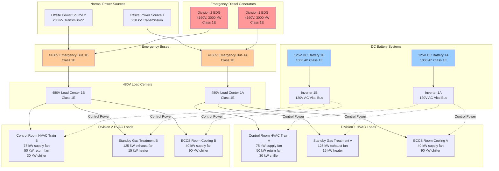

## Архитектура аварийного электроснабжения для безопасности атомных объектов

Системы аварийного электроснабжения обеспечивают электроэнергию оборудованию HVAC, связанному с безопасностью, при потере внешнего электроснабжения (LOOP), обеспечивая непрерывную работу систем вентиляции, фильтрации и управления окружающей средой, необходимых для безопасности реактора и герметизации радиоактивных материалов. Основание конструкции требует, чтобы эти системы функционировали при одновременной потере нормального и резервного источников переменного тока, сохраняя при этом полную независимость между избыточными разделами.

Фундаментальное требование исходит из Основного критерия проектирования 17, который требует, чтобы системы электроснабжения на площадке и внешние системы имели достаточную мощность и возможность для функционирования систем безопасности при условии одного отказа. Для применений HVAC это переводится в несколько независимых дизельных генераторов аварийного питания (EDG), снабжающих разделённые электрические шины, каждая из которых питает полный поезд HVAC, способный выполнять необходимые функции безопасности.

## Характеристики энергосистемы класса 1E

Класс 1E обозначает системы электроснабжения наивысшей надежности на атомных объектах. Классификация, установленная IEEE 308 (Стандартные критерии для систем электроснабжения класса 1E на атомных электростанциях), идентифицирует электрическое оборудование и системы, которые необходимы для аварийного управления реактором, изоляции герметичного корпуса, охлаждения активной зоны, отвода тепла от герметичного корпуса и реактора, или иным образом необходимы для предотвращения значительного выброса радиоактивного материала в окружающую среду.

**Основные требования класса 1E:**

Системы электроснабжения класса 1E должны сохранять независимость между избыточными разделами посредством физического разделения, электрической изоляции и функциональной независимости. Физическое разделение предотвращает отказы по общей причине от пожара, затопления, ударов предметов, удара трубопровода или экологических опасностей. Минимальные расстояния разделения варьируются от 6 м для открытой прокладки до полных трехчасовых огнеустойчивых ограждений в зависимости от основания конструкции объекта и анализа пожарных рисков.

Электрическая изоляция предотвращает распространение неисправностей одного раздела на избыточные разделы. Это требует отдельных трансформаторов, автоматических выключателей, кабелей и шин для каждого раздела без перекрестных соединений, кроме случаев устройств изоляции, соответствующих критериям одиночного отказа. Исследования координации обеспечивают устранение неисправностей защитными устройствами без влияния на здоровые разделы.

Функциональная независимость обеспечивает, что отказ или техническое обслуживание одного раздела не влияет на способность избыточных разделов выполнять функции безопасности. Каждый раздел класса 1E подключается к выделенному дизельному генератору аварийного питания, рассчитанному на 100% требуемых нагрузок безопасности для этого раздела.

**Конструкционный запас и производительность:**

Дизельные генераторы аварийного питания для атомных объектов включают значительный конструкционный запас сверх расчетных нагрузок. Типовое размером обеспечивает:

$$P_{\text{EDG}} = 1.25 \times \sum_{i=1}^{n} P_{\text{load},i} \times \text{DF}_i$$

где:
- $P_{\text{EDG}}$ = Номинальная мощность дизельного генератора аварийного питания (кВ)
- $P_{\text{load},i}$ = Требуемая мощность при непрерывной работе отдельной нагрузки (кВ)
- $\text{DF}_i$ = Коэффициент разнообразия для типа нагрузки (типичный 0.8-1.0)
- Коэффициент 1.25 обеспечивает запас 25% выше максимальной расчётной нагрузки

Для моторных нагрузок переходные процессы при пуске требуют дополнительного анализа:

$$P_{\text{start}} = P_{\text{running}} + (I_{\text{LRA}} / I_{\text{FLA}}) \times P_{\text{motor}}$$

где:
- $P_{\text{start}}$ = Общая нагрузка шины во время пуска двигателя (кВ)
- $P_{\text{running}}$ = Нагрузка при работе другого оборудования на шине (кВ)
- $I_{\text{LRA}}$ = Пусковой ток при заторможенном роторе (амперы)
- $I_{\text{FLA}}$ = Ток при полной нагрузке (амперы)
- $P_{\text{motor}}$ = Номинальная мощность двигателя (кВ)

Отношения пускового тока при заторможенном роторе к номиналу при полной нагрузке типично варьируются от 6.0 до 8.0 для асинхронных двигателей, создавая значительные переходные процессы при пуске, которые должны оставаться в пределах ограничений скачка напряжения генератора (типичный минимум 80% при пуске, восстановление до 95% в течение 2 секунд).

## Распределение аварийного электроснабжения системам HVAC

Следующая диаграмма иллюстрирует архитектуру распределения аварийного электроснабжения для двухразделённой системы HVAC, связанной с безопасностью:

## Требования к секвенцированию нагрузок и синхронизация

Дизельные генераторы аварийного питания должны запуститься, ускориться до номинальной скорости и частоты и принять нагрузки в течение 10 секунд после получения сигнала срабатывания безопасности. Этот быстрый ответ предотвращает расширенное прерывание систем HVAC, связанных с безопасностью. Однако одновременное применение всех нагрузок превысит начальную мощность генератора и создаст серьёзные скачки напряжения и частоты.

Секвенцирование нагрузок распределяет приложение нагрузки по времени на основе приоритета и характеристик пуска двигателя:

**Типовая последовательность нагрузок HVAC:**

| Последовательность | Задержка времени | Тип нагрузки | Мощность (кВ) | Суммарная нагрузка (кВ) | Причина |
|----------|------------|-----------|------------|---------------------|---------|
| 1 | 0 сек | Питание управления постоянного тока | 2 | 2 | Требуется для работы секвенсера |
| 2 | 0 сек | Критическая аппаратура | 5 | 7 | Требуется для контроля системы |
| 3 | 5 сек | Вентилятор подачи управляемого помещения | 75 | 82 | Наивысший приоритет нагрузки HVAC |
| 4 | 10 сек | Вентилятор возврата управляемого помещения | 50 | 132 | Завершение пути вентиляции ПУ |
| 5 | 15 сек | Вентилятор выхлопа системы обработки газов | 125 | 257 | Управление атмосферой герметичного корпуса |
| 6 | 20 сек | Вентилятор подачи охлаждения помещения ECCS | 40 | 297 | Инициирование охлаждения оборудования |
| 7 | 30 сек | Охладитель управляемого помещения | 30 | 327 | Управление температурой (более низкий приоритет) |
| 8 | 40 сек | Охладитель помещения ECCS | 90 | 417 | Охлаждение оборудования (задержанное допустимо) |

Последовательность обеспечивает, что напряжение остаётся выше 80% при пуске двигателя и восстанавливается до 95% в течение 2 секунд после применения каждой нагрузки. Частота должна оставаться в пределах 58-62 Гц (±2 Гц) при добавлении нагрузок с восстановлением до 59.5-60.5 Гц в течение периодов устойчивого состояния.

**Расчёты секвенцирования нагрузок:**

Скачок напряжения при пуске двигателя приблизительно:

$$\Delta V = \frac{X''_d \times I_{\text{LRA}}}{V_{\text{base}}} \times 100\%$$

где:
- $\Delta V$ = Процент скачка напряжения
- $X''_d$ = Сверхпереходная реактивность генератора (в.е., типичный 0.12-0.18)
- $I_{\text{LRA}}$ = Пусковой ток при заторможенном роторе (амперы)
- $V_{\text{base}}$ = Базовое напряжение (вольты)

Для двигателя 75 кВ с отношением LRA/FLA 6.5, пускаемого на шине 480В, питаемой генератором с $X''_d = 0.15$ в.е.:

$$I_{\text{FLA}} = \frac{75,000}{480 \times \sqrt{3} \times 0.85 \times 0.90} = 118 \text{ А}$$

$$I_{\text{LRA}} = 6.5 \times 118 = 767 \text{ А}$$

$$\Delta V = 0.15 \times \frac{767 \times 480}{480 \times 1000} \times 100 = 11.5\%$$

Этот скачок напряжения 11.5% даёт напряжение 88.5% при пуске, превышая минимальное требование 80%.

## Сравнение систем класса 1E и систем электроснабжения, не связанных с безопасностью

| Характеристика | Системы класса 1E | Системы не связанные с безопасностью |
|----------------|------------------|-------------------|
| **Нормативная база** | 10 CFR 50 Приложение A (GDC 17), IEEE 308 | Промышленные стандарты, местные коды |
| **Избыточность** | Минимум две независимые разделы | Один источник приемлем |
| **Независимость** | Требуется физическое, электрическое, функциональное разделение | Общие компоненты допускаются |
| **Квалификация по сейсмостойкости** | Категория I, встряхивание на столе IEEE 344 или анализ | Стандартный строительный код (IBC) |
| **Квалификация окружающей среды** | IEEE 323, 10 CFR 50.49 для суровых условий окружающей среды | Только нормальная окружающая среда |
| **Программа обеспечения качества** | Требуется программа согласно 10 CFR 50 Приложение B | Приемлемо коммерческое качество |
| **Время пуска** | ≤10 сек от сигнала срабатывания | Типично 10-30 сек |
| **Регулирование напряжения** | ±10% установившийся режим, 80% минимум при переходных | ±10% типично, менее строгие переходные |
| **Регулирование частоты** | ±2% (58-62 Гц), ±0.5% установившийся режим | ±3-5% приемлемо |
| **Запас топлива** | Минимум 7 дней на площадке (10 CFR 50.63) | 24-48 часов типично |
| **Частота испытаний** | Ежемесячный быстрый пуск, 24-месячный тест нагрузки | Квартальный или годовой |
| **Воздействие отказа** | Потенциальное отключение реактора, NRC сообщаемое | Операционное неудобство |
| **Документация** | Обширное основание конструкции, анализ безопасности | Стандартные инженерные файлы |
| **Управление модификациями** | Скрининг 10 CFR 50.59, возможное одобрение NRC | Внутренний инженерный обзор |
| **Стоимость установки** | 3-5× эквивалент, не связанный с безопасностью | Базовая стоимость |
| **Стоимость обслуживания** | 2-4× эквивалент, не связанный с безопасностью | Базовая стоимость |

## Требования к полной потере переменного тока (10 CFR 50.63)

Правило 10 CFR 50.63 о полной потере переменного тока требует, чтобы атомные объекты поддерживали охлаждение активной зоны, целостность герметичного корпуса и надлежащее отвода тепла от герметичного корпуса в течение указанного периода (типично 4-8 часов) при полной потере переменного тока, включая дизельные генераторы аварийного питания. Это касается сценариев, когда как внешнее, так и все онсайт источники переменного тока аварийного питания выходят из строя одновременно.

Продолжительность преодоления полной потери переменного тока зависит от:

**Факторы продолжительности преодоления:**

1. Характеристики конструкции внешнего электроснабжения (избыточность и независимость)
2. Надежность и избыточность дизельного генератора аварийного питания
3. Запас конденсата для отвода остаточного тепла
4. Возможность отвода тепла герметичного корпуса

Объекты с высоконадёжным внешним электроснабжением (частота <0.1 потери в год) и избыточными дизельными генераторами аварийного питания (≥3 единицы, конфигурация N+2) могут квалифицироваться для 4-часового преодоления. Менее надежные конфигурации требуют 8-часового или более длительного преодоления.

**Последствия для HVAC:**

При условиях полной потери переменного тока системы HVAC, связанные с безопасностью и питаемые дизельными генераторами аварийного питания, недоступны. Критические функции, требующие постоянного питания, получают резервное питание от батареи постоянного тока:

- Обитаемость управляемого помещения (повышение давления, фильтрация через клапаны с приводом постоянного тока)
- Системы аппаратуры и управления
- Аварийное освещение
- Системы коммуникации

Системы с батарейным питанием должны поддерживать функциональность в течение периода преодоления с использованием шин 125В постоянного тока или 120В переменного тока через инверторы. Расчёты нагрузки постоянного тока должны учитывать постоянное питание управления HVAC:

$$E_{\text{battery}} = \sum_{i=1}^{n} (P_{\text{load},i} \times t_{\text{coping}} \times 1.25) \times \frac{1}{\eta_{\text{inv}}}$$

где:
- $E_{\text{battery}}$ = Требуемая ёмкость батареи (Вт·ч или А·ч)
- $P_{\text{load},i}$ = Мощность отдельной нагрузки постоянного тока (Вт)
- $t_{\text{coping}}$ = Продолжительность преодоления полной потери переменного тока (часы)
- $\eta_{\text{inv}}$ = Коэффициент полезного действия инвертора (типичный 0.90-0.95)
- 1.25 = Коэффициент запаса конструкции

Для обитаемости управляемого помещения при полной потере переменного тока аварийное освещение с батарейным питанием и удаление дыма могут работать с использованием двигателей постоянного тока или двигателей переменного тока с приводом инвертора. Расход воздуха снижается до минимума, требуемого для обитаемости, а не нормального расхода вентиляции, расширяя время работы батареи.

**Альтернативные источники переменного тока (AAC):**

Многие объекты дополняют дизельные генераторы разнообразными источниками энергии, соответствующими требованиям полной потери переменного тока:

- Генераторы газовых турбин (другая технология, чем дизель)
- Генераторы турбин сгорания
- Портативные дизельные генераторы, размещённые вне площадки
- Возможность взаимного подключения к независимым онсайт источникам

Источники AAC должны продемонстрировать независимость от дизельных генераторов аварийного питания класса 1E благодаря различным источникам топлива, механизмам запуска, системам охлаждения и физическому расположению. Это разнообразие предотвращает отказы по общей причине, влияющие на оба дизельных генератора и источники AAC.

## Требования соответствия IEEE 308

IEEE 308 (Стандартные критерии для систем электроснабжения класса 1E на атомных электростанциях) устанавливает конструкцию, квалификацию, испытания и эксплуатационные критерии, обеспечивающие, что системы электроснабжения класса 1E отвечают требованиям безопасности атомных объектов. Ключевые положения, влияющие на аварийное электроснабжение HVAC, включают:

**Критерии независимости:**

Разделы класса 1E сохраняют независимость посредством физического разделения, электрической изоляции и конструкционного разнообразия, предотвращающего отказы по общей причине. Для применений HVAC:

- Раздельная прокладка кабелей (минимум 6 м или огнеустойчивые барьеры)
- Независимые источники охлаждающей воды для дизельных генераторов аварийного питания
- Раздельные системы хранения и передачи топлива
- Отдельные комнаты распределительных устройств с раздельными системами HVAC
- Без перекрестных соединений, кроме устройств изоляции

**Критерии нагрузки:**

Системы аварийного электроснабжения должны снабжать требуемые нагрузки с надлежащим регулированием напряжения и частоты при всех условиях основания конструкции:

- Напряжение: ±10% установившийся режим, минимум 80% при переходных
- Частота: ±2% установившийся режим, 58-62 Гц при изменении нагрузок
- Коэффициент мощности: минимум 0.8 отстающий
- Гармоническое искажение: <5% полное гармоническое искажение (THD)

Преобразователи с переменной частотой на моторах HVAC способствуют гармоническим токам, требующим фильтрации или размещения генератора.

**Требования к испытаниям:**

IEEE 308 требует периодических испытаний, демонстрирующих возможность системы аварийного электроснабжения:

- Ежемесячный быстрый пуск (в течение 10 сек)
- 24-месячный тест полной нагрузки (4-24 часов при номинальной нагрузке)
- 18-месячное испытание логики секвенцирования
- Отбор проб топлива и анализ (квартально)
- Сервисное испытание батареи (18-месячные интервалы)

Критерии приемки испытаний включают время пуска, регулирование напряжения, регулирование частоты, приём нагрузки и продолжительность непрерывной работы.

## Системы хранения и передачи топлива

Дизельные генераторы аварийного питания требуют хранилища топлива на площадке, обеспечивающего минимум 7-суточную работу при максимальных нагрузках безопасности согласно 10 CFR 50.63. Это требование обеспечивает продолжительную работу при расширенной потере внешнего электроснабжения с нарушенной инфраструктурой доставки топлива.

**Расчёт хранилища топлива:**

$$V_{\text{fuel}} = \frac{P_{\text{EDG}} \times \text{BSFC} \times t_{\text{duration}} \times N_{\text{units}}}{\rho_{\text{fuel}} \times 1.1}$$

где:
- $V_{\text{fuel}}$ = Требуемый объём хранилища топлива (литры)
- $P_{\text{EDG}}$ = Номинальная нагрузка дизельного генератора аварийного питания (кВ)
- BSFC = Удельный расход топлива по тормозу (кг/кВ·ч, типичный 0.35-0.42)
- $t_{\text{duration}}$ = Минимальная продолжительность работы (168 часов для 7 дней)
- $N_{\text{units}}$ = Количество дизельных генераторов, требующих одновременной работы
- $\rho_{\text{fuel}}$ = Плотность топлива (838 кг/м³ для дизеля)
- 1.1 = Коэффициент запаса, учитывающий неиспользуемый объём бака

Для двух дизельных генераторов 3000 кВ с расходом топлива 0.38 кг/кВ·ч:

$$V_{\text{fuel}} = \frac{3000 \times 0.38 \times 168 \times 2}{838 \times 1.1} = 186,000 \text{ л}$$

Резервуары для хранения получают квалификацию сейсмостойкости категории I и защиту окружающей среды, предотвращающую загрязнение топлива проникновением воды или биологическим ростом. Подземные резервуары минимизируют пожарные опасности, а наземные резервуары облегчают инспекцию и обслуживание.

**Системы передачи топлива:**

Резервные насосы передачи топлива (типично приводимые двигателем и электрическим мотором) сохраняют запас в дневном резервуаре, снабжающем системы топливного впрыска дизельного генератора. Дневные резервуары содержат 1-4 часовой запас топлива, позволяя время для работы насоса передачи или ручного дозаправки при отказах системы передачи.

Уровневые органы управления автоматически запускают насосы передачи, сохраняя уровни дневного резервуара между 70-90% ёмкости. Сигналы низкого уровня предупреждают операторов о неисправностях системы передачи, требующих ручного вмешательства.

## Заключение

Системы аварийного электроснабжения для применений HVAC на атомных объектах представляют критическую инфраструктуру, обеспечивающую функциональность систем безопасности при базовых событиях, обосновывающих конструкцию, и условиях полной потери переменного тока. Строгие требования 10 CFR 50.63, IEEE 308 и Основного критерия проектирования устанавливают стандарты производительности, значительно превышающие коммерческие установки аварийного электроснабжения.

Инженеры, разрабатывающие или обслуживающие эти системы, должны полностью понимать требования независимости, расчёты секвенцирования нагрузок, критерии квалификации и обязательства по испытаниям. Значительная премия затрат для систем класса 1E отражает обширный анализ конструкции, документацию обеспечения качества и постоянные программы наблюдения, обеспечивающие надежную работу при условиях, когда безопасность зависит от их производительности.

Надлежащая конструкция системы аварийного электроснабжения позволяет системам HVAC, связанным с безопасностью, сохранять обитаемость управляемого помещения, ограничивать радиоактивные выбросы посредством фильтрации, охлаждать необходимое оборудование и поддерживать безопасное отключение реактора при наиболее сложных условиях, которые могут встретиться атомные объекты.
