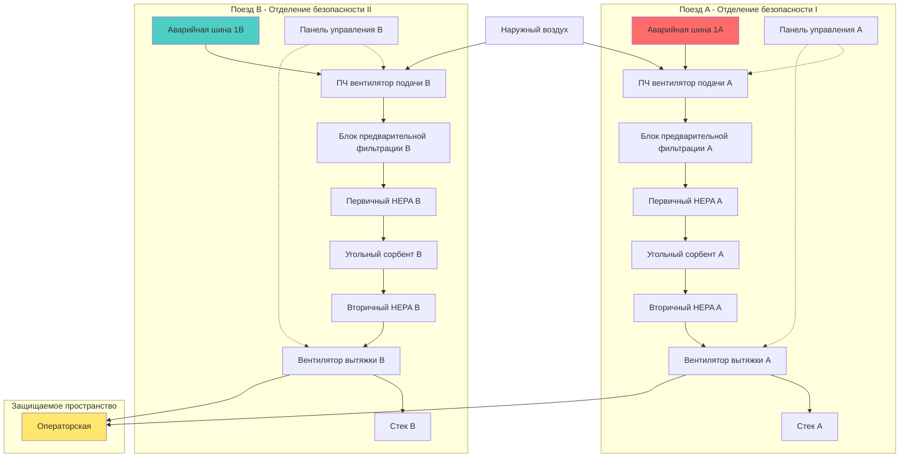

Системы вентиляции ядерных объектов, выполняющие функции безопасности, должны включать избыточность для обеспечения работоспособности при отказах отдельных компонентов, деятельности по техническому обслуживанию и проектных аварийных сценариях. Комиссия по ядерному регулированию (NRC) устанавливает эти требования через Основной критерий проектирования 17 (GDC 17) из 10 CFR 50 Приложение A, требуя, чтобы системы безопасности сохраняли функциональность при предположении любого одиночного отказа в сочетании с потерей внешнего питания. Этот принцип коренным образом формирует архитектуру HVAC ядерных объектов.

## Критерий одиночного отказа

Критерий одиночного отказа представляет основу проектирования систем безопасности ядерных объектов. Одиночный отказ представляет собой любое событие, вызывающее неработоспособность компонента, включая неправильное функционирование активного компонента, разрыв пассивного компонента или непроизвольное генерирование сигнала.

**Категории отказов:**

1. **Активные отказы:** Компоненты, требующие движения или изменения состояния (вентиляторы, заслонки, регулирующие клапаны, реле)
2. **Пассивные отказы:** Статические компоненты (разрыв воздуховода, конструктивные отказы, деградация уплотнений)
3. **Отказы по общей причине:** События, влияющие на несколько компонентов одновременно (пожар, затопление, сейсмические события)

Конструкция должна продемонстрировать, что система HVAC выполняет функцию безопасности несмотря на:

- Любой одиночный активный компонент, не способный работать по требованию
- Любой одиночный активный компонент, работающий при отсутствии необходимости
- Любой одиночный отказ пассивного компонента (разрыв трубопровода, разрыв воздуховода)
- Потеря внешнего питания одновременно с одиночным отказом
- Любая достоверная комбинация одиночных отказов

**Методология анализа:**

Инженеры проводят анализ одиночного отказа путем систематической оценки каждого компонента. Для избыточной двухпоездной системы анализ предполагает один поезд недоступным из-за отказа или обслуживания, а затем постулирует одиночный отказ в работающем поезде. Система должна по-прежнему достигать требуемой функции безопасности.

Рассмотрим связанную с безопасностью систему вентиляции управления. Анализ рассматривает:

- Поезд A недоступен (техническое обслуживание)
- Вентилятор подачи поезда B не запускается: Аварийная заслонка рециркуляции должна срабатывать, и резервный вентилятор должен запуститься
- Заслонка поезда B не переходит в новое положение: Должны существовать действия оператора вручную или физический байпас
- Отказ контрольно-измерительного оборудования: Избыточные датчики с логикой 2-из-3 предотвращают ложное срабатывание

## Архитектура избыточных поездов

Системы HVAC ядерных объектов реализуют избыточность через полностью независимые поезда, каждый из которых способен выполнять полную функцию безопасности. Минимальная конфигурация обеспечивает два поезда с полной мощностью 100%, хотя многие объекты развертывают три или четыре поезда для повышенной надежности.

**Требования к проектированию избыточных поездов:**

| Требование | Реализация | Назначение |
|-----------|-----------|-----------|
| Полная мощность 100% на поезд | Каждый поезд рассчитан на требуемый полный расход | Один поезд достаточен при одиночном отказе |
| Независимые источники питания | Отдельные аварийные дизельные генераторы | Отказы электроснабжения не влияют на несколько поездов |
| Физическое разделение | Минимум 6 м или противопожарные барьеры | Предотвращает повреждение по общей причине |
| Отдельное контрольно-измерительное оборудование | Выделенные датчики и органы управления на поезд | Исключает единые точки отказа |
| Независимые потоки | Нет общих воздуховодов, трубопроводов или коллекторов | Отказ компонента изолирован одному поезду |

**Пример конфигурации поезда:**

Типичная связанная с безопасностью система фильтрации содержит на поезд:

- Выделенный вентилятор подачи (управление преобразователем частоты)
- Блок предварительной фильтрации (MERV 14 минимум)
- Блок первичного HEPA фильтра
- Секция угольного сорбента (удаление радиойода)
- Блок вторичного HEPA фильтра
- Вентилятор вытяжки с подключением аварийного питания
- Изолирующие заслонки с отказобезопасным позиционированием
- Приборы для измерения давления и расхода
- Панель управления с логикой для конкретного поезда

Диаграмма иллюстрирует полную независимость между поездами. Между поездом A (Отделение безопасности I) и поездом B (Отделение безопасности II) не существует общих компонентов. Каждый поезд подключается к отдельным шинам аварийного питания, использует выделенное оборудование и выпускается через независимые стеки.

## Требования к разделению поездов

Физическое разделение между избыточными поездами предотвращает отказы по общей причине от одновременного отключения нескольких поездов. NRC оценивает адекватность разделения через анализ пожарных опасностей, анализ распространения наводнений и анализ разрыва высокоэнергетической линии.

**Критерии разделения:**

1. **Пространственное разделение:** Минимум 6 м горизонтального расстояния без промежуточных горючих материалов или опасностей
2. **Разделение противопожарным барьером:** Барьеры, рассчитанные на 3 часа огнестойкости между поездами, когда пространственное разделение непрактично
3. **Защита от наводнений:** Различия по высоте или водонепроницаемые барьеры предотвращают распространение наводнений между поездами
4. **Защита от снарядов:** Физические барьеры или ориентация, предотвращающая попадание снарядов в несколько поездов
5. **Предотвращение сейсмического взаимодействия:** Компоненты сейсмической категории I разделены от несейсмического оборудования, которое может упасть

**Методы реализации разделения:**

Объекты достигают разделения через:

- **Отдельные помещения:** Оборудование поезда A в помещении 101, оборудование поезда B в помещении 201 (различные пожарные зоны)
- **Бетонные стены:** Армированные бетонные барьеры, рассчитанные на 3-часовую огнестойкость и конструктивные нагрузки
- **Вертикальное разделение:** Поезд A на первом этаже, поезд B на уровне мезонина
- **Разделение по расстоянию:** Помещения с оборудованием на противоположных концах объекта

Электрические кабели избыточных поездов следуют разделенными путями кабельных лотков. Кабельные лотки поддерживают разделение на 6 м или используют противопожарные барьеры. Пробивные отверстия через противопожарные барьеры используют сертифицированные противопожарные заделки, поддерживающие рейтинг барьера.

## Электрическая независимость

Каждый избыточный поезд HVAC подключается к независимой шине, связанной с безопасностью, питаемой выделенным аварийным дизельным генератором. Эта электрическая независимость гарантирует, что единичные электрические отказы не могут отключить несколько поездов.

**Архитектура распределения питания:**

Отделение безопасности I (поезд A):
- Аварийный дизельный генератор 1A
- Шина 4160 В переменного тока 1A
- Шина 480 В переменного тока 1AA (через трансформатор)
- Центр управления двигателем MCC-1A
- Шина приборов 120 В переменного тока 1A (через инвертор)

Отделение безопасности II (поезд B):
- Аварийный дизельный генератор 1B
- Шина 4160 В переменного тока 1B
- Шина 480 В переменного тока 1BB (через трансформатор)
- Центр управления двигателем MCC-1B
- Шина приборов 120 В переменного тока 1B (через инвертор)

Цепи управления, питание контрольно-измерительного оборудования и приводы клапанов оборудования поезда A исключительно подключаются к питанию отделения I. Поезд B исключительно использует питание отделения II. На любом уровне напряжения не существует перекрестных соединений, которые могли бы распространять отказы между отделениями.

**Координация автоматических выключателей:**

Автоматические выключатели координируются так, чтобы отказы срабатывали только затронутым автоматическим выключателем, а не повышающими разделительными выключателями. Это предотвращает распространение единичных отказов на де-энергизацию целых отделений безопасности. Защитное срабатывание включает защиту от перегрузки по току, замыкания на землю, низкого напряжения и дифференциальную защиту с селективной координацией по всей системе распределения.

## Расчет доступности системы

Доступность системы количественно определяет вероятность того, что избыточные поезда успешно выполнят функцию безопасности при включении. Инженеры рассчитывают доступность, используя данные надежности компонентов и конфигурацию системы.

Для двухпоездной избыточной системы с независимыми поездами недоступность составляет:

$$U_{system} = U_A \times U_B$$

где $U_A$ и $U_B$ представляют недоступность поездов A и B соответственно.

Доступность системы становится:

$$A_{system} = 1 - U_{system} = 1 - (U_A \times U_B)$$

Для одного поезда с недоступностью $U = 0,01$ (1% недоступность, 99% доступность):

$$A_{system} = 1 - (0,01 \times 0,01) = 1 - 0,0001 = 0,9999$$

Избыточная система достигает доступности 99,99%, что на два порядка лучше, чем одиночный поезд.

**Параметры надежности компонентов:**

Типичная недоступность компонентов HVAC ядерных объектов:

| Компонент | Недоступность (U) | Среднее время между отказами |
|-----------|-------------------|------------------------------|
| Вентилятор подачи | 5 × 10⁻⁴ | 2000 часов |
| Вентилятор вытяжки | 5 × 10⁻⁴ | 2000 часов |
| Моторизованная заслонка | 1 × 10⁻³ | 1000 требований |
| Датчик дифференциального давления | 1 × 10⁻⁴ | 10000 часов |
| Контроллер ПЧ | 2 × 10⁻³ | 500 часов |

Для поезда, состоящего из последовательных компонентов, недоступность поезда суммируется:

$$U_{train} = U_{supply\_fan} + U_{HEPA} + U_{exhaust\_fan} + U_{dampers} + U_{controls}$$

С включением недоступности технического обслуживания (плановых остановок для испытаний/обслуживания) эффективная недоступность увеличивается:

$$U_{effective} = U_{random} + U_{maintenance}$$

Если техническое обслуживание происходит 48 часов ежегодно (0,55% времени):

$$U_{effective} = 0,005 + 0,0055 = 0,0105$$

Для двухпоездной избыточности:

$$A_{system} = 1 - (0,0105)^2 = 0,99989$$

Этот расчет демонстрирует, что даже при реалистичных надежностях компонентов и остановках на техническое обслуживание двухпоездная избыточность достигает исключительно высокой доступности системы, превышающей 99,98%.

**Соображения о времени выполнения задачи:**

Сценарии аварий ядерных объектов определяют время выполнения задачи (продолжительность работы системы). Для обитаемости операторской время выполнения задачи продлевается на 30 дней после аварии. Надежность в течение времени выполнения задачи следует:

$$R(t) = e^{-\lambda t}$$

где $\lambda$ представляет частоту отказа компонента и $t$ - время выполнения задачи.

Для вентилятора с MTBF 2000 часов:

$$\lambda = \frac{1}{2000} = 0,0005 \text{ отказов/час}$$

В течение миссии на 720 часов (30 дней):

$$R(720) = e^{-0,0005 \times 720} = e^{-0,36} = 0,698$$

Один поезд обеспечивает надежность 69,8% в течение миссии. Два избыточных поезда достигают:

$$R_{system}(720) = 1 - (1 - 0,698)^2 = 1 - (0,302)^2 = 0,909$$

Надежность системы увеличивается до 90,9% на 30-дневную миссию, демонстрируя важность избыточности для продолжительных операций.

## Избыточность N+1 и N+2

В то время как минимальные требования предусматривают два поезда (2 × 100%), многие объекты реализуют повышенную избыточность для улучшенной надежности и операционной гибкости.

**Конфигурация N+1 (три поезда):**

Три поезда с полной мощностью 100% обеспечивают существенные преимущества:

- Один поезд доступен при одновременном отказе и техническом обслуживании
- Испытания возможны без компрометации защиты от одиночного отказа
- Повышенная доступность во время остановок на перезагрузку, когда происходит обширное техническое обслуживание
- Обычная практика на новых объектах и исследовательских реакторах

Недоступность системы с тремя независимыми поездами:

$$U_{system} = U_A \times U_B \times U_C$$

Для $U = 0,01$ на поезд:

$$A_{system} = 1 - (0,01)^3 = 0,999999$$

Доступность достигает 99,9999% (шесть девяток).

**Конфигурация N+2 (четыре поезда):**

Некоторые приложения с высокой надежностью используют четыре поезда:

- Два поезда работают при любой комбинации одиночного отказа и технического обслуживания
- Исключительно высокая доступность для критических пространств (главная операторская)
- Позволяет проводить обширные программы испытаний без операционного влияния

**Сравнение уровней избыточности:**

| Конфигурация | Доступность одного поезда | Доступность системы | Улучшение надежности |
|-----------|-------------------------|-------------------|----------------------|
| Одиночный поезд | 99,0% | 99,0% | Базовое значение |
| 2 × 100% (N+1) | 99,0% | 99,99% | 100× |
| 3 × 100% (N+2) | 99,0% | 99,9999% | 10 000× |
| 4 × 100% (N+3) | 99,0% | 99,999999% | 1 000 000× |

Убывающая доходность становится очевидной: переход от одиночной к двойной избыточности обеспечивает драматическое улучшение (в 100 раз), в то время как дополнительные поезда обеспечивают прогрессивно меньшие дополнительные прибыли. Экономические и пространственные ограничения обычно ограничивают конструкции двумя или тремя поездами, кроме самых критических приложений.

## Применение критерия одиночного отказа

Различные системы ядерных объектов применяют критерий одиночного отказа с различной строгостью в зависимости от значимости для безопасности. Сравнение ниже иллюстрирует область применения:

| Функция системы | Уровень избыточности | Анализ одиночного отказа | Частота испытаний | Источник питания |
|----------------|-------------------|------------------------|------------------|-----------------|
| Изоляция контейнмента | 2 × 100% минимум | Полный анализ требуется | Ежемесячный ход клапана | Отдельные аварийные шины |
| Послеаварийная фильтрация | 2 × 100% минимум | Полный анализ требуется | Ежеквартальное испытание расхода | Питание с дизелем |
| Обитаемость операторской | 2 × 100% (часто 3 × 100%) | Полный анализ требуется | Ежемесячное испытание срабатывания | Бесперебойный + дизель |
| Охлаждение оборудования безопасности | 2 × 100% минимум | Полный анализ требуется | Ежеквартальное испытание расхода | Отдельные аварийные шины |
| Вентиляция вспомогательного здания | 2 × 50% допустимо | Упрощенный анализ | Ежеквартальное испытание работы | Обычное + резервное питание |
| Выпуск радиоактивных отходов | 2 × 50% допустимо | Ограниченный анализ | Ежегодное испытание расхода | Обычное питание достаточно |

Системы высокой значимости для безопасности (изоляция контейнмента, обитаемость операторской) требуют полного анализа одиночного отказа, полной избыточности и частого испытания. Системы низшей значимости для безопасности могут использовать частичную избыточность (2 × 50%), где комбинация обоих поездов обеспечивает полную мощность, но ни один в отдельности не достаточен для всех сценариев.

## Требования к проверяемости

Основной критерий проектирования 18 требует возможности испытывать системы безопасности при работе объекта для демонстрации работоспособности. Избыточность HVAC позволяет испытывать один поезд, в то время как другой остается в обслуживании.

**Положения об испытаниях:**

Каждый поезд включает:

- Контрольные соединения для измерения расхода
- Патрубки давления для проверки дифференциального давления
- Изолирующие клапаны, позволяющие испытывать один поезд
- Возможность байпаса для замены фильтра без остановки системы
- Контрольные порты контрольно-измерительного оборудования для проверки калибровки

**Контрольные испытания:**

Технические спецификации устанавливают требования к контролю:

1. **Ежемесячно:** Испытания работоспособности вентилятора (пуск, проверка работы, измерение тока)
2. **Ежеквартально:** Измерение расхода воздуха, запись дифференциального давления
3. **Ежегодно:** Испытание HEPA фильтра на месте (проверка минимальной эффективности 99,97% посредством аэрозольного испытания)
4. **Каждые 18 месяцев:** Интегрированное испытание системы, включая логику автоматического срабатывания

Во время контрольных испытаний операторы размещают один поезд в режиме испытания, в то время как избыточный поезд остается доступным для автоматического срабатывания. Процедуры испытания проверяют, что отключение одного поезда из обслуживания надлежащим образом объявляется в операторской и что доступный поезд может выполнить функцию безопасности.

**Возможность онлайн-обслуживания:**

Избыточность допускает онлайн-обслуживание в пределах разрешенных времени перерыва технических спецификаций (обычно 7 дней). Эта возможность предотвращает вынужденные остановки агрегата для незначительных отказов компонентов или планового обслуживания, существенно улучшая коэффициент использования мощности объекта при поддержании безопасности.

## Требования к документации проектирования

Нормативные акты NRC в соответствии с 10 CFR 50 Приложение B требуют обширной документации, демонстрирующей соответствие требованиям избыточности:

**Требуемая документация:**

- **Отчет об анализе одиночного отказа:** Систематическая оценка каждого достоверного отказа, демонстрирующая продолжающуюся функциональность системы
- **Анализ разделения:** Документация, подтверждающая адекватное физическое, электрическое и функциональное разделение между поездами
- **Анализ надежности:** Количественная оценка доступности системы и надежности выполнения задачи
- **Анализ пожарных опасностей:** Оценка, показывающая, что ущерб от пожара ограничен одним поездом
- **Анализ наводнений:** Демонстрация того, что внутреннее наводнение не может отключить несколько поездов
- **Анализ сейсмического взаимодействия:** Доказательство того, что несейсмические компоненты не могут влиять на несколько поездов безопасности
- **Технические спецификации:** Ограничивающие условия для операции и требования к контролю
- **Процедуры испытаний:** Детальные инструкции для периодических испытаний, поддерживающих работоспособность

Эта документация проходит нормативный обзор при первоначальном лицензировании и остается предметом проверки на протяжении всей жизни объекта. Изменения, влияющие на избыточность или разделение, требуют оценки согласно 10 CFR 50.59 для определения необходимости одобрения NRC перед реализацией.

## Общие ошибки и соображения проектирования

Опыт работающих ядерных объектов выявляет общие проблемы с реализацией избыточности:

**Общие вспомогательные системы:**

Видимо независимые поезда могут совместно использовать вспомогательные системы, создавая неосознанные зависимости:

- Системы сжатого воздуха, подающие оба поезда приводов заслонок
- Воздух для приборов из общих коллекторов
- Охлажденная вода для охлаждения пространства помещений электрооборудования
- Системы отопления, предотвращающие замерзание в обоих поездах

Конструкция должна отследить все вспомогательные системы, гарантируя, что вспомогательные системы каждого поезда сохраняют независимость или получают надлежащую классификацию безопасности.

**Нарушения разделения кабелей:**

Кабели избыточных поездов, направляемые через общие кабельные лотки или кабелеводы, нарушают требования разделения. Силовые кабели и кабели управления требуют равной строгости разделения. Тщательный контроль качества установки и проверка состояния объекта предотвращают непредусмотренные нарушения разделения, которые становятся очевидными только при обзоре анализа пожарных опасностей.

**Блокировки испытаний:**

Конфигурации испытаний иногда обходят функции блокировки безопасности или изоляции. Процедуры испытания должны гарантировать, что размещение одного поезда в режиме испытания не скомпрометирует способность доступного поезда выполнить функцию безопасности. Блокировки, предотвращающие одновременное испытание избыточных поездов, защищают от непроизвольной потери обоих поездов.

**Координация техническому обслуживания:**

Процедуры должны предотвратить работы по техническому обслуживанию обоих поездов одновременно. График технического обслуживания координируется так, чтобы один поезд оставался доступным. Если оба поезда требуют обслуживания, объект входит в состояние технической спецификации, требующее либо быстрого восстановления, либо упорядоченной остановки.

## Проверка соответствия нормативным требованиям

NRC проверяет соответствие требованиям избыточности через:

1. **Обзор сертификации проектирования:** Детальное обследование реализации избыточности при первоначальном лицензировании
2. **Проверка строительства:** Проверка разделения в состоянии на объекте и независимости
3. **Предпусковые испытания:** Демонстрация того, что избыточные поезда работают независимо
4. **Периодические проверки:** Трехлетние проверки, подтверждающие сохранение контроля конфигурации
5. **Надзор резидентного инспектора:** Ежедневное присутствие, обеспечивающее соблюдение процедур, поддерживающих разделение поездов

Несоответствие требованиям избыточности представляет значительное нарушение безопасности, потенциально требующее остановки объекта до его исправления. Политика применения мер NRC назначает уровни серьезности нарушений с соответствующими гражданскими штрафами за отказ поддерживать требуемую избыточность.

Требования к избыточности HVAC ядерных объектов гарантируют, что функции безопасности остаются доступными при отказах отдельных компонентов, условиях технического обслуживания и проектных аварийных сценариях. Систематическое применение критерия одиночного отказа, в сочетании с физической и электрической независимостью поездов, создает высоконадежные системы, защищающие здоровье и безопасность населения при всех достоверных условиях. Эти строгие требования, хотя и налагают значительные затраты и сложность, оказываются необходимыми для исключительно высоких стандартов надежности, которые требуют ядерные объекты.
