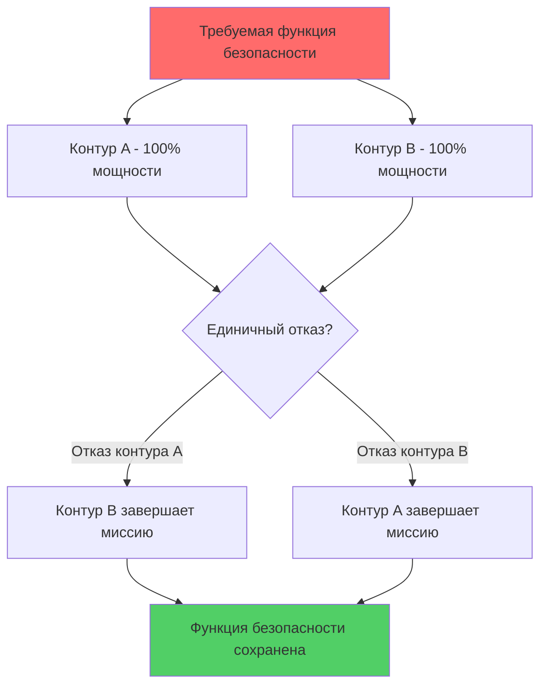
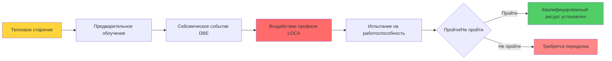

## Определение систем, связанных с безопасностью

Системы HVAC, связанные с безопасностью, — это системы, отказ которых может помешать безопасной остановке реактора или привести к значительному выбросу радиоактивных материалов в окружающую среду. В соответствии с 10 CFR 50, Приложение A, эти системы должны сохранять свою предназначенную функцию безопасности во время и после событий, определяющих конструкцию (DBE).

**Критерии классификации:**

- **Связанная с безопасностью (Класс 1E)**: Прямая функция защиты, должна работать во время аварий
- **Дополнительное качество (AQ)**: Не связана с безопасностью, но влияет на системы безопасности, требования повышенного контроля качества
- **Не связанная с безопасностью**: Коммерческого класса, без прямой функции безопасности

Различие зависит от анализа функциональных последствий. Если отказ системы создает условия, превышающие дозовые пределы 10 CFR 100 на границе объекта, система связана с безопасностью.

## Требования сейсмической категории I

Классификация сейсмической категории I (SC-I) обеспечивает функциональность оборудования во время и после безопасного землетрясения при отключении (SSE). SSE представляет максимальное колебательное движение грунта, на которое рассчитаны системы безопасности.

### Расчетный спектр отклика

Оборудование должно выдерживать спектральные ускорения, определяемые следующим образом:

$$S_a(f, \zeta) = A_{PGA} \cdot F_a(f) \cdot \frac{1}{\sqrt{1-4\zeta^2}}$$

где:
- $S_a$ = спектральное ускорение (g)
- $f$ = собственная частота (Гц)
- $\zeta$ = коэффициент демпфирования
- $A_{PGA}$ = пиковое ускорение грунта
- $F_a$ = коэффициент усиления

### Квалификация конструкции

Компоненты SC-I HVAC проходят динамический анализ или испытания на встряхивающем столе. Собственная частота должна избегать резонанса со строительными конструкциями:

$$f_n = \frac{1}{2\pi}\sqrt{\frac{k}{m_{eff}}}$$

где $k$ — жесткость системы, $m_{eff}$ — эффективная модальная масса.

**Методы квалификации:**

| Метод | Применение | Стандарт |
|-------|-----------|----------|
| Динамический анализ | Большие воздуховодные системы | IEEE 344 |
| Испытание на встряхивающем столе | Вентиляторы, заслонки, фильтры | IEEE 344 |
| Эквивалентное статическое | Жесткое оборудование ($f_n$ > 33 Гц) | ASCE 4 |
| Данные опыта | Проверенные коммерческие изделия | EPRI NP-5223 |

## Критерий единичного отказа

В соответствии с 10 CFR 50, Приложение A, GDC 1, системы безопасности должны выполнять свою функцию, предполагая любой единичный активный или пассивный отказ одновременно с потерей внешнего электроснабжения.

### Реализация резервирования

Система HVAC, связанная с безопасностью, обычно использует два резервных контура с полной мощностью:

### Анализ режимов отказа

Вероятность отказа системы при критерии единичного отказа:

$$P_{sys,fail} = P_A \cdot P_B + P_{CCF}$$

где:
- $P_A$, $P_B$ = независимые вероятности отказа каждого контура
- $P_{CCF}$ = вероятность общей причины отказа

Отказы по общей причине (CCF) должны быть минимизированы посредством:
- Физического разделения (обычно ≥ 6 м или противопожарные преграды)
- Электрической независимости (отдельные шины класса 1E)
- Экологического разнообразия (отдельные зоны вентиляции)
- Функциональной изоляции (отдельная приборизация и органы управления)

## Квалификация окружающей среды

Оборудование, связанное с безопасностью, должно работать в условиях после аварии в соответствии с 10 CFR 50.49. После аварии с потерей теплоносителя (LOCA) условия в корпусе реактора существенно меняются.

### Профиль окружающей среды после LOCA

Эволюция температуры внутри корпуса реактора следует балансу энергии:

$$\frac{dT}{dt} = \frac{\dot{Q}_{steam} - \dot{Q}_{removal}}{mc_p}$$

**Типичное окружение при LOCA:**

| Параметр | Перед аварией | Пик (LOCA) | После LOCA (24 часа) |
|----------|---------------|-----------|----------------------|
| Температура | 49°C | 171°C | 138°C |
| Давление | 101 кПа | 448 кПа | 241 кПа |
| Влажность | 40% ОВ | 100% ОВ | 100% ОВ |
| Радиация | Фоновая | 1×10⁶ рад | 5×10⁵ рад |

### Испытания квалификации

Оборудование проходит последовательное старение и моделирование аварии в соответствии с IEEE 323:

Квалифицированный ресурс $t_q$ рассчитывается с использованием уравнения Аррениуса:

$$t_q = t_{ref} \cdot e^{\frac{E_a}{R}\left(\frac{1}{T_{op}}-\frac{1}{T_{ref}}\right)}$$

где:
- $E_a$ = энергия активации (эВ)
- $R$ = газовая постоянная
- $T_{op}$ = рабочая температура (К)
- $T_{ref}$ = эталонная температура испытания (К)

## Требования к испытаниям и надзору

Технические спецификации требуют периодических испытаний для проверки работоспособности и производительности в пределах проанализированных границ.

### Интервалы испытаний наблюдения

**Требования кода ASME AG-1:**

| Компонент | Тип испытания | Периодичность | Критерии приемки |
|-----------|--------------|---------------|------------------|
| Фильтры HEPA | Испытание DOP/PAO | 18 месяцев | ≥ 99,97% эффективность |
| Угольные адсорберы | Испытание метилиодидом | 18 месяцев | ≥ 95% удаление |
| Вентиляторы ESF | Измерение потока | 18 месяцев | ≥ 90% расчетного потока |
| Заслонки | Время хода | 92 дня | ≤ расчетное время |
| Аварийное электроснабжение | Последовательность нагрузки | 18 месяцев | Полная номинальная мощность |

### Испытания на падение давления

Помещения управления и объекты, связанные с безопасностью, подвергаются испытанию утечки на месте. Скорость утечки определяется падением давления:

$$Q_{leak} = V_{room} \cdot \frac{dP}{dt} \cdot \frac{1}{P_{atm}}$$

где:
- $Q_{leak}$ = объемный расход утечки (м³/ч)
- $V_{room}$ = объем под давлением (м³)
- $dP/dt$ = скорость падения давления (см вод. ст./мин)

Критерий приемки обычно: $Q_{leak}$ ≤ 0,25 воздухообмена в час при давлении испытания.

## Соответствие техническим спецификациям

Ограничивающие условия эксплуатации (LCO) определяют минимальные требования к оборудованию. Когда оборудование неработоспособно, время завершения устанавливает максимально допустимую длительность простоя.

### Определение работоспособности

Система работоспособна, когда она может выполнять свою специальную функцию безопасности. Это требует:

1. **Физическая целостность**: Отсутствие деградированных состояний, влияющих на функцию
2. **Электрическая доступность**: Источник питания выровнен и функционален
3. **Приборизация**: Органы управления и показания точны
4. **Вспомогательные системы**: Охлаждающая вода, сжатый воздух доступны
5. **Способность производительности**: Соответствие проанализированным потоку, давлению, фильтрации

### Основание для допустимого времени простоя (AOT)

AOT устанавливается посредством вероятностного анализа риска. Условная вероятность повреждения активной зоны (CCDP) во время обслуживания должна оставаться приемлемой:

$$CCDP = \sum_{i} P_{initiator,i} \cdot P_{failure|initiator,i} \cdot AOT$$

Типичное время простоя системы HVAC, связанной с безопасностью: 7 дней для одного контура вне обслуживания при условии работоспособности противоположного контура.

## Критерии проектирования ядерной безопасности

Общие критерии проектирования (GDC) из 10 CFR 50, Приложение A устанавливают минимальные требования:

- **GDC 2**: Сейсмическое и экологическое проектирование
- **GDC 4**: Учет экологических и динамических эффектов
- **GDC 19**: Пригодность помещения управления для обитания
- **GDC 41**: Очистка атмосферы корпуса реактора
- **GDC 60**: Контроль выброса радиоактивных материалов в окружающую среду
- **GDC 61**: Вентиляция хранилищ и обращения с топливом

### Требования к обеспечению качества

10 CFR 50, Приложение B требует комплексных программ обеспечения качества для элементов, связанных с безопасностью, охватывающих:

- **Контроль конструкции**: Проверка, рецензирование, управление конфигурацией
- **Закупки**: Аудит поставщиков, проверка источников, отбор коммерческих товаров
- **Изготовление**: Отслеживаемость материалов, квалифицированные сварщики, требования контроля неразрушающего контроля
- **Испытания**: Задокументированные процедуры, откалиброванные приборы, критерии приемки
- **Техническое обслуживание**: Профилактическое обслуживание, испытание после обслуживания, корректирующие действия

**Код ASME AG-1** предоставляет подробные требования к проектированию и конструкции систем обработки воздуха в ядерной энергетике, заменяя раздел AG-1 Section BA для вентиляторов, FC для корпусов фильтров и SA для адсорберов.

Системы HVAC, связанные с безопасностью, представляют вершину инженерии экологического контроля, где соответствие нормативным требованиям, физическая надежность и надежность эксплуатации сходятся для защиты общественного здоровья и безопасности при наиболее сложных условиях.
