## Фундаментальные принципы сейсмической квалификации

Сейсмическая квалификация обеспечивает, что оборудование HVAC, связанное с безопасностью, сохраняет структурную целостность и выполняет требуемые функции безопасности во время и после сейсмических событий. Процесс квалификации рассматривает динамический отклик оборудования на движение земли, передаваемое через конструкции зданий, сложное взаимодействие, управляемое вторым законом Ньютона и принципами структурной динамики.

Когда сейсмические волны распространяются через земную кору и в конструкции ядерного объекта, они создают изменяющиеся во времени ускорения в местах крепления оборудования. Эти ускорения генерируют инерционные силы на компонентах HVAC, пропорциональные их массе. Величина и частотное содержание этих сил зависят от характеристик движения земли, динамических свойств здания и динамических характеристик оборудования.

**События, определяющие основу сейсмического проектирования:**

Ядерные объекты проектируются для двух уровней землетрясений:

**Землетрясение, основанное на работе (OBE):** Землетрясение более низкого уровня, которое могло бы разумно произойти в течение срока эксплуатации объекта. Оборудование, связанное с безопасностью, должно оставаться функциональным во время и после OBE без потери функции безопасности. Типичные пиковые ускорения земли варьируются от 0,05g до 0,15g в зависимости от сейсмичности участка.

**Безопасное землетрясение отключения (SSE):** Максимальное землетрясение, возможное для участка, основанное на геологических и сейсмологических исследованиях. Оборудование должно сохранять структурную целостность и выполнять функции безопасности во время и после SSE. SSE обычно равно 2× ускорению OBE, с пиковыми ускорениями земли варьирующимися от 0,10g до 0,30g на большинстве участков, достигая 0,5g или выше в регионах высокой сейсмичности.

## Физика динамического отклика

Сейсмический отклик оборудования HVAC подчиняется фундаментальной динамике, управляемой уравнением движения для системы с одной степенью свободы:

$$m\ddot{x} + c\dot{x} + kx = -m\ddot{x}_g$$

где:
- $m$ = масса оборудования (кг)
- $c$ = коэффициент демпфирования (Н⋅с/м)
- $k$ = жесткость (Н/м)
- $x$ = относительное смещение от равновесия (м)
- $\ddot{x}_g$ = ускорение земли (м/с²)

Собственная частота характеризует, как система вибрирует при возмущении:

$$f_n = \frac{1}{2\pi}\sqrt{\frac{k}{m}} \text{ (Гц)}$$

Оборудование с собственными частотами, близкими к доминирующим частотам движения земли, испытывает резонанс, значительно усиливая отклик ускорений. Коэффициент усиления зависит от коэффициента демпфирования:

$$\beta = \frac{c}{c_c} = \frac{c}{2\sqrt{km}}$$

Типичные значения демпфирования для оборудования HVAC:

| Тип оборудования | Коэффициент демпфирования (β) |
|---------------|------------------|
| Вентиляторы из сварной стали | 2-3% |
| Болтовые стальные сборки | 4-5% |
| Оборудование с изоляторами | 5-7% |
| Воздуховоды | 2-3% |

Максимальный отклик ускорения происходит при резонансе:

$$A_{max} = A_{ground} \times \frac{1}{2\beta}$$

Для оборудования с 3% демпфирования резонанс создает коэффициенты усиления, приближающиеся к 16,7, что демонстрирует, почему сейсмическая квалификация должна учитывать динамическое усиление.

## Методы сейсмической квалификации

IEEE 344 "Рекомендуемая практика сейсмической квалификации оборудования класса 1E для ядерных электростанций" устанавливает подходы к квалификации. Руководство нормативных актов 1.100 одобряет IEEE 344 с конкретными уточнениями для принятия NRC.

### Метод анализа

Динамический анализ вычисляет отклик оборудования, используя математические модели. Метод применяется к оборудованию с хорошо определенной геометрией, свойствами материала и граничными условиями.

**Подход модального анализа:**

1. Разработка модели конечных элементов оборудования
2. Извлечение собственных частот и форм мод
3. Расчет коэффициентов участия мод
4. Применение спектра отклика к каждой моде
5. Комбинирование модальных откликов с использованием метода SRSS или CQC

Спектр отклика представляет максимальный отклик ускорения в зависимости от собственной частоты для заданного значения демпфирования. Спектры, специфичные для участка, полученные из временных историй движения земли, охватывают все предполагаемые характеристики землетрясения.

Модальная комбинация с использованием квадратного корня из суммы квадратов (SRSS):

$$R_{total} = \sqrt{\sum_{i=1}^{n} R_i^2}$$

Для тесно расположенных мод (отношение частот < 1,1) полная квадратичная комбинация (CQC) дает более точные результаты:

$$R_{total} = \sqrt{\sum_{i=1}^{n}\sum_{j=1}^{n} \rho_{ij} R_i R_j}$$

где $\rho_{ij}$ представляет коэффициенты корреляции между модами.

**Преимущества метода анализа:**
- Более низкие затраты, чем физическое тестирование
- Параметрические исследования легко проводятся
- Применимо к крупному неподвижному оборудованию
- Предоставляет понимание распределения напряжений

**Ограничения метода анализа:**
- Требует точного моделирования демпфирования, соединений и креплений
- Сложно для сложной геометрии
- Валидация модели необходима
- Консервативные предположения могут переоценить требуемую производительность

### Метод тестирования

Испытания на встряхивающей платформе подвергают оборудование имитируемому сейсмическому движению, напрямую проверяя производительность в динамических условиях. Испытания предоставляют эмпирические доказательства структурной адекватности и функциональной способности.

**Требования к установке испытаний:**

Оборудование крепится к платформе встряхивающей платформы через его фактическую конфигурацию крепления. Платформа воспроизводит указанные временные истории ускорения или спектры отклика в трех ортогональных направлениях одновременно или последовательно в зависимости от возможностей платформы.

Спектр отклика испытания (TRS) должен охватывать требуемый спектр отклика (RRS) по всем частотам с запасом:

$$TRS(f,\beta) \geq 1.1 \times RRS(f,\beta) \text{ для всех } f$$

Коэффициент 1,1 обеспечивает запас 10%, гарантируя, что тяжесть испытания превышает основу проектирования.

**Испытание поиска резонанса:**

До сейсмического моделирования низкоуровневые синусоидальные развертки идентифицируют собственные частоты оборудования. Мониторирование акселерометров в критических местоположениях обнаруживает пики резонанса, указывающие на моды, требующие оценки.

**Испытание сейсмического моделирования:**

Полнуровневое испытание применяет движение, основанное на проектировании, на указанную длительность (обычно 30 секунд сильного движения). Оборудование должно работать во время испытания (для активных компонентов) и демонстрировать функциональность после испытания.

**Преимущества метода тестирования:**
- Напрямую демонстрирует производительность
- Захватывает фактическое демпфирование, трение и нелинейное поведение
- Выявляет неожиданные режимы отказа
- Высокая уверенность для одобрения лицензии

**Ограничения метода тестирования:**
- Дорогостоящее, особенно для крупного оборудования
- Ограничено производительностью платформы (размер и вес)
- Сложно тестировать установленные конфигурации
- Вариативность образец-образец

### Комбинированный анализ и тестирование

Многие программы квалификации используют тестирование для сложных подсборок в сочетании с анализом для общего отклика оборудования. Этот гибридный подход балансирует затраты и техническую строгость.

## Сравнение методов квалификации

| Критерий | Динамический анализ | Испытания на встряхивающей платформе | Комбинированный подход |
|-----------|-----------------|---------------------|-------------------|
| Стоимость | $ | $$$ | $$ |
| График | 2-4 месяца | 4-8 месяцев | 3-6 месяцев |
| Применимость | Ограничена сложностью моделирования | Ограничена производительностью платформы | Широкая применимость |
| Уровень уверенности | Умеренный (зависит от модели) | Высокий (эмпирический) | Высокий |
| Итерация проектирования | Легкая | Сложная/дорогостоящая | Умеренная |
| Приемлемость NRC | Требует подробного обоснования | Легко принимается | Обычно принимается |
| Крупное оборудование | Применимо | Часто непрактично | Предпочтительный метод |
| Новые конструкции | Необходимы консервативные предположения | Демонстрирует фактическую производительность | Проверяет критические компоненты |
| Значения демпфирования | Должны быть обоснованы | Измеряются напрямую | Измеряются для компонентов |

## Требования сейсмической категории I

Оборудование, обозначенное как сейсмическая категория I, должно сохранять способность выполнять функцию безопасности при нагрузке SSE. Это требует:

**Структурная адекватность:**

Напряжения остаются ниже допустимых пределов с надлежащими коэффициентами безопасности. ASME секция III отделение 1 подраздел NF предоставляет допустимые напряжения для опор компонентов:

Для нормальных и критических условий (включая OBE):
- Первичное мембранное напряжение: $\sigma_m \leq 0.6S_y$
- Первичное мембранное + изгиб: $\sigma_{m+b} \leq 0.9S_y$

Для условий экстренности (SSE):
- Первичное мембранное напряжение: $\sigma_m \leq 0.9S_y$
- Первичное мембранное + изгиб: $\sigma_{m+b} \leq 1.35S_y$

где $S_y$ представляет предел текучести материала.

**Функциональная способность:**

Активные компоненты (вентиляторы, демпферы, элементы управления) должны работать во время сейсмических событий, когда это необходимо для функции безопасности. Испытания демонстрируют операционную способность под динамической нагрузкой.

**Проектирование крепления:**

Опорные системы передают сейсмические нагрузки от оборудования к конструкции здания. Проектирование крепления следует ACI 349 (Код требований для бетонных конструкций ядерной безопасности) для бетонных анкеров или стандартов AISC для стальных конструкций.

Требуемая мощность анкера рассматривает:

$$F_{anchor} = \sqrt{(T_{seismic})^2 + (T_{dead})^2} + V_{seismic} \times \mu$$

где:
- $T_{seismic}$ = сейсмическая сила натяжения
- $T_{dead}$ = натяжение/сжатие мертвой нагрузки
- $V_{seismic}$ = сейсмическая сдвиговая сила
- $\mu$ = коэффициент трения

## Сейсмически квалифицированные компоненты системы HVAC

```mermaid
graph TB
    subgraph "Оборудование сейсмической категории I HVAC"
        A[Блок аварийной фильтрации]
        B[Вентилятор, связанный с безопасностью]
        C[Изоляционный демпфер]
        D[Кондиционер комнаты управления]
        E[Корпус HEPA-фильтра]
        F[Воздуховод с сейсмическими опорами]
    end

    subgraph "Элементы квалификации"
        A --> A1[Испытание на встряхивающей платформе<br/>0,3g SSE]
        A --> A2[Функциональное испытание<br/>Во время движения]
        A --> A3[Проектирование крепления<br/>ACI 349]

        B --> B1[Модальный анализ<br/>Модель MEE]
        B --> B2[Поиск резонанса<br/>Диапазон 10-35 Гц]
        B --> B3[Проверка крепления]

        C --> C1[Испытание хода демпфера<br/>Под сейсмической нагрузкой]
        C --> C2[Испытание утечки герметика<br/>После сейсма]
        C --> C3[Квалификация привода]

        D --> D1[Комбинированный метод<br/>Испытание + анализ]
        D --> D2[Виброизоляция<br/>Сейсмические упоры]
        D --> D3[Целостность системы<br/>охлаждения]

        E --> E1[Прочность каркаса<br/>ASME AG-1]
        E --> E2[Удержание фильтра<br/>Фильтрующий материал]
        E --> E3[Анализ опоры]

        F --> F1[Максимум 12,2 м<br/>Расстояние боковых опор]
        F --> F2[Анализ гибкости<br/>Тепловой + сейсмический]
        F --> F3[Взаимодействие II/I<br/>Оценка]
    end

    subgraph "Соответствие нормативным требованиям"
        G[Испытания IEEE 344]
        H[Руководство RG 1.100]
        I[ASME QME-1]
        J[10 CFR 50 Приложение B QA]
    end

    A1 --> G
    B1 --> G
    C1 --> G
    D1 --> G
    E1 --> I
    F1 --> H

    G --> J
    H --> J
    I --> J

    style A fill:#ff6b6b
    style B fill:#ff6b6b
    style C fill:#ff6b6b
    style D fill:#ff6b6b
    style E fill:#ff6b6b
    style F fill:#ff6b6b
    style J fill:#4ecdc4
```

## Проектирование сейсмической опоры воздуховода

Сейсмические опоры воздуховода предотвращают чрезмерное движение и структурный отказ во время землетрясений. SMACNA "Стандарты конструкции воздуховода HVAC" глава 6 предоставляет руководство по проектированию, дополненное расчетами, специфичными для объекта.

**Расстояние опор:**

Максимальное продольное расстояние: 12,2 м (40 футов)
Максимальное поперечное расстояние: 12,2 м (40 футов)

Опоры рядом с сосредоточенными нагрузками (вентиляторы, демпферы) требуют сокращенного расстояния на основе анализа распределения нагрузки.

**Расчет боковой силы:**

Сейсмическая боковая сила на воздуховоде:

$$F_p = 0.4 \times a_p \times S_{DS} \times W_p \times \frac{1 + 2\frac{z}{h}}{R_p/I_p}$$

где:
- $a_p$ = коэффициент усиления компонента (2,5 для жесткого оборудования)
- $S_{DS}$ = ускорение спектра проектирования
- $W_p$ = вес компонента
- $z$ = высота над основанием
- $h$ = высота конструкции
- $R_p$ = коэффициент модификации отклика компонента
- $I_p$ = коэффициент важности компонента (1,5 для сейсмической категории I)

**Конфигурация раскосов:**

Четырехосное раскосовка обеспечивает сопротивление в обоих горизонтальных направлениях. Раскосы ориентированы под углом 45° к горизонтали, создавая эффективные пути нагрузки. Каждый раскос переносит:

$$F_{brace} = \frac{F_p}{\cos(45°) \times 2} = \frac{F_p}{1.414}$$

## Сейсмическое взаимодействие II/I

Несейсмические (категория II) системы рядом с оборудованием сейсмической категории I требуют оценки для предотвращения удара или повреждения во время землетрясений. Отказавшие компоненты без сейсма не должны отключать функции безопасности.

**Критерии оценки:**

Вычислите потенциальное смещение оборудования без сейсма:

$$\delta_{II} = \frac{S_a \times g}{(2\pi f_n)^2}$$

Если $\delta_{II} + зазор < разделение$, взаимодействие не происходит.

В противном случае либо ограничьте оборудование категории II до стандартов сейсма, либо увеличьте расстояние разделения.

**Верхние системы:**

Трубопровод, кабельные лотки и воздуховоды над оборудованием, связанным с безопасностью, требуют ограничения, предотвращающего падающий мусор. Даже системы, не связанные с безопасностью, получают сейсмическое ограничение, когда расположены над оборудованием категории I.

## Нормативные требования и стандарты

**IEEE 344:** Определяет процедуры квалификации, включая установку испытаний, приборы, критерии приемки и требования к документации. Стандарт требует квалификации для охвата всех ориентаций крепления и мест, где будет установлено оборудование.

**Руководство нормативных актов 1.100:** Одобряет IEEE 344 с уточнениями:
- Спектр отклика испытания должен охватывать требуемый спектр отклика с запасом
- Подтверждение резонансной частоты требуется до и после испытания
- Многоосное испытание предпочтительно; последовательное одноосное приемлемо с обоснованием
- Функциональное испытание во время и после сейсмического моделирования обязательно

**ASME QME-1:** Квалификация активного механического оборудования, используемого на ядерных объектах, предоставляет дополнительные требования для вращающегося оборудования, сосредоточиваясь на целостности подшипника и выравнивании вала под сейсмической нагрузкой.

**Требования к документации:**

Пакеты квалификации, поданные в NRC, включают:
- Описание оборудования и функция безопасности
- Обоснование выбора метода квалификации
- Расчеты анализа или процедуры испытаний
- Отчеты об испытаниях с временными историями и спектрами отклика
- Результаты функционального испытания
- Разрешение расхождений
- Параметры квалифицированного оборудования (местоположение, крепление, ограничения ориентации)

## Заключение

Сейсмическая квалификация систем HVAC ядерных объектов обеспечивает доступность функции безопасности во время и после землетрясений благодаря строгому анализу или тестированию. Понимание физики динамического отклика, применение надлежащих методов квалификации и соответствие нормативным требованиям создает оборудование, способное защитить здоровье и безопасность общественности в условиях экстремальных природных явлений. Комбинация стандартов испытаний IEEE 344, руководства RG 1.100 и обоснованного инженерного анализа предоставляет техническую основу для программ сейсмической квалификации, поддерживающих безопасность ядерных объектов.
