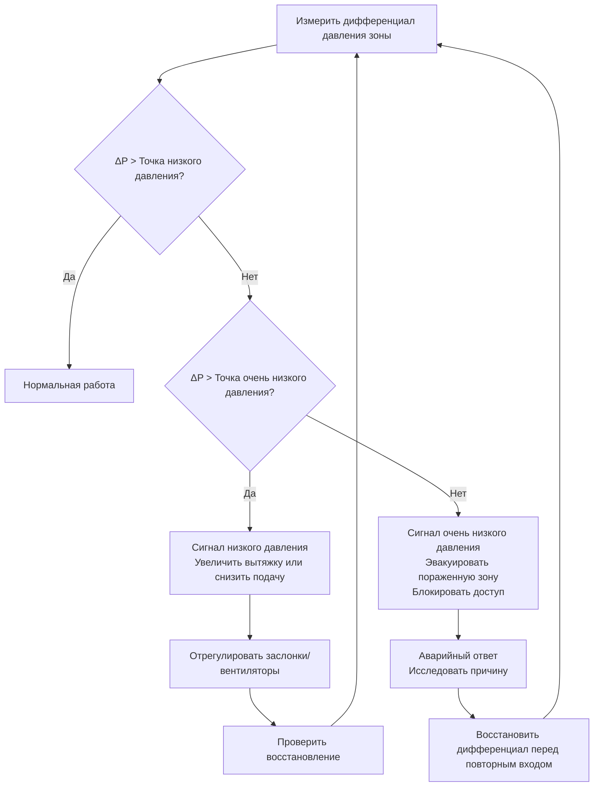

## Фундаментальный принцип управления направленным воздушным потоком

Чистые-в-грязные воздушные потоки в ядерных объектах основаны на каскадных дифференциалах давления, чтобы гарантировать, что воздух всегда течет из областей с меньшим потенциалом радиологического загрязнения в области с более высоким риском загрязнения. Этот подход, основанный на физике, предотвращает миграцию радиоактивных частиц и загрязненного воздуха в занятые чистые зоны, защищая персонал и предотвращая распространение загрязнения.

Движущей силой является градиент давления между зонами. Воздух естественным образом течет из областей высокого давления в области низкого давления, следуя уравнению дифференциала давления:

$$Q = C \cdot A \cdot \sqrt{\frac{2\Delta P}{\rho}}$$

Где:
- $Q$ = объемный расход воздуха через отверстие (м³/ч)
- $C$ = коэффициент расхода (типично 0,6–0,65 для дверей)
- $A$ = площадь утечки (м²)
- $\Delta P$ = дифференциал давления (Па)
- $\rho$ = плотность воздуха (кг/м³)

Эта зависимость демонстрирует, что поддержание постоянного дифференциала давления является критическим — удвоение дифференциала давления увеличивает поток воздуха примерно на 41%, а уменьшение вдвое снижает его на 29%.

## Классификация зон и проектирование каскада давления

Ядерные объекты устанавливают радиологические зоны на основе потенциала загрязнения, как правило, организованные в четыре категории с прогрессивно отрицательным давлением:

| Классификация зоны | Типичный дифференциал давления | Направление воздушного потока | Риск загрязнения |
|---------------------|-------------------------------|-------------------|--------------------|
| Чистая зона (офисные помещения) | +12–15 Па | Наружу | Отсутствует |
| Буферная зона (коридоры) | +5–10 Па | В буферную из чистой | Минимальный |
| Управляемая зона (вход RCA) | –5–10 Па | В управляемую | От низкого к умеренному |
| Загрязненная зона (горячие области) | –15–25 Па | В загрязненную | Высокий |

Каскад давления должен поддерживать минимальный дифференциал в 2,5 Па между соседними зонами при всех условиях эксплуатации согласно рекомендациям 10 CFR 20. Однако большинство объектов предусматривают 5–12 Па для обеспечения запаса прочности против колебаний давления, вызванных операциями с дверями, засорением фильтров и вариациями системы.

### Расчет дифференциала давления

Для многозонного каскада общее требование к давлению в системе от чистейшей до наиболее загрязненной зоны:

$$\Delta P_{total} = \sum_{i=1}^{n} \Delta P_i + \Delta P_{margin}$$

Где $\Delta P_i$ представляет дифференциал через каждую границу зоны, а $\Delta P_{margin}$ учитывает потери давления во время открытия дверей (типично 20–30% номинального дифференциала).

## Конструкция и эксплуатация шлюза

Шлюзы служат зонами переходного давления между областями со значительно различающимися режимами давления. Две основные конфигурации:

### Конфигурация пузырькового шлюза

Поддерживается под давлением выше, чем обе соседние зоны, обеспечивая поток воздуха в оба пространства:

$$P_{шлюз} > P_{чистая} > P_{загрязненная}$$

Эта конфигурация предотвращает передачу загрязнения, но требует непрерывного свежего воздуха и приводит к более высокому потреблению энергии.

### Конфигурация синкового шлюза

Поддерживается под давлением ниже, чем обе соседние зоны, вытягивая воздух из обоих пространств:

$$P_{чистая} > P_{загрязненная} > P_{шлюз}$$

Эта конфигурация обеспечивает превосходное сдерживание в случае неожиданного повышения давления на загрязненной стороне, но может допустить кросс-загрязнение чистой-в-грязную, если обе двери откроются одновременно.

## Расчеты скорости утечки

Неконтролируемая утечка через трещины, проникновения и уплотнения дверей определяет фактический расход воздуха, необходимый для поддержания дифференциалов давления. Скорость утечки через компоненты оболочки здания следует:

$$Q_{утечка} = K \cdot A \cdot (\Delta P)^n$$

Где:
- $K$ = коэффициент утечки (зависит от геометрии отверстия)
- $A$ = эквивалентная площадь утечки (см²)
- $n$ = показатель потока (0,5 для турбулентного, 1,0 для ламинарного)

Для типичной коммерческой конструкции двери с уплотнительными лентами площадь утечки составляет от 25 до 77 см² на дверь. При дифференциале 10 Па:

$$Q_{утечка} = 0,65 \cdot 51,6 \text{ см}^2 \cdot \sqrt{\frac{2 \cdot 10 \cdot 1,2}{1,2}} = 48,8 \text{ м³/ч (29 CFM) за дверь}$$

Этот расчет демонстрирует, почему поддержание контроля давления требует значительного расхода воздуха — одна дверь может требовать 50–150 м³/ч (30–90 CFM) свежего или вытяжного воздуха в зависимости от направления давления.

## Системы мониторинга дифференциала давления

Непрерывный мониторинг дифференциалов давления зоны требуется 10 CFR 20.1406 и реализуется через:

**Магнехелические манометры**: Обеспечивают визуальное указание на границах зон. Точность ±2% от полной шкалы (±0,02 Па в диапазоне 10 Па) ограничивает точность для низких дифференциалов.

**Электронные датчики давления**: Более высокая точность (±0,5% от показания) позволяет интеграцию с системами автоматизации зданий. Неопределенность измерения должна быть рассмотрена в логике управления:

$$\Delta P_{управление} = \Delta P_{задание} + U_{прибор} + \Delta P_{запас}$$

**Точки срабатывания сигналов тревоги**: Настроены на предупреждение перед падением дифференциала ниже минимально приемлемого значения:

- Сигнал низкого давления: 80% задания (например, 8 Па при задании 10 Па)
- Сигнал очень низкого давления: Минимальный приемлемый дифференциал (например, 2,5 Па)

## Системы блокировки дверей

Для предотвращения одновременного открытия обеих дверей шлюза (что исключило бы барьер давления), системы блокировки используют:

**Механические блокировки**: Физические связи предотвращают открытие одной двери, пока другая остается открытой. Не требует электроэнергии, но не предусматривает возможность отмены.

**Электромагнитные блокировки**: Электрические замки, управляемые датчиками положения дверей. Допускают административную отмену в чрезвычайных ситуациях, но требуют резервного питания для поддержания заблокированного состояния при отключении питания.

**Блокировки на основе давления**: Контролируют дифференциал давления и предотвращают открытие двери, если дифференциал падает ниже порога. Наиболее совершенные, но подвержены отказам датчиков.

Логика блокировки должна учитывать время цикла двери для обеспечения восстановления давления:

$$t_{восстановление} = \frac{V_{шлюз}}{\dot{V}_{нетто}} \cdot \ln\left(\frac{\Delta P_{начальное}}{\Delta P_{конечное}}\right)$$

Где $V_{шлюз}$ — объем шлюза, а $\dot{V}_{нетто}$ — чистый расход воздуха в пространство или из него.

## Рекомендации по проектированию системы

Достижение надежного воздушного потока чистый-в-грязный требует:

1. **Систем отдельной вытяжки** для загрязненных зон для предотвращения кросс-загрязнения через общую воздуховодную сеть
2. **Управления объемом подаваемого воздуха** с использованием клапанов VAV, независимых от давления, для поддержания давления в зонах несмотря на засорение фильтров
3. **Отслеживания расхода вытяжного воздуха** для поддержания смещения между подачей и вытяжкой (типично на 10–15% больше вытяжка в загрязненных зонах)
4. **HEPA-фильтрации** на потоках вытяжного воздуха из загрязненных зон согласно 10 CFR 20, приложение B
5. **Резервные вытяжные вентиляторы** с автоматическим переключением для обеспечения непрерывного отрицательного давления

Смещение подачи-вытяжки для загрязненной зоны:

$$\dot{V}_{вытяжка} = \dot{V}_{подача} + \dot{V}_{инфильтрация} + \dot{V}_{нагнетание}$$

Где $\dot{V}_{нагнетание}$ — дополнительная вытяжка, необходимая для достижения целевого отрицательного давления (типично 150–570 м³/ч (90–335 CFM) на зону в зависимости от размера и характеристик утечки).

## Проверка производительности и испытания

Стандарт ASHRAE 111 предоставляет процедуры испытаний для проверки производительности дифференциала давления:

- **Первоначальный ввод в эксплуатацию**: Проверка дифференциалов при всех положениях дверей и режимах эксплуатации
- **Имитация засорения фильтра**: Испытание дифференциалов при чистых и грязных условиях фильтра
- **Тест качания двери**: Измерение времени восстановления дифференциала после операции с дверью
- **Испытание трассирующим газом**: Проверка фактического направления воздушного потока с использованием SF₆ или других трассирующих веществ

Критерии приемки обычно требуют поддержания минимального дифференциала в течение 95% времени пребывания и восстановления до задания в течение 30–60 секунд после операции с дверью.

Воздушный поток чистый-в-грязный является фундаментальной стратегией сдерживания для ядерных объектов, обеспечивая пассивную защиту благодаря физическому управлению давлением, которое работает непрерывно без необходимости активного обнаружения выброса загрязнения.
