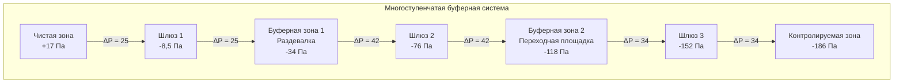

# Буферные зоны HVAC в ядерных учреждениях

Буферные зоны служат промежуточными областями давления между чистыми незагрязненными областями и контролируемыми радиологическими зонами в ядерных учреждениях, обеспечивая переходные пространства, которые предотвращают прямую миграцию загрязнения при движении персонала и оборудования. Эти критические переходные области, включая шлюзы, раздевалки, переходные площадки и коридоры доступа, используют тщательно спроектированные системы вентиляции, которые поддерживают определенные отношения давления к смежным зонам, одновременно компенсируя динамические возмущения потока воздуха, создаваемые открытием дверей, движением персонала и передачей оборудования. Нормативное руководство NRC 1.140 устанавливает требования к давлению в буферных зонах, которые обеспечивают двустороннюю защиту: отрицательное давление относительно чистых зон предотвращает выход загрязнения, а положительное давление относительно контролируемых зон предотвращает попадание загрязнения при нормальной работе.

## Назначение и требования к буферным зонам

### Функциональные задачи

**Первичный барьер загрязнения:**
Буферные зоны устанавливают постепенный каскад давления, который минимизирует перепад давления между чистыми и контролируемыми зонами. Вместо поддержания одного большого перепада (например, +17 Па чистая к -169 Па контролируемая), буферные зоны создают промежуточные уровни давления, которые снижают переходные потоки воздуха при открытии дверей и обеспечивают избыточность локализации.

**Путь дезактивации персонала:**
Раздевалки и переходные площадки в буферных зонах позволяют работникам надевать и снимать средства индивидуальной защиты в среде контролируемой вентиляции, где обнаружение и удаление загрязнения происходит до входа персонала в чистые области. Постепенное снижение давления совпадает с этапами дезактивации.

**Коридор передачи оборудования:**
Буферные зоны предоставляют контролируемые пути для инструментов, материалов и оборудования, перемещающихся между радиологическими зонами, с картинами воздушных потоков, предназначенными для предотвращения распространения загрязнения во время операций передачи.

### Нормативные требования

**Спецификации NRC Regulatory Guide 1.140:**
- Отрицательное давление относительно чистых зон: -42 до -84 Па
- Положительное давление относительно контролируемых зон: +42 до +84 Па
- Перепад давления поддерживается при всех положениях двери
- Непрерывный мониторинг с возможностью сигнализации
- Ежегодная проверка в соответствии с ASME N511

**Стандарты радиационной защиты 10 CFR 20:**
Проектирование буферной зоны должно поддерживать программы контроля загрязнения, которые поддерживают воздействие на работников на уровне ALARA (As Low As Reasonably Achievable), предотвращая миграцию загрязнения из контролируемых в чистые области через надлежащим образом направленный воздушный поток.

**Критерии проекта:**

| Параметр | Спецификация | Нормативная основа |
|-----------|--------------|------------------|
| Минимальный перепад к чистой зоне | -42 Па | NRC RG 1.140 |
| Минимальный перепад к контролируемой зоне | +42 Па | NRC RG 1.140 |
| Воздухообмены в час | 10-20 ACH | ASHRAE, специфичны для учреждения |
| Фильтрация подачи | MERV 13-16 | 10 CFR 50 App A |
| Фильтрация выхода | Одноступенчатая HEPA | Руководство NRC |
| Время восстановления давления | <5 секунд после закрытия двери | Промышленный стандарт |
| Мониторинг перепада | Точность ±3 Па | ASME AG-1 |

## Каскад давления воздуха от чистой к контролируемой зоне

### Основы каскада давления

**Отношение давления трех зон:**
Буферная зона устанавливает промежуточный уровень давления, который создает два меньших перепада давления вместо одного большого:

$$P_{clean} > P_{buffer} > P_{controlled}$$

Типичные абсолютные давления относительно атмосферы:
- Чистая зона: $P_c = +17$ Па
- Буферная зона: $P_b = -34$ Па
- Контролируемая зона: $P_{ctrl} = -118$ Па

**Расчеты перепада давления:**
Перепад чистая-буферная:

$$\Delta P_{c-b} = P_c - P_b = 17 - (-34) = +51 \text{ Па}$$

Перепад буферная-контролируемая:

$$\Delta P_{b-ctrl} = P_b - P_{ctrl} = -34 - (-118) = +84 \text{ Па}$$

Общий перепад чистая-контролируемая:

$$\Delta P_{total} = \Delta P_{c-b} + \Delta P_{b-ctrl} = 51 + 84 = 135 \text{ Па}$$

### Баланс подачи-выхода для давления в буферной зоне

**Расчет потока дисбаланса:**
Давление в буферной зоне зависит от чистого дисбаланса потока воздуха между подачей и выходом, учитывая утечку через все границы:

$$Q_{exhaust} - Q_{supply} = Q_{leak,clean} + Q_{leak,controlled}$$

Где потоки утечки определяются перепадом давления и характеристиками отверстия:

$$Q_{leak} = C_d A_{effective} \sqrt{\frac{2\rho \Delta P}{\rho}}$$

**Пример расчета для буферной зоны:**
Дано:
- Объем буферной зоны: 56,6 м³
- Эффективная площадь утечки к чистой зоне: 0,28 м²
- Эффективная площадь утечки к контролируемой зоне: 0,23 м²
- Целевое давление: -34 Па (чистая), +84 Па (контролируемая)
- Коэффициент расхода: $C_d = 0,65$

Утечка из чистой в буферную (в м³/ч):

$$Q_{c-b} = 0,65 \times 0,28 \times \sqrt{\frac{2 \times 1,2 \times 51}{1,2}} \times 3,6 = 0,182 \times 10,1 \times 3,6 = 6,6 \text{ м³/ч}$$

Утечка из буферной в контролируемую (в м³/ч):

$$Q_{b-ctrl} = 0,65 \times 0,23 \times \sqrt{\frac{2 \times 1,2 \times 84}{1,2}} \times 3,6 = 0,1495 \times 13,3 \times 3,6 = 7,2 \text{ м³/ч}$$

Требуемый выход превышает подачу на:

$$Q_{imbalance} = 6,6 + 7,2 = 13,8 \text{ м³/ч}$$

Для целевого воздухообмена 15 ACH:

$$Q_{supply} = \frac{56,6 \times 15}{60} = 14,15 \text{ м³/ч}$$

$$Q_{exhaust} = 14,15 + 13,8 = 27,95 \text{ м³/ч}$$

### Переходный воздушный поток при открытии двери

**Всплеск потока при открытии двери:**
Когда двери открываются между зонами, происходит мгновенный высокоскоростной поток для выравнивания давления. Этот переходный поток должен подаваться/выводиться системой вентиляции для быстрого восстановления расчетных перепадов:

$$Q_{door} = C_d A_{door} \sqrt{\frac{2\Delta P}{\rho}}$$

Для стандартной двери персонала 0,9 м × 2,1 м ($A = 1,89$ м²) с перепадом 51 Па:

$$Q_{door} = 0,65 \times 1,89 \times \sqrt{\frac{2 \times 51}{1,2}} \times 3,6 = 1,23 \times 9,2 \times 3,6 = 40,7 \text{ м³/ч}$$

Это представляет мгновенный всплеск потока, длящийся 5-10 секунд во время цикла открытия/закрытия двери.

**Проектирование восстановления давления:**
Системы подачи/выхода буферной зоны должны обеспечивать достаточную резервную мощность для восстановления перепадов давления в течение 5 секунд после закрытия двери. Требуемая резервная мощность:

$$Q_{reserve} = \frac{V_{buffer} \times N_{recovery}}{60}$$

Где $N_{recovery}$ представляет воздухообмены в течение периода восстановления (обычно 1,5-2,0 ACH):

$$Q_{reserve} = \frac{56,6 \times 1,5}{60} = 1,42 \text{ м³/ч}$$

## Проектирование вентиляции раздевалки

### Компоновка раздевалки и воздушный поток

**Зонирование в раздевалке:**
Раздевалки подразделяются на чистую сторону (уличная одежда), переходную область (душ/дезактивация) и загрязненную сторону (хранилище защитной одежды) с постепенным снижением давления, следующим градиенту риска загрязнения.

**Требования к картине воздушного потока:**
Подаваемый воздух входит на чистую сторону раздевалки, течет через персонал по мере его движения через этапы и выходит из загрязненной стороны около уровня пола для захвата оседающих частиц. Этот воздушный поток от чистого к грязному предотвращает миграцию загрязнения в сторону чистых областей.

### Конфигурация подачи и выхода

**Подача подаваемого воздуха:**
- Расположение: Диффузоры потолочного монтажа на чистой стороне
- Скорость: 1,5-2,5 м/с на выходе диффузора (низкая турбулентность)
- Распределение: Равномерное покрытие по путям циркуляции персонала
- Фильтрация: Предфильтры MERV 13-16, однопроходная вентиляция
- Температура: 20-22°C (комфорт при смене одежды)

**Сбор воздуха на выходе:**
- Расположение: Решетки на уровне пола или низкая стена на загрязненной стороне
- Скорость: 1,0-1,5 м/с на выходе решетки
- Покрытие: Несколько выходных точек предотвращают мертвые зоны
- Фильтрация: Одноступенчатая HEPA (99,97% при 0,3 мкм)
- Мониторинг: Непрерывный радиационный мониторинг перед выпуском

**Таблица параметров проектирования:**

| Параметр | Чистая сторона | Переходная | Загрязненная сторона |
|-----------|-----------|------------|-------------------|
| Давление (Па) | -17 | -51 | -68 |
| Воздухообмены (ACH) | 10-12 | 15-20 | 20-25 |
| Подача м³/ч (9,3 м² каждая) | 1,55 | 2,33 | 3,10 |
| Выход м³/ч (9,3 м² каждая) | 1,71 | 2,71 | 3,71 |
| Температура (°C) | 21 | 21 | 22 |
| Скорость потока (м/с) | 0,38 | 0,51 | 0,64 |

### Функции контроля загрязнения

**Вентиляция переходной площадки:**
Выделенный выход на уровне пола непосредственно внутри входа в контролируемую зону захватывает загрязнение с обуви персонала. Минимальная скорость 0,76 м/с на поверхности переходной площадки с прямым выходом к фильтрации HEPA предотвращает попадание загрязнения в буферные области.

**Душевые и станции дезактивации:**
События загрязнения персонала требуют аварийных душевых дезактивации в буферных зонах. Системы выхода душа обеспечивают:
- 20-30 ACH во время операций дезактивации
- Мгновенное включение с активацией движения или вручную
- Подача теплой воды (35-40°C) для удаления загрязнения
- Сливы на полу, подключенные к системам радиоактивных жидких отходов
- Воздушная завеса при входе в душ, поддерживающая 1,0 м/с

**Хранилище средств индивидуальной защиты:**
Области хранения загрязненных СИЗ в раздевалках поддерживают максимальное отрицательное давление (-84 Па) с выделенным выходом, предотвращающим перекрестное загрязнение чистых областей. HEPA-фильтрованный выход обрабатывает загрязнение частицами от снятия СИЗ.

## Интеграция шлюзов

### Системы двойных дверей шлюзов

**Стратегия контроля давления в шлюзе:**
Шлюзы поддерживают промежуточное давление между смежными зонами, рассчитываемое как среднее арифметическое давлений границ:

$$P_{airlock} = \frac{P_{zone1} + P_{zone2}}{2}$$

Для шлюза чистая-буферная:

$$P_{airlock} = \frac{17 + (-34)}{2} = -8,5 \text{ Па}$$

Это промежуточное давление обеспечивает поток воздуха, всегда движущийся к зоне с более низким давлением независимо от того, какая дверь открывается, обеспечивая двустороннюю защиту от загрязнения.

**Логика управления блокировкой:**
Электронные блокировки предотвращают одновременное открытие двери, исключая прямой путь воздушного потока между чистыми и контролируемыми зонами. Система блокировки включает:
- Магнитные выключатели положения двери, проверяющие статус закрытия
- Временная задержка (5-10 секунд), обеспечивающая восстановление давления перед разблокировкой противоположной двери
- Возможность аварийного переопределения для эвакуации персонала
- Индикация локального статуса и удаленный мониторинг

### Системы вентиляции шлюзов

**Проектирование подачи/выхода:**
Вентиляция шлюза работает непрерывно для поддержания промежуточного давления и быстрой очистки загрязнения после каждого использования:

**Непрерывный режим (двери закрыты):**
- Подача: 15-20 ACH поддерживает баланс давления
- Выход: Немного превышает подачу для отрицательного давления
- Фильтрация: MERV 13-16 подача, HEPA выход

**Режим очистки (после использования):**
- Подача: Увеличивается до 30-40 ACH на 2-3 минуты
- Выход: Увеличивается пропорционально поддерживая давление
- Длительность: 3-5 полных объемных воздухообменов

**Расчет размера шлюза:**
Для шлюза 2,4 м × 2,4 м × 2,4 м (13,8 м³):

Расход в непрерывном режиме:

$$Q_{continuous} = \frac{13,8 \times 18}{60} = 4,14 \text{ м³/ч подачи}$$

Расход режима очистки:

$$Q_{purge} = \frac{13,8 \times 35}{60} = 8,05 \text{ м³/ч подачи}$$

### Интеграция шлюза в буферной зоне

**Конфигурация последовательного шлюза:**
Сложные ядерные учреждения используют последовательные шлюзы, создающие несколько буферных этапов между чистыми и сильно загрязненными зонами:

Каждый шлюз и буферный этап добавляют барьер локализации загрязнения при поддержании эффективности доступа персонала.

## Принципы локализации загрязнения

### Физические барьеры и воздушный поток

**Стратегия направленного воздушного потока:**
Контроль загрязнения в буферных зонах зависит от последовательного воздушного потока от чистого к грязному, поддерживаемого через:

1. **Градиент давления**: Отрицательное давление относительно чистых зон предотвращает внутренний поток воздуха
2. **Пороговая скорость**: Минимальная скорость 0,38-0,51 м/с на отверстиях предотвращает обратную миграцию
3. **Размещение выхода**: Низко установленные выходы захватывают оседающее загрязнение
4. **Распределение подачи**: Потолочная подача направляет поток вниз и через комнату

**Предотвращение миграции загрязнения:**
Во время переходных процессов открытия двери проектирование буферной зоны обеспечивает движение загрязнения всегда в сторону контролируемых зон:

$$\vec{V}_{air} = -\nabla P$$

Вектор скорости воздуха следует градиенту давления от высокого к низкому давлению. Надлежащий каскад давления гарантирует, что этот градиент всегда указывает в сторону контролируемой зоны.

### Фильтрация HEPA в буферных зонах

**Одноступенчатая HEPA на выходе буферной зоны:**
Выход буферной зоны получает одноступенчатую фильтрацию HEPA (99,97% эффективности при 0,3 мкм), обеспечивающую:
- Захват загрязнения частицами перед выпуском
- Защита нижележащей системы воздуховодов от загрязнения
- Сниженное бремя обслуживания по сравнению с двухступенчатыми системами контролируемой зоны

**Рассмотрение перепада давления:**
Перепад давления чистого фильтра HEPA: 34-51 Па
Перепад давления загруженного фильтра HEPA: 102-136 Па (триггер замены)

Общее статическое давление выхода:

$$SP_{total} = SP_{duct} + SP_{HEPA} + SP_{fittings} + SP_{discharge}$$

Типичное проектирование: 203-271 Па общего статического давления для вентиляторов выхода буферной зоны.

### Непрерывный мониторинг воздуха

**Обнаружение загрязнения:**
Буферные зоны включают непрерывные мониторы воздуха (CAMs), измеряющие радиоактивность в воздухе в реальном времени:
- Место отбора: Воздуховод выхода перед фильтрами HEPA
- Измерение: Активность брутто-беты-гамма (cpm или мкКи/мл)
- Уставка сигнала тревоги: 2-5× уровни фона
- Ответ: Автоматическое увеличение вентиляции, уведомление оператора

**Мониторинг перепада давления:**
Каждая граница буферной зоны требует непрерывного измерения перепада давления:
- Тип датчика: Емкостной манометр (точность ±3 Па)
- Дисплей: Локальное указание и сигнализация в управляющем помещении
- Сигналы тревоги: Предупреждение при 75% расчетного ΔP, тревога при 50%
- Логирование данных: Интервалы 1 минуты для нормативного соответствия

## Рассмотрение средств индивидуальной защиты

### Вентиляция при надевании и снятии СИЗ

**Надевание СИЗ на чистой стороне:**
Персонал надевает защитное снаряжение на чистой стороне раздевалки под положительным давлением относительно переходной области. Чистая подача воздуха предотвращает контакт с загрязнением перед входом в контролируемую зону:
- Подача: Диффузоры потолка обеспечивают ламинарный поток вниз
- Скорость: 0,25-0,38 м/с над рабочей областью
- Чистота: Фильтрация MERV 13-16 поддерживает качество воздуха в помещении

**Снятие загрязненного СИЗ:**
Снятие СИЗ происходит на загрязненной стороне под отрицательным давлением с усиленным захватом выхода. Критические функции проектирования:
- Несколько выходных точек на уровне пола и среднего уровня
- Минимальная скорость 0,64 м/с на выходе выходных решеток
- Немедленная близость к переходной площадке и станции мониторинга
- HEPA-фильтрованный выход всего воздуха

### Интеграция респираторной защиты

**Автономные дыхательные аппараты (SCBA):**
Вводы высокого загрязнения требуют использования SCBA, влияющие на конструкцию раздевалки:
- Хранилище SCBA: Герметичные шкафы с HEPA-фильтрованной подачей воздуха
- Область надевания: Выделенное пространство с вертикальным ламинарным потоком 1,0 м/с
- Станция тестирования: Кабина проверки пригодности с захватом выхода
- Станция заправки: Отдельное помещение с взрывозащищенным электрооборудованием

**Воздухоочищающие респираторы (APR):**
Стандартные входы используют APR с фильтрами для частиц, требующие:
- Чистое хранилище в герметичных шкафах с положительным давлением
- Проверка пригодности ежегодно в соответствии с 10 CFR 20
- Утилизация использованного фильтра в контейнерах загрязненных отходов
- Возможность дезактивации перед удалением

### Станции обследования загрязнения

**Мониторы загрязнения персонала (PCMs):**
Буферные зоны включают автоматические PCM на выходных точках, обнаруживающие загрязнение перед входом в чистую зону:
- Мониторы рук/ног на переходных площадках
- Портальные мониторы на выходах раздевалки
- Чувствительность: <20 дpm/100 см² беты-гаммы
- Ответ тревоги: Блокировка двери выхода, сигнал необходимости дезактивации

**Вентиляция для станций обследования:**
Станции PCM требуют выделенной вентиляции, предотвращающей распространение загрязнения во время обследований:
- Локальный выход: Скорость захвата 0,76-1,0 м/с на уровне пола
- Подача: Низкоскоростная потолочная подача (1,5 м/с) обеспечивающая чистый воздух
- Давление: Слегка отрицательное (-7 Па) относительно окружающей буферной области
- Фильтрация: HEPA выход захватывает любое взволнованное загрязнение

### Источники загрязнения, связанные с СИЗ

**Тепловой стресс и влага:**
Непроницаемая защитная одежда генерирует значительное метаболическое тепло, требующее усиленного охлаждения:
- Температура подаваемого воздуха: 18-20°C в областях надевания СИЗ
- Скорость вентиляции: 20-25 ACH предотвращающие накопление тепла
- Скорость воздуха: 0,38-0,51 м/с обеспечивающие конвективное охлаждение
- Относительная влажность: 40-50% предотвращающие конденсацию влаги

**Образование частиц при снятии СИЗ:**
Снятие загрязненной защитной одежды нарушает поверхностное загрязнение, создавая частицы в воздухе. Проектирование выхода буферной зоны захватывает эту переходную нагрузку:
- Усиленный расход выхода во время операций снятия
- Низко установленные выходы (30-61 см над полом)
- Несколько выходных точек предотвращающие мертвые зоны
- Фильтрация HEPA защищающие нижележащий воздуховод

Системы HVAC буферных зон представляют сложные инженерные решения, балансирующие контроль загрязнения, безопасность персонала и эффективность операций, обеспечивая существенные переходные пространства, которые защищают работников и предотвращают миграцию радиоактивного материала в ядерных учреждениях.
