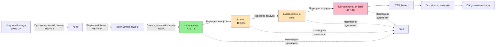

Чистые зоны на ядерных объектах представляют наивысший уровень радиологической чистоты, требуя строгого управления HVAC для предотвращения попадания загрязнений и обеспечения безопасной рабочей среды для персонала и оборудования. Эти площади требуют точного контроля давления, высокоэффективной фильтрации и непрерывного мониторинга для обеспечения соответствия нормативным требованиям и безопасности операций.

## Определение и требования к чистым зонам

Чистые зоны — это незагрязненные площади на ядерных объектах, где нет радиоактивных материалов и не ожидается их наличие при нормальных условиях эксплуатации. Эти помещения включают административные офисы, комнаты управления, основные помещения управления, комнаты электрооборудования и объекты для персонала, такие как раздевалки на чистой стороне.

Основная цель HVAC для чистых зон — поддерживать положительное давление относительно смежных буферных зон и контролируемых зон. Эта иерархия давления предотвращает миграцию потенциально загрязненного воздуха в чистые помещения. Типичные перепады давления составляют от +12,5 до +25 Па относительно буферных зон.

Чистые зоны должны поддерживать условия окружающей среды, подходящие для непрерывного пребывания персонала. Диапазон температур обычно находится между 20°C и 24°C с влажностью воздуха, контролируемой между 30% и 60% для обеспечения комфорта и предотвращения накопления статического электричества, которое может повлиять на чувствительное электронное оборудование.

## Поддержание положительного давления

Контроль положительного давления в чистых зонах основан на подаче большего количества воздуха, чем выходит или передается в соседние помещения. Перепад давления рассчитывается с использованием:

$$\Delta P = \frac{Q_{supply} - Q_{exhaust}}{C_L}$$

где $\Delta P$ — перепад давления (Па), $Q_{supply}$ — расход подаваемого воздуха (м³/с), $Q_{exhaust}$ — расход выходящего воздуха (м³/с), и $C_L$ — коэффициент утечки, зависящий от качества строительства здания.

Кратность воздухообмена в чистых зонах обычно находится в диапазоне от 4 до 8 воздухообменов в час (ACH), рассчитывается как:

$$ACH = \frac{Q_{supply} \times 3600}{V_{room}}$$

где $Q_{supply}$ выражен в м³/с, а $V_{room}$ — объем помещения в м³.

Системы подачи воздуха в чистые зоны включают управление переменным расходом воздуха (VAV) с установками минимального расхода воздуха для обеспечения надлежащей вентиляции при низкой загруженности. Контурные системы управления давлением непрерывно модулируют заслонки подачи и вытяжки для поддержания установленных перепадов давления в пределах ±1,25 Па.

## Требования к фильтрации для чистых зон

Подаваемый воздух в чистые зоны проходит через многоступенчатую фильтрацию для удаления частиц и обеспечения высокого качества воздуха. Типичная цепь фильтрации состоит из:

| Ступень фильтра | Рейтинг эффективности | Основная функция |
|-----------------|----------------------|------------------|
| Предварительный фильтр | MERV 8 | Удаление грубых частиц, защита системы |
| Вторичный фильтр | MERV 13-14 | Удаление мелких частиц |
| Заключительный фильтр | MERV 15-16 или HEPA | Удаление субмикронных частиц |

HEPA фильтры (минимум 99,97% эффективности при 0,3 мкм) устанавливаются в критических чистых зонах, таких как комнаты управления и центры экстренного реагирования, чтобы обеспечить защиту от внешних радиологических выбросов. Эти фильтры требуют регулярного мониторинга перепада давления с заменой, обычно происходящей при перепаде давления от 500 до 625 Па.

Воздухораспределители в чистых зонах используют конструкции с низкой скоростью для минимизации шума и сквозняков. Скорости выхода обычно ограничены 2,0-3,0 м/с для поддержания уровня шума ниже NC-35 в занятых помещениях.

## Вход персонала и оборудования

Доступ в чистые зоны осуществляется через контролируемые точки входа, оборудованные шлюзами или вестибюлями, которые поддерживают каскады давления. Переход персонала из чистых зон происходит через буферные зоны в контролируемые зоны через раздевалки, где надевается защитная одежда.

Каскад давления шлюза поддерживает:

- Чистая зона: +25 Па относительно буферной зоны
- Шлюз/вестибюль: +12,5 Па относительно буферной зоны
- Буферная зона: 0 Па (нейтральное или слегка положительное относительно контролируемых зон)

Оборудование, попадающее в чистые зоны, проходит радиологическое обследование и дезактивацию при необходимости перед передачей. Материальные шлюзы с блокирующимися дверями предотвращают одновременное открытие, которое скомпрометировало бы перепады давления.

## Мониторинг и сигнализация

Системы HVAC чистых зон включают комплексный мониторинг для обнаружения отклонений давления, деградации фильтров и отказов системы. Критические точки мониторинга включают:

**Мониторинг перепада давления**: Датчики давления с точностью ±0,25 Па непрерывно измеряют перепады давления между чистыми зонами и соседними помещениями. Установки точек сигнализации активируются при отклонении ±20% от установленных значений.

**Мониторинг расхода воздуха**: Станции подачи и вытяжки воздуха с тепловыми или дифференциальными датчиками давления проверяют, что расходы остаются в пределах проектных допусков. Сигналы низкого расхода указывают на загрузку фильтра, отказ вентилятора или неисправность заслонок.

**Перепад давления фильтра**: Манометры Magnehelic или электронные датчики контролируют перепад давления на каждой ступени фильтра. Высокий перепад давления указывает на загрузку фильтра, требующую замены.

**Температура и влажность**: Датчики окружающей среды с точностью ±0,3°C и ±2% RH контролируют условия в помещении с сигналами тревоги при выходе за пределы диапазона.

Все точки мониторинга подключаются к системе управления зданием (BMS) с трендингом данных, объявлением аварий и автоматическими ответами системы. Критические сигналы тревоги передаются в постоянно укомплектованные комнаты управления для немедленного реагирования.

## Переход в буферные и контролируемые зоны

Переход из чистых зон в буферные зоны и впоследствии в контролируемые зоны следует строгому каскаду давления, который предотвращает миграцию загрязнений. Буферные зоны служат промежуточными пространствами между чистыми и потенциально загрязненными зонами, обычно поддерживаемыми при нейтральном давлении или слегка положительном давлении относительно контролируемых зон.

Проектирование каскада давления обеспечивает, что направленный поток воздуха всегда течет из зон с меньшим потенциалом загрязнения в зоны с большим потенциалом загрязнения. Передача воздуха из чистых зон поступает в буферные зоны, затем в контролируемые зоны, где он выходит через HEPA фильтрацию перед выпуском.

Блокировки дверей предотвращают одновременное открытие нескольких дверей в каскаде, что привело бы к короткому замыканию перепада давления и разрешило миграцию загрязнений. Электромагнитные замки, управляемые BMS, обеспечивают последовательное открытие дверей в шлюзах персонала и материалов.

Экстренные условия, такие как пожар или эвакуация, могут требовать разворота давления для разрешения эвакуации персонала из контролируемых зон через чистые зоны. Системы аварийного переопределения временно разворачивают поток вытяжки и активируют дополнительную HEPA фильтрацию для защиты чистых зон во время аварийной эвакуации, при этом приоритизируя безопасность персонала.

Системы HVAC чистых зон представляют основу радиологического зонирования на ядерных объектах, обеспечивая наивысший уровень защиты от попадания загрязнений благодаря строгому контролю давления, фильтрации и мониторингу. Надлежащее проектирование, эксплуатация и техническое обслуживание этих систем является критически важным для безопасности объекта и соответствия нормативным требованиям.
