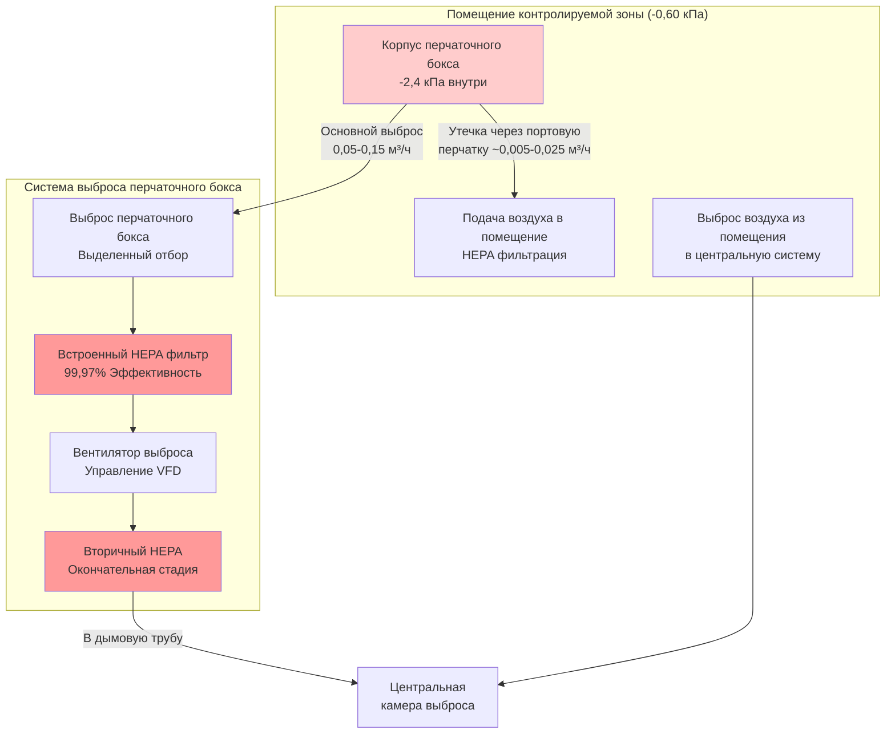

Контролируемые зоны представляют собой области с наивысшим риском загрязнения на объектах ядерной энергетики, требующие наиболее строгих систем контроля вентиляции для предотвращения миграции радиоактивных материалов. Эти зоны включают оболочки реакторных зданий, горячие камеры, перчаточные боксы, объекты дезактивации и площади обработки радиоактивных отходов. Система вентиляции обеспечивает окончательный инженерный барьер против выброса загрязнений благодаря максимальному отрицательному давлению, резервной HEPA-фильтрации, непрерывному радиационному мониторингу и строгим однопроходным режимам потока воздуха в соответствии с NRC Regulatory Guide 1.140 и 10 CFR Part 20.

## Классификация и требования контролируемых зон

### Определение зоны и критерии сдерживания

Контролируемые зоны содержат радиоактивные материалы, загрязненное оборудование или процессы, которые производят радиоактивность в воздухе. Доступ требует разрешений на работу с радиацией, дозиметрии персонала и защитного оборудования. Система вентиляции поддерживает эти зоны при максимальном отрицательном давлении относительно всех других помещений здания, чтобы загрязненный воздух поступал только в направлении фильтрованного выброса.

**Нормативная основа согласно 10 CFR Part 20:**
- Пределы производной концентрации воздуха (DAC) для конкретных изотопов
- Обозначение зон с радиоактивностью в воздухе при превышении концентраций 1 DAC
- Меры контроля для зон высокой радиации при мощностях дозы, превышающих 100 мrem/ч
- Меры контроля для зон очень высокой радиации при мощностях дозы, превышающих 500 рад/ч на расстоянии 1 м

**Требования к давлению в контролируемой зоне:**

| Тип зоны | Давление относительно буфера | Давление относительно атмосферы | Кратность воздухообмена | Стадии фильтрации |
|-----------|---------------------|------------------------|-------------|-------------------|
| Стандартная контролируемая | -0,30-0,60 кПа | -0,60-1,20 кПа | 4-6 ACH | Двойная HEPA |
| Горячие камеры | -0,60-1,20 кПа | -1,20-2,40 кПа | 6-10 ACH | Двойная HEPA + уголь |
| Перчаточные боксы | -1,20-2,40 кПа | -2,40-4,80 кПа | 10-15 ACH | Двойная HEPA |
| Оболочка реактора | -0,60-1,20 кПа | -1,20-3,60 кПа | 0,5-1,0 ACH | Двойная HEPA + уголь |
| Высокоактивные зоны | -1,20-3,60 кПа | -2,40-7,20 кПа | 15-20 ACH | Тройная HEPA |

Перепад давления обеспечивает направленный поток воздуха из зон с меньшим потенциалом загрязнения в зоны с более высоким потенциалом загрязнения, создавая иерархию сдерживания.

### Системы поддержания отрицательного давления

**Стратегия контроля давления:**

Контролируемые зоны достигают отрицательного давления, когда расход воздуха на выходе превышает расход воздуха на входе. Перепад давления зависит от объемного дисбаланса и характеристик утечки оболочки здания.

$$\Delta P = K \cdot \left(\frac{Q_{exhaust} - Q_{supply}}{A_{leak}}\right)^n$$

Где:
- $\Delta P$ = Перепад давления (кПа)
- $K$ = Коэффициент герметичности здания (0,5-2,0 в зависимости от конструкции)
- $Q_{exhaust}$ = Расход воздуха на выходе (м³/ч)
- $Q_{supply}$ = Расход воздуха на входе (м³/ч)
- $A_{leak}$ = Эффективная площадь утечки (м²)
- $n$ = Показатель потока (0,5-0,65 для турбулентного потока)

Для контролируемой зоны, требующей -0,60 кПа с эффективной площадью утечки 4,6 м²:

$$Q_{imbalance} = A_{leak} \sqrt{\frac{2 \Delta P}{\rho K}} = 4.6 \sqrt{\frac{2 \times 60}{1.2 \times 1.0}} = 2,100 \text{ м³/ч}$$

Следовательно, расход на выходе должен превышать расход на входе примерно на 2 100 м³/ч для поддержания проектного перепада.

**Управление с частотным преобразователем:**

Современные системы используют вентиляторы выброса с управлением VFD и датчиками давления, обеспечивающие непрерывную обратную связь. Алгоритм управления поддерживает постоянный перепад давления несмотря на изменяющиеся скорости утечки:

$$Q_{exhaust} = Q_{base} + K_p (\Delta P_{setpoint} - \Delta P_{actual}) + K_i \int (\Delta P_{setpoint} - \Delta P_{actual}) dt$$

Это пропорционально-интегральное (PI) управление компенсирует открывание дверей, засорение фильтров и изменения утечки оболочки.

**Требования к резервированию:**

- Минимум два выхода вентилятора выброса с полной производительностью 100%
- Автоматическое переключение при отказе вентилятора (время переключения <10 секунд)
- Общая система подачи с резервной системой электроснабжения
- Резервный дизельный генератор для функций, связанных с безопасностью
- Резервное электроснабжение от аккумулятора для критического мониторинга давления и сигнализации

## HEPA-фильтрация воздуха выброса

### Конфигурация многоступенчатой фильтрации

Выброс контролируемой зоны требует резервной HEPA-фильтрации для достижения коэффициентов дезактивации, превышающих 10⁶ (99,9999% эффективность удаления). Стандартная конфигурация использует предварительные фильтры, две ступени HEPA и активированный уголь для удаления радиойода.

**Расположение фильтровальной батареи:**

**Суммарная эффективность фильтрации:**

Для двух HEPA-фильтров последовательно, каждый с эффективностью 99,97%:

$$\eta_{total} = 1 - (1 - \eta_1)(1 - \eta_2) = 1 - (1 - 0.9997)(1 - 0.9997) = 0.999999 \text{ или } 99.9999\%$$

Это представляет коэффициент дезактивации (DF):

$$DF = \frac{1}{1 - \eta_{total}} = \frac{1}{1 - 0.999999} = 1,000,000$$

**Спецификации HEPA-фильтров согласно ASME AG-1:**

- Минимальная эффективность: 99,97% при 0,3 мкм (наиболее проникающий размер частиц)
- Максимальная поверхностная скорость: 1,3 м/с при расчетном расходе (предотвращает повреждение носителя)
- Материал фильтра: Стеклопластик или синтетический (типы, устойчивые к радиации, для высокорадиационных зон)
- Конструкция корпуса: Нержавеющая сталь или обработанная древесина для высокой влажности окружающей среды
- Уплотнение прокладки: Неопрен или силикон, предназначены для герметичного монтажа
- Испытание: Требуется индивидуальное DOP/PAO свидетельство для каждого фильтра

**Характеристики перепада давления:**

Чистый фильтр: 2,4-3,6 кПа
Загруженный фильтр (замена): 8,4-9,6 кПа
Проектный базис: 6,0 кПа (условие промежуточной жизни)

Требуемое общее статическое давление системы:

$$SP_{total} = SP_{duct} + SP_{prefilter} + SP_{HEPA1} + SP_{carbon} + SP_{HEPA2} + SP_{stack}$$

Типичные значения: 19-36 кПа всего для систем выброса контролируемых зон.

### Испытание фильтров на месте установки

**Аэрозольное испытание на испытание ASME N510:**

Ежегодное испытание на месте установки подтверждает эффективность установленной системы и определяет утечки от обхода фильтра. Тест вводит аэрозоль выше по потоку HEPA и измеряет концентрацию ниже по потоку.

$$\eta_{system} = \left(1 - \frac{C_{downstream}}{C_{upstream}}\right) \times 100\%$$

**Процедура испытания:**
1. Введите PAO (полиальфаолефиновый) аэрозоль выше по потоку от ступеней HEPA
2. Целевая концентрация выше по потоку: 80-100 мкг/л
3. Измеряйте концентрацию ниже по потоку с фотометром
4. Сканируйте всю поверхность и периметр корпуса фильтра
5. Приемка: ≤0,05% проникновения для первичных систем, ≤0,01% для критических приложений

**Обнаружение утечки и ремонт:**

Проникновения, превышающие 0,05%, указывают повреждение фильтра или утечку уплотнения:
- Повреждение носителя фильтра: Замените фильтр
- Утечка прокладки: Переуплотните одобренной смесью
- Утечка корпуса: Отремонтируйте или замените корпус
- Повторное испытание после ремонта для проверки устранения

### Проектирование адсорбера активированного углерода

**Требование удаления радиойода:**

Йод-131 (период полураспада 8 дней) представляет критический продукт деления, требующий удаления. Активированный уголь адсорбирует радиойод посредством физической и химической адсорбции при пропитке йодидом калия или триэтилендиамином (TEDA).

**Параметры проектирования согласно Regulatory Guide 1.52:**

$$t_{residence} = \frac{V_{carbon}}{Q} \geq 0.25 \text{ секунд}$$

Где:
- $V_{carbon}$ = Объем слоя углерода (м³)
- $Q$ = Расход воздуха (м³/ч)

Для системы выброса 4 700 м³/ч:

$$V_{carbon} = Q \times t_{residence} = 4700 \times \frac{0.25}{3600} = 0.326 \text{ м³}$$

**Конфигурация слоя:**
- Глубина: 10-15 см минимум (5-10 см типично, удвоено для запаса прочности)
- Тип: Активированный уголь из скорлупы кокоса, пропитанный TEDA
- Испытание температуры воспламенения: ≥150°C согласно ASTM D3466
- Эффективность удаления радиойода: ≥95% при расчетном расходе и влажности

Слои углерода расположены между стадиями HEPA для предотвращения попадания угольной пыли в выброс дымовой трубы, одновременно захватывая любой йод, проникающий сквозь первичный HEPA.

## Системы мониторинга загрязнений

### Непрерывные мониторы воздуха (CAMs)

**Обнаружение радиоактивности в воздухе в реальном времени:**

Непрерывные мониторы воздуха отбирают пробы воздуха контролируемых зон и потоков выброса для обнаружения радиоактивности в воздухе и обеспечения немедленной способности тревоги. Мониторы используют несколько технологий обнаружения в зависимости от характеристик изотопа.

**Типы мониторов и приложения:**

| Тип монитора | Метод обнаружения | Контролируемые изотопы | Чувствительность | Расположение |
|--------------|------------------|-------------------|-------------|----------|
| Альфа-САМ | Сцинтилляционный детектор | Pu-239, Am-241, U-238 | 1-10 DAC | Выброс перчаточного бокса |
| Бета-САМ | Счетчик Гейгера-Мюллера | Sr-90, Cs-137, I-131 | 10-100 DAC | Общие контролируемые зоны |
| Гамма-САМ | Сцинтилляция NaI | Co-60, Cs-137, I-131 | Переменная | Зоны обработки |
| Дисперсная | Сбор фильтра + подсчет | Все частицы | 1 DAC | Все выбросы |
| Специфична к йоду | Патрон из серебристого цеолита | I-131, I-125 | 0,1-1 DAC | Оболочка реактора |

**Уставки тревоги согласно 10 CFR Part 20:**

- Предупреждение (низкое): 1 DAC (инициировать расследование)
- Тревога (высокая): 10 DAC (эвакуировать зону, изолировать вентиляцию)
- Высокая тревога: 100 DAC (автоматическая изоляция сдерживания)

**Требования к расходу проб:**

$$Q_{sample} = \frac{V_{zone} \times ACH}{60} \times SF$$

Где:
- $V_{zone}$ = Объем зоны (м³)
- $ACH$ = Кратность воздухообмена в час
- $SF$ = Фракция проб (типично 0,1-1,0% расхода выброса)

Для контролируемой зоны объемом 1 400 м³ с 6 ACH:

$$Q_{sample} = \frac{1400 \times 6}{60} \times 0.005 = 0.7 \text{ м³/ч минимальный расход пробы}$$

### Мониторинг выброса через дымовую трубу

**Нормативное требование согласно 10 CFR Part 20.1302:**

Все выбросы контролируемых зон поступают через контролируемые дымовые трубы с непрерывным отбором проб, радиационным обнаружением, измерением потока и постоянной записью. Мониторинг дымовой трубы обеспечивает:

1. Проверку производительности HEPA-фильтрации
2. Количественное определение выбросов радиоактивности в окружающую среду
3. Демонстрацию соответствия пределам выбросов
4. Данные реагирования на чрезвычайные ситуации во время аварийных условий

**Компоненты системы мониторинга дымовой трубы:**

- Зонд отбора проб: Изокинетическое извлечение от осевой линии дымовой трубы
- Транспортировка пробы: Обогреваемая линия поддерживает >-4°C выше точки росы (предотвращает конденсацию)
- Фильтр аэрозоля: Непрерывное собирание для анализа альфа/бета/гамма
- Патрон радиойода: Уголь или серебристый цеолит для захвата I-131
- Измерение потока: Трубка Пито или ультразвуковой расходомер
- Детекторы радиации: Мониторы гамма в реальном времени + лабораторный анализ собранного носителя

**Требование к изокинетическому отбору проб:**

$$\frac{V_{sample}}{V_{stack}} = \frac{Q_{sample}/A_{probe}}{Q_{stack}/A_{stack}} = 1.0 \pm 0.2$$

Поддержание этого отношения обеспечивает репрезентативный отбор проб частиц без смещения в сторону больших или меньших частиц.

## Интеграция перчаточных боксов и горячих камер

### Проектирование вентиляции перчаточного бокса

**Назначение и контроль загрязнений:**

Перчаточные боксы обеспечивают герметичные корпусы для обработки высокорадиоактивных материалов при манипуляции через портальные перчатки. Внутреннее отрицательное давление предотвращает выход загрязнения через малые утечки, порванные перчатки или порты передачи материалов.

**Требования к перепаду давления:**

- Внутренняя часть перчаточного бокса относительно комнаты: -1,20-2,40 кПа
- Абсолютное внутреннее давление: -2,40-4,80 кПа относительно атмосферы
- Точность мониторинга дифференциала: ±0,025 кПа

**Конфигурация системы вентиляции:**

**Расчеты расхода воздуха:**

Утечка в перчаточный бокс через портальные перчатки и малые проникновения:

$$Q_{leak} = C_d \times A_{leak} \times \sqrt{\frac{2 \Delta P}{\rho}}$$

Для 20 портальных перчаток (20 см диаметром) с -2,4 кПа дифференциала:

Общая площадь утечки: $A_{leak} = 20 \times \pi (10)^2 = 6,283 \text{ см²}$

$$Q_{leak} = 0.65 \times 0.063 \times \sqrt{\frac{2 \times 240}{1.2}} = 0.12 \text{ м³/ч}$$

Расход выброса должен превышать утечку на 50-100% для запаса прочности: **0,18-0,24 м³/ч на перчаточный бокс.**

**Проверка кратности воздухообмена:**

Для внутреннего объема перчаточного бокса 2,8 м³ с расходом выброса 0,2 м³/ч:

$$ACH = \frac{Q \times 60}{V} = \frac{0.2 \times 60}{2.8} = 4.3 \text{ кратности воздухообмена в час}$$

Эта высокая кратность воздухообмена обеспечивает быстрое удаление загрязнений и реакцию давления при операциях передачи материалов.

### Системы вентиляции горячих камер

**Определение горячей камеры и экранирование:**

Горячие камеры содержат чрезвычайно высокоактивные радиоактивные материалы, требующие толстого бетонного экранирования (0,9-1,8 м) и оборудования для дистанционного управления. Вентиляция должна отводить тепло распада, предотвращать выход загрязнения и поддерживать отрицательное давление несмотря на высокие тепловые нагрузки.

**Рассмотрение тепловой нагрузки:**

Радиоактивный распад генерирует значительное тепло в горячих камерах:

$$Q_{decay} = A \times E_{decay} \times 1 \text{ кВт на кюри}$$

Где:
- $A$ = Активность (Бк или Ки)
- $E_{decay}$ = Энергия распада (кВт/Бк, специфична для изотопа)

Для источника Sr-90/Y-90 (3,7×10¹² Бк, 6,7 Вт/ТБк):

$$Q_{decay} = 3.7 \times 10^{12} \times 6.7 \times 10^{-12} = 25 \text{ кВт}$$

**Проектирование вентиляции и охлаждения:**

- Воздух подачи: HEPA фильтрация, контроль температуры (18-24°C для отвода тепла распада)
- Кратность воздухообмена: Минимум 6-10 ACH для контроля загрязнения
- Дополнительное охлаждение: Охлаждающие змеевики в подаче для высоких тепловых нагрузок
- Выброс: Двойная HEPA-фильтрация с мониторами радиации

**Герметизация проникновений камеры:**

Все услуги, входящие в горячие камеры (электрические, трубопроводные, измерительные), требуют газонепроницаемых уплотнений:
- Механические уплотнения: Пластины из нержавеющей стали с прокладками из неопрена
- Электрические проникновения: Эпоксидные залитые или сборочные уплотнения сжатия
- Проникновения трубопроводов: Сварные гильзы с кольцевым уплотнением
- Испытание герметичности: Испытание спада давления для проверки <0,1% объема/день утечки

## Вентиляция высокоактивных зон

### Основа проектирования для экстремальных уровней загрязнения

**Критерии классификации:**

Высокоактивные зоны превышают 100 Р/ч мощности гамма-дозы или содержат радиоактивные источники на мегакюри-уровне. Примеры включают бассейны облученного топлива, камеры переработки, объекты производства изотопов и хранилища высокоактивных отходов.

**Усиленные требования к вентиляции:**

- Давление: -1,20-3,60 кПа (более высокие дифференциалы для экстремального загрязнения)
- Кратность воздухообмена: Минимум 15-20 ACH (увеличенная разбавляющая вентиляция)
- Фильтрация: Тройная HEPA последовательно (DF >10⁹) с промежуточными угольными стадиями
- Материалы: Радиационно-стойкие компоненты (воздуховод из нержавеющей стали, стойкие к радиации прокладки)
- Экранирование: Воздуховод проложен для минимизации радиационной утечки через проникновения

**Эффективность тройной HEPA:**

$$\eta_{triple} = 1 - (1-0.9997)^3 = 0.999999999 \text{ или } 99.9999999\%$$

Коэффициент дезактивации:

$$DF = \frac{1}{1-0.999999999} = 1,000,000,000$$

Эта экстремальная эффективность фильтрации снижает концентрации выбросов ниже пределов обнаружения даже для очень высоких исходных членов.

**Радиационно-стойкие материалы:**

Стандартный носитель HEPA-фильтра деградирует под воздействием устойчивого гамма-облучения:
- Носитель из стекловолокна: Использование до ~10⁶ рад кумулятивной дозы
- Носитель из силикатного волокна: Использование до ~10⁸ рад кумулятивной дозы
- HEPA из спеченного металла из нержавеющей стали: Использование >10⁹ рад (очищаемый и переиспользуемый)

Выбор материала зависит от ожидаемой кумулятивной радиационной дозы в течение срока службы фильтра.

### Системы аварийного сдерживания

**Вентиляция сценария аварии:**

Проектные основные аварии (DBA) требуют продолжение эксплуатации вентиляции в экстремальных условиях:
- Температура: До 121°C (выброс пара после аварии)
- Влажность: 100% RH (условия насыщенного пара)
- Радиация: 10⁶-10⁸ рад кумулятивная доза
- Продолжительность: Минимум 30 дней непрерывной эксплуатации

**Спецификации квалифицированного оборудования:**

Все оборудование вентиляции, связанное с безопасностью, требует экологической квалификации согласно 10 CFR Part 50 Приложение B:
- Сейсмическая квалификация: Работоспособность во время и после проектной основной землетрясения (DBE)
- Влагостойкость: Запечатанные двигатели, конструкция из нержавеющей стали, обогреваемые корпусы фильтров
- Рейтинг температуры: Способность к непрерывной эксплуатации 121°C
- Толерантность к радиации: Компоненты испытаны до 2× ожидаемой дозы аварии

**Изолирующие клапаны сдерживания:**

Автоматические изолирующие заслонки закрываются при высоком сигнале радиации для предотвращения нефильтрованного выброса:
- Время закрытия: ≤5 секунд от сигнала инициирования
- Герметичность: <0,001 м³/ч на м² площади заслонки при давлении проектирования
- Приведение в действие: Отказ в закрытом положении при потере питания или управляющего воздуха
- Индикация положения: Резервные микропереключатели с индикацией помещения управления

**Восстановление после аварии:**

После завершения аварии дополнительные системы фильтрации восстанавливают атмосферу сдерживания:
- Мобильные блоки HEPA: Емкость 2 400-9 400 м³/ч, подвижное оборудование
- Скорость очистки: Достичь <1 DAC в течение 48-72 часов
- Соединения: Установленные до использования соединительные фланцы для быстрого развертывания
- Питание: Независимый дизельный генератор или подключение к сети

Системы вентиляции контролируемых зон на объектах ядерной энергетики используют самую сложную технологию контроля загрязнения в инженерии зданий. Несколько независимых барьеров сдерживания—каскады отрицательного давления, резервная HEPA-фильтрация, непрерывный мониторинг и системы аварийного резервирования—обеспечивают, что радиоактивные материалы остаются в сдерживании при всех условиях эксплуатации. Тщательный анализ проектирования, комплексное испытание и непрерывное наблюдение поддерживают эти критические системы безопасности на протяжении всего срока эксплуатации объекта.
