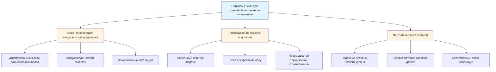
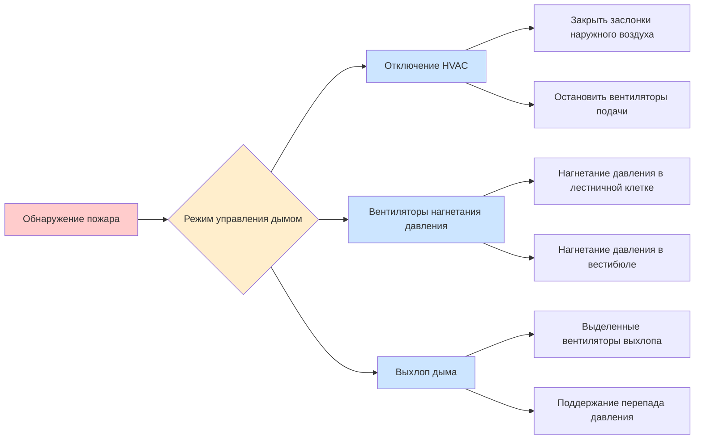

## Обзор

Здания общественного пользования создают уникальные проблемы для HVAC из-за высокой пиковой плотности людей, переменных режимов использования и строгих требований к безопасности жизнедеятельности. Помещения общественного назначения — включая театры, аудитории, конференц-центры, арены и дома молитвы — требуют систем, которые справляются с экстремальными тепловыми нагрузками и нагрузками вентиляции, сохраняя при этом приемлемый комфорт для преимущественно малоподвижных посетителей. Основная сложность заключается в управлении теплом, выделяемым сотнями или тысячами людей, сосредоточенных в относительно небольших объемах, при обеспечении надлежащей вентиляции без создания сквозняков или чрезмерного шума.

## Характеристики пребывания людей и профили нагрузок

### Пиковая плотность людей

Здания общественного пользования характеризуются плотностью людей, значительно превышающей типовые коммерческие здания:

| Тип помещения | Расчетная плотность | Явная теплоотдача на человека | Скрытая теплоотдача на человека |
|-----------|----------------|--------------------------|------------------------|
| Театр (фиксированные места) | 1 человек на 0,5-0,9 м² | 72 кДж/ч | 45 кДж/ч |
| Арена (спортивное событие) | 1 человек на 0,9-1,4 м² | 73 кДж/ч | 58 кДж/ч |
| Конференц-зал | 1 человек на 1,4-1,9 м² | 72 кДж/ч | 45 кДж/ч |
| Танцевальный зал | 1 человек на 0,9-1,4 м² | 89 кДж/ч | 101 кДж/ч |

Общая охлаждающая нагрузка от людей в театре на 500 мест при полной загруженности:

$$Q_{total} = N \times (q_s + q_l) = 500 \times (72 + 45) = 58,500 \text{ кДж/ч} = 16,7 \text{ кВт}$$

Это представляет только нагрузку от людей, исключая приобретение от ограждающей конструкции, освещения и оборудования.

### Разнообразие нагрузок и временные колебания

В отличие от офисных зданий с относительно стабильной пребыванием людей в течение рабочего дня, здания общественного пользования испытывают резкие колебания нагрузок в зависимости от расписания мероприятий. Коэффициент разнообразия — отношение фактической совпадающей нагрузки к сумме отдельных пиковых нагрузок — значительно влияет на выбор размера системы:

$$\text{Коэффициент разнообразия} = \frac{\text{Фактическая пиковая нагрузка}}{\text{Сумма отдельных пиков}}$$

Для центра исполнительских искусств с несколькими залами коэффициенты разнообразия обычно варьируются от 0,6 до 0,8, что позволяет снизить производительность центрального оборудования. Однако оборудование отдельных зон должно справляться с полными локальными пиками.

## Требования к вентиляции согласно ASHRAE 62.1

### Расчет наружного воздуха

ASHRAE 62.1 устанавливает минимальные скорости вентиляции для зданий общественного пользования, используя процедуру расчета скорости вентиляции:

$$V_{oz} = R_p \times P_z + R_a \times A_z$$

Где:
- $V_{oz}$ = наружный воздух, требуемый в дыхательной зоне (CFM)
- $R_p$ = скорость наружного воздуха на человека (CFM/человек)
- $P_z$ = численность населения зоны
- $R_a$ = скорость наружного воздуха на площадь (CFM/м²)
- $A_z$ = площадь пола зоны (м²)

### Классификация зданий общественного пользования

| Категория пребывания | $R_p$ (CFM/человек) | $R_a$ (CFM/м²) | Примечания |
|--------------------|--------------------|--------------------|-------|
| Сидения в аудитории | 5 | 0,65 | Фиксированные места |
| Места молитвы | 5 | 0,65 | Фиксированные/подвижные места |
| Залы судов | 5 | 0,65 | Зоны для зрителей |
| Законодательные палаты | 5 | 0,65 | Общественные места |
| Библиотеки (зоны чтения) | 5 | 1,29 | Более высокий компонент площади |
| Музеи/галереи | 7,5 | 0,65 | Более активное пребывание |

Для аудитории площадью 929 м² на 800 мест:

$$V_{oz} = 5 \times 800 + 0,65 \times 929 = 4,000 + 604 = 4,604 \text{ CFM}$$

Этот минимальный наружный воздух должен поддерживаться при всех режимах работы для обеспечения приемлемого качества воздуха в помещении.

## Выбор системы и стратегии проектирования

### Подходы к распределению воздуха

### Системы верхнего всеобщего воздушного распределения

Наиболее распространенный подход использует потолочные блоки обработки воздуха с высокоиндукционными диффузорами для обеспечения адекватного перемешивания без создания сквозняков в зоне пребывания людей. Критические параметры проектирования:

**Расчет дальности выброса:**

$$L = \frac{V_t}{K \times \sqrt{Q}}$$

Где:
- $L$ = дальность выброса до конечной скорости (м)
- $V_t$ = конечная скорость (обычно 0,25 м/с)
- $K$ = коэффициент диффузора (данные производителя)
- $Q$ = расход воздуха (CFM)

Для условий без сквозняков в театрах скорость подачи воздуха на уровне головы (1,2-1,5 м выше пола) не должна превышать 0,15 м/с.

### Системы вентиляции вытеснением

Системы вытеснения подают прохладный воздух на уровне пола (обычно 17-20°C) при очень низких скоростях (менее 0,42 м/с). Дифференциал температуры подаваемого воздуха обусловливает физику процесса:

$$\Delta T = T_{return} - T_{supply} = 5,6-8,3°\text{C}$$

Силы плавучести от тепла, выделяемого людьми, создают восходящие потоки конвекции, которые переносят загрязнители к выхлопным отверстиям на потолке. Высота стратификации можно оценить как:

$$h_s = \frac{Q_{total}}{1.08 \times CFM \times \Delta T}$$

Этот подход хорошо работает для помещений большого объема с высокими потолками (минимум 3-3,6 м), но требует тщательного контроля температуры подаваемого воздуха, чтобы избежать дискомфорта на уровне щиколоток.

## Рассмотрение теплового комфорта

### Требования для малоподвижных посетителей

Зрители театров и аудиторий остаются сидящими в течение длительных периодов с метаболической скоростью около 1,0 мет (58 Вт/м²). Границы зоны комфорта ASHRAE Standard 55 должны учитывать:

**Входные данные для расчета Predicted Mean Vote (PMV):**
- Метаболическая скорость: 1,0 мет (малоподвижность)
- Теплоизоляция одежды: 0,5-1,0 clo (сезонные колебания)
- Скорость воздуха: предпочтительно менее 0,15 м/с
- Асимметрия лучистой температуры: менее 5°C по вертикали

Нейтральная температура для малоподвижных людей в одежде с теплоизоляцией 0,5 clo составляет приблизительно 24°C операционной температуры. Однако здания общественного пользования часто устанавливают целевое значение 22-23°C для размещения широкого диапазона индивидуальных предпочтений при высокой плотности мест.

### Ограничения акустики и сквозняков

Ограничения скорости подаваемого воздуха в зонах пребывания людей определяются как комфортом, так и акустикой:

| Местоположение | Максимальная скорость | Критерий шума |
|----------|------------------|-----------------|
| Театры исполнительских искусств | 0,13 м/с | NC-20 к NC-25 |
| Кинотеатры | 0,15 м/с | NC-30 |
| Конференц-залы | 0,18 м/с | NC-30 к NC-35 |
| Спортивные арены | 0,20 м/с | NC-40 |

## Интеграция систем безопасности жизнедеятельности и управления дымом

### Координация систем управления дымом

Здания общественного пользования обычно требуют систем управления дымом согласно International Building Code для помещений, вмещающих более 300 человек. Система HVAC должна быть скоординирована с выделенным управлением дымом:

### Требования для нагнетания давления

Системы нагнетания давления в лестничных клетках и коридорах выхода должны поддерживать минимальные перепады давления:

$$\Delta P = 12,5-25 \text{ Па}$$

Требуемая производительность вентилятора зависит от площади утечки и желаемого давления:

$$CFM = 2610 \times A_L \times \sqrt{\Delta P}$$

Где $A_L$ — общая площадь утечки в м².

## Вентиляция по требованию

Здания общественного пользования являются основными кандидатами для вентиляции по требованию на основе CO₂ (DCV) с учетом высокой изменчивости пребывания людей. Доля наружного воздуха регулируется на основе измеренной концентрации CO₂:

$$\frac{V_{ot}}{V_t} = \frac{C_s - C_o}{C_z - C_o}$$

Где:
- $V_{ot}$ = приток наружного воздуха
- $V_t$ = общий приток воздуха
- $C_s$ = концентрация CO₂ в подаваемом воздухе
- $C_o$ = концентрация CO₂ в наружном воздухе
- $C_z$ = концентрация CO₂ в зоне (целевое значение: 1000-1200 ppm)

Системы DCV могут снизить энергию вентиляции на 40-60% в период неполной загруженности при обеспечении соответствия кодексам при полной загруженности.

## Контрольный список проектирования

**Критические рассмотрения для HVAC зданий общественного пользования:**
- Установите проектное количество людей на основе кодовых расчетов эвакуации, а не архитектурного плана
- Рассчитайте требования к наружному воздуху при пиковом пребывании согласно процедуре расчета вентиляции ASHRAE 62.1
- Выберите размер оборудования на полные пиковые нагрузки; применяйте разнообразие только к центральным установкам, обслуживающим несколько зон
- Проверьте дальность выброса подаваемого воздуха и конечные скорости для работы без сквозняков
- Скоординируйте с защитой от пожара для интеграции систем управления дымом
- Укажите воздуховоды низкой скорости (максимум 7,6 м/с в зонах пребывания людей) для акустической производительности
- Проектируйте для быстрого предварительного охлаждения или предварительного нагрева перед событиями (обычное время подготовки 2-4 часа)
- Реализуйте управление экономайзером там, где климат позволяет, для предварительного кондиционирования события с бесплатным охлаждением
- Рассмотрите рекуперацию энергии на больших количествах наружного воздуха (окупаемость обычно менее 3 лет)

---

**Расположение файла:** `/Users/evgenygantman/Documents/github/gantmane/hvac/content/specialty-applications-testing/specialty-hvac-applications/places-of-assembly/_index.md`
