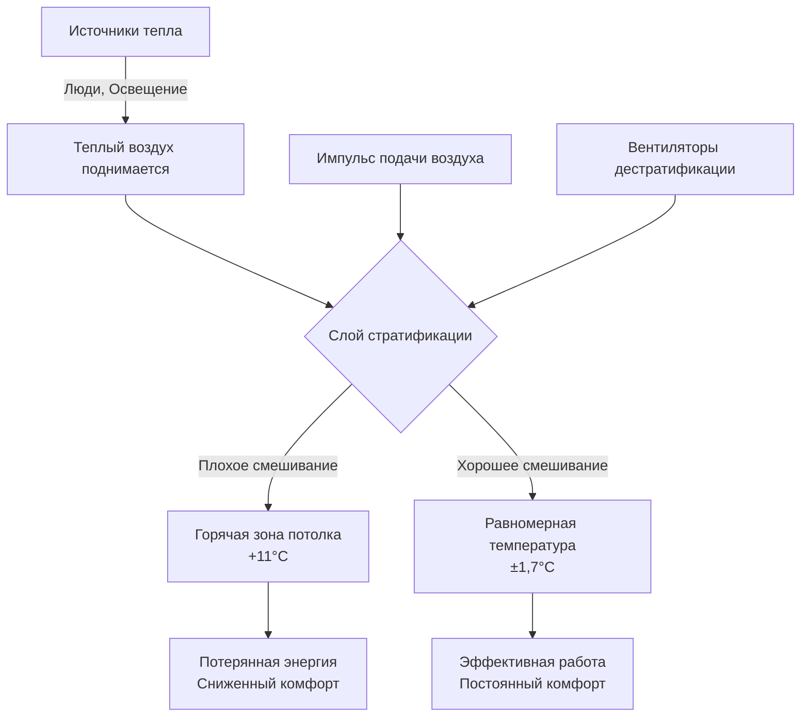
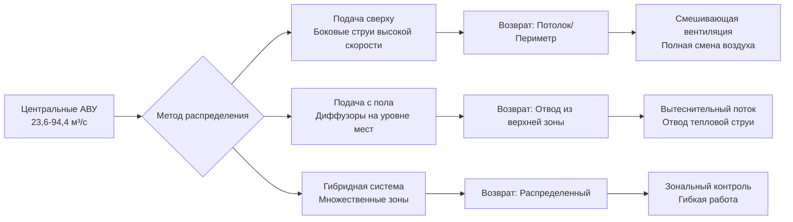
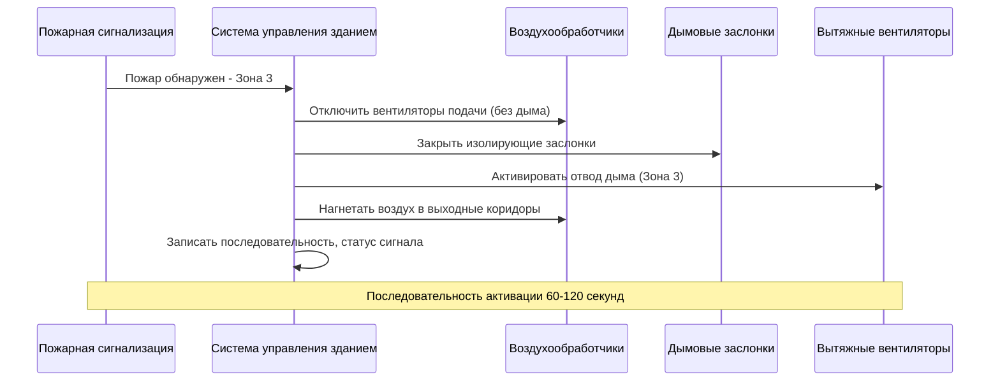

Арены и стадионы представляют уникальные проблемы HVAC из-за своих огромных закрытых объемов, чрезвычайно переменной плотности занятости и противоречивых требований к производительности между комфортом зрителей и условиями игровой поверхности. Эти объекты требуют специализированных инженерных подходов, учитывающих тепловую стратификацию, экстремальные пиковые нагрузки и интеграцию систем безопасности жизни.

## Фундаментальные характеристики нагрузок

Чувствительные и скрытые холодильные нагрузки в местах собрания принципиально отличаются от обычных зданий из-за плотности занятости и уровней активности.

Пиковая нагрузка занятости генерирует тепло с интенсивностью, определяемой метаболической активностью:

$$q_{person} = q_{sensible} + q_{latent} = 264 + 211 = 475 \text{ кДж/ч на человека (сидя, возбужденное состояние)}$$

Для арены на 20 000 мест при полной загрузке:

$$Q_{total} = 20,000 \times 475 = 9,500,000 \text{ кДж/ч} = 2,697 \text{ кВт}$$

Этот расчет не включает освещение, нагрузки от ограждающей конструкции и вентиляционный воздух, которые типично добавляют дополнительно 40-60% требуемой мощности.

### Рассмотрение крытых и открытых объектов

| Параметр | Крытая арена | Открытый стадион | Раздвижная крыша |
|-----------|--------------|------------------|------------------|
| Нагрузка от ограждения | Высокая (прибыль от остекления) | Минимальная (только коридоры) | Переменная (зависит от положения) |
| Солнечное излучение | Контролируемое | Прямое воздействие на трибуны | Частичное воздействие |
| Стратификация | Критическая проблема | Ограниченные зоны только | Контроль в зависимости от режима |
| Скорость вентиляции | 25 CFM/м³/ч (ASHRAE 62.1) | Естественная + механическое смешивание | Переходные стратегии |
| Сложность проектирования | Очень высокая | Умеренная | Экстремальная (двухрежимная) |

## Физика тепловой стратификации

Пространства с большим объемом испытывают значительные вертикальные градиенты температур из-за подъема воздуха, вызванного плавучестью. Высота стратификации зависит от тепловвода и геометрии объема:

$$\Delta T = \frac{Q_{total}}{1.08 \times A_{floor} \times v_{mixing}}$$

Где $v_{mixing}$ представляет эффективную скорость смешивания, вызванную импульсом подаваемого воздуха. При недостаточной циркуляции воздуха обычно возникают перепады температур 8-14°C между зонами пола и потолка.

### Методы контроля стратификации

1. **Системы подачи с высокой скоростью**: Скорость струи 10-20 м/с на выходе создает смешивание по всей зоне занятости
2. **Вытеснительная вентиляция**: Низкоскоростная (0,25-0,50 м/с) подача на уровне пола с отводом на потолке
3. **Вентиляторы дестратификации**: Вентиляторы большого диаметра, низкой частоты вращения (2,4-7,3 м диаметр) циркулируют воздух по вертикали
4. **Воздухораспределение через пол**: Подача через ступени трибун для прямого кондиционирования занимающихся

## Требования к проектированию многоцелевых объектов

Современные арены принимают разнообразные мероприятия, требующие адаптируемых стратегий HVAC. Условия проектирования варьируются кардинально:

**Хоккей на льду**: Ледяная поверхность поддерживается на -6,7–-3,9°C, температура воздуха 10,0–15,6°C, относительная влажность максимум 30-40% для предотвращения образования тумана.

**Баскетбол**: Стандартные условия комфорта, 22,2–24,4°C, 40-60% ОВ.

**Концерты**: Максимальная плотность занятости, скрытые нагрузки увеличиваются на 30-40% из-за стояния и танцев.

**Выставки**: Частичное использование пола, способность зонирования необходима для избежания кондиционирования неиспользуемого объема.

Психрометрическая проблема при ледовых мероприятиях требует точного контроля точки росы:

$$\omega_{max} = 0.622 \times \frac{P_{sat,ice}}{P_{atm} - P_{sat,ice}}$$

При температуре ледяной поверхности -5,6°C, $P_{sat} = 0,0394$ кПа, максимальный коэффициент влажности составляет 0,0017 кг/кг для предотвращения конденсации и тумана.

## Стратегии воздухораспределения

### Количества подачи воздуха и смена воздуха

Для арены объемом 56 633 м³ при расчетной занятости:

$$CFM_{total} = \frac{Q_{sensible}}{1.08 \times \Delta T}$$

При условии $\Delta T = 11°C$ и $Q_{sensible} = 6,330,000$ кДж/ч:

$$CFM_{total} = \frac{6,330,000}{1.08 \times 11} = 532,099 \text{ CFM (9,003 \text{ м³/с)}}$$

Это дает смену воздуха в час:

$$ACH = \frac{9,003 \times 3600}{56,633} = 572 \text{ смен/ч}$$

Более высокие показатели смены (10-15) улучшают смешивание и снижают стратификацию, но увеличивают потребление энергии вентилятором.

## Требования норм и безопасность жизни

Места собрания подпадают под требования IBC Chapter 3 и IMC Chapter 4. Ключевые положения:

**Вентиляция**: ASHRAE 62.1 требует 8,5 м³/ч (25 CFM) наружного воздуха на человека в зонах зрительских мест. Это требование не может быть снижено управлением вентиляцией по требованию в местах собрания.

**Контроль дыма**: Раздел 909 IBC требует систем управления дымом для групп занятости A-1, A-2, A-3 и A-4, превышающих определенные пороги площади и занятости. Крупные арены типично применяют:

- Механический отвод дыма при минимум 6-8 смен воздуха в час
- Нагнетание воздуха в выходные коридоры и лестницы (+12-24 Па)
- Системы автоматического обнаружения и активации
- Разделение и дымовые преграды

**Работа в чрезвычайных ситуациях**: Системы HVAC должны интегрироваться с системами пожарной сигнализации для автоматического отключения или активации режима управления дымом. Вентиляторы подачи воздуха на путях эвакуации могут требовать продолжения работы при питании от резервных источников.

### Последовательность интеграции безопасности жизни

## Энергетические соображения и работа при неполной нагрузке

Арены работают при расчетных условиях только 10-15% часов в году. Стратегии работы при неполной нагрузке существенно влияют на потребление энергии:

1. **Системы переменного объема**: Снижение расхода воздуха пропорционально занятости и нагрузке
2. **Зональное кондиционирование**: Кондиционирование только занятых зон трибун и игровой площадки
3. **Накопление тепла**: Накопление на основе льда или охлажденной воды для снижения пиковой нагрузки во время мероприятий
4. **Рекуперация тепла**: Захват энергии выходящего воздуха для отопления периметра и горячего водоснабжения

Коэффициент неполной нагрузки (PLR) для типовой работы арены:

$$PLR = \frac{\text{Фактические часы работы с нагрузкой}}{\text{Всего часов в год}} = \frac{400}{8760} \approx 0.046$$

Этот низкий коэффициент требует ступенчатого выключения оборудования, управления частотным приводом и эффективной разгрузки для избежания потерь энергии в период без мероприятий.

## Заключение

Успешное проектирование HVAC для арен и стадионов требует баланса между экстремальными пиковыми нагрузками, разнообразными требованиями мероприятий и нормативными требованиями безопасности жизни при сохранении операционной гибкости и энергоэффективности. Инженеры должны применять строгий анализ нагрузок, контроль стратификации и соответствующее нормам управление дымом для создания сред, обслуживающих как комфорт зрителей, так и спортивную производительность при чрезвычайно варьирующихся условиях.
