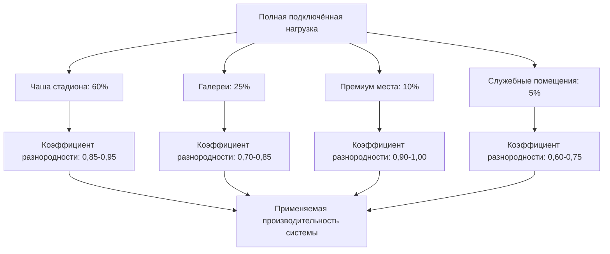

## Обзор

Системы HVAC для арен и стадионов представляют уникальные проблемы производительности, вызванные экстремальными колебаниями плотности размещения, быстрыми переходами нагрузок во время прибытия и убытия, а также массивными требованиями к наружному воздуху. В отличие от обычных зданий, где размещение растёт постепенно, эти сооружения испытывают импульсные условия, которые могут перегрузить недостаточно мощные системы в течение минут.

Фундаментальная проблема: проектирование для пиковых переходных нагрузок при сохранении операционной эффективности во время событий с частичной заполняемостью, которые представляют 60-80% годовых часов работы.

## Основы теплоотдачи от толпы

Теплоотдача человека следует метаболическому уравнению:

$$Q_{sensible} = M \cdot A_{DuBois} \cdot (1 - \eta) \cdot SHR$$

Где $M$ — метаболическая скорость (Вт/м²), $A_{DuBois}$ — площадь поверхности тела (обычно 1,8 м²), $\eta$ — механический КПД (0 для сидящих зрителей), а $SHR$ — коэффициент явного теплообмена.

Для зрителей теплоотдача варьируется в зависимости от уровня активности:

| Уровень активности | Явная теплота (Вт/чел.) | Скрытая теплота (Вт/чел.) | Всего теплоты (Вт/чел.) | SHR |
|-------------------|--------------------------|---------------------------|------------------------|-----|
| Сидящий, спокойный | 70 | 35 | 105 | 0,67 |
| Сидящий, умеренная активность | 85 | 55 | 140 | 0,61 |
| Стоящий, лёгкая активность | 95 | 65 | 160 | 0,59 |
| Медленная ходьба | 115 | 85 | 200 | 0,58 |

Пиковая нагрузка от толпы для арены на 20000 мест при предположении 90% явной теплоты, 10% стоящих:

$$Q_{total} = (18000 \times 140) + (2000 \times 160) = 2520000 + 320000 = 2840000 \text{ Вт} = 807 \text{ кВт}$$

Это представляет только полученную нагрузку от занимаемых мест, без учета солнечной радиации, освещения или трансмиссионных нагрузок.

## Коэффициенты разнородности нагрузок

Применение полной проектной производительности для всех зон одновременно приводит к существенному переизбытку оборудования. Исследования ASHRAE демонстрируют, что фактические пиковые нагрузки показывают значительную разнородность на зонах сооружения.

Рекомендуемые коэффициенты разнородности по размеру площадки:

| Вместимость площадки | Чаша стадиона | Галереи | Премиум зоны | Общая разнородность установки |
|---------------------|---------------|---------|--------------|-------------------------------|
| 5000-10000 | 0,90 | 0,75 | 0,95 | 0,85 |
| 10000-20000 | 0,88 | 0,78 | 0,95 | 0,82 |
| 20000-50000 | 0,85 | 0,80 | 0,95 | 0,80 |
| 50000-100000 | 0,85 | 0,82 | 0,95 | 0,78 |

Эти коэффициенты учитывают:
1. Рассредоточенное заполнение зон во время прибытия
2. Схемы движения по галереям (не все зоны достигают пика одновременно)
3. События с частичной заполняемостью
4. Запасы производительности оборудования

## Импульсные нагрузки при прибытии и убытии

Наиболее острое переходное состояние возникает во время предварительного прибытия, когда нагрузки наружного воздуха совмещаются с явной и скрытой теплотой толпы. Для окна прибытия в 60 минут:

```mermaid
gantt
    title Профиль тепловой нагрузки - день события
    dateFormat HH:mm
    axisFormat %H:%M
    section Нагрузки
    Фоновая нагрузка       :done, 14:00, 2h
    Импульс прибытия        :active, 16:00, 1h
    Устойчивая нагрузка события :crit, 17:00, 3h
    Импульс убытия      :active, 20:00, 30m
    После события          :done, 20:30, 1h
```

Расчет скорости пиковой нагрузки при прибытии:

$$\dot{Q}_{arrival} = \frac{N_{capacity} \times f_{arrival}}{t_{window}} \times (Q_{person} + Q_{OA,person})$$

Для арены на 20000 мест с 80% прибытием в течение 60 минут:

$$\dot{Q}_{arrival} = \frac{20000 \times 0,80}{60 \text{ мин}} \times (140 \text{ Вт} + 45 \text{ Вт}) = 49333 \text{ Вт/мин}$$

Это темп нарастания 823 кВт/мин требует систем, способных к быстрому развёртыванию производительности и существенному тепловому накоплению.

## Требования к наружному воздуху для больших собраний

Стандарт ASHRAE 62.1 определяет требования к наружному воздуху на основе категории занятости. Для помещений общественного пользования:

$$V_{OA} = R_p \times P_z + R_a \times A_z$$

Где:
- $R_p$ = 2,36 м³/(ч·чел.) (занятость для мест общественного пользования)
- $P_z$ = численность зоны
- $R_a$ = 0,65 м³/(ч·м²) (компонент по площади)
- $A_z$ = площадь зоны

Для чаши на 20000 мест с площадью 23000 м²:

$$V_{OA} = (2,36 \times 20000) + (0,65 \times 23000) = 47200 + 14950 = 62150 \text{ м³/ч}$$

Это представляет 45-60% от общего воздухопотока системы в большинстве конструкций. Тепловая нагрузка наружного воздуха в условиях летнего расчета (35°C ТС, 24°C ТВ) для достижения 24°C, 50% ОВ:

$$Q_{OA,sensible} = 1208 \times 62150 \times (35 - 24) = 826 \text{ кВт}$$
$$Q_{OA,latent} = 0,68 \times 62150 \times (\omega_{outside} - \omega_{inside})$$

Используя психрометрические свойства: $\omega_{35/24} = 0,0136$, $\omega_{24/50} = 0,0093$:

$$Q_{OA,latent} = 0,68 \times 62150 \times (0,0136 - 0,0093) \times 2470 = 112 \text{ кВт}$$

Общая нагрузка наружного воздуха: 938 кВт (268 кВт), представляя 50-70% от общего охлаждения при пиковом прибытии.

## Стратегия вентиляции при эвакуации

Эвакуация после события создает обратную импульсную нагрузку. По мере убытия занимающих мест тепловая масса, накопленная в сиденьях, конструкции и отделке, высвобождает сохраненную теплоту. Эффективная вентиляция при эвакуации предотвращает дискомфортные условия в премиум-зонах, где гости могут задержаться.

Подход к конструированию:

1. Поддерживать минимум 30% наружного воздуха во время эвакуации (первые 30 минут после события)
2. Переносить приоритет охлаждения на галереи и премиум-зоны
3. Допускать дрейф температуры в чаше на 26-27°C
4. Развернуть экономайзер охлаждения при благоприятных условиях окружающей среды

Эффективность экономайзера во время вечерних событий (обычны для крытых арен):

$$\dot{Q}_{economizer} = 1208 \times V_{economizer} \times (T_{return} - T_{outside})$$

Для воздухопотока экономайзера 3400 м³/ч с возвратом 26°C и наружной 18°C:

$$\dot{Q}_{economizer} = 1208 \times 3400 \times (26 - 18) = 33 \text{ кВт}$$

Это бесплатное охлаждение существенно снижает потребность в механическом охлаждении после события.

## Стратегия расчета производительности

Рекомендуемый подход для определения производительности системы:

1. Рассчитать нагрузки при полной занятости для всех зон
2. Применить коэффициенты разнородности зон на основе размера сооружения
3. Добавить 15-20% для вариативности нагрузки наружного воздуха
4. Включить 10% запас эффективности оборудования
5. Проверить против темпов нарастания импульса при прибытии

Для центральных установок, обслуживающих площадки вместимостью 20000+ мест, устанавливать производительность модульными приращениями, соответствующими 20-25% от пиковой нагрузки для оптимизации эффективности при частичных нагрузках во время меньших событий.

## Компоненты

- Арены на 10000-20000 мест
- Стадионы на 20000-50000 мест
- Мега-стадионы на 50000-100000 мест
- Вариация плотности занятости
- Зоны стоячих мест
- Требования к премиум-местам
- Кондиционирование общих мест
