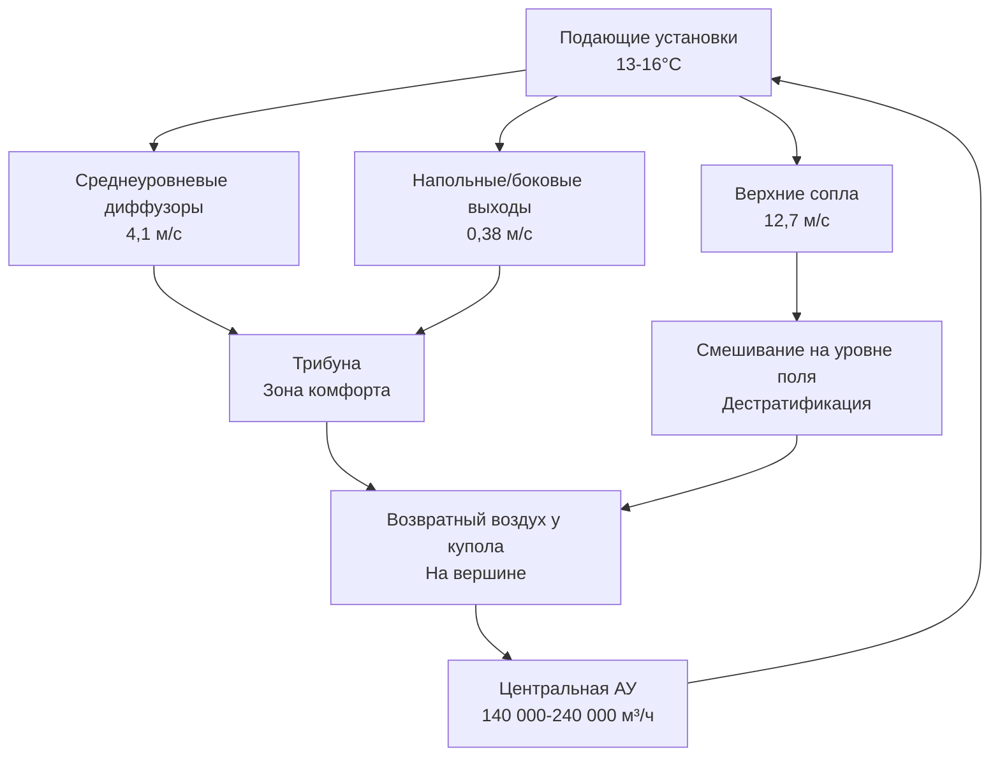

## Обзор

Закрытые стадионы создают исключительные проблемы при проектировании HVAC из-за их массивных замкнутых объемов (обычно 140 000-420 000 м³), высокой плотности людей (40 000-80 000 зрителей) и конфликтующих требований по температуре между поверхностями игровых площадок и зонами размещения зрителей. Инженерный вызов сосредоточен на управлении стратификацией воздуха в пространствах с вертикальными размерами, превышающими 60 м, при одновременном поддержании точных условий на уровне поля для естественного газона или производительности спортсменов наряду с приемлемым комфортом в зонах для зрителей, охватывающих несколько уровней.

## Характеристики тепловых нагрузок

### Влияние объема и стратификации

Фундаментальная проблема в HVAC закрытого стадиона возникает из-за стратификации, вызванной плавучестью. Температурные дифференциалы создают градиенты плотности, описываемые следующим уравнением:

$$\frac{dP}{dz} = -\rho g$$

где вертикальное изменение давления приводит к накоплению теплого воздуха в вершине купола. Для пространства высотой 76 м с температурным дифференциалом 8°C теоретическая плоскость нейтрального давления находится на высоте примерно 38 м, располагая занятые зоны сидения в отрицательном давлении относительно уровня поля.

Интенсивность стратификации зависит от числа Ричардсона:

$$Ri = \frac{g \beta \Delta T H}{U^2}$$

где $\beta$ — коэффициент теплового расширения, $\Delta T$ — вертикальный температурный дифференциал, $H$ — характерная высота, $U$ — характерная скорость. Значения $Ri > 10$ указывают на поток, управляемый плавучестью, требующий активной дестратификации.

### Солнечная нагрузка через прозрачные крыши

Современные закрытые стадионы все чаще используют прозрачные материалы кровли (ЭТФЭ, поликарбонатные панели) для естественного освещения. Солнечное тепловое поглощение становится существенным:

$$Q_{solar} = A_{roof} \cdot SHGC \cdot I_{solar} \cdot CLF$$

Для крыши площадью 18 600 м² с SHGC = 0,45 и пиковой солнечной радиацией 950 Вт/м², мгновенные солнечные поглощения превышают 7 600 кВт. Коэффициент охлаждения нагрузки (CLF) учитывает эффекты тепловой массы, но пиковые нагрузки во время дневных мероприятий определяют размер системы.

| Тип крыши | SHGC | Видимое пропускание | Влияние пиковой нагрузки |
|-----------|------|-------------------|------------------------|
| ЭТФЭ однослойный | 0,85 | 0,90 | 1 075 Вт/м² |
| ЭТФЭ трёхслойный | 0,45 | 0,75 | 568 Вт/м² |
| Прозрачные панели | 0,35 | 0,50 | 442 Вт/м² |
| Непрозрачный утеплённый | 0,05 | 0,00 | 63 Вт/м² |

### Нагрузки от людей

Пиковая загрузка помещения генерирует явное и скрытое тепло:

- Явное тепло: 291 кДж/ч на человека (лёгкая деятельность, сидение)
- Скрытое тепло: 233 кДж/ч на человека
- Итого: 524 кДж/ч на человека

Для 60 000 человек общая метаболическая нагрузка достигает 8 680 кВт, сопоставима с солнечными поглощениями. Локализованные плотности нагрузки в нижней части трибун сидения (5,4-7,5 чел/м² площади пола) создают горячие точки, требующие дополнительного кондиционирования.

## Стратегии распределения воздуха

### Требования кондиционирования на уровне поля

Системы естественного газона в закрытых стадионах требуют точного экологического контроля:

- **Температура**: 16-24°C на высоте травяного покрова
- **Относительная влажность**: 50-60% (предотвращает болезни, сохраняет игровые свойства)
- **Скорость воздуха**: <1,0 м/с (предотвращает чрезмерную потерю влаги)
- **Фотосинтетически активное излучение**: 400-700 мкмоль/м²·с (дополнительное освещение)

Баланс энергии на поверхности травы:

$$Q_{net} = Q_{solar} + Q_{lights} - Q_{evap} - Q_{conv} - Q_{rad}$$

Испаряемая транспирация от активно растущей травы может превышать 315 Вт/м² площади поля, создавая тепловой сток, требующий компенсации нагревом 3 150-4 725 кВт во время мероприятий.

### Вытеснение воздуха для зон зрителей

Системы вытеснения с низкой скоростью используют тепловую плавучесть. Подаваемый воздух при 18-20°C через диффузоры на уровне пола или спинок сидений создаёт прохладную зону в нижних 2,4-3,0 м:

$$Q_{zone} = \dot{m} c_p (T_{exhaust} - T_{supply})$$

Типичные параметры проектирования:
- Скорость подачи: 0,25-0,50 м/с
- Температурный дифференциал: 3-4°C ниже температуры помещения
- Кратность воздухообмена: 0,8-1,2 воздухообмена в час для занятых зон

Такой подход снижает энергию вентилятора на 30-40% по сравнению с традиционным смешиванием сверху при одновременном улучшении теплового комфорта благодаря сниженному движению воздуха и вертикальным температурным градиентам, согласованным с расположением людей.

### Смешивание сверху для дестратификации

Высокомоментные струи с верхних уровней борются со стратификацией. Диффузоры сопловидного типа с дальностью выброса 45-60 м подают воздух с начальными скоростями 10-15 м/с. Число Архимеда управляет траекторией струи:

$$Ar = \frac{g \beta \Delta T D}{U_o^2}$$

где $D$ — диаметр сопла и $U_o$ — скорость выброса. Поддержание $Ar < 0,01$ обеспечивает проникновение струи на уровень поля до того, как плавучесть начнёт доминировать.

## Подход к проектированию системы

### Зонирование и производительность

Закрытые стадионы требуют нескольких зон HVAC:

| Зона | Площадь | Проектные условия | Подача м³/ч на чел |
|------|---------|------------------|-------------------|
| Игровое поле | 7 400 м² | 20-22°C, 55% ОВ | Н/П (по площади) |
| Нижние трибуны | 2 320 м² | 22-24°C, 45-55% ОВ | 8,5-11,3 м³/ч |
| Верхние трибуны | 3 250 м² | 21-23°C, 45-55% ОВ | 6,8-10,2 м³/ч |
| VIP-люкс | 80 люкс | 21-24°C, индивид. управл. | 14,2-17,0 м³/ч |
| Коридоры | 13 900 м² | 23-26°C, 50% ОВ | 0,28 м³/ч·м² |
| Пресс/трансляция | 1 400 м² | 21-22°C, нагрузки оборудования | 0,85 м³/ч·м² |

Общая производительность системы обычно составляет 2 830-4 245 кВт охлаждения, с центральными установками, использующими распределение холодной воды (7-8°C подача, 12-14°C возврат).

### Вентиляция по ASHRAE 62.1

Требования к уличному воздуху следуют категориям занятости:
- **Зоны зрителей**: 3,5 м³/ч на человека (0,0017 м³/ч·м² + компонент по числу людей)
- **Игровое поле**: 0,17 м³/ч·м²
- **VIP-люкс**: 2,4 м³/ч на человека + 0,0034 м³/ч·м²

Для 60 000 человек плюс вспомогательные помещения, минимальный уличный воздух приближается к 235 м³/ч. Управление вентиляцией по спросу с использованием датчиков CO₂ (уставка 1 000-1 200 ppm) снижает энергопотребление во время мероприятий с неполной загрузкой.

### Выбор оборудования и резервирование

Критические системы требуют резервирования N+1:
- Центральные холодильники: 4 × 880 кВт (25% резервирование)
- Воздухообрабатывающие установки: Несколько установок на зону (отказ одной установки снижает производительность на 20-30%)
- Насосы: Дублированные или тройные схемы с управлением VFD

Энергия вентилятора доминирует в операционных затратах. Переменные объёмные системы с направляющим аппаратом входа или VFD снижают годовую энергию на 40-50% по сравнению с постоянным объёмом.

## Операционные соображения

### Предварительное охлаждение и тепловая масса

Масса стадиона (бетон, сталь) обеспечивает тепловое накопление. Предварительное охлаждение за 12-24 часа до мероприятий снижает пиковую механическую нагрузку на 15-25%. Эффективная теплоёмкость:

$$C_{eff} = \sum m_i c_{p,i}$$

При типовом строительстве эффективная теплоёмкость достигает 263-527 кДж/(м²·K) площади пола, накапливая 1 760-2 800 кДж с депрессией температуры 2°C.

### Режим мероприятия против режима обслуживания

Профили эксплуатации существенно различаются:
- **Режим мероприятия**: Полная производительность, максимальный уличный воздух, приоритет комфорта зрителей
- **Режим обслуживания**: Сниженная производительность (20-30%), приоритет кондиционирования поля, минимальный уличный воздух
- **Подготовка/разборка**: Промежуточная производительность, умеренный уличный воздух

Системы энергоуправления переходят между режимами на основе расписаний и датчиков занятости в реальном времени.

## Заключение

Проектирование HVAC закрытого стадиона требует интеграции физики распределения воздуха больших объёмов, многозонного теплового управления и операционной гибкости. Успех требует компьютерного моделирования гидродинамики для прогнозирования закономерностей стратификации, тщательного внимания к характеристикам выброса и импульса высокоуровневых диффузоров и признания того, что кондиционирование поля и комфорт зрителей представляют фундаментально разные тепловые среды в одном замкнутом пространстве.
