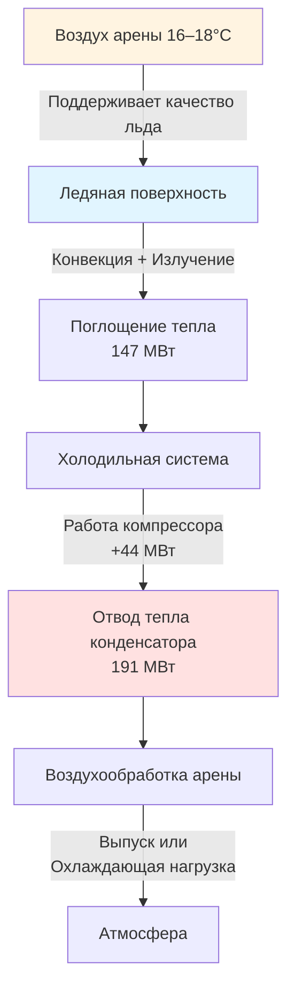

## Основы тепловых нагрузок при событиях

Системы HVAC в ареме должны приспосабливаться к кардинально различным тепловым профилям в зависимости от типа события. Спектр нагрузок варьируется от хоккея на льду, требующего поверхности льда с температурой ниже нуля (−9 до −4 °C) с отводом тепла холодильной установкой, до высокоплотных концертов, генерирующих 73–94 кДж/ч на человека с массивными сценическими осветительными нагрузками, превышающими 150 МВт.

Фундаментальная сложность заключается в временной изменчивости нагрузок. Площадка, на которой проводится хоккейный матч в пятницу вечером и концерт в субботу вечером, испытывает изменение нагрузки на 1,2–1,4 ГДж/ч в течение 24 часов.

## Тепловая динамика ледяного катка

### Тепловой баланс ледяной поверхности

Ледяная поверхность представляет собой массивную чувствительную охлаждающую нагрузку, которая парадоксально увеличивает общие требования к охлаждению здания. Тепловой поток в лёд следует уравнению:

$$q_{ice} = \frac{k \cdot A \cdot (T_{air} - T_{ice})}{z} + h_{conv} \cdot A \cdot (T_{air} - T_{ice}) + \alpha \cdot A \cdot q_{rad}$$

Где:
- $k$ = теплопроводность бетонной плиты (68–86 Вт/(м·K))
- $z$ = толщина плиты над трубами хладоносителя (обычно 38–64 мм)
- $h_{conv}$ = коэффициент конвективной теплопередачи (4,5–8,5 Вт/(м²·K))
- $\alpha$ = поглощательная способность ледяной поверхности (0,05–0,10 для чистого льда)
- $q_{rad}$ = падающее излучение от освещения и конструкции

### Влияние отвода тепла холодильной установкой

Холодильные системы ледяного катка отводят 1,2–1,4 кратное тепло, поглощённое ледяной поверхностью, из-за работы компрессора. Для стандартного хоккейного катка НХЛ 1580 м²:

- Поглощение льдом: 132–190 МВт
- Отвод конденсатора: 176–249 МВт

Отводимое тепло должно управляться системой HVAC арены, как правило, через выделенные системы воздуха конденсатора или испарительные конденсаторы с выпуском.

### Стратегии температуры воздуха в арене

Ледяные события требуют температуры воздуха в арене 16–18 °C с относительной влажностью ниже 50 %, чтобы предотвратить образование тумана и минимизировать тепловую нагрузку на ледяную поверхность. Точка росы должна оставаться ниже 7 °C, чтобы избежать конденсации на льду при быстром движении воздуха.

## Баскетбольные и спортивные площадки в помещениях

Конфигурация баскетбола исключает ледяной охлаждающий резервуар и вводит изолированную систему пола над бетонной плитой. Ключевые тепловые отличия:

| Параметр | Хоккей на льду | Баскетбол | Разница |
|----------|-------------|-----------|---------|
| Температура льда/пола | −6 °C | 22 °C | +28 K |
| Температура воздуха арены | 17 °C | 22–24 °C | +6 K |
| Отвод тепла холодильной установкой | 191 МВт | 0 | −191 МВт |
| Эффект тепловой ёмкости пола | Тепловой резервуар | Изолированный нейтральный | +88 МВт колебание |
| Плотность занятости | 17 000–19 000 | 17 000–19 000 | Нейтральная |

Чистый эффект: баскетбольные события требуют на 103–132 МВт меньше охлаждения, чем хоккей на льду, несмотря на более высокие температуры воздуха, из-за устранения отвода тепла холодильной установкой.

## Осветительные приборы концертов и сценические нагрузки

Концертные конфигурации вводят наивысшие чувствительные нагрузки в приложениях арен.

### Тепловыделение сценического света

Современные концертные световые системы состоят из:

1. **Движущиеся осветительные приборы**: 575 Вт–1200 Вт на единицу, 50–200 единиц
2. **Светодиодные заливные системы**: 300 Вт–500 Вт на единицу, 100–300 единиц
3. **Прожекторные лучи**: 1200 Вт–2500 Вт на единицу, 4–8 единиц
4. **Видеостены**: 150–250 Вт/м², 50–200 м²

Общая подключённая световая нагрузка: 200–400 кВт (0,68–1,37 ГДж/ч)

Фактическое тепловыделение учитывает световую эффективность:

$$Q_{lighting} = P_{connected} \times 3.412 \times \eta_{heat}$$

Где $\eta_{heat}$ = 0,70–0,85 для светодиодных систем (15–30 % энергии преобразуется в свет, остальное в тепло).

Для крупного концерта: $Q_{lighting}$ = 350 кВт × 3,412 × 0,80 = 956 МВт

### Нагрузки звуковой системы и производства

- Звуковое усиление: 50–150 кВт (0,17–0,51 ГДж/ч)
- Видеопроизводство: 30–80 кВт (0,10–0,27 ГДж/ч)
- Пиротехника/эффекты: Переменные, мгновенные нагрузки 0,6–1,5 ГДж/ч (кратковременно)

## Вариации плотности занятости

ASHRAE Fundamentals Chapter 18 предоставляет значения тепловыделения людей, но приложения арен требуют корректировок для конкретного события:

| Тип события | Коэффициент занятости | Уровень активности | Чувствительная нагрузка (кДж/ч·чел.) | Скрытая нагрузка (кДж/ч·чел.) |
|------------|---------------|----------------|-------------------------------|----------------------------|
| Хоккей на льду | 85–95 % | Умеренная (крики) | 264–295 | 190–232 |
| Баскетбол | 90–98 % | Высокая (интенсивные крики) | 295–337 | 232–284 |
| Концерт (сидя) | 95–100 % | Умеренно-высокая | 284–316 | 211–253 |
| Концерт (зал на полу) | 100–120 % | Очень высокая (танцы) | 337–400 | 284–348 |

Для арены на 18 000 мест на максимальной баскетбольной вместимости:

$$Q_{occupants} = N \times (q_{sensible} + q_{latent}) = 18,000 \times (316 + 258) = 10,332 \text{ МВт}$$

## Управление тепловыми нагрузками при быстрой смене события

### Переход от льда к баскетболу

Временная шкала: 12–18 часов для полной тепловой стабилизации

```mermaid
gantt
    title Тепловой переход от льда к баскетболу
    dateFormat HH:mm
    axisFormat %H:%M

    section Ледяная поверхность
    Ледяная поверхность поддерживается −6°C           :done, ice1, 00:00, 2h
    Установка изолированного пола  :active, floor1, 02:00, 4h
    Прогрев пола до 20–22°C      :floor2, 06:00, 8h

    section Воздух арены
    Поддержание 16°C              :done, air1, 00:00, 4h
    Постепенный прогрев 16→22°C       :active, air2, 04:00, 8h
    Стабилизация 22°C            :air3, 12:00, 2h

    section Режим HVAC
    Охлаждение ледяного события             :done, hvac1, 00:00, 2h
    Переходное снижение охлаждения    :active, hvac2, 02:00, 6h
    Режим нагрева пола        :hvac3, 08:00, 4h
    Стандартное комфортное охлаждение      :hvac4, 12:00, 2h
```

### Стратегии предварительной подготовки события

**Ледяные события (из баскетбольной конфигурации):**
- T−24h: Начать удаление пола, открыть бетонную плиту (22 °C)
- T−20h: Активировать холодильную систему льда, начать охлаждение плиты
- T−16h: Снижение температуры воздуха арены 22 °C → 17 °C со скоростью 0,3–0,4 °C/ч
- T−12h: Начало ресёрфинга льда, когда плита достигает −7 до −6 °C
- T−8h: Первый слой льда завершён (13 мм), продолжить нарастание
- T−4h: Финальная толщина льда 25–32 мм, роспись при необходимости
- T−2h: Арена стабилизирована при 16–17 °C, ОВ 40–48 %

**Концертные события (из любой конфигурации):**
- T−12h: Установка пола завершена при необходимости
- T−10h: Предварительное охлаждение арены до 20–21 °C (ожидание толпы и световых нагрузок)
- T−6h: Система сценического света включена для тепловой стабилизации
- T−4h: Полная ёмкость HVAC доступна, мониторинг зон оборудования
- T−2h: Температура в арене 21–22 °C, допускается подъём на 1–2 °C во время события

## Итоговый расчёт нагрузки

Общая охлаждающая нагрузка арены по типам событий (площадка на 18 000 мест):

| Компонент нагрузки | Хоккей на льду | Баскетбол | Концерт |
|----------------|-----------|------------|---------|
| Люди | 2,5 ГДж/ч | 3,0 ГДж/ч | 3,1 ГДж/ч |
| Освещение (арена) | 0,24 ГДж/ч | 0,35 ГДж/ч | 0,18 ГДж/ч |
| Освещение (сцена/лёд) | 0,09 ГДж/ч | 0,0 ГДж/ч | 0,30 ГДж/ч |
| Отвод холодильной установкой | 0,21 ГДж/ч | 0,0 ГДж/ч | 0,0 ГДж/ч |
| Звук/производство | 0,03 ГДж/ч | 0,06 ГДж/ч | 0,24 ГДж/ч |
| Ограждение/инфильтрация | 0,15 ГДж/ч | 0,18 ГДж/ч | 0,18 ГДж/ч |
| **Итоговая пиковая нагрузка** | **3,2 ГДж/ч** | **3,6 ГДж/ч** | **4,0 ГДж/ч** |

Коэффициент разнообразия пиковой нагрузки: 1,24 (концерт против хоккея на льду)

ASHRAE Standard 90.1 требует, чтобы системы, обслуживающие эти объекты, учитывали разнообразие нагрузок через системы переменного объёма воздуха, ступенчатое включение оборудования и накопление тепловой энергии, где это экономически оправдано.

## Рекомендации по проектированию

1. **Размерность центральной установки для концертной конфигурации** (3,8–4,1 ГДж/ч охлаждения) с ступенчатым включением оборудования для эффективной работы на ледяных событиях
2. **Отделить отвод тепла холодильного конденсатора** от основной системы HVAC арены, чтобы избежать связи нагрузок
3. **Установить распределение воздуха на уровне пола** для ледяных событий, чтобы поддерживать стратификацию и снизить тепловую нагрузку на верхние ряды
4. **Обеспечить выделенное охлаждение сцены/производства** с 25–34 м³/ч на кВт подключённой нагрузки
5. **Проектировать для контролируемых темпов повышения температуры 0,3–0,4 °C/ч** во время смены события, чтобы предотвратить структурную конденсацию

Ключ к успешному проектированию HVAC многофункциональной арены заключается в понимании физики теплового сигнала каждого типа события и предоставлении гибких, ступенчатых систем, способных эффективно работать во всём спектре нагрузок.
