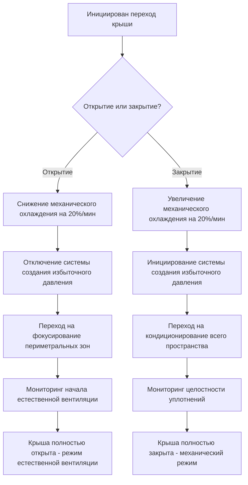
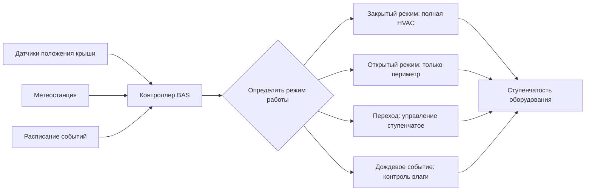

Стадионы с убирающейся крышей представляют уникальные вызовы для HVAC из-за принципиального изменения условий между закрытым и открытым состояниями. Система должна поддерживать два различных режима эксплуатации с кардинально отличающимися тепловыми нагрузками, требованиями к вентиляции и стратегиями создания давления, одновременно управляя быстрыми переходами между состояниями.

## Основы двухрежимной работы

Термодинамические условия резко изменяются в зависимости от положения крыши. При закрытой крыше стадион функционирует как обычное закрытое помещение, требующее механического кондиционирования и создания избыточного давления. При открытой крыше конструкция становится полуоткрытым объектом, где доминирует естественная вентиляция, а механические системы дополняют, а не контролируют условия.

**Режим закрытой крыши:**
- Полное механическое охлаждение и отопление
- Создание избыточного давления в здании на уровне 50-120 Па (0,02-0,05 дюйм вод. ст.)
- Инфильтрация сведена к минимуму благодаря избыточному давлению
- Полный контроль влажности
- Пиковые нагрузки охлаждения 28 000-53 000 кВт в зависимости от емкости

**Режим открытой крыши:**
- Естественная вентиляция через отверстие в крыше
- Охлаждение периметра для занятых зон
- Отсутствие создания избыточного давления в здании
- Контроль влажности ограничен прямым удалением
- Механическая нагрузка снижена на 60-80%

Переход между режимами создает третье операционное состояние, в котором система должна реагировать на изменяющиеся граничные условия, одновременно поддерживая приемлемый уровень комфорта для уже усаживающихся зрителей.

## Расчет нагрузок для двух режимов

Размер системы должен соответствовать обоим экстремальным условиям. Прибыль явного тепла при закрытой крыше следует стандартным расчетам для закрытых конструкций:

$$Q_{sensible} = Q_{lights} + Q_{occupants} + Q_{solar} + Q_{transmission} + Q_{equipment}$$

Для стадиона на 50 000 мест с закрытой крышей:
- Явное тепло от людей: $50 000 \times 0,073 \text{ кВт} = 3 650 \text{ кВт}$
- Освещение (200 Вт/место): $50 000 \times 0,2 \text{ кВт} = 10 000 \text{ кВт}$
- Солнечное излучение через прозрачную крышу: $13 935 \text{ м}^2 \times 0,126 \text{ кВт/м}^2 = 1 756 \text{ кВт}$
- Передача тепла и оборудование: ~2 350 кВт
- Всего: ~17 756 кВт (примерно 5 050 т охлаждения)

При открытой крыше прямое солнечное излучение на зрительские места и поле увеличивается, в то время как передача тепла через оболочку здания существенно снижается. Система должна по-прежнему кондиционировать периметральные зоны, но полагается на естественную вентиляцию для основного движения воздуха.

Отношение емкости режима закрытой крыши к режиму открытой крыши обычно составляет от 2,5:1 до 4:1 в зависимости от климата и конструкции крыши.

## Стратегия создания давления при закрытой крыше

Поддержание избыточного давления в здании предотвращает инфильтрацию и контролирует поступление влаги. Разность давлений через оболочку здания определяет поток инфильтрации:

$$Q_{infiltration} = A \times C \times \sqrt{\Delta P}$$

Где $A$ — площадь утечек, $C$ — коэффициент потока, а $\Delta P$ — разность давлений.

Для стадионов с убирающейся крышей целевая разность давлений 50-120 Па (0,02-0,05 дюйм вод. ст.) относительно наружного воздуха обеспечивает адекватный контроль инфильтрации без чрезмерной механической нагрузки на систему крыши. Система уплотнения крыши должна поддерживать это давление, позволяя плавную работу во время переходов.

Количество приточного воздуха для создания избыточного давления превышает вытяжку на 15-25%, создавая поле положительного давления. Требования к вентиляции наружным воздухом согласно стандарту ASHRAE 62.1 по-прежнему применимы, обычно требуя 3,95 м³/(ч·чел.) для мест общественного собрания:

$$V_{oa} = 50 000 \times 3,95 = 197 500 \text{ м}^3\text{/ч (минимум)}$$

Поток воздуха для создания давления добавляется к этому базовому требованию.

## Естественная вентиляция при открытой крыше

При открытой крыше стадион становится естественно вентилируемой конструкцией со значительным эффектом тепловой дымовой трубы и потоками, вызванными ветром. Объемный расход потока от термической плавучести:

$$Q = C_d A \sqrt{2g\Delta H \frac{\Delta T}{T_i}}$$

Где:
- $C_d$ = коэффициент расхода (0,6–0,65)
- $A$ = эффективная площадь отверстия
- $g$ = ускорение свободного падения
- $\Delta H$ = разность высот между входом и выходом
- $\Delta T$ = разность температур внутри и снаружи
- $T_i$ = внутренняя абсолютная температура

Для стадиона с эффективным отверстием крыши 9 290 м² и разностью высот 46 м поток за счет эффекта дымовой трубы может превышать 1 420 000 м³/ч при разности температур 5,5 °C. Эта естественная вентиляция значительно превосходит механические системы, делая невозможным контроль условий внутри.

Механическая система переключается на кондиционирование периметральных зон, сосредотачиваясь на занятых зрительских местах, а не на контроле всего пространства. Вытеснительная вентиляция от низких боковых диффузоров обеспечивает локальное охлаждение, а теплый воздух естественным образом выводится через отверстие в крыше.

## Кондиционирование переходного периода

Переходный период крыши (обычно 10–20 минут) создает динамические граничные условия. По мере открытия или закрытия крыши эффективный объем здания, солнечные прибыли и пути вентиляции непрерывно изменяются.

Последовательность управления должна изменять механическую емкость в соответствии с изменяющимся профилем нагрузки. Линейное изменение от емкости режима открытой крыши к емкости режима закрытой крыши за переходный период предотвращает скачки системы и поддерживает комфорт:

$$Q_{transition}(t) = Q_{open} + \frac{Q_{closed} - Q_{open}}{t_{transition}} \times t$$

Колебания температуры на 1,1–2,2 °C во время переходного периода являются типичными и обычно приемлемы для комфорта зрителей.

## Контроль влажности при задержках из-за дождя

Дождевые события при частично или полностью открытой крыше вносят прямую воду и нагрузки влажности. Требование по удалению влаги сочетает испарение с мокрых поверхностей и прямое попадание дождя:

$$\dot{m}_{moisture} = \dot{m}_{rain} + \dot{m}_{evaporation}$$

Для интенсивного дождя (51 мм/ч) над полем площадью 4 645 м²:
- Прямой поток массы дождя: $4 645 \times 0,051 \times 1 000 = 236 900 \text{ кг/ч}$

Если крыша закрывается во время дождя, эта вода испаряется в пространство. Испарение даже 10% собранной воды (23 690 кг/ч) требует огромного осушения:

$$Q_{latent} = \dot{m} \times h_{fg} = 23 690 \times 2 450 = 58 040 \text{ кВт}$$

Эта скрытая нагрузка (16 500 т исключительно по скрытому охлаждению) превышает типичную емкость осушения. Стратегии включают:

1. **Дренирование перед закрытием:** Обеспечить дренирование поля удаляет стоячую воду перед закрытием крыши
2. **Высокая начальная скорость вентиляции:** Выведение воздуха с повышенной влажностью вместо его кондиционирования
3. **Постепенное охлаждение:** Допустить временное повышение температуры в пространстве, увеличивая влагоемкость воздуха
4. **Дополнительное осушение:** Выделенные системы для удаления влаги после события

## Методология размера системы

Двухрежимное требование направляет выбор оборудования в сторону модульных систем со ступенчатой емкостью.

| Режим работы | Емкость охлаждения | Стратегия вентиляции | Создание давления | Фокус управления |
|----------------|------------------|----------------------|----------------|---------------|
| Крыша закрыта | 100% (28 000–53 000 кВт) | Механическая подача/возврат | 50–120 Па | Температура/влажность всего пространства |
| Переходный период | 40–100% ступенчатое | Смешанная механическая/естественная | Ступенчатое к нулю | Температуры зон |
| Крыша открыта | 20–40% | Естественная + механическое охлаждение периметра | Отсутствует | Только периметральные зоны |
| Восстановление после дождя | 100% + осушение | Высокая вентиляция выведения | Переменное | Удаление влаги |

Ступенчатость оборудования должна обеспечивать как минимум 4–6 ступеней, позволяя плавную модуляцию при изменении граничных условий. Регулируемые частотные приводы на вентиляторах подачи и возврата позволяют точный контроль расхода воздуха при изменении граничных условий.

**Рекомендуемая конфигурация:**
- Центральная установка с несколькими холодильными машинами (минимум 25% емкости каждая)
- Распределенные приточно-вытяжные установки для контроля зон
- Отдельные системы для периметра и всего пространства
- Выделенные установки осушения для влажных событий
- Управляемые частотным приводом вентиляторы подачи/выведения

Система распределения воздуха должна справляться с полной нагрузкой при закрытой крыше, позволяя работу только периметра при открытой крыше. Отдельные воздуховоды для периметральных зон и верхних рядов мест позволяют независимый контроль.

## Требования к интеграции управления

Система управления зданием должна взаимодействовать с датчиками положения крыши, метеостанциями и системами расписания событий для предсказания изменений режима.

Алгоритмы прогноза погоды должны инициировать предварительное охлаждение перед закрытием крыши в жарких условиях, используя тепловую массу здания как тепловой аккумулятор для снижения пикового спроса во время переходного периода.

Требования к энергоэффективности стандарта ASHRAE 90.1 применяются к механическим системам, однако требования к экономайзеру могут быть отменены, если крыша обеспечивает прямое бесплатное охлаждение посредством естественной вентиляции. Демонстрация эквивалентной или превосходящей энергетической производительности посредством интегрированного проектирования получает соответствие.

Уникальная двухрежимная работа стадионов с убирающейся крышей требует гибких модульных систем HVAC, способных реагировать на быстрое изменение граничных условий, одновременно поддерживая комфорт зрителей во всех операционных состояниях. Правильный размер системы должен учитывать пиковые нагрузки при закрытой крыше, позволяя эффективную работу при частичной нагрузке во время событий с открытой крышей.
