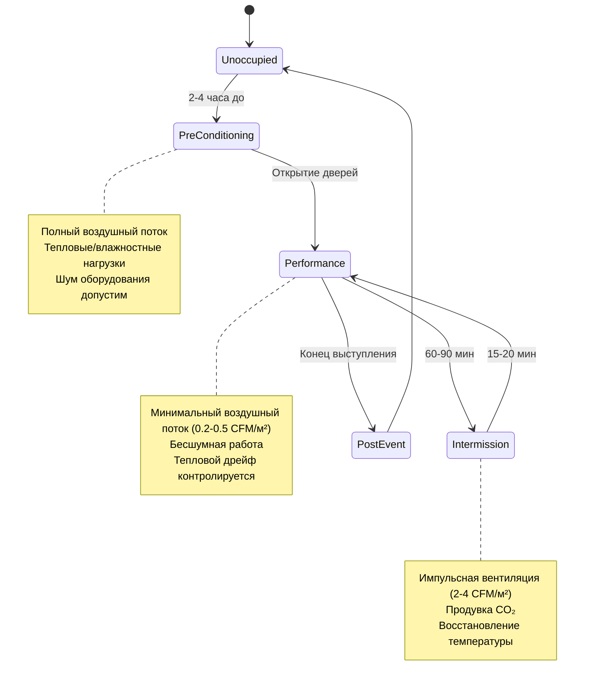
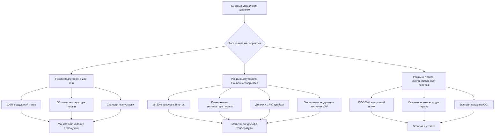

Концертные залы представляют наиболее акустически требовательное применение HVAC. Двойственная задача поддержания абсолютной тишины во время выступлений при обеспечении теплового комфорта для 1,500-3,000 человек требует сложного инженерного проектирования, балансирующего термодинамику, психрометрику и акустику.

## Акустические критерии и физика управления шумом

Мировые концертные залы работают на уровне NC-15 или ниже во время выступлений, что эквивалентно примерно 25-30 дBA. Этот порог находится ниже уровня фонового шума большинства занятых помещений и приближается к пределу чувствительности человеческого слуха.

**Требования к ослаблению звуковой мощности HVAC:**

Взаимосвязь между звуковой мощностью, генерируемой HVAC, и уровнем звукового давления, воспринимаемым слушателем:

$$L_p = L_w - 10\log_{10}(A) + 10\log_{10}\left(\frac{Q}{4\pi r^2}\right)$$

Где:
- $L_p$ = уровень звукового давления в позиции слушателя (дБ)
- $L_w$ = уровень звуковой мощности компонента HVAC (дБ)
- $A$ = поглощение помещением (сабины)
- $Q$ = коэффициент направленности
- $r$ = расстояние от источника (м)

Концертные залы с высоким поглощением (2,000-4,000 сабин) требуют глушителей воздуховодов с вносимым затуханием 30-40 дB в октавных полосах 125-4000 Гц. Приточные установки, расположенные на расстоянии более 30 м от сцены с несколькими каскадами ослабления, достигают целевых критериев.

## Режимы работы системы

Системы HVAC концертного зала работают в отдельных режимах, соответствующих схемам использования помещения:

### Предварительное кондиционирование

Предварительное кондиционирование устанавливает тепловые и влажностные условия за 2-4 часа до выступления. Помещение рассматривается как незанятое, что позволяет полный воздушный поток (1.5-2.5 CFM/м² площади пола) и неограниченную работу оборудования.

**Энергия предварительного охлаждения тепловой массы:**

$$Q_{precool} = \sum(m_i \cdot c_{p,i} \cdot \Delta T_i)$$

Для зала площадью 5,574 м² с железобетонной/каменной конструкцией, предварительное охлаждение с 24°C до 20°C требует удаления примерно 16-21 ГДж тепла из конструктивной массы. Это удаление энергии предотвращает радиационное нагревание зрителей во время выступления, когда воздушный поток минимален.

### Режим работы во время выступления

Во время выступлений подача воздуха сокращается до 0.2-0.5 CFM/м² площади пола — достаточно только для компенсации влажностных нагрузок от присутствующих. Охлаждение чувствуемого тепла зависит от тепловой стратификации и медленного движения воздуха.

**Принципы вентиляции вытеснением:**

Низкоскоростной (0.13-0.25 м/с) холодный воздух, поступающий на уровне пола, создает стратифицированную среду. Движение, вызванное плавучестью, следует:

$$\frac{dp}{dz} = -\rho g$$

Где вертикальные градиенты плотности создают стабильную стратификацию. Источники тепла (люди, освещение) генерируют тепловые плюмы с характеристической скоростью:

$$w = 1.5 \left(\frac{Q}{z}\right)^{1/3}$$

Где $w$ — скорость плюма (м/с), $Q$ — тепловыпуск (кДж/ч), $z$ — высота над источником (м). Сидящий человек, выделяющий 73 кДж/ч чувствуемого тепла, генерирует плюм 0.15-0.20 м/с на уровне головы, захватывающий окружающий воздух и создающий вертикальные градиенты температуры 3-4°C от пола до потолка.

| Рабочий параметр | Перед мероприятием | Во время выступления | Антракт |
|---------------------|-----------|-------------|--------------|
| Подача воздуха | 42,500-71,000 CFM (м³/ч) | 5,700-14,200 CFM (м³/ч) | 57,000-113,700 CFM (м³/ч) |
| Воздухообмены в час | 4-6 ч⁻¹ | 0.5-1.0 ч⁻¹ | 5-10 ч⁻¹ |
| Температура подачи | 13-16°C | 16-18°C | 11-14°C |
| Уровень NC | NC-35 допустимо | NC-15 максимум | NC-30 допустимо |
| Дрейф температуры помещения | ±0°C целевое | +1 до +2°C допустимо | Возврат к уставке |

### Управление нагрузкой во время антракта

Периоды антракта (15-20 минут) требуют быстрой вентиляции для продувки CO₂ и удаления накопленного тепла. Плотность присутствующих достигает 0.28-0.46 м²/человека в фойе, генерируя пиковые нагрузки 70-116 кДж/ч на человека.

**Скорость снижения CO₂:**

$$C(t) = C_0 \cdot e^{-\lambda t} + C_{\infty}(1 - e^{-\lambda t})$$

Где $\lambda = ч^{-1}/60$ (мин⁻¹). Для снижения CO₂ с 1,500 ppm до 800 ppm за 15 минут требуется примерно 8-10 воздухообменов в час с наружным воздухом при 400 ppm.

## Управление влажностью для музыкальных инструментов

Струнные и духовые инструменты требуют 40-50% относительной влажности в течение всего года. Влажность древесины достигает равновесия с окружающими условиями согласно:

$$EMC = \frac{1800}{W} \left[\frac{KH(1-KH)}{1-KH+KH^2}\right]$$

Где $EMC$ — равновесная влажность древесины, $W$ — точка насыщения волокна (30% для большинства пород), $K$ — зависящая от температуры константа, $H$ — относительная влажность (десятичная дробь).

Снижение влажности ниже 35% относительной вызывает усадку древесины, расхождение стыков и растрескивание резонансной доски. Повышение выше 60% относительной вызывает набухание, блокировку и рост плесени.

**Расчет нагрузки увлажнения:**

$$\dot{m}_w = \rho \cdot Q \cdot (\omega_{set} - \omega_{supply})$$

Где $\dot{m}_w$ — скорость добавления воды (кг/ч), $\rho$ — плотность воздуха (1.2 кг/м³), $Q$ — воздушный поток (CFM), $\omega$ — коэффициент влажности (кг воды/кг сухого воздуха).

Зал объемом 67,665 м³, поддерживающий 45% относительной влажности при 21°C в зимних условиях (наружные условия −7°C, 30% относительной влажности) требует примерно 68-91 кг/ч добавления воды при 6 воздухообменах в час.

## Стратегии распределения воздуха

Концертные залы используют три основные стратегии распределения:

**1. Вентиляция вытеснением через подпольное пространство**
- Подпольные пленумы глубиной 46-61 см
- Низкоскоростные (0.25-0.50 м/с) диффузоры, встроенные в пол
- Температура подачи 17-18°C (4-6°C ниже помещения)
- Воздух на выброс извлекается из потолка через акустические пленумы

**2. Верхняя низкоскоростная раздача**
- Крупноплощадные потолочные диффузоры (1.5-2.3 м² каждый)
- Скорость выброса 0.25-0.50 м/с
- Температура подачи 14-17°C
- Естественная конвекция и стратификация при низких потоках

**3. Персональные диффузоры в кресле**
- Персональная подача воздуха в каждое кресло (0.14-0.24 м³/ч на кресло)
- Регулируемое направленное управление
- Температура подачи 16-18°C
- Наивысшее удовлетворение зрителей, но сложный монтаж

## Выбор оборудования и звукоизоляция

Приточные установки, обслуживающие помещения для выступлений, требуют:

- Вентиляторы переменной скорости с балансом класса FC 9 или лучше
- Входные и выпускные глушители (вносимое затухание 30+ dB)
- Внутренняя облицовка стекловолокном (5-10 см толщины, облицованная)
- Скорости выброса вентилятора ограничены 6-7.6 м/с
- Секции доступа между каждым компонентом для будущего обслуживания

Спецификации воздуховодов:

- Ограничения скорости: магистральные 6-9 м/с, ветви 4-6 м/с, терминалы 2-3 м/с
- Минимум 7.6 см облицовки воздуховода в системах подачи и возврата
- Гибкие соединения на всех установках (30-46 см длины)
- Глушители воздуховодов на ответвлениях, обслуживающих помещение выступлений
- Избегаемые проходы воздуховодов через потолки сцены или зрительного зала, где это возможно

## Последовательности управления

Системы управления концертного зала реализуют последовательности, основанные на расписании и реакции на присутствие:

Переходы между режимами следуют предварительно запрограммированным расписаниям, интегрированным с системами продажи билетов. Возможность ручного переопределения позволяет операторам корректировать время на основе фактического времени начала выступления и продолжительности антрактов.

## Контрольный список проектирования

Критические требования проектирования для HVAC концертного зала:

- Акустическое моделирование всех воздуховодов и диффузоров на этапе проектирования
- Верификация NC-15 при пусконаладке с использованием калиброванных измерений
- Системы контроля влажности с точностью ±5% относительной влажности и фильтрацией 0.3 мкм
- Резервное оборудование увлажнения и осушения (минимум N+1)
- Анализ целесообразности вентиляции вытеснением для новых зданий
- Координация шкалы времени предварительного кондиционирования с операционной деятельностью зала
- Пиковая емкость при антракте рассчитана на наихудший случай посещаемости
- Режим аварийной вентиляции для эвакуации дыма (NFPA 92)

Проектирование HVAC концертного зала требует интеграции акустического инженерства, контроля психрометрических параметров и науки о тепловом комфорте. Успех требует понимания того, что тишина во время выступления столь же критична, как температура и влажность — и намного сложнее достигается механическими средствами.
