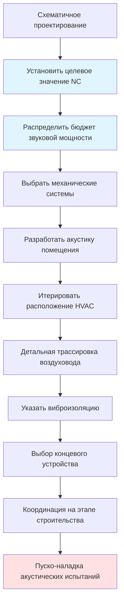

Системы HVAC концертных залов предъявляют наиболее жесткие акустические требования в инженерии зданий. Достижение критериев фонового шума NC 15-20 требует физико-ориентированной интеграции между механической и акустической дисциплинами проектирования, охватывающей передачу звука по множеству путей: шум излучения звука из воздуховодов, структурно-borne вибрация и излучение от концевых устройств.

## Акустические критерии и физика

### Основы критериев шума

Концертные залы нацелены на NC 15-20 для сохранения динамического диапазона неусиленной оркестровой музыки. Рейтинг NC представляет максимальный допустимый уровень звукового давления в октавных полосах:

| Центр октавной полосы (Гц) | NC 15 (дБ) | NC 20 (дБ) | NC 25 (дБ) |
|-------------------------|------------|------------|------------|
| 63                      | 47         | 51         | 54         |
| 125                     | 36         | 40         | 44         |
| 250                     | 29         | 33         | 37         |
| 500                     | 22         | 26         | 31         |
| 1000                    | 17         | 22         | 27         |
| 2000                    | 14         | 19         | 24         |
| 4000                    | 12         | 17         | 22         |
| 8000                    | 11         | 16         | 21         |

ASHRAE Handbook - HVAC Applications, глава 49 устанавливает эти целевые значения. Частотно-зависимая чувствительность человеческого уха (взвешивание A) делает контроль в среднечастотном диапазоне (500-4000 Гц) особенно критичным для ощущаемой тишины.

### Бюджетирование уровня звуковой мощности

Общий уровень звукового давления в положении слушателя описывается:

$$L_p = L_w + 10\log_{10}\left(\frac{Q}{4\pi r^2} + \frac{4}{R}\right)$$

Где:
- $L_p$ = уровень звукового давления в месте приема (дБ)
- $L_w$ = уровень звуковой мощности источника (дБ)
- $Q$ = коэффициент направленности (безразмерный)
- $r$ = расстояние от источника (м)
- $R$ = постоянная помещения, $\frac{S\alpha}{1-\alpha}$ (м²)
- $S$ = общая площадь поверхностей помещения (м²)
- $\alpha$ = средний коэффициент поглощения

Это соотношение определяет расстояние изоляции механического помещения и выбор диффузора.

## Процесс координации с акустиками

Критические этапы координации:

1. **Фаза концепции**: Акустик устанавливает геометрию помещения, целевые значения реверберации (1,8-2,2 с для оркестровых залов) и бюджет шума HVAC
2. **Разработка проекта**: Механический инженер распределяет звуковую мощность по каждой зоне диффузора на основе пространственного распределения
3. **Рабочая документация**: Совместный обзор прохождения воздуховодов через акустически рассчитанные узлы
4. **Пуско-наладка**: Измерение фонового шума при работе систем при проектном расходе воздуха

## Изоляция механического помещения

### Конструктивная разделка

Механические помещения должны быть конструктивно отделены от помещений для выступлений. Три стратегии изоляции:

| Стратегия | Виброизоляция | Применение | Ограничение |
|----------|---------------------|-------------|------------|
| Отдельное здание | Полная | Удаленная центральная установка | Длина трубопроводов/воздуховодов |
| Плавающая плита | 95-99% при >10 Гц | Подземное помещение оборудования | Требует углубления 200-300 мм |
| Изолированная платформа | 90-98% при >15 Гц | Оборудование на крыше | Сложность передачи нагрузки |

Собственная частота пружинных изоляторов определяет передачу:

$$f_n = \frac{1}{2\pi}\sqrt{\frac{k}{m}}$$

Где $k$ = жесткость пружины (Н/м) и $m$ = поддерживаемая масса (кг). Для 99% изоляции при вынуждающей частоте $f$ собственная частота должна удовлетворять $f_n < 0,1f$.

### Затухание на расстоянии

Расположение механических помещений на расстоянии 15-30 м от помещений для выступлений обеспечивает геометрическое затухание:

$$TL_{distance} = 20\log_{10}\left(\frac{r_2}{r_1}\right)$$

Удвоение расстояния дает 6 дБ снижение передачи структурной вибрации.

## Крепление оборудования

### Виброизолирующие фундаменты

Все вращающееся оборудование требует инерционных оснований с массой $m_{base} \geq 1,5 \times m_{equipment}$. Пружинные изоляторы под инерционными основаниями обеспечивают:

- **Статическое отклонение**: 50-75 мм (минимум)
- **Собственная частота**: 2-3 Гц
- **Эффективность изоляции**: 95-98% при частотах вращения вентилятора (900-1800 об/мин)

Неопреновые изоляторы на сдвиг обеспечивают неадекватную производительность для концертных залов из-за собственных частот выше 8 Гц.

### Гибкие соединения

Все соединения воздуховодов и трубопроводов с изолированным оборудованием требуют гибких секций:

- **Воздуховод**: Тканевые соединители со свободной длиной 50-75 мм, стекловолокно в неопреновой оболочке
- **Трубопровод**: Плетеные шланги из нержавеющей стали или резиновые расширительные швы
- **Электрика**: Гибкий кабелепровод с минимальной петлей 300 мм

## Контроль шума излучения звука из воздуховодов

### Физика передачи звука

Звуковая энергия передается через стенки воздуховода посредством распространения изгибных волн. Потери на передачу излучения из воздуховода:

$$TL_{breakout} = 10\log_{10}\left(\frac{W_{in}}{W_{out}}\right) = 10\log_{10}\left(\frac{P S}{4\pi f \rho c S_{duct}}\right) + 20\log_{10}(f) - 40$$

Где:
- $P$ = периметр воздуховода (м)
- $S$ = площадь поперечного сечения воздуховода (м²)
- $f$ = частота (Гц)
- $\rho c$ = характеристический импеданс воздуха (415 Па·с/м при 20°C)
- $S_{duct}$ = площадь поверхности воздуховода (м²)

### Стратегии смягчения излучения из воздуховода

1. **Увеличение толщины воздуховода**: 22 gauge → 18 gauge добавляет 8-10 дБ потерь передачи
2. **Внешняя защита**: 25 мм барьер из виниловой пленки с добавленной массой (MLV) добавляет 15-20 дБ
3. **Низкая скорость**: Поддерживать скорость воздуховода <4 м/с для минимизации генерирования шума турбулентности
4. **Круглые vs. прямоугольные**: Круглые воздуховоды обеспечивают 3-5 дБ лучше потери передачи благодаря более высокой жесткости

## Шум излучения диффузора

### Выбор концевого устройства

Шум излучения диффузора доминирует в звуковом поле занятых помещений. Уровень звуковой мощности от диффузора:

$$L_w = K_w + 10\log_{10}(Q) + 50\log_{10}(v) + 10\log_{10}(A_k)$$

Где:
- $K_w$ = постоянная диффузора (данные производителя)
- $Q$ = расход воздуха (л/с)
- $v$ = скорость на выходе (м/с)
- $A_k$ = свободная площадь (м²)

Критические параметры для NC 15-20:

- **Скорость выхода**: максимум <1,0 м/с
- **Скорость в горловине**: максимум <2,0 м/с
- **Коэффициент активной площади**: >0,60 для снижения турбулентности
- **Соотношение сторон**: Подходить из пленума потолка перпендикулярно щели для минимизации траектории струи

### Производительность плнума

Коробки плнума подачи воздуха выше по потоку от диффузоров обеспечивают:

- Выравнивание скорости по лицевой части диффузора
- 5-8 дБ дополнительного затухания при 250-1000 Гц
- Акустически облицованные плнумы (25 мм стекловолокно, плотность 48 кг/м³) добавляют 3-5 дБ

## Конфигурация системы

Последовательность проектирования приоритизирует контроль шума у источника, по пути и в месте приема.

## Проверка при пуско-наладке

Окончательные акустические испытания в соответствии с ASTM E1374 проверяют проект:

1. Расположить микрофон на нескольких позициях слушателей (оркестр, балкон)
2. Работать все системы HVAC при проектном расходе воздуха
3. Измерить 1/3-октавную полосу SPL (63-8000 Гц)
4. Проверить соответствие критериям NC 15-20
5. Определить и устранить любые тональные компоненты (частота лопастей, гул двигателя)

## Источники

- ASHRAE Handbook - HVAC Applications, глава 49: "Sound and Vibration"
- ASHRAE Handbook - Fundamentals, глава 8: "Sound and Vibration"
- ANSI/ASA S12.60: "Acoustical Performance Criteria for Learning Spaces"

---

Успешное проектирование HVAC концертного зала требует ранней интеграции акустиков, физико-ориентированного выбора компонентов и тщательного внимания к каждому пути передачи. Запас 5-10 дБ между типичной коммерческой практикой (NC 25-30) и требованиями концертного зала (NC 15-20) представляет экспоненциально больший инженерный усилия и затраты, оправданные сохранением художественного впечатления.
