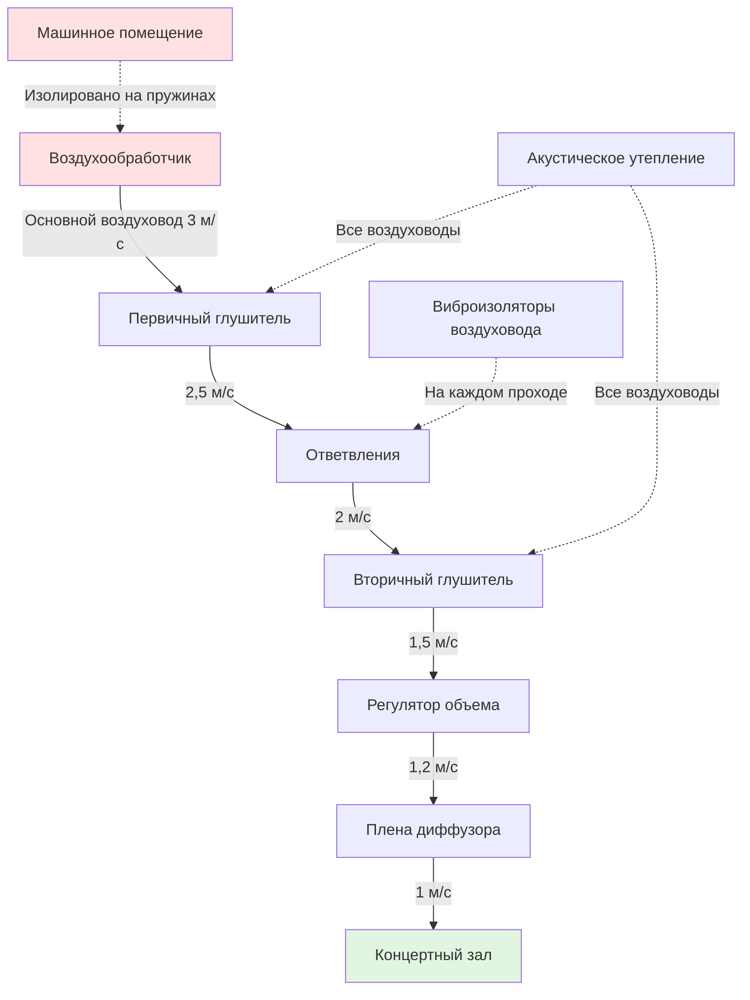
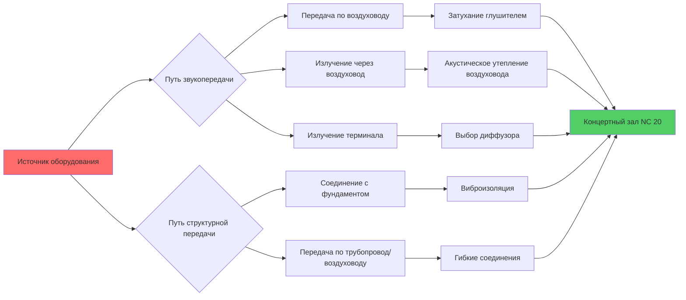

## Основы требований NC 20

NC 20 представляет один из наиболее строгих требований к фоновому шуму в проектировании HVAC, обычно указываемый для концертных залов мирового класса, звукозаписывающих студий и критических сред прослушивания. Кривые критериев шума (NC), разработанные Beranek, определяют максимально допустимые уровни звукового давления в октавных полосах от 63 Гц до 8000 Гц. При NC 20 фоновый шум становится неслышимым во время музыкальных пассажей, сохраняя полный динамический диапазон акустических исполнений.

Сложность вытекает из логарифмического характера интенсивности звука. Снижение с NC 30 до NC 20 означает уменьшение громкости вдвое, требуя экспоненциально большего инженерного усилия. Каждый путь распространения звука—звукопередача через воздуховоды, передача через механическое соединение и излучение через стенки воздуховода—должны быть проанализированы и ослаблены.

**Пределы NC 20 в октавных полосах:**

| Частота (Гц) | 63 | 125 | 250 | 500 | 1000 | 2000 | 4000 | 8000 |
|----------------|-------|-------|-------|-------|-------|-------|-------|-------|
| УЗД (дБ) | 47 | 36 | 29 | 22 | 17 | 14 | 12 | 11 |

Низкие частоты представляют наибольшую проблему проектирования. Предел 63 Гц в 47 дБ часто определяет проектирование системы, поскольку низкочастотный звук затухает медленно и эффективно проникает через барьеры.

## Системы распределения воздуха низкой скорости

Скорость воздуха в воздуховодах напрямую коррелирует с шумом, генерируемым турбулентностью. Акустическая мощность, генерируемая турбулентным потоком, масштабируется примерно с восьмой степенью скорости:

$$W \propto v^8$$

Это соотношение делает снижение скорости наиболее эффективной стратегией контроля шума. Для приложений NC 20 максимальные скорости воздуховодов не должны превышать:

- Основные воздуховоды подачи: 2,5–4,0 м/с
- Ответвленные воздуховоды: 2,0–3,0 м/с
- Концевые участки у зала: 1,5–2,0 м/с
- Скорость выхода диффузора: 1,0–1,5 м/с

Акустическая мощность, генерируемая в прямых участках воздуховода, подчиняется:

$$L_w = 10 \log_{10}\left(\frac{v}{1000}\right)^5 + 10 \log_{10}(A) + K$$

где $v$ — скорость в м/с, $A$ — площадь поперечного сечения воздуховода в м², $K$ — константа, зависящая от шероховатости поверхности воздуховода и конфигурации.

Достижение этих низких скоростей требует существенно увеличенных воздуховодов. Система, спроектированная для NC 20, может иметь сечения воздуховодов в 2–3 раза больше, чем обычные конструкции, что напрямую влияет на архитектурную координацию и затраты на строительство.

## Проектирование и применение глушителей воздуховодов

Пассивные глушители воздуховодов используют звукопоглощающие материалы для преобразования акустической энергии в тепло посредством вязких и тепловых пограничных эффектов. Эффективность глушителя зависит от:

1. **Толщины материала** относительно длины волны
2. **Ширины воздушного канала** между перегородками
3. **Длины** звукопоглощающего пути
4. **Скорости потока на поверхности материала**

Для низкочастотного затухания, критического для NC 20, проектирование глушителя должно учитывать соотношение четвертьволны:

$$\lambda = \frac{c}{f}$$

где $\lambda$ — длина волны, $c$ — скорость звука (344 м/с), $f$ — частота. На частоте 63 Гц длина волны приближается к 5,5 м, требуя значительной длины глушителя или толщины перегородки для эффективного затухания.

**Требования к эффективности глушителя:**

| Октавная полоса (Гц) | Минимальное затухание (дБ) |
|------------------|----------------------------|
| 63 | 10–15 |
| 125 | 15–20 |
| 250 | 20–25 |
| 500 | 25–30 |
| 1000+ | 25–30 |

Критические ограничения проектирования включают поддержание скорости потока на поверхности ниже 4,0 м/с для предотвращения собственного шума глушителя и обеспечение сухости материала, поскольку влага сильно снижает звукопоглощающие свойства.

## Изоляция машинного помещения

Механическое оборудование генерирует как звукопередачу в воздухе, так и структурный шум. Для приложений NC 20 машинные помещения должны быть:

**Физически отделены** от сценических помещений на минимум 15 м или межэтажными барьерами
**Структурно развязаны** через плавающие полы или изолированные конструктивные плиты
**Акустически герметизированы** сборками с индексом звукоизоляции STC 60+ и двойными входными дверями

Вибрация оборудования передается через жесткие соединения. Сила, передаваемая через виброизоляторы, подчиняется:

$$T = \frac{F}{\sqrt{1 + (2\zeta r)^2 - r^2}}$$

где $T$ — передаваемая сила, $F$ — возмущающая сила, $\zeta$ — коэффициент затухания, $r$ — отношение частот $(f/f_n)$. Эффективная изоляция требует, чтобы рабочая частота была минимум в $\sqrt{2}$ раз выше собственной частоты изолятора.

**Требования к изоляции оборудования:**

| Тип оборудования | Эффективность изоляции | Собственная частота |
|----------------|---------------------|-------------------|
| Воздухообработчики | 95–98% | 3–5 Гц |
| Холодильные машины | 95–98% | 3–5 Гц |
| Градирни | 90–95% | 5–7 Гц |
| Насосы | 95–98% | 3–5 Гц |
| Вентиляторы | 95–98% | 3–5 Гц |

Все трубопроводные и воздуховодные соединения должны включать гибкие муфты с минимальным прогибом 50 мм для предотвращения обхода вибрации.

## Анализ путей распространения звука

Достижение NC 20 требует выявления и количественной оценки каждого пути передачи звука с использованием баланса акустической мощности:

$$L_{p,hall} = L_w + 10\log_{10}\left(\frac{Q}{4\pi r^2} + \frac{4}{R}\right)$$

где $L_{p,hall}$ — уровень звукового давления в зале, $L_w$ — акустическая мощность источника, $Q$ — коэффициент направленности, $r$ — расстояние, $R$ — постоянная помещения.

Критические пути обычно включают:

- **По воздуховоду**: Прямая передача через пути подачи/возврата воздуха
- **Излучение через стенку**: Звук, излучаемый стенками воздуховода (становится значительным на низких частотах)
- **Регенерированный**: Турбулентность в отводах, регуляторах и переходах
- **Структурный**: Вибрация через жесткие соединения
- **Обходной**: Передача через пространства плен и строительную конструкцию

## Измерение и проверка

Проверка уровня NC следует стандартам ASHRAE Standard 189.1 и ANSI S12.2. Измерения требуют:

**Инструментарий**: Звукомеры точности тип 1 с октавными фильтрами
**Фон**: Все системы HVAC работают, нет посторонних источников
**Местоположения**: Множество позиций в зале для выступлений
**Продолжительность**: Минимум 30 секунд интегрирования на позицию

Измеренный уровень NC соответствует наивысшей кривой NC, касательной к спектру октавных полос. Одна октавная полоса, превышающая пределы, вызывает отказ NC, даже если другие полосы достигают более низких уровней.

**Протокол проверки:**

1. Установить базовый уровень со всеми отключенными системами (проверка постороннего вторжения)
2. Запустить системы HVAC на номинальные расходы воздуха
3. Измерить УЗД в октавных полосах в 6–12 местоположениях
4. Нанести измеренный спектр на кривые NC
5. Определить ограничивающую октавную полосу
6. Документировать отклонения и внедрить корректирующие меры

Общие режимы отказа включают недостаточное низкочастотное затухание, чрезмерную скорость воздуховода, неадекватную изоляцию оборудования и обходную передачу через потолочные плены. Устранение часто требует добавления вторичных глушителей, снижения расхода воздуха или улучшения изоляции—все дорогостоящие послестроительные модификации, подчеркивающие необходимость тщательного анализа проектирования.

Достижение NC 20 требует интегрированного акустического и механического проектирования с начала проекта. Физические ограничения распределения воздуха низкой скорости, зависящее от длины волны затухание и многопутевая передача звука требуют расширенного пространственного выделения, выбора премиум-оборудования и скрупулезного выполнения строительства. Результат сохраняет предусмотренную акустическую среду, где самый тихий музыкальный пассаж остается свободным от помех от механической системы.
