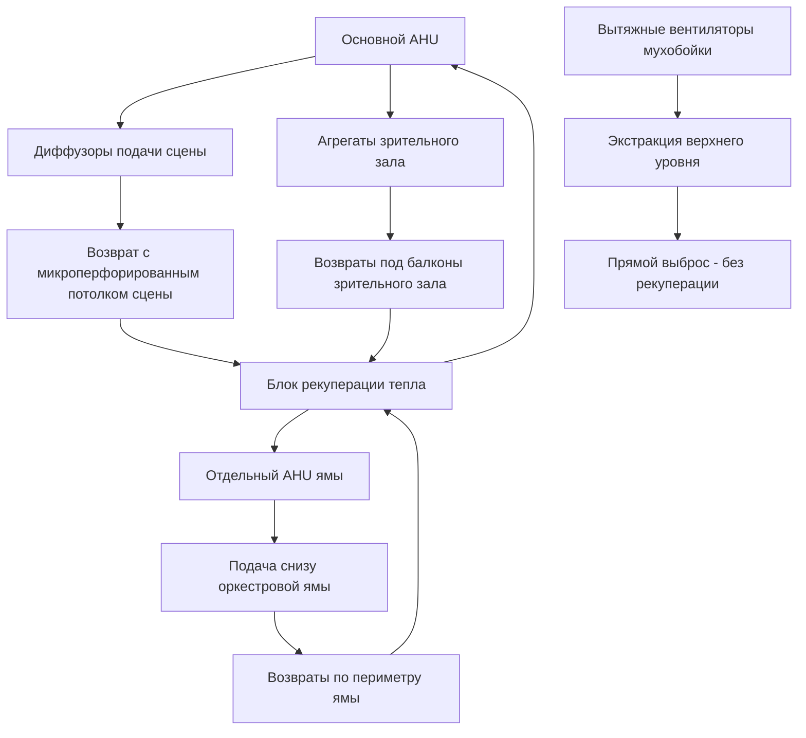

## Обзор

Системы HVAC оперных театров представляют уникальные инженерные вызовы, сочетающие экстремальные тепловые нагрузки, строгие акустические требования, быстрые колебания нагрузок и сохранение исторической архитектуры. Театральная сцена генерирует 50–150 Вт/м² от театрального освещения при требовании практически бесшумной работы, оркестровые ямы требуют 15–25 воздухообменов в час несмотря на ограниченное пространство, а мухобойки высотой 20–35 м над уровнем сцены создают огромные проблемы с расслоением воздуха.

## Характеристики тепловых нагрузок

### Генерация тепла на сцене

Театральное освещение создает основную тепловую нагрузку с плотностью мощности, варьирующейся в зависимости от типа представления:

| Тип представления | Плотность мощности освещения | Доля явного тепла | Длительность пиковой нагрузки |
|------------------|---------------------|---------------------|---------------------|
| Опера | 100–150 Вт/м² | 0,95–0,98 | 2–4 часа |
| Балет | 80–120 Вт/м² | 0,96–0,99 | 1,5–3 часа |
| Драма | 50–80 Вт/м² | 0,97–0,99 | 2–3 часа |
| Репетиция | 20–40 Вт/м² | 0,85–0,90 | 4–8 часов |

Передача конвективного тепла от осветительных приборов подчиняется:

$$Q_{conv} = h \cdot A \cdot (T_{fixture} - T_{air})$$

где температура поверхности приборов достигает 150–250°C, создавая мощные плавучие струи со скоростями:

$$v = \sqrt{2 \cdot g \cdot H \cdot \frac{\Delta T}{T_{avg}}}$$

Для мухобойки высотой 25 м с ΔT = 15 К скорость плавучести приближается к 4,8 м/с, требуя тщательного проектирования вентиляции для предотвращения расслоения.

### Метаболические нагрузки артистов

Артисты генерируют 200–400 Вт на человека во время активного выступления, пиковые выходы при ансамблевых номерах достигают:

$$Q_{metabolic} = N_{performers} \cdot (M + W)$$

где M — метаболический уровень (300–400 Вт) и W — механическая работа (50–100 Вт) при танцевальных движениях.

## Архитектура системы

## Кондиционирование сцены

### Распределение приточного воздуха

Системы подачи воздуха на сцене используют потолочные микроперфорированные панели с скоростью воздуха на выходе 0,15–0,25 м/с для минимизации акустических помех. Требуемый расход воздуха:

$$\dot{V} = \frac{Q_{total}}{\rho \cdot c_p \cdot \Delta T}$$

Для типичной сцены площадью 600 м² с тепловой нагрузкой освещения 90 кВ и температурным перепадом 12 К:

$$\dot{V} = \frac{90,000}{1,2 \cdot 1006 \cdot 12} = 6,2 \text{ м}^3/\text{с}$$

Это дает скорость подачи 10,3 л/с·м², распределяемую через 40–60 м² микроперфорированной поверхности для поддержания скорости ниже акустического порога.

### Стратегия вентиляции мухобойки

Мухобойка создает вертикальный канал высотой 20–35 м, требующий отдельной вытяжки для удаления плавучего тепла. Естественное расслоение вызывает градиенты температуры 0,5–0,8 К/м, с температурами на верхней точке (25 м), достигающими 15–20 К выше уровня сцены.

Вытяжные вентиляторы, размерные для 8–12 воздухообменов в час, работают периодически, активируясь, когда температура на верхней точке превышает установку на 8 К:

$$\dot{V}_{exhaust} = \frac{V_{fly} \cdot ACH}{3600} = \frac{(600 \cdot 25) \cdot 10}{3600} = 41,7 \text{ м}^3/\text{с}$$

Подпиточный воздух поступает через ручные клапаны на уровне сцены, создавая вертикальный поток воздуха, который переносит тепло вверх без нарушения условий на сцене.

## Климат-контроль оркестровой ямы

### Ограничения пространства и плотность нагрузок

Оркестровые ямы площадью 60–100 м² вмещают 50–80 музыкантов в углубленном пространстве 1,5–2,5 м ниже уровня сцены, создавая плотность мощности 30–50 Вт/м² (метаболическое) плюс 5–10 Вт/м² (освещение инструментов).

Приточный воздух, подаваемый через системы поднятого пола со скоростью 0,3–0,5 м/с, обеспечивает вытеснительную вентиляцию:

$$Q_{total} = Q_{sensible} + Q_{latent} = (N \cdot 200) + (N \cdot 100 \cdot 2450/1000)$$

Для 70 музыкантов:

- Явная нагрузка: 14 кВ
- Скрытая нагрузка: 17,2 кВ (7 л/ч влаги)
- Общая нагрузка: 31,2 кВ

Требуемый расход воздуха при ΔT = 10 К:

$$\dot{V} = \frac{14,000}{1,2 \cdot 1006 \cdot 10} = 1,16 \text{ м}^3/\text{с}$$

Это представляет 16,5 воздухообменов в час для ямы 80 м² глубиной 2,2 м.

### Акустическая интеграция

Приточные решетки должны соответствовать критериям NC-20 до NC-25. Максимально допустимая скорость воздуха в воздуховодах:

$$v_{max} = 2,5 \text{ м/с (магистрали)}, \quad 1,5 \text{ м/с (ветви)}, \quad 0,8 \text{ м/с (концевые устройства)}$$

Глушители обеспечивают затухание 15–25 дБ в полосах октав 125–4000 Гц с потерей вставки, проверяемой:

$$IL = 10 \log_{10}\left(\frac{W_{incident}}{W_{transmitted}}\right)$$

## Системы зрительного зала

### Стратегия теплового зонирования

Традиционные конструкции подковы с 3–5 ярусами балконов требуют независимого управления зонами:

- Партер: 40–45% вместимости, высота потолка 2,5–3,0 м
- Первый ярус: 20–25% вместимости, высота потолка 3,5–4,5 м
- Верхние ярусы: 35–40% вместимости, высота потолка 5,0–7,0 м

Приточный воздух, распределяемый через подсидячие диффузоры (партер) и настенные решетки (балконы), поддерживает вертикальный градиент температуры ≤ 2 К между полом и зоной дыхания на высоте 1,8 м.

### Кондиционирование при быстрой смене декораций

Смены декораций длительностью 3–8 минут требуют быстрого отклика системы. Тепловая инерция системы характеризуется постоянной времени:

$$\tau = \frac{m \cdot c_p}{\dot{m} \cdot c_p} = \frac{V_{space} \cdot \rho}{ACH \cdot V_{space} \cdot \rho / 3600} = \frac{3600}{ACH}$$

При 8 ACH, τ = 450 секунд (7,5 минут), совпадая с длительностью смены. Сброс температуры приточного воздуха на 4–6 К во время затемнений предотвращает переохлаждение при управлении переходными нагрузками.

## Реновация исторических зданий

### Ограничения интеграции

Оперные театры, построенные в 1850–1920 годах, представляют вызовы сохранения:

- **Конструктивные ограничения**: допустимая нагрузка на пол 2,5–4,0 кПа, ограничивающая размещение оборудования
- **Пространственные ограничения**: глубины потолочных полостей 0,3–0,8 м против современных требований 1,2–1,5 м
- **Сохранение эстетики**: видимые воздуховоды запрещены в общественных пространствах
- **Акустическая изоляция**: передача ударного шума через историческую кладку ограничена STC-55

### Современные стратегии систем

**Децентрализованное размещение оборудования** распределяет меньшие установки (5–15 кВ) в доступных местах вместо центральных объектов, уменьшая размеры воздуховодов и конструктивные нагрузки.

**Вытеснительная вентиляция** из подпольных пленумов или диффузоров уровня сидений исключает потолочные воздуховоды в сохраняемых пространствах, улучшая эффективность за счет сниженного ΔT (6–8 К против 10–12 К).

**Системы переменного потока хладагента (VRF)** с фреоновыми линиями диаметром 65 мм заменяют воздуховоды подачи 400–600 мм, протягиваясь через существующие каналы и полости.

## Нормы и критерии проектирования

Рекомендации ASHRAE для HVAC оперного театра:

- **ASHRAE 55**: Целевая температура теплового комфорта 21–23°C, 40–55% отн. влажности во время представления
- **ASHRAE 62.1**: Скорость вентиляции 7,5 л/с·человека (зрители), 12,5 л/с·человека (артисты)
- **ASHRAE Handbook - HVAC Applications**: Глава 5 (Места общественного собрания) определяет условия проектирования
- **NC-20 до NC-25**: Критерии фонового шума для помещений представления

Проверка проектирования требует моделирования вычислительной гидродинамики (CFD) тепловых струй на сцене и расслоения в зрительном зале, валидированного согласно протоколам измерений проекта ASHRAE Research Project RP-1515.

## Проверка производительности

Приемочное испытание валидирует:

1. **Акустическая производительность**: измерения NC в 10+ местоположениях во время полной работы системы
2. **Распределение тепла**: вариация ±1,5 К по зонам сидений при полной вместимости
3. **Контроль влажности**: поддержание 40–60% отн. влажности во время 4-часового представления с 1500+ зрителями
4. **Соотношения давлений**: сцена +5–+8 Па относительно зрительного зала для содержания сценического тумана
5. **Время отклика**: восстановление температуры в течение 15 минут после переходных нагрузок при смене декораций

Эти параметры обеспечивают комфорт артистов, удовлетворение зрителей и акустическую прозрачность, требуемые для мировоклассной оперной сцены.
