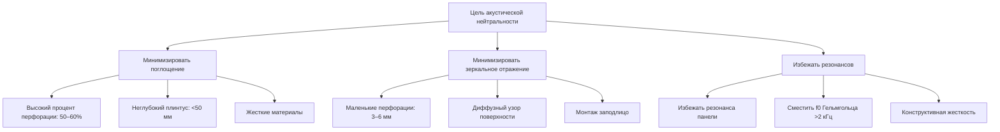
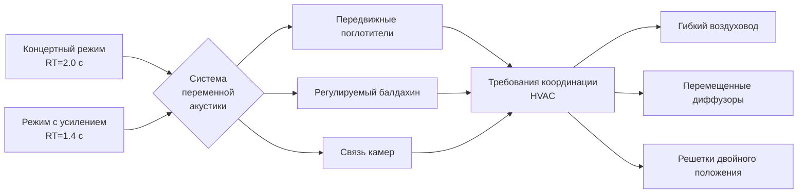

## Введение

Координация времени реверберации представляет критическое пересечение между проектированием механических систем и архитектурной акустикой. Компоненты HVAC вводят разрывы в поверхности помещения, которые действуют как акустические поглотители, диффузоры или непреднамеренные отражатели. Акустические последствия подающих диффузоров, решеток возврата, проникновений воздуховодов и механических обработок поверхностей напрямую влияют на общий коэффициент поглощения в уравнении Сабина и на результирующие характеристики реверберации.

## Физика времени реверберации

Уравнение Сабина управляет временем реверберации для большинства объемов концертных залов:

$$T_{60} = \frac{0.161V}{A}$$

где $T_{60}$ — время в секундах для затухания звукового давления на 60 дБ, $V$ — объем помещения в кубических метрах, и $A$ — общее поглощение помещения в метрических единицах сабина:

$$A = \sum_{i=1}^{n} S_i \alpha_i$$

Каждый элемент HVAC вводит площадь поверхности $S_i$ с коэффициентом поглощения $\alpha_i$, который изменяет общее поглощение. Одна большая решетка возврата с $\alpha = 0.30$ и площадью 2.0 м² вносит вклад 0.6 сабина, что эквивалентно приблизительно 1.5 м² площади аудитории.

Целевые времена реверберации для концертных залов обычно варьируются от 1.8 до 2.2 секунд на средних частотах (500–1000 Гц) с повышенным басовым соотношением для тепла:

$$\text{Басовое соотношение} = \frac{T_{60,125} + T_{60,250}}{T_{60,500} + T_{60,1000}}$$

Оптимальные басовые соотношения варьируются от 1.10 до 1.30 для оркестровой музыки.

## Влияние поглощения поверхностей HVAC

Элементы системы HVAC вносят зависящее от частоты поглощение, которое должно быть определено количественно во время акустического проектирования:

| Элемент HVAC | Диапазон коэффициента поглощения | Преобладающий эффект |
|--------------|------------------------------|-----------------|
| Перфорированные металлические диффузоры (без подложки) | 0.15–0.25 (500 Гц) | Резонансное поглощение |
| Решетки возврата с плинтусом | 0.25–0.40 (500 Гц) | Резонанс Гельмгольца |
| Ткань в воздуховоде (открытая) | 0.60–0.90 (1000 Гц) | Пористое поглощение |
| Твердые металлические воздуховоды (окрашенные) | 0.02–0.05 | Минимальное поглощение |
| Расширенные металлические решетки | 0.10–0.20 | Вязкие потери |

### Резонанс Гельмгольца в решетках

Перфорированные решетки с подкладками камер ведут себя как резонаторы Гельмгольца с резонансной частотой:

$$f_0 = \frac{c}{2\pi}\sqrt{\frac{P}{V_c(t_{eff})}}$$

где $c$ — скорость звука (343 м/с), $P$ — площадь перфорации, $V_c$ — объем камеры, и $t_{eff}$ — эффективная толщина, включая поправки на торцы. Поглощение достигает пика при $f_0$ с коэффициентом, потенциально превышающим 0.50, создавая локализованные провалы времени реверберации, влияющие на тональный баланс.

## Акустическое проектирование решетки диффузора

Акустическая прозрачность требует проектирования диффузора, которое минимизирует как поглощение, так и зеркальное отражение:

### Критерии проектирования акустической нейтральности

1. **Процент перфорации**: 40–60% открытой площади уменьшает поглощение при сохранении выброса воздуха
2. **Диаметр перфорации**: Маленькие отверстия (3–6 мм) минимизируют эффекты дифракции выше 2000 Гц
3. **Глубина подложки**: Неглубокие плинтусы (<50 мм) смещают резонансы выше диапазона речи/музыки
4. **Профиль поверхности**: Монтаж заподлицо исключает дифракцию на краю
5. **Выбор материала**: Жесткие металлы предотвращают резонанс панели

### Распределение по поверхностям и потолку

Потолочные диффузоры представляют большие площади поверхности для падающего звука и вносят большее поглощение. Диффузоры, установленные на стене или на высокой боковой стене, снижают акустическое воздействие благодаря меньшей площади и углам скользящего падения, где коэффициенты поглощения уменьшаются на косинус-фактор.

## Предотвращение флаттер-эхо

Флаттер-эхо возникают из повторяющихся отражений между параллельными отражающими поверхностями. Элементы HVAC могут либо смягчить, либо обострить флаттер в зависимости от размещения и характеристик поверхности.

### Механизм флаттер-эхо

Частота флаттер-эхо $f_{flutter}$ между параллельными поверхностями, разделенными расстоянием $d$:

$$f_{flutter} = \frac{c}{2d}$$

Для зала с расстоянием потолок-пол 15 м флаттер-эхо возникает при фундаментальной частоте 11.4 Гц с слышимыми гармониками, расширяющимися до сотен Гц. Каждое отражение должно быть ослаблено, чтобы предотвратить накопление.

### Стратегии смягчения HVAC

| Стратегия | Реализация | Эффективность |
|----------|---------------|---------------|
| Прерывание поверхности | Большие массивы диффузоров нарушают плоские поверхности | Высокая для потолков |
| Поглощение | Открытая облицовка воздуховода в решетках | Средняя, зависит от частоты |
| Рассеивание | Неправильные узоры решеток | Средняя–высокая |
| Геометрия | Наклонные проникновения воздуховодов | Высокая для стен |

Распределенные макеты диффузоров с нерегулярным расстоянием обеспечивают акустическое рассеивание, которое нарушает когерентные отражения. Рекомендуемая минимальная нерегулярность расстояния составляет ±20% от номинальной сетки.

## Координация переменной акустики

Системы переменной акустики позволяют регулировать время реверберации для различных типов представлений. Системы HVAC должны вмещать движущиеся элементы без компрометации распределения воздуха:

### Требования координации

**Передвижные стеновые панели**: Диффузоры HVAC должны избегать расположения панелей или использовать перемещенные диффузоры, установленные на передвижных секциях. Гибкие подключения воздуховодов (максимальная длина 1.5 м) позволяют движению панелей при сохранении класса давления.

**Втяжные баннеры**: Поток подаваемого воздуха не должен попадать на тканевые поверхности, вызывая флаттер или смещение. Минимальный зазор 1.0 м от высокоскоростных струй.

**Двери связи камер**: Пути возврата воздуха должны функционировать как в соединенной, так и в несоединенной конфигурациях. Двойные решетки или переводные воздуховоды обеспечивают адекватный возврат во всех акустических режимах.

**Регулируемое поглощение**: Моторизованные тканевые панели или вращающиеся элементы требуют координации с образцами выброса диффузора, чтобы предотвратить короткое замыкание распределения воздуха при развертывании панелей.

## Акустическое воздействие облицовки воздуховода

Внутренняя облицовка воздуховода обеспечивает затухание шума механической системы, но открытая облицовка в переходах решеток создает локализованное высокое поглощение:

$$\alpha_{exposed} = 1 - (1-\alpha_{lining})\cdot\frac{A_{free}}{A_{total}}$$

Открытая стеклофибровая облицовка с $\alpha_{lining} = 0.85$ на 1000 Гц и 30% свободной площади дает $\alpha_{exposed} = 0.62$. Стандартная практика ограничивает открытую облицовку внутренней частью воздуховода с герметизированными краями во всех периметрах решеток.

## Стандарты проектирования ASHRAE

ASHRAE Handbook - HVAC Applications, глава 49 (Контроль звука и вибрации) предоставляет рекомендации:

- Максимально рекомендуемый NC-15 для концертных залов
- Требуется координация времени реверберации с акустическим консультантом
- Выбор диффузора приоритизирует акустические критерии над тепловыми характеристиками в критических зонах
- Размер решетки возврата поддерживает скорость потока лица ниже 2.0 м/с, чтобы минимизировать самогенерируемый шум

## Рекомендации по спецификациям

Механические спецификации для акустически критичных пространств должны включать:

1. **Критерии акустической производительности**: Целевые коэффициенты поглощения по полосам октав для всех открытых элементов HVAC
2. **Требования макета**: Полномасштабные макеты диффузора и решетки для акустического измерения перед закупкой
3. **Допуски при установке**: ±3 мм монтаж заподлицо для предотвращения граничных эффектов
4. **Чертежи координации**: Наложение элементов HVAC на акустические модели трассировки лучей
5. **Протокол пусконаладки**: Измерения RT после установки с системой HVAC в финальной конфигурации

## Заключение

Успешная координация времени реверберации требует рассмотрения элементов системы HVAC как неотъемлемых акустических компонентов. Характеристики поглощения, рассеивания и отражения диффузоров, решеток и проникновений воздуховодов напрямую влияют на измеренное время реверберации и должны быть определены количественно во время проектирования. Тесная координация между механическими и акустическими консультантами, поддерживаемая физическими макетами и вычислительной верификацией, обеспечивает, что системы HVAC поддерживают, а не компрометируют цели акустической производительности.
