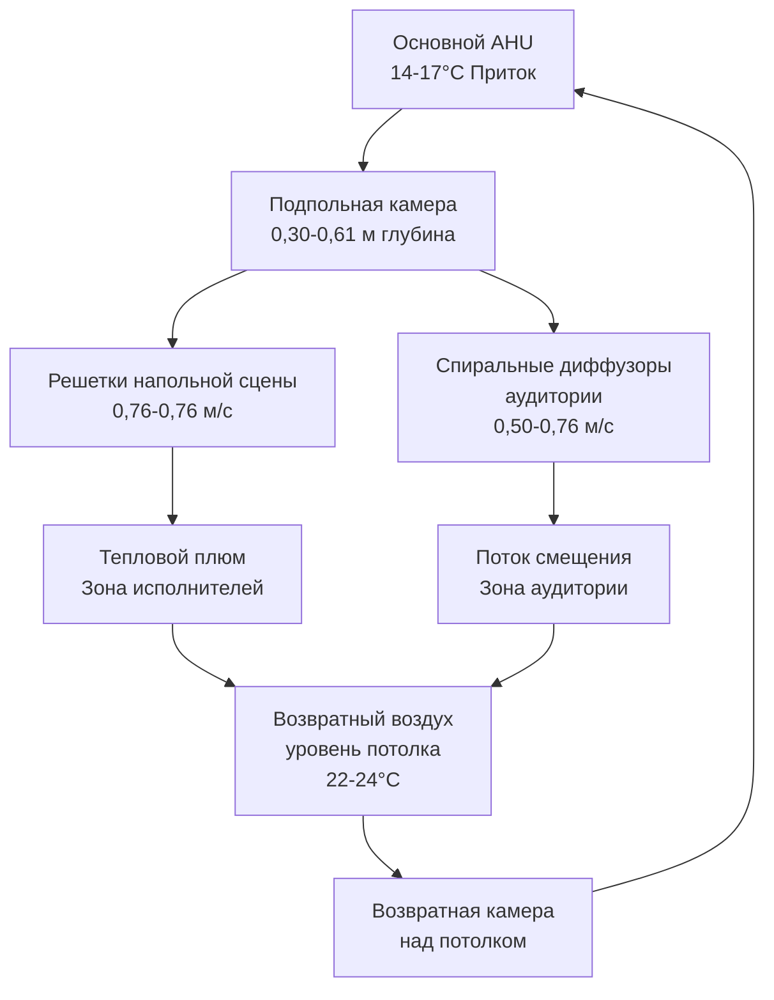
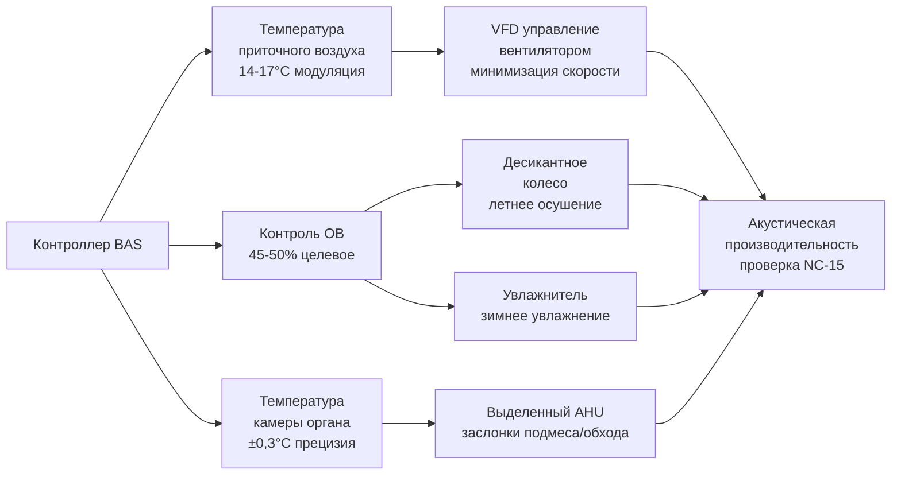

## Обзор

Проектирование HVAC концертного зала представляет самую требовательную акустическую среду в инженерии климат-контроля. Система должна поддерживать точные условия окружающей среды для сохранения инструментов при уровнях шума ниже 15 дBA (NC-15), часто требуя скоростей потока воздуха ниже 1,22 м/с и специализированного акустического ослабления, превышающего 60 дB. Критическое взаимодействие между термической стратификацией, контролем относительной влажности и акустической передачей определяет каждое проектное решение.

## Требования к акустическим характеристикам

### Критерии шума и звуковая мощность

Концертные залы требуют уровней фонового шума NC-15 или ниже, что соответствует примерно 25-28 dBA в зоне зрителей. Связь между скоростью воздуха в воздуховоде и создаваемой звуковой мощностью следует формуле:

$$L_w = 10 \log_{10}\left(\frac{V^3 \cdot A}{10^{12}}\right) + K$$

где $L_w$ — уровень звуковой мощности (dB), $V$ — скорость воздуха (м/с), $A$ — площадь воздуховода (м²), $K$ — константа (обычно 85-90).

Для достижения NC-15 максимальные скорости воздуха в воздуховодах должны быть ограничены:

| Местоположение | Макс. скорость | Типовой размер |
|----------|--------------|--------------|
| Основные магистральные воздуховоды | 2,44 м/с | 1,22 м × 0,61 м |
| Ветвевые воздуховоды | 1,52 м/с | 0,61 м × 0,30 м |
| Терминальные устройства | 0,91 м/с | Специальные диффузоры |
| Подпольные камеры | 0,61 м/с | Полная ширина сцены |

### Изоляция вибраций

Все механическое оборудование требует изоляции для предотвращения передачи вибраций через конструкцию. Требуемая эффективность изоляции:

$$\eta = \left(1 - \frac{1}{\sqrt{1 + (2\zeta r)^2}}\right) \times 100\%$$

где $\zeta$ — коэффициент демпирования (0,05–0,10 для стальных пружин) и $r$ — отношение частот ($f/f_n$). Требуется минимальное отношение частот 4:1, что требует собственных частот ниже 4–6 Гц для типичного механического оборудования.

## Требования к влажности инструментов и материалов

### Критический контроль относительной влажности

Музыкальные инструменты проявляют изменения размеров, пропорциональные содержанию влаги, следуя формуле:

$$\frac{\Delta L}{L} = \alpha_{MC} \cdot \Delta MC$$

где $\alpha_{MC}$ — коэффициент влагового расширения (0,0015–0,0025 на 1% изменения MC для дерева) и содержание влаги связано с OВ через изотермы сорбции.

**Целевые параметры окружающей среды:**

- **Относительная влажность:** 40–60% (оптимально: 45–50%)
- **Температура:** 20–22°C во время исполнений
- **Стабильность OВ:** ±5% максимальное колебание
- **Сезонный дрейф:** <2% в неделю

Струнные инструменты (скрипки, виолончели) с тонкими деревянными секциями (5–10 мм) быстро реагируют на изменения OВ с постоянными времени 24–48 часов. Фортепиано с большей массой проявляют постоянные времени 7–14 дней.

### Расчёты скрытой нагрузки

Метаболическое выделение влаги аудиторией доминирует в скрытых нагрузках:

$$q_{latent} = N \cdot SHR \cdot q_{total} \cdot \frac{1-SHR}{SHR}$$

Для зала на 2000 мест при 1,17 кВт на человека и коэффициенте явной теплоты 0,75:

$$q_{latent} = 2000 \times 1,17 \times \frac{1-0,75}{0,75} = 780 \text{ кВт}$$

Это требует емкости осушения примерно 6,4 кВт удаления влаги летом во время исполнений.

## Системы подпольного распределения воздуха

### Принципы проектирования

Подпольное распределение воздуха (UFAD) обеспечивает превосходные акустические характеристики, устраняя воздуховоды над головой и используя низкоскоростную вентиляцию смещением. Разница температур приточного воздуха приводит в движение систему:

$$Q = \rho \cdot c_p \cdot \dot{m} \cdot \Delta T$$

где снижение температуры приточного воздуха на 4–7°C ниже температуры помещения создает естественный конвективный поток. Приточный воздух поступает при температуре 14–17°C через напольные решетки при скоростях ниже 0,61 м/с.

**Компоненты системы UFAD:**

### Управление термической стратификацией

Вертикальный градиент температуры при вентиляции смещением следует формуле:

$$\frac{dT}{dz} = \frac{q_{conv}}{A \cdot \rho \cdot c_p \cdot u_z}$$

где $q_{conv}$ — конвективное тепловыделение, $A$ — площадь пола, $u_z$ — вертикальная скорость. Целевой градиент составляет 0,28–0,56°C на метр высоты, ограничивая стратификацию до 4,4–6,7°C между полом и потолком в зале высотой 12 м.

## Стабильность температуры органных труб

### Изменение высоты звука с температурой

Высота звука органной трубы варьируется прямо пропорционально абсолютной температуре воздушного столба:

$$\frac{\Delta f}{f} = \frac{1}{2} \cdot \frac{\Delta T}{T}$$

где $f$ — частота в Гц и $T$ — абсолютная температура в Кельвинах. Для концертной ля (440 Гц) при 21°C (294 K), изменение температуры на 1,1°C дает:

$$\Delta f = 440 \times \frac{1}{2} \times \frac{1,1}{294} = 0,83 \text{ Гц}$$

Это смещение на 0,83 Гц заметно на слух. Стандарт ASHRAE Standard 55 допускает колебание ±1,7°C, но органные установки требуют максимально ±0,6°C.

### Стратегии контроля температуры

**Уставки по зонам:**

| Зона | Температура | Полоса контроля | Схема движения воздуха |
|------|-------------|--------------|-----------------|
| Камера органа | 21°C | ±0,3°C | Ламинарная, низкая скорость |
| Платформа сцены | 20–21°C | ±0,6°C | UFAD смещение |
| Зона зрителей | 21–22°C | ±1,1°C | Смещение + смешивание |
| Верхние галереи | 22–23°C | ±1,7°C | Естественная стратификация |

Камеры органов требуют выделенной прецизионной обработки воздуха с модулирующими заслонками подмеса и обхода для непрерывного контроля температуры независимо от основной системы зала.

## Тепловой комфорт исполнителей

### Метаболическое выделение тепла

Исполняющие музыканты выделяют 1,32–1,76 кВт в зависимости от инструмента и уровня напряжения:

- **Струнные игроки (сидя):** 1,32 кВт (1,3 мет)
- **Деревянные/медные духовые (сидя):** 1,46 кВт (1,4 мет)
- **Ударные (стоя):** 1,61 кВт (1,6 мет)
- **Дирижер (активный):** 1,76 кВт (1,7 мет)

Явная нагрузка на сцену для оркестра из 100 музыкантов:

$$q_{stage} = 100 \times 1,46 = 146 \text{ кВт (41,5 тонн)}$$

### Асимметричное тепловое излучение

Сценическое освещение добавляет 43,9–87,9 кВт лучистой нагрузки непосредственно на исполнителей. Средняя лучистая температура ($MRT$), которую испытывают исполнители, отличается от температуры воздуха:

$$MRT = \sqrt[4]{\sum_{i=1}^{n} F_i \cdot T_i^4}$$

где $F_i$ — коэффициент вида поверхности $i$ и $T_i$ — температура поверхности в Кельвинах. Верхнее освещение при 65°C с коэффициентом вида 0,3 может повысить среднюю лучистую температуру на 4,4–6,7°C выше температуры воздуха.

Системы UFAD решают эту проблему, обеспечивая локализованное охлаждение на уровне пола, где сидящие исполнители втягивают кондиционированный воздух непосредственно в свою микросреду.

## Кондиционирование зала аудитории

### Разнообразие нагрузок и пиковый спрос

Явное тепло аудитории следует формуле:

$$q_{sensible} = N \cdot SHR \cdot q_{total}$$

При 1,17 кВт на человека и коэффициенте явной теплоты 0,75:

$$q_{sensible} = 2000 \times 0,75 \times 1,17 = 1755 \text{ кВт (50 тонн)}$$

Пиковый спрос охлаждения возникает через 30–45 минут после начала исполнения по мере насыщения тепловой массы. Предварительное охлаждение пространства до 19–20°C перед приходом зрителей и контролируемый дрейф до 22°C во время исполнения сокращает пиковую емкость оборудования на 20–30%.

### Схемы распределения воздуха

**Сравнение методов распределения:**

| Тип системы | Скорость | Уровень шума | Градиент температуры | Потребление энергии |
|-------------|----------|-------------|---------------|------------|
| Верхнее смешивание | 1,22–1,83 м/с | NC-20 до NC-25 | 1,1–2,2°C | Базовый |
| Боковой высокий | 0,91–1,52 м/с | NC-18 до NC-22 | 1,7–2,8°C | 105% |
| Подпольное смещение | 0,46–0,76 м/с | NC-12 до NC-15 | 4,4–6,7°C | 85% |
| Лучистая + DOAS | Н/П (лучистая) | NC-10 до NC-12 | <1,1°C | 75% |

Подпольная вентиляция смещением достигает превосходных акустических характеристик при снижении энергопотребления на 15% по сравнению с верхними системами.

## Интеграция и управление системой

Интегрированные последовательности управления поддерживают критический баланс между акустической производительностью, стабильностью окружающей среды и энергоэффективностью:

Система управления отдает приоритет защите инструментов (OВ и температура органа) над комфортом занимающих во время неиспользования, переключаясь на сбалансированный контроль во время исполнений.

## Контрольный список проектирования

**Критические требования HVAC концертного зала:**

- [ ] Акустический анализ, подтверждающий NC-15 во всех занимаемых местах
- [ ] Проверка скорости воздуха в воздуховодах: магистрали <2,44 м/с, ветви <1,52 м/с, терминалы <0,91 м/с
- [ ] Изоляция вибраций с отношением частот >4:1 (собственная частота <6 Гц)
- [ ] Система контроля влажности, поддерживающая 40–60% OВ в течение года
- [ ] Глубина подпольной камеры 0,30–0,61 м с доступом для обслуживания
- [ ] Выделенный прецизионный контроль камеры органа ±0,3°C
- [ ] Приточный воздух платформы сцены 14–17°C при <0,61 м/с
- [ ] Последовательность предварительного охлаждения до 19–20°C перед приходом зрителей
- [ ] Акустическая обработка: глушители >60 dB вносимое ослабление при 125–500 Гц
- [ ] Расположение оборудования >30 м от зала исполнений или в изолированном хранилище

---

**Нормативные стандарты:**
- ASHRAE Standard 55: Тепловые условия окружающей среды для занятости человеком
- ASHRAE Handbook - HVAC Applications, Chapter 5: Places of Assembly
- ANSI S12.2: Критерии оценки шума в помещениях
