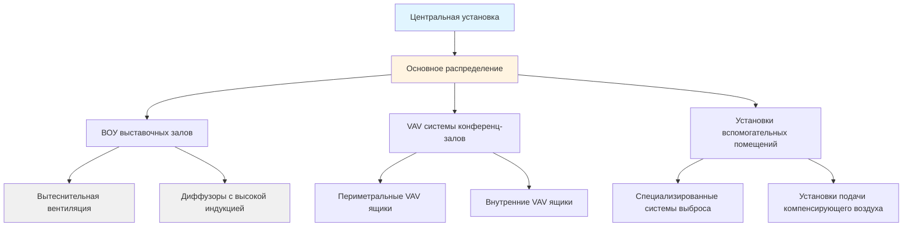

Конференц-центры представляют уникальные вызовы для HVAC из-за их огромного масштаба, функционального разнообразия и непредсказуемых паттернов занятости. Эти учреждения требуют систем, способных кондиционировать выставочные залы площадью свыше 9 290 м², одновременно обслуживая меньшие конференц-залы и поддерживая эффективность при широко варьирующихся условиях нагрузки.

## Физические характеристики и тепловые вызовы

Конференц-центры имеют исключительно высокие потолки (обычно 9–18 м в выставочных залах), создавая значительные эффекты стратификации. Температурный градиент в этих пространствах соответствует:

$$T(z) = T_{\text{пол}} + \beta z$$

где $\beta$ представляет температурный градиент (обычно 0,3–1,2°C на метр высоты) и $z$ — вертикальное расстояние. Эта стратификация усложняет расчеты нагрузок, так как температуры в зоне занятости значительно отличаются от средних температур пространства.

Соотношение нагрузки ограждающей конструкции к нагрузке от занятости резко варьируется в зависимости от функции пространства. Выставочные залы с большими остекленными фасадами могут испытывать нагрузки ограждающей конструкции 455–680 кДж/(ч·м²), тогда как внутренние конференц-залы зависят от занятости при 910–1 365 кДж/(ч·м²) во время пиковой нагрузки.

## Стратегия многозонного проектирования

Конференц-центры требуют разделения зон для обработки фундаментальной разницы между периметральными выставочными пространствами и внутренними конференц-залами. Эффективная стратегия зонирования распознает три отчетливых термальных режима:

**Зоны выставочных залов**
- Большие открытые объемы с минимальным внутренним разделением
- Переменная занятость: 0–1,4 м²/человека в зависимости от типа события
- Нагрузки оборудования: 32–86 Вт/м² от дисплеев, освещения и электроники
- Периоды подготовки с минимальными требованиями охлаждения

**Зоны конференц-залов**
- Разделенные пространства с реконфигурируемыми перегородками
- Плотная занятость: 0,9–2,3 м²/человека во время сеансов
- Высокие требования вентиляции согласно ASHRAE 62.1
- Одновременные спросы на отопление и охлаждение на смежных участках

**Зоны вспомогательных помещений**
- Грузовые платформы, требующие полного выброса и подачи компенсирующего воздуха
- Зоны пищевых услуг с жиросодержащим выбросом
- Внутренние служебные пространства с умеренными требованиями

## Проектирование центральной установки и разнообразие нагрузок

Центральные установки конференц-центров используют разнообразие нагрузок охлаждения в нескольких выставочных пространствах. Коэффициент совпадения для нагрузок охлаждения редко превышает 0,65–0,75, что означает, что установленная мощность установки может быть существенно меньше суммы пиковых нагрузок отдельных зон.

Разнообразная нагрузка охлаждения выражается как:

$$Q_{\text{всего}} = F_d \sum_{i=1}^{n} Q_{i,\text{пик}}$$

где $F_d$ — коэффициент разнообразия (0,65–0,75) и $Q_{i,\text{пик}}$ представляет пиковые нагрузки отдельных зон. Для учреждения с суммированными пиковыми нагрузками зон 2 110 кВт фактическая мощность установки может быть 1 405–1 580 кВт.

### Типичная конфигурация центральной установки

| Компонент | Диапазон мощности | Конфигурация | Уровень избыточности |
|-----------|---------------|---------------|------------------|
| Холодильные машины | 2 810–10 550 кВт всего | 3–5 единиц параллельно | N+1 минимум |
| Градирни | 125% отвода тепла холодильной машиной | Несколько секций | На холодильную машину |
| Основные насосы | 9,5–11,4 л/(с·кВт) | Специализированные на холодильную машину | Встроенные |
| Вторичные насосы | Переменный расход | 2–4 с переменной скоростью | N+1 |
| Котлы | 60–80% от нагрузки отопления | 2–3 единицы | N+1 |

Первичное-вторичное насосное устройство отделяет производство от распределения, критически важное для поддержания расхода холодильной машины при изменяющихся спросах зон. Вторичный расход варьируется от 20–100% на основе положений клапанов по всему учреждению.

## Распределение воздуха для выставочных залов с высокими потолками

Обычные системы верхнего смешивания тратят энергию на нагрев или охлаждение массивного незанятого объема выше 2,4–3,0 м. Два превосходных подхода решают эту проблему:

**Вытеснительная вентиляция**
Подача воздуха при 17–19°C вблизи уровня пола через диффузоры с низкой скоростью. Естественная конвекция от источников тепла (люди, оборудование) создает восходящие потоки, переносящие загрязняющие вещества к возвратным/выпускным точкам на уровне потолка. Эта стратегия снижает энергию охлаждения на 15–25% по сравнению с верхним смешиванием и одновременно улучшает качество воздуха в зоне занятости.

Скорость потока, управляемая плавучестью, приближается к:

$$v = \sqrt{\frac{2g \Delta T H}{T_{\text{ср}}}}$$

где $g$ — ускорение свободного падения, $\Delta T$ — разница температур, управляющая стратификацией, и $H$ — характеристическая высота.

**Диффузоры с высокой индукцией**
Потолочные диффузоры с высокими скоростями выброса (7,6–12,7 м/с) и коэффициентами индукции 8:1 до 12:1 захватывают комнатный воздух, создавая смешанный поток подачи, который спускается в зону занятости перед значительным затуханием температуры. Этот подход эффективно работает с более низкими количествами подачи воздуха, чем традиционные системы смешивания.

## Требования вентиляции и управление CO₂

ASHRAE 62.1 определяет скорости вентиляции для пространств собраний на основе плотности занятости. Для конференц-центров:

- Выставочные залы: 0,03 CFM (0,051 м³/ч)/м² + 2,4 CFM (4,1 м³/ч)/человека
- Конференц-залы: 0,03 CFM (0,051 м³/ч)/м² + 2,4 CFM (4,1 м³/ч)/человека
- Зоны собраний (плотные): 0,03 CFM (0,051 м³/ч)/м² + 2,4 CFM (4,1 м³/ч)/человека

При пиковой занятости (1,4 м²/человека) конференц-залы требуют доли наружного воздуха, превышающей 35–40%. Управляемая спросом вентиляция, использующая датчики CO₂, обеспечивает существенную экономию энергии во время периодов частичной занятости, которые представляют большую часть рабочих часов.

Соотношение концентрации CO₂ в пространстве:

$$C_{\text{пространство}} = C_{\text{наружный}} + \frac{G}{V_{\text{oa}}}$$

где $G$ — скорость генерации CO₂ (0,14–0,19 CFM (0,24–0,32 м³/ч) на человека) и $V_{\text{oa}}$ — скорость вентиляции наружным воздухом. Поддержание 1000–1200 ppm обычно требует рассчитанных количеств наружного воздуха.

## Стратегии энергоэффективности

**Переменный первичный расход**
Современные центральные установки исключают постоянные первичные контуры в пользу переменного первичного расхода (VPF), где насосы, специализированные для холодильных машин, модулируют на основе общего спроса системы. Это снижает энергию насоса на 30–50% годовых по сравнению с первичными-вторичными устройствами с постоянным первичным расходом.

**Экономайзер со стороны воды**
Во время прохладных условий окружающей среды (обычно ниже 10–13°C по влажному термометру) градирни могут обеспечивать охлажденную воду непосредственно, минуя холодильные машины полностью. Годовая экономия энергии 15–25% достижима в умеренных климатах.

**Тепловое аккумулирование энергии**
Аккумулирование льда или охлажденной воды сдвигает производство охлаждения на внепиковые ночные часы, уменьшая плату за спрос и обеспечивая меньшую мощность холодильной машины через выравнивание нагрузки. Накопленная энергия:

$$E = m c_p \Delta T \quad \text{(явная)} \quad \text{или} \quad E = m h_{fg} \quad \text{(скрытая)}$$

Для ледяного аккумулирования скрытая теплота плавления ($h_{fg}$ = 335 кДж/кг) обеспечивает исключительно высокую энергетическую плотность.

## Круглосуточная подготовка и разборка операций

Конференц-центры работают непрерывно во время смены событий. Бригады подготовки работают ночью, устанавливая павильоны, пока одновременные события занимают другие зоны. Это требует:

- Независимого управления зонами, предотвращающего помехи кондиционирования между активными выставочными пространствами и зонами подготовки
- Поддержания минимальной вентиляции в незанятых выставочных залах (0,03 CFM (0,051 м³/ч)/м²) для безопасности бригады
- Гибкости в расписании, позволяющей выборочную активацию зон без эксплуатации всех воздухообрабатывающих устройств
- Интеграции освещения и HVAC, где подготовительное освещение автоматически запускает минимальное кондиционирование

Во время периодов подготовки нагрузки падают до 10–20% уровней событий, но системы должны поддерживать минимальный расход воздуха для вентиляции и пресс-релиза пространства. VAV системы с коэффициентами ограничения 10:1 или выше обеспечивают это без вентиляторных ящиков уровня зон.

## Пресс-релиз и контроль дыма

Большие выставочные залы требуют осторожного пресс-релиза относительно внешних и смежных пространств. Положительное давление 0,005–0,012 кПа предотвращает инфильтрацию через ограждающую конструкцию здания, избегая затруднений при открытии дверей.

Системы контроля дыма для этих больших объемов обычно применяют один из двух подходов:

1. **Зонированный контроль дыма** разделяющий пространство с развертываемыми барьерами и выборочным выбросом
2. **Механический выброс на высоком уровне** используя специализированные вентиляторы выброса дыма, рассчитанные на 4–6 воздухообмена в час

Обе стратегии должны координироваться с системами пожарной сигнализации и соответствовать требованиям NFPA 92 для больших объемов пространства.

---

**Файл:** `/Users/evgenygantman/Documents/github/gantmane/hvac/content/specialty-applications-testing/specialty-hvac-applications/places-of-assembly/convention-centers/_index.md`

Это содержание обеспечивает физико-основанный анализ систем HVAC конференц-центров, охватывая фундаментальные тепловые вызовы, стратегии многозонного проектирования, оптимизацию центральной установки и операционную гибкость, требуемую для этих сложных учреждений.
