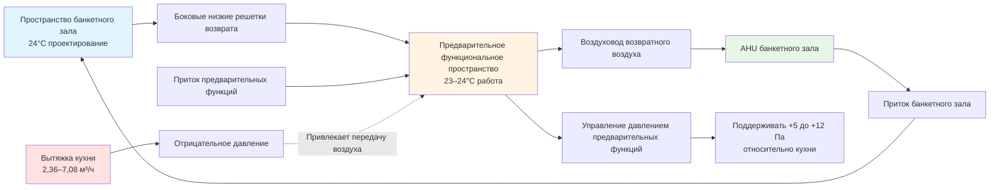

## Основы проектирования HVAC банкетного зала

Банкетные залы представляют исключительные проблемы HVAC из-за экстремальных колебаний плотности занятости (50–500 человек на 92,9 м²), конфигураций делимых пространств, требующих независимого управления зонами, высоких потолков, вызывающих тепловое расслоение, и соседства с кухнями, имеющими интенсивные выбросы. Основная инженерная задача заключается в проектировании систем, которые эффективно обрабатывают конфигурации банкетов, генерирующие 73–88 кДж/ч на человека, в сравнении с танцевальными мероприятиями, производящими 161–234 кДж/ч на человека, при сохранении приемлемых условий комфорта в высоких потолках высотой 5,5–8,5 м.

Успешное проектирование HVAC банкетного зала требует координации между расположением воздушных перегородок, местоположением люстр, определяющим ограничения распределения воздуха, интеграцией предварительных функциональных пространств для получения преимуществ разнородности нагрузки и приточным воздухом из кухни, который может перегрузить давление в банкетном зале при неправильном проектировании.

```mermaid
graph TD
    A[Система HVAC банкетного зала] --> B[Зоны делимого пространства]
    A --> C[Адаптивность конфигурации]
    A --> D[Контроль вертикального расслоения]
    A --> E[Интеграция смежных пространств]

    B --> B1[Независимый AHU на зону]
    B --> B2[Герметизация воздушной перегородки]
    B --> B3[Изолирующие заслонки зон]
    B --> B4[Индивидуальное управление DDC]

    C --> C1[Режим банкета<br/>73–88 кДж/ч·чел]
    C --> C2[Режим танца<br/>161–234 кДж/ч·чел]
    C --> C3[Театральные места<br/>66–73 кДж/ч·чел]
    C --> C4[Прием стоя<br/>117–146 кДж/ч·чел]

    D --> D1[Контроль температуры приточного воздуха]
    D --> D2[Расчет дальности отпуска]
    D --> D3[Компенсация высоты потолка]
    D --> D4[Помехи люстры]

    E --> E1[Возвратный воздух предварительных функций]
    E --> E2[Приток из кухни]
    E --> E3[Изоляция сервисного коридора]
    E --> E4[Вестибюль погрузочной платформы]

    style A fill:#e1f5ff
    style C fill:#fff4e1
    style D fill:#ffe1e1
    style E fill:#e8f5e9
```

## Конфигурации занятости и разнородность нагрузки

Выделение явного и скрытого тепла в банкетном зале значительно варьируется в зависимости от типа деятельности и плотности посадки. Понимание этих вариаций нагрузки критически важно для определения размеров системы и разработки стратегии управления.

| Конфигурация | Плотность занятости | Явное тепло | Скрытое тепло | Всего на человека | Вентиляция согласно ASHRAE 62.1 |
|---------------|------------------|---------------|-------------|------------------|----------------------------|
| Банкет сидя | 0,93–1,40 м²/чел | 51 кДж/ч | 22 кДж/ч | 73 кДж/ч | 3,54 м³/ч на чел |
| Театр сидя | 0,65–0,93 м²/чел | 48 кДж/ч | 18 кДж/ч | 66 кДж/ч | 3,54 м³/ч на чел |
| Класс сидя | 1,40–1,86 м²/чел | 48 кДж/ч | 18 кДж/ч | 66 кДж/ч | 3,54 м³/ч на чел |
| Прием стоя | 0,56–0,74 м²/чел | 80 кДж/ч | 51 кДж/ч | 131 кДж/ч | 3,54 м³/ч на чел |
| Танцевальная активность | 0,93–1,12 м²/чел | 102 кДж/ч | 117 кДж/ч | 219 кДж/ч | 9,44 м³/ч на чел |

Скорость выделения тепла во время танца приближается к уровням легкой физической активности, с метаболическими скоростями достигающими 117–132 кДж/ч и долями скрытого тепла, превышающими 50%. Это создает две различные проблемы проектирования:

**Емкость явного охлаждения:** Режим танца требует в 2,5–3 раза больше явного охлаждения, чем банкет. Системы должны справляться с этой вариацией без чрезмерных количеств приточного воздуха при низких нагрузках.

**Емкость удаления влаги:** Танцевальные мероприятия генерируют высокие влажностные нагрузки, требующие температур точки конденсации на аппарате на 3–4°C ниже, чем при банкетах. Одного контроля переменной скорости вентилятора недостаточно для решения этой проблемы.

### Расчет нагрузки для делимых банкетных залов

Для делимых банкетных залов с управляемыми воздушными перегородками каждая зона должна рассчитываться независимо, исходя из наихудшей занятости. Установленная общая емкость превышает разнородную общую нагрузку банкетного зала:

$$Q_{total} = \sum_{i=1}^{n} Q_{zone,i} > Q_{ballroom} \times f_{diversity}$$

Где:
- $Q_{zone,i}$ = Отдельная емкость проектирования зоны (кДж/ч)
- $Q_{ballroom}$ = Емкость целого банкетного зала, если не разделен (кДж/ч)
- $f_{diversity}$ = Коэффициент разнородности (обычно 0,85–0,95 для конгресс-центров)

Этот подход без разнородности гарантирует приемлемые условия, когда воздушные перегородки делят пространство на отдельно занимаемые зоны с одновременно происходящими различными типами мероприятий (типичный сценарий: банкет в одной секции, танцы в соседней).

## Зонирование делимого банкетного зала и координация перегородок

Воздушные перегородки создают акустические и тепловые барьеры, делящие большие банкетные залы на 2–4 меньших пространства. Системы HVAC должны поддерживать независимость зон, избегая передачи воздуха через зазоры перегородок, которая ухудшает акустическую изоляцию и управление температурой зоны.

### Утечка воздуха через воздушную перегородку

Управляемые перегородки достигают рейтингов Sound Transmission Class (STC) 50–55 при надлежащей герметизации, но требуют управления дифференциалом положительного давления для предотвращения передачи воздуха. Утечка воздуха через уплотнения перегородок следует принципам потока через отверстие:

$$Q_{leak} = C_d \times A_{gap} \times \sqrt{\frac{2 \times \Delta P}{\rho}}$$

Где:
- $Q_{leak}$ = Утечка потока воздуха (м³/ч)
- $C_d$ = Коэффициент расхода (0,6–0,65 для уплотнений перегородок)
- $A_{gap}$ = Эффективная площадь зазора (м²)
- $\Delta P$ = Дифференциал давления через перегородку (Па)
- $\rho$ = Плотность воздуха (кг/м³)

Для поддержания акустической целостности дифференциал давления через перегородки не должен превышать 5–8 Па. Это требует точной балансировки приточного и возвратного потока воздуха для каждой зоны, обычно с использованием управляемых модулирующих заслонок DDC, которые поддерживают уставки статического давления зоны ±1,25 Па.

### Стратегия управления независимостью зон

Каждый делимый раздел требует:

1. **Выделенный воздухоприемный агрегат или зональные теплообменники:** Независимое управление температурой предотвращает тепловую передачу через утечки перегородок
2. **Изолирующие заслонки зон:** Автоматические заслонки в приточных и возвратных воздуховодах закрываются при объединении зон, предотвращая дисбаланс потока воздуха
3. **Контроль давления:** Датчики статического давления проверяют изоляцию зон и активируют условия тревоги, если дифференциалы давления превышают пределы
4. **Координированное управление экономайзером:** Заслонки наружного воздуха модулируют вместе во всех зонах для предотвращения дифференциалов давления между зонами

Последовательность управления должна решать переходы режима (объединенный к разделенному операционному состоянию) путем постепенного изменения уставок зоны и потоков воздуха для предотвращения переходных процессов давления, которые генерируют слышимый шум воздуха через уплотнения перегородок.

## Тепловое расслоение в помещениях с высокими потолками

Высота потолка банкетного зала 5,5–8,5 м создает значительное тепловое расслоение, которое уменьшает эффективную емкость охлаждения и увеличивает требования к размерам оборудования. Накопление теплого воздуха вблизи потолка представляет "потерянную" охлаждающую емкость, которая не способствует комфорту в занятой зоне.

### Расчет расслоения

Температурный градиент в пространстве с внутренним теплопритоком и высокими потолками можно приблизительно выразить:

$$\frac{dT}{dz} \approx \frac{Q_{internal}}{A_{floor} \times \rho \times c_p \times v_z}$$

Где:
- $dT/dz$ = Температурный градиент (°C/м)
- $Q_{internal}$ = Внутренние тепловыделения (кДж/ч)
- $A_{floor}$ = Площадь пола (м²)
- $v_z$ = Средняя вертикальная скорость воздуха (м/ч)
- $\rho$ = Плотность воздуха (кг/м³)
- $c_p$ = Удельная теплоемкость воздуха (кДж/кг·°C)

При типичных условиях банкетного зала с минимальным движением воздуха температурные градиенты 0,3–0,9°C на метр высоты являются распространенными, что приводит к температурам потолка на 5–14°C выше температуры занятой зоны. Этот расслоенный воздух содержит значительное явное тепло, которое должно быть заменено дополнительным охлаждением.

### Стратегии смягчения расслоения

**Приточный воздух с высокой скоростью:** Скорость сопел 7,6–12,7 м/с на выходах приточного воздуха создает турбулентное смешивание и захватывание воздуха в помещении, которое предотвращает расслоение. Дальность отпуска должна достигать 75–90% размера пространства:

$$L_{throw} = V_o \times \frac{T_o}{50} \times K_{trajectory}$$

Где:
- $L_{throw}$ = Дальность отпуска до скорости 0,42 м/с (м)
- $V_o$ = Начальная скорость выпуска (м/ч)
- $T_o$ = Эффективный диаметр выпуска (см)
- $K_{trajectory}$ = Коэффициент коррекции траектории (0,8–1,2 в зависимости от монтажа)

Для потолка высотой 7,3 м с периметральными боковыми диффузорами дальность отпуска к центру помещения должна быть 12–15 м, требующая скоростей выпуска 600+ м/ч.

**Дифференциал температуры приточного воздуха:** Более холодный приточный воздух (7–9°C ниже температуры в помещении) увеличивает плотность воздуха, вызывая нисходящую проекцию, которая противодействует естественному расслоению. Однако чрезмерные дифференциалы температуры создают холодные сквозняки в занятой зоне и требуют контроля влаги для предотвращения конденсации на диффузорах.

**Координация люстр:** Декоративные люстры создают физические препятствия для воздушных потоков. Выходы приточного воздуха должны располагаться, чтобы избежать прямого воздействия на элементы люстры, сохраняя при этом адекватную дальность отпуска. Это часто требует индивидуальных компоновок распределения воздуха, согласованных с дизайнерами освещения на ранних этапах проектирования.

## Интеграция приточного воздуха из кухни

Банкетные залы, смежные с кухнями общественного питания, должны обеспечивать приточный воздух для вытяжек кухни, которые могут вытягивать 2,36–7,08 м³/ч в зависимости от типа оборудования и разнородности. Неправильно интегрированные системы приточного воздуха создают дисбалансы давления, влияющие на комфорт в банкетном зале и работу дверей.

### Требования емкости приточного воздуха

Вытяжки кухни типа I (оборудование, производящее жир) требуют скоростей вытяжки на основе производительности оборудования и конфигурации вытяжки согласно ASHRAE 154:

| Тип вытяжки | Скорость вытяжки | Типичный приточный воздух |
|-----------|--------------|-------------------|
| Навесная вытяжка на стене | 99–141 м³/ч на метр длины | 80–90% от вытяжки |
| Одиночная островная навес | 141–188 м³/ч на метр длины | 80–90% от вытяжки |
| Двойная островная навес | 188–235 м³/ч на метр длины | 80–90% от вытяжки |
| Задняя полка/проходная | 56–94 м³/ч на метр длины | 80–90% от вытяжки |

Оставшиеся 10–20% представляют инфильтрацию через двери и передачу воздуха из смежных пространств. Банкетные залы не должны обеспечивать более 25–30% общего приточного воздуха кухни для предотвращения чрезмерных нагрузок на давление.

### Влияние на давление в банкетном зале

Когда работает вытяжка кухни, объект испытывает отрицательное давление, если не предусмотрен адекватный приточный воздух. Отношение давления следует:

$$\Delta P_{building} = \frac{(Q_{supply} - Q_{exhaust})^2 \times \rho}{2 \times C_d^2 \times A_{leakage}^2}$$

Этот дифференциал давления влияет на работу дверей банкетного зала (двери становятся трудно открывать при дифференциале давления, превышающем 37 Па) и могут вызвать передачу воздуха из предварительных функциональных пространств или внешнюю инфильтрацию.

Предпочтительное решение обеспечивает выделенные установки приточного воздуха кухни с предварительным подогревом и минимальным охлаждением, расположенные для выпуска непосредственно в кухонное окружение. Системы банкетного зала поддерживают небольшое положительное давление (5–12 Па) относительно кухонных пространств, предотвращая кухонные запахи от попадания в банкетный зал, позволяя контролируемый передачу воздуха через сервисные коридоры.

## Интеграция предварительных функциональных пространств

Предварительные функциональные области (вестибюли, фойе и коридоры, смежные с банкетными залами) предлагают преимущества разнородности нагрузки и возможности интеграции возвратного воздуха, но требуют тщательного управления отношением давления.

Предварительные функциональные пространства обычно работают при более низкой плотности занятости (2,8–4,6 м²/человека) с более низкими теплопритоками, создавая разнородность охлаждающей нагрузки. Некоторые проекты банкетных залов используют предварительные функциональные пространства как пленумы возвратного воздуха, с низкими боковыми решетками возвратного воздуха, которые собирают воздух для возврата в воздухоприемные агрегаты банкетного зала. Этот подход предоставляет несколько преимуществ:

- **Сокращенная воздуховодная система:** Исключает необходимость обширной воздуховодной системы возвратного воздуха в потолке банкетного зала
- **Улучшенное распределение воздуха:** Более длинный путь потока воздуха через пространство улучшает смешивание
- **Акустическое смягчение:** Снижает шум возвратного воздуха, передаваемый в банкетный зал
- **Разнородность нагрузки:** Предварительные функциональные нагрузки частично компенсируются использованием пространства как плениума возвратного воздуха

Основное ограничение проектирования — поддержание приемлемых температур в предварительных функциональных пространствах при использовании в качестве плениума возвратного воздуха. Предварительные функциональные области требуют дополнительного охлаждения, когда температуры возвратного воздуха банкетного зала превышают условия проектирования предварительных функциональных пространств.

## Выбор системы и поэтапность емкости

Системы HVAC банкетного зала должны эффективно справляться с широким диапазоном нагрузок между минимальной занятостью (подготовка/уборка на 10–20% проектной нагрузки) и пиковыми танцевальными мероприятиями (100–120% проектной нагрузки банкета). Системы с единственной емкостью циклируют чрезмерно при низких нагрузках, создавая колебания температуры и влажности.

### Рекомендуемые конфигурации системы

**Переменный объем воздуха (VAV) с зональным подогревом:** Каждый делимый раздел получает выделенные VAV терминалы с горячей водой или электрическим подогревом. Поток приточного воздуха модулируется от 30–40% минимума до 100% максимума, поддерживая надлежащее распределение воздуха при всех условиях нагрузки. Этот подход обеспечивает хорошую эффективность при частичной нагрузке и отличное управление зонами.

**Несколько небольших воздухоприемных агрегатов:** Вместо одного большого AHU, обслуживающего весь банкетный зал, 2–4 меньших агрегата обслуживают отдельные зоны. Агрегаты поэтапно включаются/выключаются на основе нагрузки с ротацией свинца и отставания. Это обеспечивает встроенную поэтапность емкости и поддерживает высокую эффективность оборудования при частичной нагрузке.

**Переменная скорость привода с многоступенчатым охлаждением:** Один большой AHU с приводом переменной частоты вентилятора и 2–3 ступени прямого охлаждения или клапана охлажденной воды с двумя ходами. Обеспечивает экономичное решение для меньших банкетных залов (<929 м²), где делимые зоны не требуются.

Общая емкость системы должна быть основана на одновременной танцевальной занятости при условиях проектирования, даже если это представляет редкий наихудший сценарий. Попытка определить размер для "средних" условий приводит к недостаточной емкости во время пиковых мероприятий, которые генерируют наибольше жалобы клиентов и влияют на доход.

---

## Компоненты

- Проектирование делимого банкетного зала
- Интеграция воздушной перегородки
- Индивидуальное управление зоной
- Емкость банкетного зала 14–280 м³/ч
- Конфигурация банкетной посадки
- Конфигурация театральной посадки
- Конфигурация классной комнаты
- Конфигурация приема стоя
- Координация смежности с кухней
- Близость к погрузочной платформе
