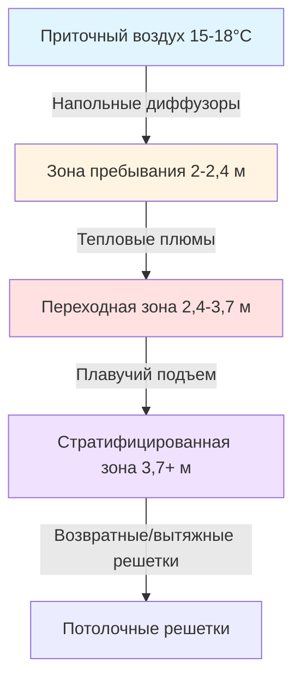
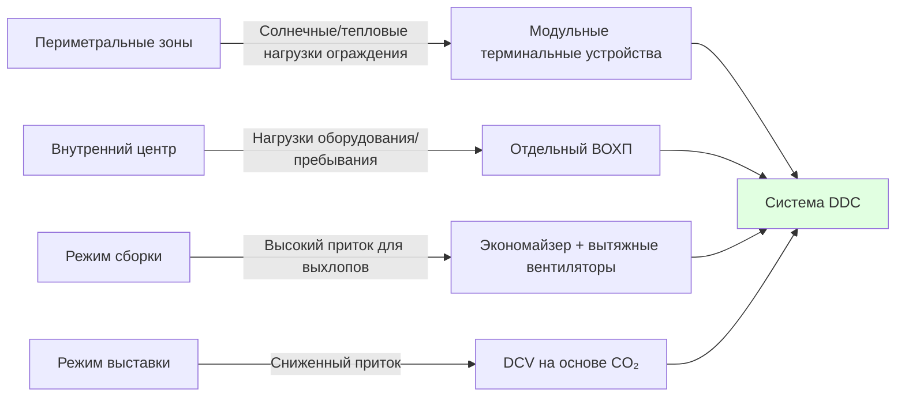

## Физические характеристики выставочных залов

Выставочные залы создают уникальные проблемы для систем HVAC из-за их масштаба и переменных режимов эксплуатации. Типичные объекты варьируются от 4 650 до 46 500 м² с высотой потолка от 6 до 12 м. Безколонное решение максимизирует гибкость планировки, но исключает возможность размещения распределенной механической инфраструктуры в кондиционируемом пространстве.

Тепловая обстановка в этих помещениях определяется тремя различными режимами работы: сборка (высокие нагрузки от выхлопов оборудования), активная выставка (высокая плотность людей и оборудования стендов) и разборка (переходные режимы работы оборудования). Каждый режим имеет принципиально различные профили нагрузок, требующие адаптивных стратегий управления.

## Анализ тепловых нагрузок

### Базовые нагрузки здания

Удельная чувствительная охлаждающая нагрузка соответствует стандартным требованиям ASHRAE 90.1 по ограждающим конструкциям, однако большая площадь создает значительные солнечные теплопритоки через световые люки или фасадные системы. Для зала с 15% площадью световых люков и U-значением 2,56 Вт/(м²·К):

$$q_{solar} = A_{glazing} \times SHGC \times I_{peak} \times CLF$$

Где коэффициент теплопередачи через остекление (SHGC) обычно находится в диапазоне 0,25–0,35 для соответствующего нормам остекления, а пиковое падающее излучение $I_{peak}$ достигает 790–950 Вт/м² в зависимости от ориентации и широты.

### Тепловые нагрузки от оборудования стендов

Оборудование стендов генерирует основную внутреннюю нагрузку во время активной выставки. Типичные конфигурации стендов включают:

| Тип оборудования | Плотность нагрузки | Цикл работы | Эффективная нагрузка |
|------------------|-------------------|------------|----------------------|
| Мониторы дисплея (LED) | 40–60 Вт/шт. | 100% | 47–225 кДж/ч |
| Галогенные прожекторы | 75–150 Вт/светильник | 80% | 256–482 кДж/ч |
| Демонстрационное оборудование | 500–2000 Вт/стенд | 40–60% | 720–4728 кДж/ч |
| Холодильные витрины | 1200–1800 Вт/шт. | 90% | 3888–5184 кДж/ч |

Для оценки нагрузок ASHRAE рекомендует 160–270 Вт/м² для стандартных стендов и 320–540 Вт/м² для технологически насыщенных выставок. Коэффициент разнообразия по всему залу варьируется от 0,6 до 0,8 в зависимости от типа выставки.

Общая нагрузка выставки:

$$Q_{total} = Q_{envelope} + Q_{lighting} + Q_{occupants} + (Q_{booth} \times DF)$$

Где коэффициент разнообразия $DF$ учитывает неодновременную работу оборудования стендов.

### Нагрузки при сборке и разборке

Во время сборки выхлопы погрузчиков и автомобилей создают значительные нагрузки загрязняющих веществ. Типичный пропановый погрузчик грузоподъемностью 3600 кг генерирует приблизительно:

- Чувствительное тепло: 30–35 МВт
- CO₂: 0,36–0,54 кг/ч
- CO: 0,068–0,113 кг/ч

Для зала площадью 9300 м² с 10–15 активными погрузчиками во время сборки требования к вентиляции составляют:

$$Q_{vent} = \frac{G_{CO}}{C_{outdoor} - C_{indoor,max}} \times 60$$

Где $G_{CO}$ представляет общую скорость выработки монооксида углерода, а $C_{indoor,max}$ – предельно допустимую концентрацию ACGIH (35 ppm при 8-часовой экспозиции, обычно проектируют на 25 ppm).

Этот расчет часто дает требования к наружному воздуху в 2,5–4,0 воздухообмена в час во время сборки, что значительно превышает 0,3–0,6 воздухообмена, необходимые во время выставок.

## Стратегии распределения воздуха

### Системы потолочного распределения

Традиционные системы используют высокоиндукционные диффузоры, установленные на высоте 5,5–7,6 м над чистовым полом. Расстояние подачи для адекватного смешивания в безколонном пространстве требует:

$$L_{throw} = K \times \sqrt{Q_{supply}}$$

Где $K$ зависит от геометрии диффузора (обычно 1,8–2,4 для высокоиндукционных линейных диффузоров) и $Q_{supply}$ – производительность диффузора в CFM.

Основная проблема – тепловая стратификация. Температурный градиент в помещении высотой 9 м может достигать:

$$\frac{dT}{dz} = \frac{q_{internal}}{k_{effective} \times A_{floor}} + \frac{g}{c_p} \times \left(\frac{1}{T_{avg}}\right)$$

Этот градиент часто создает разницу температур 4–7°C между зоной пребывания и зоной потолка, снижая эффективность охлаждения на 15–25%.

### Подпольная система воздухораздачи (UFAD)

Системы UFAD подают кондиционированный воздух через напольные диффузоры или траншейные системы, используя естественную плавучесть для удаления загрязняющих веществ. Физика вытеснительной вентиляции создает четкие слои стратификации:

Высота стратификации $h_s$ может быть предсказана из:

$$h_s = 1.2 \times \left(\frac{q_{heat}}{n \times \rho \times c_p \times \Delta T}\right)^{1/3}$$

Где $n$ – количество источников тепла (количество стендов), а $\Delta T$ – разница температур между приточным воздухом и помещением.

UFAD обеспечивает превосходную производительность для выставочных залов потому что:

1. Подача охлаждения непосредственно на уровень пребывания/стендов
2. Естественное удаление тепла и загрязняющих веществ через тепловые плюмы
3. Сниженное энергопотребление вентилятора (более низкое статическое давление, 20–30 Па в сравнении с 600–840 Па потолочных систем)
4. Упрощенные временные коммунальные подключения на уровне пола

### Проектирование напольной системы распределения

Траншейные системы, интегрированные в конструктивную плиту, обеспечивают наиболее гибкое решение. Ключевые параметры проектирования:

| Параметр | Значение проектирования | Основание |
|----------|------------------------|----------|
| Расстояние траншей | 6–9 м м.о. | Максимальное расстояние подачи при скорости на выходе 2,5 м/с |
| Скорость подачи | 2–3 м/с | Баланс между потерей давления и шумом (NC 35–40) |
| Скорость на выходе диффузора | 1–1,5 м/с | Минимизация сквозняков в зоне пребывания |
| Температура приточного воздуха | 15–18°C | Обеспечение комфорта при достаточном ΔT |

## Временные коммунальные подключения

Коммунальные услуги стендов выставок требуют трехфазного питания 480 В, холодной воды, а все чаще – сжатого воздуха и передачи данных. Система HVAC должна обеспечивать подключения на уровне стенда без нарушения распределения воздуха.

Планирование плотности подключений:

$$N_{connections} = \frac{A_{floor}}{A_{booth,avg}} \times f_{utility}$$

Где $f_{utility}$ – доля стендов, требующих подключений HVAC (обычно 0,05–0,15 для технологических выставок).

Быстроразъемные муфты с интервалом 6–9 м позволяют экспонентам подключаться к воздухораспределительной плене для точечного охлаждения или специального контроля температуры стенда. Каждое подключение должно включать:

- Регулирующий клапан, независимый от давления (сохранение баланса системы)
- Ограничительное отверстие расхода (максимум 0,5–1,5 л/м² в час)
- Доступ съемного фильтра (предотвращение занесения загрязняющих веществ)

## Зонирование и стратегии управления

Большая площадь пола требует нескольких зон управления, однако открытая планировка исключает физическое разделение. Эффективное зонирование основывается на:

Режим сборки требует 100% наружного воздуха при работе погрузчиков с выделенными вытяжными вентиляторами, обеспечивающими расход в 1,1–1,3 раза от приточного для создания отрицательного давления (предотвращение миграции в смежные помещения).

Режим выставки переходит на управляемую вентиляцию, модулирующую приток наружного воздуха на основе измеренного уровня CO₂ (сохранение ниже 1000 ppm). Это снижает охлаждающие нагрузки на 30–45% в сравнении с постоянной высокой вентиляцией.

## Планирование мощности и определение размера оборудования

Полная мощность системы должна обеспечивать пиковую нагрузку выставки плюс коэффициент безопасности для экстремальных событий:

$$Q_{design} = 1.15 \times \left[Q_{envelope,peak} + Q_{lighting} + (Q_{occupants} \times DF_{occ}) + (Q_{booth,max} \times DF_{booth})\right]$$

Коэффициент безопасности 15% учитывает необычные выставки (автомобильные выставки с работающими транспортными средствами, пищевые выставки с оборудованием для готовки). Типичные расчетные мощности варьируются от 1580–2280 кВт на 9300 м² для стандартных выставок.

Воздухообрабатывающие устройства должны обеспечивать 0,8–1,2 CFM (1,4–2 м³/ч) на м² для потолочных систем и 0,6–0,9 CFM (1–1,5 м³/ч) на м² для систем UFAD благодаря улучшенной тепловой эффективности. Переключение температуры приточного воздуха на основе нагрузки помещения оптимизирует контроль влажности и потребление энергии.

## Эксплуатационные соображения

Предварительное охлаждение или предварительный обогрев массивной тепловой массы (плиты перекрытия толщиной 300–450 мм, материалы выставки) требует 24–48 часов подготовки перед событиями. Постоянная времени тепловой задержки:

$$\tau = \frac{m \times c_p}{UA_{effective}}$$

Для типичной конструкции дает постоянные времени 18–36 часов, что требует раннего запуска системы для достижения стабильных условий при открытии выставки.
