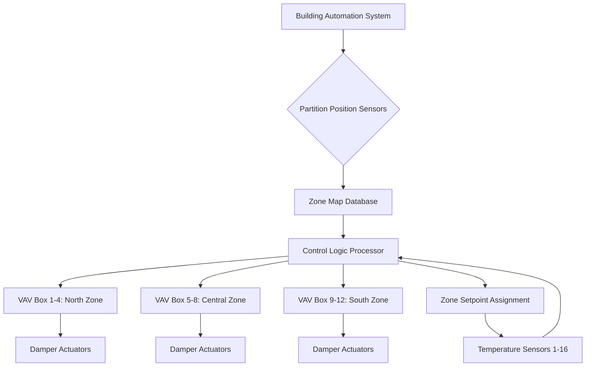
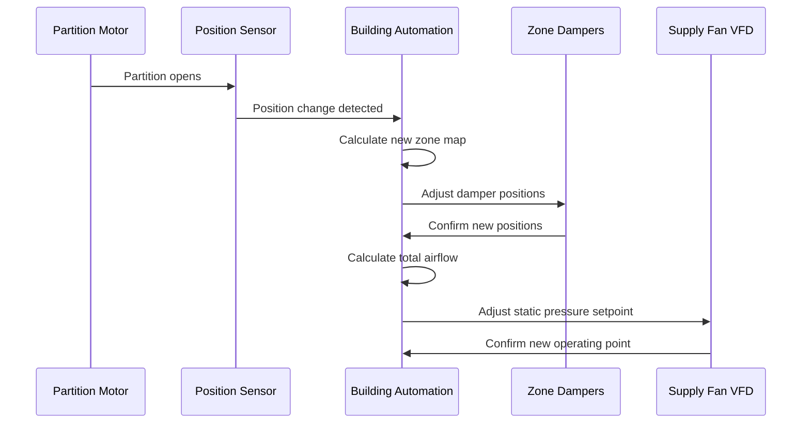

Конференц-центры создают уникальные проблемы HVAC из-за часто переконфигурируемых помещений с помощью передвижных перегородок. Фундаментальная инженерная проблема заключается в поддержании независимого теплового управления для зон, которые изменяют размер и соседство по еженедельному или ежедневному графику. Это требует сложной координации между механическими системами, архитектурой управления и положением перегородок для обеспечения комфорта пассажиров во всех возможных конфигурациях.

## Термодинамические принципы динамического зонирования

Когда передвижные перегородки делят большие конференц-залы, каждое полученное пространство развивает независимые тепловые нагрузки, определяемые:

$$Q_{zone} = Q_{sensible} + Q_{latent} = \rho V c_p \Delta T + \dot{m}_{air} h_{fg} \Delta \omega$$

Где чувствительная и скрытая составляющие варьируются резко в зависимости от плотности занятости, осветительных нагрузок и использования оборудования в каждом разделенном пространстве. Критическая инженерная проблема возникает, когда смежные зоны требуют одновременного отопления и охлаждения из-за различных внутренних нагрузок или солнечного облучения.

Тепловая постоянная времени зоны влияет на отклик управления при переконфигурации:

$$\tau = \frac{m_{air} c_p}{UA_{envelope} + \dot{m}_{supply} c_p}$$

Более крупные объединенные зоны имеют более длительные постоянные времени (20-45 минут), а разделенные пространства реагируют быстрее (8-15 минут), требуя от систем управления динамически адаптировать параметры коэффициента усиления.

## Архитектура отображения зон VAV

Гибкие системы зонирования используют стратегии отображения зон, которые разделяют физические клапаны VAV и контрольные зоны. Зал площадью 3700 м² может содержать 16 коробок VAV, обслуживающих 64 возможные конфигурации зон.

### Алгоритмы присвоения зон

Системы управления используют алгоритмы, зависящие от положения, где входные данные о местоположении перегородки (от магнитных датчиков язычка или ультразвуковых датчиков) запускают переназначение зоны. Система вычисляет эффективную площадь зоны:

$$A_{effective} = \sum_{i=1}^{n} A_{subzone,i} \cdot I_i$$

Где $I_i$ — бинарный индикатор (1, если подзона включена в текущую конфигурацию перегородки, 0, если исключена). Расчет площади обновляет требования к подаче воздуха в реальном времени.

## Требования одновременного отопления и охлаждения

Конференц-центры часто требуют отопления в периметральных зонах при охлаждении центральных зон, особенно в переходные сезоны. Это требует двухканальных или последовательных вентилируемых клапанов VAV с возможностью переточки.

| Тип системы | Независимость отопления/охлаждения | Время отклика зоны | Энергоэффективность | Сложность переконфигурации |
|-------------|------------------------------|-------------------|-------------------|---------------------------|
| Одноканальный VAV с переточкой | Средняя | 12-18 мин | Хорошо | Низкая |
| Двухканальный VAV | Отличная | 8-12 мин | Удовлетворительно | Средняя |
| Последовательный вентилируемый VAV | Отличная | 10-15 мин | Очень хорошо | Низкая |
| Параллельный вентилируемый VAV | Хорошо | 15-20 мин | Хорошо | Низкая |
| Охлаждаемый потолок с DOAS | Средняя | 25-35 мин | Отличная | Высокая |

Энергетический штраф за одновременное отопление и охлаждение следует:

$$E_{penalty} = \dot{m}_{reheat} c_p (T_{reheat} - T_{supply}) + \dot{m}_{cooling} \frac{c_p \Delta T_{cooling}}{COP}$$

Последовательные вентилируемые клапаны минимизируют этот штраф, используя смешивание возвратного воздуха для снижения энергии переточки.

## Стратегии координации зонных заслонок

Гибкое зонирование требует интеллектуальной координации заслонок для предотвращения дисбаланса давления при объединении или разделении зон. Распределение давления по нескольким зонам, использующим общий воздуховод подачи, следует:

$$\Delta P_{total} = \sum_{i=1}^{n} \frac{\dot{V}_i^2}{2} \left(\frac{1}{C_d^2 A_i^2}\right) \rho$$

Когда перегородки открываются для объединения зон, положение заслонок должно переуравновешиться для поддержания расчетных соотношений воздушного потока. Стандарт ASHRAE 90.1 требует понижения VAV до 30% пикового потока, но приложения гибкого зонирования часто указывают возможность понижения на 20% для лучшего управления с частичной нагрузкой.

### Координация отклика заслонок

Последовательность переконфигурации завершается за 45-90 секунд для правильно спроектированных систем. Актюаторы заслонок требуют времени хода 60-120 секунд для предотвращения переходных процессов давления, которые вызывают шум и дискомфорт.

## Требования к гибкости системы управления

Системы управления конференц-центров должны поддерживать несколько режимов работы без изменений программирования. Архитектура управления использует объектно-ориентированный дизайн, где зоны, датчики и клапаны существуют как объекты программного обеспечения с назначаемыми отношениями.

### Размещение датчиков и избыточность

Датчики температуры требуют стратегического размещения для обеспечения точной обратной связи независимо от конфигурации перегородки. Оптимальное расстояние сетки датчиков следует:

$$L_{sensor} = 2.5 \sqrt{\frac{Q_{zone}}{\rho c_p \Delta T_{design}}}$$

Для конференц-пространств с расчетными нагрузками охлаждения 1200-1800 Вт/м², это дает расстояние датчиков 4,5-7,5 м. Беспроводные датчики обеспечивают гибкость установки, хотя время работы батареи (обычно 5-7 лет) требует отслеживания обслуживания.

## Возможности быстрой переконфигурации

Руководство ASHRAE 36 рекомендует системам управления достичь стабильных условий в течение 2 часов после изменения конфигурации. Время установления зависит от тепловой массы и пропускной способности воздушного потока:

$$t_{settle} = -\tau \ln\left(\frac{T_{final} - T_{setpoint}}{T_{initial} - T_{setpoint}}\right)$$

Для подхода на 95% к уставке с $\tau$ = 25 минут, установление требует 75 минут при типичных условиях.

### Метрики производительности переконфигурации

| Метрика | Целевые показатели производительности | Метод измерения |
|--------|-------------------|-------------------|
| Время отклика заслонки | 60-90 секунд | Обратная связь актюатора |
| Стабильность температуры зоны | ±0,6°C в течение 90 мин | Анализ данных тренда |
| Время баланса давления | <2 минут | Датчики дифференциального давления |
| Сходимость контрольного цикла | <5 циклов до стабилизации | Мониторинг выхода PID |
| Задержка обновления базы данных | <5 секунд | Системные логи |

## Лучшие практики для проектирования гибкого зонирования

Проектируйте гибкие системы зонирования с клапанами VAV, рассчитанными на 125-150% пиковой нагрузки зоны, чтобы учесть неопределенность конфигурации. Обеспечьте минимальное соотношение понижения 2:1 для всех клапанов. Установите датчики положения перегородки с прямым жестким соединением для обеспечения надежного отображения зон. Укажите системы управления с проверенными приложениями конференц-центров и встроенной логикой координации перегородок.

Координируйте механические планы с местоположением направляющих перегородок на этапе проектирования, чтобы оптимизировать размещение решеток подачи и возврата для всех предполагаемых конфигураций. Эта предварительная координация предотвращает мертвые зоны и циркуляцию воздуха в обход, которые компрометируют комфорт в определенных конфигурациях перегородок.
