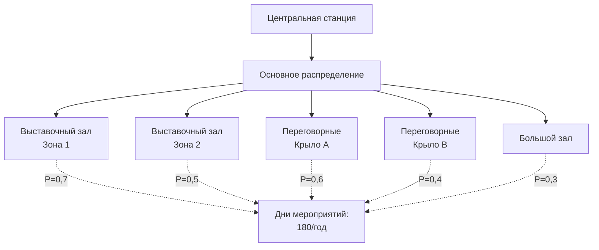

## Основы разнообразия нагрузок

Конференц-центры представляют уникальные задачи для HVAC из-за временного и пространственного разнообразия нагрузок. В отличие от постоянно занятых зданий, объекты конференц-центров испытывают резкие колебания нагрузок в зависимости от графика мероприятий, неполного использования пространства и циклов подготовки/демонтажа. Понимание коэффициентов разнообразия необходимо для экономичного выбора размера центральной станции и реализации систем теплового аккумулирования.

### Определение коэффициента разнообразия

Коэффициент разнообразия представляет собой отношение суммы индивидуальных максимальных потребностей к совпадающему максимальному спросу:

$$D_f = \frac{\sum_{i=1}^{n} Q_{max,i}}{Q_{coincident}} \geq 1.0$$

Где $Q_{max,i}$ — пиковая охлаждающая нагрузка для зоны $i$, а $Q_{coincident}$ — фактическая одновременная пиковая нагрузка. Типичные коэффициенты разнообразия конференц-центров находятся в диапазоне от 1,3 до 2,0, что означает, что центральная станция может быть рассчитана на 50-77% суммы пиковых нагрузок зон.

Коэффициент одновременного использования является обратной величиной:

$$f_{sim} = \frac{1}{D_f} = \frac{Q_{coincident}}{\sum_{i=1}^{n} Q_{max,i}}$$

Для конференц-центров исследования ASHRAE указывают значения $f_{sim}$ между 0,5 и 0,8 в зависимости от размера объекта и графика мероприятий.

## Влияние графика мероприятий на нагрузки

Нагрузки конференц-центра резко колеблются на четырех этапах работы:

### Профиль нагрузки по этапам

| Этап | Заселённость | Освещение | Оборудование | Вентиляция | Коэффициент типичной нагрузки |
|------|-----------|----------|-----------|-------------|---------------------|
| Подготовка | 10-20% | 50-70% | 30-50% | Минимум | 0,25-0,35 |
| Мероприятие (занято) | 100% | 100% | 80-100% | Проектирование | 1,0 |
| Демонтаж | 10-20% | 50-70% | 20-40% | Минимум | 0,20-0,30 |
| Простой | 0-5% | 10-20% | 5-10% | Выкл./минимум | 0,05-0,15 |

Общая охлаждающая нагрузка на каждом этапе следует:

$$Q_{total} = Q_{envelope} + (Q_{occupancy} + Q_{lighting} + Q_{equipment}) \times f_{load} + Q_{ventilation}$$

Нагрузки оболочки остаются постоянными, но внутренние нагрузки и нагрузки вентиляции масштабируются с коэффициентом нагрузки, специфичным для этапа $f_{load}$.

## Сценарии неполной заселённости

Конференц-центры редко работают со всеми пространствами одновременно. Выставочные залы могут принимать мероприятия, в то время как переговорные остаются пустыми, или наоборот. Оценка нагрузки на основе вероятности учитывает это:

$$Q_{design} = \sum_{i=1}^{n} (Q_{zone,i} \times P_{occupied,i})$$

Где $P_{occupied,i}$ — вероятность того, что зона $i$ заселена в условиях пиковой нагрузки. Исторические данные из систем управления объектом предоставляют эти вероятности.

### Влияние стратегии зонирования

Надлежащее зонирование позволяет выборочное кондиционирование:

## Выбор размера центральной станции и пиковые нагрузки

Мощность центральной станции должна сбалансировать недостаточную производительность (неадекватное охлаждение во время пиковых мероприятий) и избыточную производительность (плохая эффективность при частичной нагрузке во время типичных операций). Проектная охлаждающая мощность:

$$Q_{plant} = f_{sim} \times \sum_{i=1}^{n} Q_{zone,i} \times f_{safety}$$

Где $f_{safety}$ обычно составляет 1,10–1,15 для учета будущего роста нагрузки и экстремальной погоды. Для конференц-центра с суммой пиковых нагрузок зон 35,2 МВт, типичный выбор размера станции будет:

$$Q_{plant} = 0,65 \times 35,2 \times 1,10 = 25,1 \text{ МВт}$$

Это представляет снижение на 28,5% от пиковой суммы, что приводит к значительной экономии капитальных затрат.

### Соображения по конфигурации станции

Руководящий документ ASHRAE 36 рекомендует многоступенчатую работу чиллеров для конференц-центров:

| Конфигурация | Эффективность при 25% нагрузки | Эффективность при 50% нагрузки | Эффективность при 100% нагрузки |
|---------------|------------------------|------------------------|-------------------------|
| Один большой чиллер | 0,21-0,24 кВт/кВт охлаждения | 0,16-0,19 кВт/кВт охлаждения | 0,14-0,17 кВт/кВт охлаждения |
| Два одинаковых чиллера | 0,17-0,20 кВт/кВт охлаждения | 0,16-0,19 кВт/кВт охлаждения | 0,14-0,17 кВт/кВт охлаждения |
| Три ступенчатых чиллера | 0,16-0,19 кВт/кВт охлаждения | 0,15-0,18 кВт/кВт охлаждения | 0,14-0,17 кВт/кВт охлаждения |

Несколько меньших чиллеров обеспечивают лучшую эффективность при частичной нагрузке во время этапов подготовки, демонтажа и неполной заселённости.

## Применение теплового аккумулирования

Системы теплового аккумулирования (TES) предоставляют существенные преимущества для конференц-центров путём разделения мгновенной нагрузки от работы чиллера. Требуемая ёмкость хранения зависит от коэффициента формы профиля нагрузки:

$$V_{storage} = \frac{\int_{t_1}^{t_2} (Q_{load}(t) - Q_{chiller}) dt}{\rho \times c_p \times \Delta T \times \eta}$$

Для хранения охлажденной воды с $\Delta T = 8,3°C$ и эффективностью системы $\eta = 0,90$:

$$V_{storage} = \frac{Q_{peak-hours} \times 12,660 \text{ кДж/кВт-ч}}{983,3 \text{ кг/м}^3 \times 4,18 \text{ кДж/кг-°C} \times 8,3°C \times 0,90} = 0,405 \times Q_{peak-hours} \text{ м}^3\text{/кВт-ч}$$

### Стратегия выравнивания нагрузки

TES позволяет постоянную работу чиллера во время занятых периодов:

```mermaid
gantt
    title Выравнивание нагрузки теплового аккумулирования - день мероприятия
    dateFormat HH:mm
    axisFormat %H:%M

    section Нагрузка здания
    Фаза подготовки (низкая)           :done, 06:00, 4h
    Мероприятие (пик)                :crit, 10:00, 8h
    Фаза демонтажа (умеренная)         :active, 18:00, 3h
    Ночное снижение температуры               :21:00, 9h

    section Работа чиллера
    Постоянная базовая нагрузка           :done, 06:00, 15h
    Зарядка хранилища            :active, 21:00, 9h

    section Хранилище
    Период разрядки            :crit, 10:00, 8h
    Период зарядки               :active, 21:00, 9h
```

Системы TES могут снизить производительность чиллера на 30-40% при одновременном смещении электрического спроса на часы вне пиковых значений, что генерирует существенную экономию затрат на коммунальные услуги при структурах тарифов, зависящих от времени использования.

## Рекомендации по проектированию

Основаны на исследованиях ASHRAE и полевых исследованиях:

1. **Применение коэффициента разнообразия**: используйте $D_f = 1,5$ для первоначального выбора размера конференц-центров, превышающих 18,600 м², снижая до $D_f = 1,3$ для объектов менее 9,300 м².

2. **Вероятность заселённости**: проанализируйте данные графика мероприятий за 3-5 лет, чтобы установить коэффициенты вероятности, специфичные для зон. При отсутствии данных используйте значение по умолчанию $P = 0,60$ для выставочных залов и $P = 0,40$ для переговорных пространств.

3. **Тепловое аккумулирование**: рассмотрите TES для объектов с отношением пиковой к средней нагрузке, превышающим 2,0, и благоприятными структурами тарифов на коммунальные услуги (разница пик/внепиковое >0,08 USD/кВт-ч).

4. **Мониторинг**: установите субсчётчики на основные зоны, чтобы проверить предположения о разнообразии и уточнить стратегии работы станции с течением времени.

Надлежащее применение принципов разнообразия нагрузок позволяет системам HVAC конференц-центров достичь сокращения капитальных затрат на 20-35% при сохранении теплового комфорта во время всех этапов работы.
