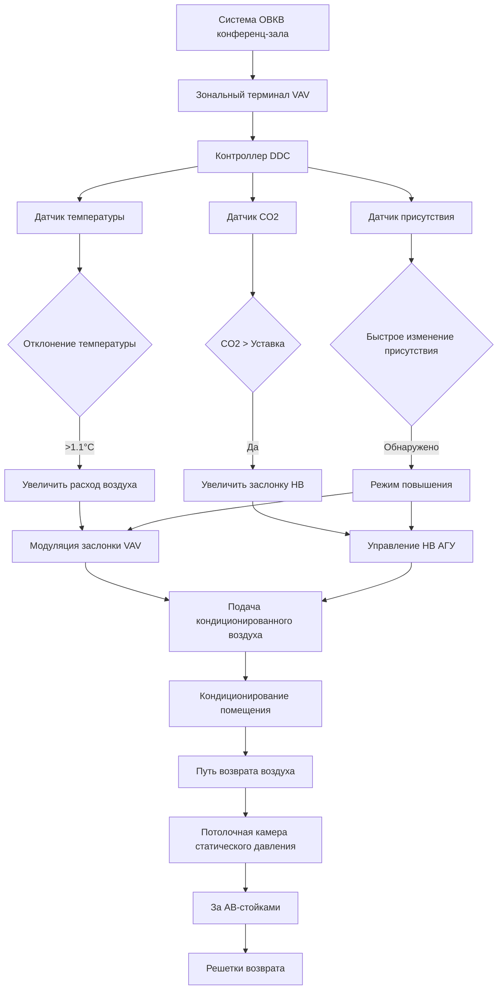

Конференц-залы центров конвенций представляют уникальные задачи в области ОВКВ из-за быстрых колебаний занятости, высокой концентрации тепловыделения от оборудования АВ и необходимости поддерживать индивидуальный тепловой комфорт в помещениях, которые часто перестраиваются. Эти залы — от переговорных на 10 человек до делимых конференц-залов на 100 человек — требуют отзывчивых систем, которые уравновешивают энергоэффективность с комфортом обитателей при сильно переменных режимах использования.

## Требования к вентиляции и управление по CO2

ASHRAE 62.1 определяет минимальные расходы наружного воздуха для конференц-залов на основе плотности занятости и площади помещения. Стандарт предписывает:

$$V_{bz} = R_p \times P_z + R_a \times A_z$$

Где:
- $V_{bz}$ = расход наружного воздуха в дыхательной зоне (м³/ч)
- $R_p$ = расход наружного воздуха на человека (0.85 м³/ч на человека для конференц-залов)
- $P_z$ = количество людей в зоне
- $R_a$ = расход наружного воздуха на единицу площади (0.65 м³/(ч·м²))
- $A_z$ = площадь пола зоны (м²)

Для делимого конференц-зала площадью 111 м² рассчитанного на 60 человек минимальный расход наружного воздуха составляет:

$$V_{bz} = 0.85 \times 60 + 0.65 \times 111 = 51 + 72 = 123 \text{ м³/ч}$$

**Управление вентиляцией по спросу на основе CO2 (DCV)** обеспечивает значительную экономию энергии путем модуляции наружного воздуха на основе фактической занятости. Взаимосвязь между занятостью, выделением CO2 и стационарной концентрацией следует:

$$C_{ss} = C_{oa} + \frac{N \times G}{V_{oa} \times 60}$$

Где:
- $C_{ss}$ = стационарная концентрация CO2 (ppm)
- $C_{oa}$ = концентрация CO2 наружного воздуха (~400 ppm)
- $N$ = количество людей
- $G$ = скорость выделения CO2 на человека (~0.05 м³/ч при малоподвижной деятельности)
- $V_{oa}$ = расход наружного воздуха (м³/ч)

Установка уставки управления на уровне 1000 ppm позволяет системе снижать расход наружного воздуха во время периодов низкой занятости, сохраняя при этом соответствие нормам и качество воздуха.

## Динамика тепловых нагрузок и время отклика

Конференц-залы испытывают ступенчатые изменения нагрузки при входе людей на запланированные сеансы. Явное тепловыделение от людей следует:

$$q_{sensible} = N \times SHG$$

Для малоподвижных взрослых при температуре воздуха 22°C величина SHG составляет 72 Вт на человека. Зал, переходящий от пустого к 40 людям, генерирует мгновенный прирост явной тепловой нагрузки в 2880 Вт.

**Постоянная времени** кондиционируемого помещения определяет, как быстро температура растет без адекватного отклика ОВКВ:

$$\tau = \frac{m \times c_p}{\dot{Q}_{cooling}}$$

Где:
- $\tau$ = постоянная времени (часы)
- $m$ = тепловая масса (кг воздуха + мебели)
- $c_p$ = удельная теплоемкость (1005 Дж/(кг·К) для воздуха)
- $\dot{Q}_{cooling}$ = охлаждающая способность (Вт)

Конференц-залы с легкой конструкцией и минимальной тепловой массой могут демонстрировать постоянные времени 15–30 минут, требуя быстрого отклика ОВКВ для предотвращения дрейфа температуры, превышающего 1.1°C при переходах занятости.

## Тепловые нагрузки от оборудования АВ

Современные конференц-залы содержат значительные электрические нагрузки от проекционных систем, дисплеев, вычислительного оборудования и инфраструктуры видеоконференцсвязи. Эти нагрузки имеют отличительные тепловые характеристики:

| Тип оборудования | Типичная плотность нагрузки | Коэффициент одновременности | Распределение тепла |
|------------------|------------------------------|---------------------------|---------------------|
| Потолочные проекторы | 500–1200 Вт каждый | 0.8 | 70% радиант, 30% конвекция |
| Крупноформатные дисплеи | 300–600 Вт каждый | 1.0 | 50% радиант, 50% конвекция |
| Оборудование АВ-стойки | 21–54 Вт/м² | 0.7 | 80% конвекция, 20% радиант |
| Станции подключения ноутбуков | 50–100 Вт каждая | 0.5 | 60% конвекция, 40% радиант |

Высокий радиантный компонент от проекционного оборудования создает повышенную среднюю радиационную температуру (MRT), которая влияет на тепловой комфорт независимо от температуры воздуха:

$$PMV = f(T_{air}, T_{radiant}, RH, v_{air}, M_{met}, I_{clo})$$

Где PMV (Предсказанная средняя оценка) учитывает как температуру воздуха, так и радиационную температуру. Увеличение MRT на 2.8°C от проекционного оборудования требует примерно снижение температуры воздуха на 1.1–1.7°C для поддержания эквивалентного комфорта.

## Стратегии проектирования системы

**Выбор размера терминала VAV** должен учитывать как пиковые нагрузки, так и поддерживать минимальный расход для вентиляции. Пиковый расход охлаждаемого воздуха рассчитывается как:

$$\dot{V}_{peak} = \frac{q_{sensible}}{1.2 \times \Delta T}$$

Для зала с пиковой явной нагрузкой 4400 Вт и перепадом температур 11.1°C:

$$\dot{V}_{peak} = \frac{4400}{1.2 \times 11.1} = 330 \text{ м³/ч}$$

Терминал также должен доставлять минимальную вентиляцию при коэффициенте понижения, требуя тщательного выбора для избежания чрезмерных скоростей истечения при нагреве или условиях низкой нагрузки.

## Независимое управление комнатой и зонирование

Каждый конференц-зал требует независимого управления температурой для размещения:
- Переменной плотности людей (10–100 человек)
- Разнообразных тепловых предпочтений участников одновременных встреч
- Конфигураций подвижных стен, объединяющих/разделяющих пространства

**Стратегии зонирования** включают:

1. **Один блок VAV на комнату** — обеспечивает полную независимость, но увеличивает стоимость и сложность координации
2. **Общий VAV с зональными заслонками** — экономичен для небольших переговорных с похожими профилями нагрузки
3. **Серийные вентиляторные терминалы** — поддерживают циркуляцию воздуха при низких показателях наружного воздуха, улучшая отзывчивость комфорта

Последовательности управления должны включать **отвод с учетом присутствия** с возможностями быстрого восстановления. Уставки отвода 26°C охлаждение / 18°C нагрев снижают потребление энергии, позволяя 30-минутные циклы предварительного прогрева перед запланированными событиями для установления условий комфорта.

## Конфигурация возвратного воздуха

Стратегическое размещение возвратного воздуха предотвращает шунтирование и обеспечивает эффективное удаление тепла из сосредоточенных источников:

- **Возвраты на низких боковых стенках** — захватывают расслоившийся теплый воздух от людей и проекционного оборудования
- **Возвраты потолочной камеры статического давления за АВ-стойками** — прямое удаление высокоплотных тепловыделений оборудования
- **Минимум 3 м разделения** от воздухораспределителей подачи для предотвращения потерь смешивания

Передаточные решетки в подвижных стенах должны обеспечивать минимум 65 см² на м³/ч для выравнивания давления при объединении комнат, предотвращая хлопанье дверей и жалобы на комфорт.

## Метрики производительности

Эффективность системы ОВКВ конференц-залов сосредоточена на:

| Метрика | Целевое значение | Метод измерения |
|---------|------------------|-----------------|
| Время восстановления температуры | <20 минут для отклонения 2.8°C | Тренд при переходах занятости |
| Стационарное значение CO2 | <1000 ppm при проектной занятости | Непрерывный мониторинг |
| Равномерность температуры | <1.7°C вариация по пространству | Многоточечное измерение |
| Акустическая производительность | NC 30–35 | Измерение уровня звука при проектном расходе |

Достижение этих целевых показателей требует интегрированного управления, правильно подобранного оборудования и наладки, которая подтверждает производительность на полном диапазоне сценариев занятости, типичных при работе центра конвенций.
