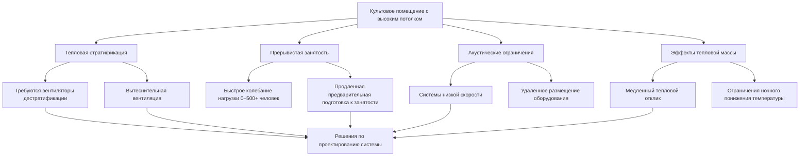

# HVAC для культовых зданий

Культовые здания представляют уникальные проблемы HVAC, которые отличают их от традиционных коммерческих зданий. Церкви, синагоги, мечети и храмы обычно имеют высокие потолки, массивную конструкцию со значительной тепловой массой, прерывистую занятость с экстремальными колебаниями нагрузки и строгие акустические требования, ограничивающие выбор оборудования.

## Уникальные проектные проблемы

### Тепловая стратификация при высоких потолках

Культовые помещения обычно имеют высоту потолков 6–18 м, что создает явно выраженную тепловую стратификацию. Теплый воздух накапливается на уровне потолка в период отопления, снижая комфорт и эффективность в занятой зоне. Градиент температуры можно количественно выразить как:

$$\frac{dT}{dz} = \frac{Q_{conv}}{k \cdot A}$$

Где $\frac{dT}{dz}$ — вертикальный градиент температуры, $Q_{conv}$ — конвективная передача тепла, $k$ — теплопроводность и $A$ — площадь поперечного сечения.

### Расчеты нагрузок при прерывистой занятости

Пиковая занятость происходит только во время богослужений, создавая экстремальную изменчивость нагрузки. Мгновенная нагрузка на осушающее охлаждение от занятости может быть рассчитана как:

$$Q_{sensible} = N \cdot SHG \cdot CLF$$

Где $N$ — количество людей, $SHG$ — явное тепловыделение на человека (обычно 264 кДж/ч для сидящих взрослых), и $CLF$ — коэффициент охлаждающей нагрузки с учетом эффектов тепловой массы.

Для святилища на 500 мест:
$$Q_{sensible} = 500 \times 264 \times 0,85 = 112,200 \text{ кДж/ч}$$

Скрытая нагрузка становится значительной при высокой плотности занятости:

$$Q_{latent} = N \cdot LHG = 500 \times 211 = 105,500 \text{ кДж/ч}$$

Общая нагрузка от занятости: 217,700 кДж/ч (61,5 кВт) появляется в течение 15–30 минут после начала богослужения.

### Тепловая масса и время восстановления

Историческая каменная конструкция с каменными или толстыми кирпичными стенами имеет высокую тепловую массу, которая задерживает тепловой отклик. Постоянная времени для изменения температуры:

$$\tau = \frac{\rho \cdot c \cdot V}{UA}$$

Где $\rho$ — плотность, $c$ — удельная теплоемкость, $V$ — объем, $U$ — общий коэффициент передачи тепла и $A$ — площадь поверхности. Для массивной конструкции $\tau$ может превышать 8–12 часов, требуя продленной подготовки помещения, начинающейся за 3–5 часов до богослужений.

## Подходы к системам HVAC

| Тип здания | Основная система | Распределение | Ключевые соображения |
|---------------|----------------|--------------|-------------------|
| Традиционная церковь | Гидравлическое излучение + вытеснительная вентиляция | Напольное/подставное отопление, низкое боковое подведение | Предварительный нагрев тепловой массы, бесшумная работа |
| Современное святилище | VAV с периферийной индукцией | Потолочные диффузоры с контролем дальности | Акустическая облицовка воздуховода, переменное расписание |
| Историческая реставрация | Высокоскоростная система с маленькими воздуховодами | Скрытая укладка под скамей или в пол | Минимальное визуальное воздействие, ограничения кодекса |
| Мечеть | Выделенный наружный воздух + излучающий пол | Излучение под ковром с верхней DOAS | Приспособление для снятия обуви, нагрузки моечных станций |
| Синагога | Раздельное зонирование для нескольких помещений | Отдельные системы для святилища/классов | Разнообразное расписание занятости, элементы управления Субботой |

### Требования по вентиляции

Стандарт ASHRAE 62.1 классифицирует культовые здания как "Места религиозного поклонения", требующие 0,1 м³/(ч·м²) плюс 8,5 м³/ч на человека. Для святилища площадью 465 м² с 500 посетителями:

$$V_{ot} = R_a \cdot A_z + R_p \cdot P_z = (0,1 \times 465) + (8,5 \times 500) = 4,711 \text{ м³/ч}$$

Это требование наружного воздуха создает значительную нагрузку кондиционирования при экстремальных погодных условиях.

## Акустические ограничения

Уровни фонового шума должны оставаться ниже NC-25 до NC-30, чтобы избежать помех разборчивости речи и музыки. Это требует:

- Скоростей приточного воздуха, ограниченных до 2–3 м/с на диффузорах
- Скоростей воздуха в воздуховодах ниже 4–5 м/с в занятых помещениях
- Размещения оборудования в удаленных механических помещениях с виброизоляцией
- Облицованных воздуховодов с акустическим ослаблением

Уровень звуковой мощности от диффузоров должен соответствовать:

$$L_{p} = L_{w} - 10\log_{10}(Q) - 20\log_{10}(r) + 2,5$$

Где $L_{p}$ — уровень звукового давления, $L_{w}$ — звуковая мощность диффузора, $Q$ — коэффициент направленности и $r$ — расстояние от источника.

## Рекомендации по проектированию

**Выбор системы:** Отдавайте приоритет системам, позволяющим контролировать переменную производительность для соответствия прерывистым нагрузкам. Системы VAV, модулирующие конденсационные котлы и оборудование с переменной скоростью обеспечивают оптимальную эффективность при частичной нагрузке.

**Стратегия управления:** Внедрите управление на основе занятости с резервной астрономической часами. Включите адаптивный предварительный запуск на основе дифференциала температуры в помещении/на улице и характеристик тепловой массы.

**Снижение стратификации:** Установите потолочные вентиляторы дестратификации на расстоянии 6–9 м для помещений выше 6 м. Работа на низкой скорости во время занятости предотвращает жалобы на сквозняки, одновременно восстанавливая потолочное тепло.

**Контроль влажности:** Поддерживайте 30–50% ОВ для сохранения органов, пианино и деревянных предметов. Выделенное осушение может потребоваться в влажном климате в период незанятости.

**Рекуперация энергии:** Применяйте вентиляцию с рекуперацией энергии для кондиционирования значительного требования наружного воздуха. Энтальпийные колеса или пластинчатые теплообменники снижают энергию кондиционирования на 50–70%.

## Руководство по применению ASHRAE

Руководство ASHRAE — Приложение HVAC, Глава 4 "Места собрания" содержит конкретное руководство для культовых зданий, подчеркивая необходимость тихой работы, гибкости для различных режимов занятости и сохранения архитектурного характера исторических сооружений. Условия проектирования должны учитывать церемониальную одежду, которая может отличаться от типичной офисной одежды.

## Заключение

Успешное проектирование HVAC для культовых зданий требует понимания взаимодействия между тепловой массой, прерывистыми режимами занятости, архитектурными ограничениями и акустическими требованиями. Надлежащий анализ нагрузки с учетом быстрых колебаний занятости, в сочетании с выбором системы, приоритизирующей бесшумную работу и переменную производительность, обеспечивает комфорт жителей, уважая уникальный характер этих пространств.
