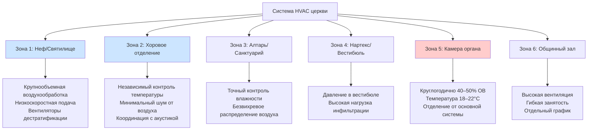

## Обзор

Церковные здания представляют уникальные проблемы проектирования HVAC из-за высоких потолков, прерывистой занятости, акустических ограничений и требований сохранения исторических элементов. Проектировщик должен уравновесить тепловой комфорт в занятых зонах скамей с защитой чувствительных компонентов, включая органы, витражи и архитектурные отделочные материалы. ASHRAE Handbook - HVAC Applications, глава 3 (Места собраний) и глава 24 (Музеи, галереи, архивы и библиотеки) предоставляют техническую основу для систем климат-контроля церквей.

## Тепловое расслоение в помещениях с высокими потолками

Церковные нефы обычно имеют высоту потолков от 6 до 18 м, создавая значительные вертикальные градиенты температуры. Коэффициент расслоения количественно определяет этот эффект:

$$
\Delta T_{\text{strat}} = \frac{q_{\text{convective}}}{A_{\text{floor}} \cdot h_{\text{eff}}} \cdot (H - H_{\text{occ}})
$$

Где:
- $\Delta T_{\text{strat}}$ = разность температур между потолком и занятой зоной (°C)
- $q_{\text{convective}}$ = конвективный тепловой прирост (кДж/ч)
- $A_{\text{floor}}$ = площадь пола (м²)
- $h_{\text{eff}}$ = эффективный коэффициент теплопередачи (кДж/ч·м²·°C)
- $H$ = высота потолка (м)
- $H_{\text{occ}}$ = высота занятой зоны, обычно 1,8 м

Для традиционного нефа с потолками высотой 12 м и 500 прихожанами расслоение может создавать температурные перепады от 8 до 14°C между потолком и зонами скамей в отопительный сезон.

## Расчет нагрузки обогрева зоны скамей

Занятая зона скамей требует точного расчета нагрузки, чтобы избежать недостаточного кондиционирования. Пиковая нагрузка отопления учитывает инфильтрацию, потери ограждающей конструкции и требования прогрева:

$$
Q_{\text{pew}} = Q_{\text{envelope}} + Q_{\text{inf}} + Q_{\text{warmup}}
$$

$$
Q_{\text{warmup}} = \frac{V_{\text{occ}} \cdot \rho \cdot c_p \cdot (T_{\text{set}} - T_{\text{night}})}{t_{\text{warmup}}}
$$

Где:
- $V_{\text{occ}}$ = объем занятой зоны (м³)
- $\rho$ = плотность воздуха, 1,2 кг/м³
- $c_p$ = удельная теплоемкость воздуха, 1,0 кДж/кг·°C
- $T_{\text{set}}$ = температура уставки занятой зоны (°C)
- $T_{\text{night}}$ = температура ночного снижения (°C)
- $t_{\text{warmup}}$ = время прогрева (ч), обычно 2–4 ч перед службой

Церкви с прерывистыми графиками работы (2–3 службы в неделю) требуют быстрого прогрева, что увеличивает установленную отопительную мощность на 30–50 процентов выше стационарных нагрузок.

## Стратегия зонирования HVAC

Надлежащее зонирование разделяет пространства с разными тепловыми и режимами занятости. Типичная церковь требует минимум четырех зон:

## Требования к влажности органа

Органы требуют строгого климат-контроля для предотвращения смещения звука, коррозии труб и деградации кожаных компонентов. Камера органа требует:

- **Температура:** 18–22°C круглогодично (±1°C допуск)
- **Относительная влажность:** 40–50% круглогодично (±5% допуск)
- **Кратность воздухообмена:** 2–4 ACH, с фильтрацией минимум MERV 11

Контроль влажности критически важен. Размерные изменения деревянных труб следуют:

$$
\Delta L = L_0 \cdot \alpha_{\text{wood}} \cdot \Delta \text{MC}
$$

Где изменение влагосодержания коррелирует с ОВ через изотерму сорбции. Колебание ОВ на 20% вызывает примерно 1% размерное изменение деревянных труб, достаточное для расстройки инструмента.

Камера органа должна быть изолирована от основной системы нефа с использованием специального воздухообрабатывающего оборудования с точным контролем влажности (паровое или ультразвуковое увлажнение) и круглогодичной работой.

## Защита витражей

Исторические витражи уязвимы к тепловому шоку и конденсации. Требования проектирования включают:

- **Предотвращение поверхностной конденсации:** Поддерживайте температуру внутренней поверхности стекла выше точки росы на ≥3°C
- **Избегайте высокоскоростного воздушного потока:** Ограничьте скорость воздуха возле стекла до <0,25 м/с во избежание теплового напряжения
- **Контроль поглощения солнечного тепла:** Температуры внутренней поверхности могут достигать 49–60°C на южных/западных сторонах
- **Защитное остекление:** Рассмотрите внешнее штормовое остекление с вентилируемым воздушным зазором для окон высокой стоимости

Критическая проверка конденсации:

$$
T_{\text{glass,interior}} > T_{\text{dewpoint,interior}} + 3°C
$$

Это требование часто требует периметрального обогрева (радиантные панели, плинтусные конвекторы или теплые воздушные завесы) вдоль стенок окон во время зимней работы.

## Традиционные и современные подходы к HVAC церквей

| Аспект проектирования | Традиционные церкви | Современные церкви |
|----------------------|-------------------|-------------------|
| **Высота потолка** | 9–18 м, требующая контроля расслоения | 4,5–7,5 м, обычное распределение |
| **Режим занятости** | Прерывистый (2–3 службы/неделю) | Частый (ежедневные мероприятия) |
| **Стратегия вентиляции** | Естественная вентиляция, низкий ACH | Механическая вентиляция, 25–30 CFM (42–50 м³/ч)/человека |
| **Тип системы** | Радиаторы, блочные обогреватели, минимальное охлаждение | Центральная воздухообработка, полное кондиционирование |
| **Контроль влажности** | Только камера органа | Увлажнение/осушение всего здания |
| **Воздуховоды** | Скрытые в стенах, минимальные | Открытые или акустически обработанные |
| **Акустические ограничения** | Жесткие (NC 25–30) | Умеренные (NC 30–35) |
| **Снижение температуры** | Глубокое снижение (10–13°C), длительный прогрев | Умеренное снижение (17–18°C) |
| **Сохранение исторических памятников** | Строгие ограничения на пробивки | Гибкость проектирования |

## Критерии выбора системы

**Для традиционных/исторических церквей:**
- Гидравлические радиантные системы (радиантные панели в скамейках, периметральные плинтусы)
- Высокоиндукционные диффузоры для борьбы с расслоением
- Отдельное кондиционирование камеры органа
- Минимальные видимые воздуховоды в молитвенном пространстве
- Соответствие требованиям государственного офиса по сохранению исторических памятников (SHPO)

**Для современных молитвенных пространств:**
- Системы переменного объема воздуха (VAV) с контролем на основе занятости
- Подпольное распределение воздуха (UFAD) для гибкой расстановки мест
- Координация с системой аудиовизуализации
- Вентиляция с рекуперацией энергии для высоких показателей наружного воздуха
- Управление зданием с программированием графика работы

## Рекомендации по проектированию

1. **Проведите детальный анализ нагрузки**, учитывая прерывистую занятость и требования прогрева
2. **Укажите тихое оборудование:** Системы вентиляторов NC 25–30, концевые устройства с акустической облицовкой
3. **Реализуйте дестратификацию:** Потолочные вентиляторы (обратимые, низкоскоростные) или высокоиндукционные диффузоры подачи
4. **Защитите чувствительные элементы:** Отдельные системы для камер органов, архивного хранилища
5. **Включите контроль на основе занятости:** Датчики CO₂ для контроля спроса вентиляции, программируемые графики
6. **Координируйте с архитектурными элементами:** Скройте воздуховоды, решетки и оборудование из основного зрительного восприятия
7. **Спланируйте соответствие требованиям сохранения:** Задействуйте SHPO рано для исторических зданий, минимизируйте пробивки
8. **Решите проблему инфильтрации вестибюля:** Поддерживайте слабое избыточное давление (5–7 Па) в нартексе относительно наружного воздуха

## Справочные стандарты

- **ASHRAE Handbook - HVAC Applications:** Глава 3 (Места собраний)
- **ASHRAE Standard 62.1:** Вентиляция для приемлемого качества внутреннего воздуха (25–30 CFM (42–50 м³/ч)/человека для мест религиозного поклонения)
- **ASHRAE Handbook - HVAC Applications:** Глава 24 (критерии среды сохранения)
- **National Park Service Preservation Brief 24:** Отопление, вентиляция и охлаждение исторических зданий
- **AIA Historic Resources Committee:** Рекомендации по установке систем HVAC в исторических конструкциях

## Компоненты

- Традиционное проектирование нефа
- Современное молитвенное пространство
- Святилище на 200–2000 мест
- Алтарная/санктуарий область
- HVAC хорового отделения
- Кондиционирование камеры органа
- HVAC нартекса/вестибюля
- HVAC общинного многофункционального зала
