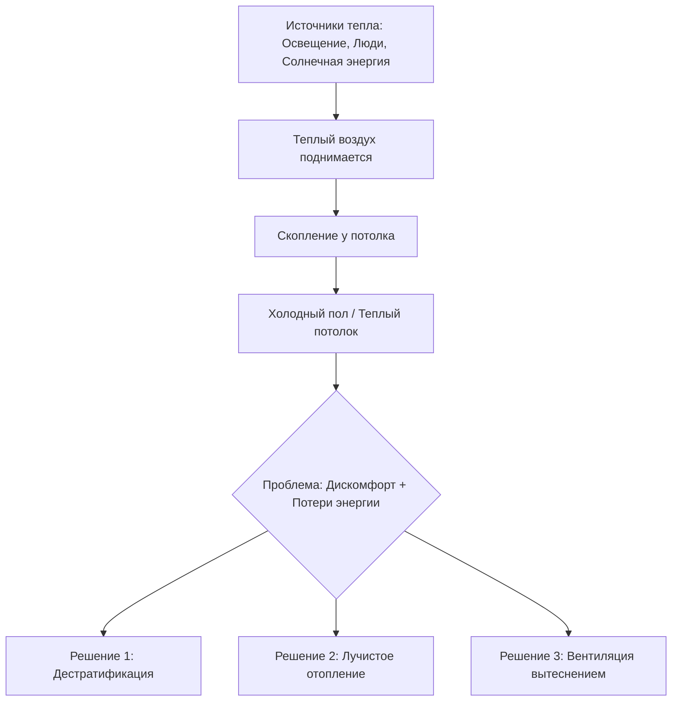
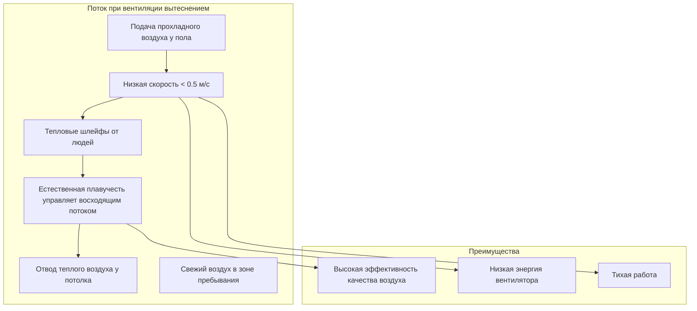

## Тепловая стратификация в высоких помещениях храмов

Храмовые помещения с высотой потолков от 6 до 18 м представляют значительные проблемы для HVAC из-за тепловой стратификации, при которой теплый воздух скапливается в верхней части помещения, а зоны пребывания людей остаются некомфортными. Понимание физики стратификации необходимо для эффективного проектирования систем.

### Физика стратификации

Тепловая стратификация возникает вследствие различий плотности воздуха при разных температурах. Сила плавучести на единицу объема:

$$F_b = g(\rho_{cold} - \rho_{hot}) = g\rho_{cold}\left(1 - \frac{T_{cold}}{T_{hot}}\right)$$

где $g = 9,81$ м/с², температуры выражены в Кельвинах. При разности температур 10°C при типичных условиях в помещении разность плотности составляет примерно 3,5%, создавая значительные силы плавучести, которые управляют вертикальной стратификацией.

Вертикальный градиент температуры в нестратифицированных высоких помещениях может достичь 0,5–1,5°C на метр высоты. Для потолка высотой 15 м это дает разность температур потолок-пол 7,5–22,5°C, что приводит к значительным потерям энергии и дискомфорту для людей.

## Сравнение стратегий систем

| Стратегия | Эффективность в зоне пребывания | Энергетическая эффективность | Капитальные затраты | Акустическое воздействие |
|----------|----------------------------|-------------------|--------------|-----------------|
| Смешивающая вентиляция (высокий выброс) | Умеренная | Низкая | Низкие | Высокое |
| Вентиляция вытеснением | Высокая | Высокая | Умеренные | Низкое |
| Вентиляторы дестратификации | Умеренная-Высокая | Умеренная | Низко-Умеренные | Умеренное |
| Лучистое отопление пола/скамей | Отличная | Очень высокая | Высокие | Отсутствует |
| Потолочные лучистые панели | Высокая | Высокая | Умеренно-Высокие | Отсутствует |
| Комбинированное лучистое + вытеснение | Отличная | Очень высокая | Наивысшие | Низкое |

## Системы вентиляторов дестратификации

Вентиляторы дестратификации механически смешивают слои стратифицированного воздуха, рециркулируя теплый воздух потолка в зону пребывания. Эффективность вентилятора зависит от скорости циркуляции воздуха относительно объема помещения.

### Расчет размера вентилятора и размещение

Требуемая скорость циркуляции воздуха для дестратификации:

$$Q_{circ} = \frac{V \cdot ACH_{destrat}}{60}$$

где $V$ — объем помещения (м³), $ACH_{destrat}$ обычно составляет 2–4 воздухообмена в час для эффективной дестратификации. Для храмового помещения объемом 1500 м³:

$$Q_{circ} = \frac{1500 \times 3}{60} = 75 \text{ м}^3/\text{мин} = 2650 \text{ CFM}$$

Размещение вентилятора должно следовать этим принципам:

- Размещение вентиляторов на 2/3–3/4 высоты потолка
- Интервал между вентиляторами 8–12 м в больших помещениях
- Направление потока воздуха под углом 15–20° от горизонтали для обеспечения смешивания без сквозняков
- Окружная скорость на кончике лопасти не должна превышать 35 м/с для акустического контроля

Потребляемая мощность дестратификации значительно ниже восстановленной тепловой энергии. Коэффициент эффективности для вентиляторной дестратификации:

$$COP_{destrat} = \frac{Q_{heat\,recovered}}{P_{fan}}$$

Типичные значения составляют 15–30, что делает дестратификацию высокоэффективной по стоимости.

## Лучистое отопление для зон пребывания

Системы лучистого отопления решают проблему стратификации путем прямой доставки тепловой энергии людям и поверхностям, минуя необходимость нагревать весь объем воздуха. Этот подход особенно эффективен в высоких помещениях, где конвективное отопление неэффективно.

### Лучистое отопление пола и скамей

Системы лучистого отопления пола обеспечивают комфорт в зоне пребывания без нагревания верхних объемов воздуха. Тепловой поток с нагреваемого пола:

$$q'' = h_c(T_{floor} - T_{air}) + \epsilon\sigma(T_{floor}^4 - T_{mrt}^4)$$

где $h_c$ — коэффициент конвективного теплопередачи (обычно 3–5 Вт/м²K для полов), $\epsilon$ — коэффициент излучения (0,85–0,90 для большинства материалов), $\sigma = 5,67 \times 10^{-8}$ Вт/м²K⁴, $T_{mrt}$ — средняя радиационная температура.

Для температуры пола 27°C в помещении с температурой 20°C:

- Конвективная составляющая: 30–35 Вт/м²
- Радиационная составляющая: 35–40 Вт/м²
- Общий тепловой поток: 65–75 Вт/м²

**Стандарт ASHRAE 55** рекомендует температуру пола между 19–29°C, при этом 23–27°C оптимальны для сидячей деятельности, такой как храмовые службы.

### Потолочные лучистые панели

Высокоинтенсивные или низкоинтенсивные лучистые панели, установленные на высоте 4–8 м над полом, обеспечивают асимметричное лучистое отопление. Интенсивность излучения в зоне пребывания:

$$I = \frac{\epsilon\sigma T_{panel}^4 A_{panel} \cos\theta}{4\pi r^2}$$

где $\theta$ — угол от нормали панели, $r$ — расстояние до целевой зоны.

Высота установки панели влияет на охват и интенсивность. Более низкое расположение (4–5 м) обеспечивает большую интенсивность, но меньший охват; более высокое расположение (6–8 м) обеспечивает более широкий охват, но требует более высоких температур панели.

## Вентиляция вытеснением vs. смешивающая вентиляция

Выбор между вентиляцией вытеснением и смешивающей вентиляцией фундаментально влияет на управление стратификацией в высоких помещениях.

### Вентиляция вытеснением

Вентиляция вытеснением подает прохладный воздух (15–18°C) с низкой скоростью (< 0,5 м/с) у пола, позволяя силам плавучести от источников тепла управлять вертикальным потоком воздуха. Система использует естественную стратификацию, а не борется с ней.

Эффективность вентиляции для систем вытеснения составляет 1,2–1,6, в сравнении с 1,0 для идеального смешивания. Это означает, что системы вытеснения могут достичь того же качества воздуха с 40% меньшей подачей наружного воздуха.

Число Архимеда характеризует режим вентиляции вытеснением:

$$Ar = \frac{g\beta\Delta T H}{u_0^2}$$

где $\beta$ — коэффициент термического расширения (≈ 1/300 K⁻¹), $\Delta T$ — разность температур подачи и помещения, $H$ — характеристическая высота, $u_0$ — скорость подачи. Для эффективной вентиляции вытеснением $Ar > 10$.

### Смешивающая вентиляция

Обычные системы смешивания подают воздух с высокой скоростью (5–10 м/с) из поднятых позиций для увлечения воздуха помещения и создания равномерных условий. В высоких помещениях это требует:

- Высокобросковых диффузоров с дальностью броска 0,75–1,0 высоты потолка
- Температуру подаваемого воздуха на 8–12°C ниже температуры в помещении
- Расходы воздуха на подаче 1,5–2,0 раза больше требуемых по теплу/охлаждению

Эффективность смешивающей вентиляции в высоких помещениях часто составляет 0,8–0,9, что указывает на короткое замыкание между подачей и возвратом.

## Стратегии кондиционирования соборных потолков

Соборные потолки в храмовых помещениях требуют интегрированных стратегий, сочетающих несколько подходов:

**Стратегия отопительного сезона:**
1. Лучистое отопление пола или скамей для основного комфорта (60–70% нагрузки)
2. Вентиляция вытеснением для качества воздуха (100% наружного воздуха во время служб)
3. Вентиляторы дестратификации во время пребывания людей для улучшения равномерности
4. Минимальное верхнее отопление для предотвращения конденсации на холодных поверхностях

**Стратегия холодного сезона:**
1. Вентиляция вытеснением или низкоскоростная смешивающая вентиляция с прохладным подаваемым воздухом
2. Радиационные охлаждающие панели, если контроль влажности адекватен (точка росы должна быть на 2–3°C ниже температуры панели)
3. Стратификация выгодна в режиме охлаждения — теплый воздух естественно поднимается к потолочным возвратам

**Стратегия незанятого периода:**
1. Понижение температуры до 13–16°C в отопительный сезон
2. Выключение вентиляторов дестратификации в периоды отсутствия людей для сохранения стратификации и сокращения потерь тепла через потолок
3. Предварительный прогрев за 2–4 часа до служб с использованием вентиляторов дестратификации

## Энергетические характеристики

Надлежащее управление стратификацией в высоких храмовых помещениях дает существенную экономию энергии. Энергетический штраф за неконтролируемую стратификацию:

$$\Delta Q = \dot{m}c_p\Delta T_{strat} = \frac{UA(T_{ceiling} - T_{outdoor})\Delta T_{strat}}{\Delta T_{indoor-outdoor}}$$

Для помещения высотой 15 м со стратификацией 15°C, температурой наружного воздуха 3°C и целевой температурой в помещении 20°C штраф стратификации увеличивает потери тепла примерно на 45%.

**Стандарт ASHRAE 90.1** содержит нормативные требования к тепловому контролю в помещениях высотой более 6 м, требуя систем дестратификации или альтернативных стратегий, демонстрирующих эквивалентные характеристики.

Эффективный контроль стратификации в сочетании с лучистым отоплением может сократить потребление энергии на отопление на 30–50% по сравнению с обычными воздушными системами в высоких храмовых помещениях, при этом улучшая тепловой комфорт и снижая акустический шум от оборудования HVAC.

## Рекомендации по проектированию

Для храмовых помещений с высотой потолков от 6 до 18 м:

1. **Основное отопление:** Лучистое отопление пола или низкоуровневые лучистые панели для обеспечения комфорта в зоне пребывания
2. **Вентиляция:** Вентиляция вытеснением со скоростью подачи 0,3–0,5 м/с для обеспечения акустических и энергетических преимуществ
3. **Контроль стратификации:** Вентиляторы дестратификации работают во время пребывания людей в режиме отопления
4. **Управление:** Датчики вертикальной температуры на уровне пола (1,5 м) и середины высоты (8–10 м) для модуляции работы вентилятора дестратификации
5. **Изоляция потолка:** Минимум RSI-5,3 для минимизации потерь тепла в неотапливаемый чердак или наружу

Этот интегрированный подход решает уникальную физику теплопередачи в высоких храмовых помещениях, сохраняя при этом комфорт, акустику и энергетическую эффективность.
