## Обзор

Здания религиозного назначения представляют уникальные проблемы для систем HVAC из-за высоко прерывистых режимов оккупанции. Типичные сооружения испытывают пиковую оккупанцию в течение 2-6 часов в неделю во время богослужений с минимальной или нулевой оккупанцией в течение рабочих дней. Этот режим работы создаёт возможности для значительного энергосбережения через стратегические протоколы ночной уставки и восстановления климата, но требует тщательного инженерного проектирования для обеспечения теплового комфорта в период оккупанции.

Фундаментальная проблема заключается в балансировании энергосбережения в периоды неоккупанции с тепловой инертией массивных строительных конструкций, характерных для архитектуры религиозных зданий. Каменная, кирпичная и бетонная конструкция обеспечивают значительную теплоёмкость, которая сопротивляется быстрым изменениям температуры, продлевая периоды восстановления, но также смягчая колебания температуры.

## Режимы оккупанции и отклик HVAC системы

```mermaid
gantt
    title Недельный режим оккупанции и режимы работы HVAC
    dateFormat HH:mm
    axisFormat %a %H:%M

    section Воскресенье
    Неоккупировано (ночная уставка) :done, sun1, 00:00, 6h
    Предварительное кондиционирование :active, sun2, 06:00, 3h
    Богослужение (полная мощность) :crit, sun3, 09:00, 2h
    Богослужение (полная мощность) :crit, sun4, 11:00, 1.5h
    Постоккупационный период :active, sun5, 12:30, 1h
    Ночная уставка :done, sun6, 13:30, 10.5h

    section Пн-Пт
    Глубокая ночная уставка :done, week1, 00:00, 24h

    section Среда
    Неоккупировано :done, wed1, 00:00, 17h
    Предварительное кондиционирование :active, wed2, 17:00, 1.5h
    Вечерняя деятельность :crit, wed3, 18:30, 2h
    Ночная уставка :done, wed4, 20:30, 3.5h

    section Суббота
    Глубокая ночная уставка :done, sat1, 00:00, 24h
```

## Расчёт времени восстановления климата

Время, требуемое для восстановления от ночной уставки до уставки оккупанции, зависит от мощности отопления/охлаждения, теплоёмкости здания и наружных условий. Период восстановления рассчитывается как:

$$
t_{\text{recovery}} = \frac{M \cdot c_p \cdot (T_{\text{occupied}} - T_{\text{setback}})}{Q_{\text{HVAC}} - Q_{\text{loss}}}
$$

Где:
- $t_{\text{recovery}}$ = время восстановления (часы)
- $M$ = эффективная теплоёмкость (кг)
- $c_p$ = удельная теплоёмкость (Дж/кг·К)
- $T_{\text{occupied}}$ = уставка оккупанции (°C)
- $T_{\text{setback}}$ = уставка ночной подстройки (°C)
- $Q_{\text{HVAC}}$ = доступная мощность отопления/охлаждения (Вт)
- $Q_{\text{loss}}$ = потери/приобретение тепла в здании во время восстановления (Вт)

Для зданий с значительной теплоёмкостью (каменная кладка, бетон) следует применять эмпирический коэффициент коррекции 1,2-1,5 для учёта теплового запаздывания в строительной конструкции и предметах внутреннего оборудования.

## Алгоритм оптимального старта

Современные системы автоматизации зданий используют алгоритмы оптимального старта для минимизации времени восстановления при обеспечении комфорта в период оккупанции. Алгоритм рассчитывает наиболее позднее возможное время запуска на основе:

$$
t_{\text{start}} = t_{\text{occupancy}} - \left( k_1 \cdot \Delta T_{\text{indoor}} + k_2 \cdot \Delta T_{\text{outdoor}} + k_3 \right)
$$

Где:
- $t_{\text{start}}$ = рассчитанное время запуска
- $t_{\text{occupancy}}$ = запланированное время оккупанции
- $\Delta T_{\text{indoor}}$ = ошибка внутренней температуры (°C)
- $\Delta T_{\text{outdoor}}$ = отклонение наружной температуры от проектной (°C)
- $k_1, k_2, k_3$ = эмпирически определённые коэффициенты

Алгоритм изучает производительность системы во времени через адаптивную подстройку, корректируя коэффициенты для минимизации энергопотребления при сохранении надёжности комфорта.

## Сравнение стратегий кондиционирования

| Стратегия | Энергосбережение | Риск комфорта | Время работы оборудования | Сложность | Оптимальное применение |
|----------|-----------------|---------------|--------------------------|-----------|----------------------|
| **Ночная уставка (3-4°C)** | 15-25% | Низкий | Умеренный | Низкая | Стандартные недельные богослужения |
| **Глубокая ночная уставка (6-8°C)** | 30-45% | Средний | Высокий пиковый спрос | Средняя | Учреждения с предсказуемым расписанием |
| **Оптимальный старт** | 20-35% | Очень низкий | Оптимизированный | Высокая | Переменные режимы оккупанции |
| **Только предварительное кондиционирование** | 5-15% | Очень низкий | Высокий | Низкая | Здания с высокой теплоёмкостью |
| **Адаптивная ночная уставка** | 25-40% | Низкий | Оптимизированный | Очень высокая | Многофункциональные сооружения |
| **DCV + ночная уставка** | 35-50% | Низкий | Умеренный | Высокая | Большие залы (>200 человек) |

## Управление вентиляцией по требованию (DCV)

Стандарт ASHRAE 62.1 разрешает DCV для помещений с переменной оккупанцией, превышающей 25 человек на 1000 м². Здания религиозного назначения — идеальные кандидаты из-за значительной разницы между требуемой вентиляцией в периоды оккупанции и неоккупанции.

Расход вентиляционного воздуха модулируется на основе измеренной концентрации CO₂:

$$
V_{\text{DCV}} = V_{\text{min}} + \frac{(C_{\text{measured}} - C_{\text{outdoor}}) \cdot A}{(C_{\text{design}} - C_{\text{outdoor}}) \cdot P}
$$

Где:
- $V_{\text{DCV}}$ = требуемый расход вентиляции (CFM, м³/ч)
- $V_{\text{min}}$ = минимальная вентиляция для неоккупированного помещения (CFM, м³/ч)
- $C_{\text{measured}}$ = измеренная концентрация CO₂ в помещении (ppm)
- $C_{\text{outdoor}}$ = концентрация CO₂ на улице (~400 ppm)
- $C_{\text{design}}$ = проектная граница внутренней концентрации CO₂ (обычно 1000 ppm)
- $A$ = площадь пола (м²)
- $P$ = плотность оккупанции (человек/100 м²)

Во время богослужений уровни CO₂ могут повышаться с 450 ppm (неоккупировано) до 800-1000 ppm в течение 30-45 минут, активируя повышенный приток наружного воздуха. После окончания оккупанции система снижает вентиляцию по мере снижения уровней CO₂.

## Использование теплоёмкости конструкций

Массивная конструкция, характерная для архитектуры религиозных зданий, обеспечивает тепловое хранилище, которое может быть стратегически использовано:

**Зимняя стратегия:**
- Предварительный нагрев в период низких тарифов на электроэнергию (02:00-06:00)
- Накопление тепловой энергии в каменных стенах и бетонных перекрытиях
- Снижение нагрузки на отопление во время оккупанции через тепловыделение
- Экономия затрат на энергию 20-35% при структуре тарифов в зависимости от времени использования

**Летняя стратегия:**
- Ночное естественное охлаждение для отвода накопленного тепла с холодным наружным воздухом
- Предварительное охлаждение теплоёмкости конструкции перед оккупанцией
- Снижение нагрузки на механическое охлаждение во время богослужений
- Эффективна в климатах с суточным колебанием температуры >8°C

## Энергосбережение от ночной уставки

Годовое энергосбережение от ночной подстройки температуры в периоды неоккупанции:

$$
E_{\text{saved}} = \frac{UA \cdot \Delta T_{\text{setback}} \cdot h_{\text{setback}} \cdot HDD}{\eta_{\text{heating}}}
$$

Для охлаждения:

$$
E_{\text{saved}} = \frac{UA \cdot \Delta T_{\text{setback}} \cdot h_{\text{setback}} \cdot CDD}{\text{COP}_{\text{cooling}}}
$$

Где:
- $E_{\text{saved}}$ = годовое энергосбережение (кДж)
- $UA$ = коэффициент тепловых потерь здания (Вт/°C)
- $\Delta T_{\text{setback}}$ = разница температуры ночной уставки (°C)
- $h_{\text{setback}}$ = часов в сутки при ночной уставке (ч)
- $HDD$/$CDD$ = градусо-дни отопления/охлаждения
- $\eta_{\text{heating}}$ = эффективность системы отопления
- $\text{COP}_{\text{cooling}}$ = коэффициент производительности системы охлаждения

Для типичного помещения для богослужений площадью 930 м² с уставкой 4°C в течение 140 часов в неделю, годовое энергосбережение на отопление варьируется от 25-40% в зависимости от климатической зоны и типа конструкции.

## Рекомендации по проектированию

**Размер оборудования:**
Размер систем для 1,15-1,25 кратного расчётной нагрузке для обеспечения адекватной мощности восстановления. Передачасление свыше 1,3x приводит к уменьшению отдачи и увеличению потерь на циклирование.

**Последовательность управления:**
1. Реализовать алгоритмы оптимального старта/остановки с периодом обучения 2 недели
2. Использовать беспроводные датчики оккупанции для обнаружения ранних прибытий
3. Возможность ручного переопределения для незапланированных событий
4. Раздельные зоны для главного зала, зала общения и административных помещений

**Размещение датчиков:**
Установить датчики CO₂ в зоне оккупанции на высоте дыхания (1,2-1,8 м над полом), вдали от приточного воздуха и входных дверей. Многоточечное зондирование рекомендуется для залов площадью более 465 м².

**Мониторинг:**
Еженедельно отслеживать производительность времени восстановления для выявления деградации системы или возможностей оптимизации расписания. Выдавать предупреждение техническому обслуживанию, когда время восстановления превышает рассчитанное на >20%.

## Соответствие нормативным требованиям

Стандарт ASHRAE 90.1 (Энергетический стандарт для зданий) требует наличие автоматических элементов управления ночной уставкой для помещений с неоккупанцией >12 часов в неделю. Международный кодекс по энергосбережению (IECC) устанавливает аналогичные требования. Эти требования естественным образом согласуются с режимом работы помещений для религиозных служб.

Стандарт ASHRAE 62.1 разрешает снижение вентиляции в периоды неоккупанции при условии, что помещение доводится до проектной вентиляции до начала оккупанции или в течение первого часа оккупанции.

---

**Ссылки:**
- ASHRAE Standard 62.1: Вентиляция для приемлемого качества внутреннего воздуха
- ASHRAE Standard 90.1: Энергетический стандарт для зданий, кроме малоэтажных жилых зданий
- ASHRAE Handbook - HVAC Applications, Chapter 5: Помещения для собраний
