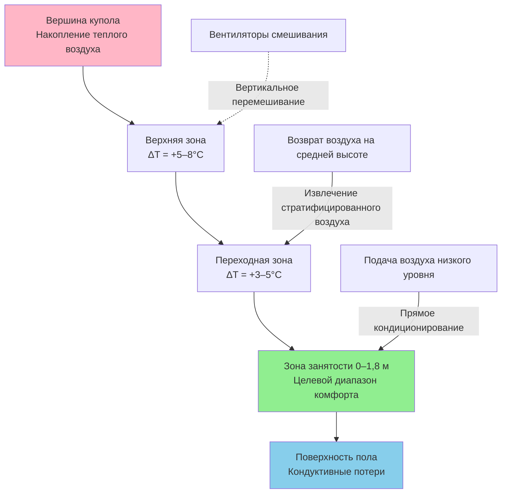

## Обзор

Системы HVAC мечетей сталкиваются с уникальными проблемами, обусловленными исламскими архитектурными традициями и практиками богослужения. Занятость на уровне пола во время молитвы (позиции сужуда и руку), экстремальные прерывистые нагрузки во время пяти ежедневных молитв и пятничных собраний, высокая влажность в зонах омовения (области вуду) и структуры с куполами большого объема создают отличительные тепловые и вентиляционные требования, отсутствующие в обычных помещениях общественного собрания.

## Воздухораспределение на уровне пола

### Физика тепла на уровне молитвы

Молящиеся, сидящие, стоящие на коленях и припадающие ниц на поверхность пола, нуждаются в подаче кондиционированного воздуха в пределах 0–61 см над готовым полом, что противоречит традиционным стратегиям верхнего распределения. Развитие теплового пограничного слоя над полом молитвенного зала определяет комфорт:

$$\delta_t \approx 5x \cdot Re_x^{-0.5} \cdot Pr^{-0.33}$$

где $\delta_t$ — толщина теплового пограничного слоя, $x$ — расстояние от точки подачи воздуха, $Re_x$ — число Рейнольдса, $Pr$ — число Прандтля (примерно 0,7 для воздуха).

**Стратегии проектирования:**

| Метод распределения | Преимущество | Ограничение |
|---------------------|-----------|------------|
| Подпольное воздухораспределение (UFAD) | Оптимальная подача на уровне пола | Высокие начальные затраты, сложность модернизации |
| Регистры низкого боку (15–30 см от пола) | Прямое покрытие зоны занятости | Плохое перемешивание, возможные сквозняки |
| Вентиляция вытеснением | Естественные преимущества стратификации | Требует высоких потолков (>3,7 м) |
| Лучистое отопление/охлаждение пола | Без движения воздуха, равномерная температура | Медленная реакция на прерывистые нагрузки |

### Управление стратификацией

Крупные молитвенные залы с куполами создают серьезную тепловую стратификацию. Градиент температуры соответствует:

$$\frac{dT}{dz} = \frac{Q_{internal}}{k_a \cdot A_{floor}}$$

где $Q_{internal}$ — внутренний прирост тепла, $k_a$ — коэффициент теплопроводности воздуха (0,026 Вт/м·К), $A_{floor}$ — площадь пола. В структурах с куполами высотой более 12 м разница температур между полом и вершиной в 8–14°C — обычное явление без смешивания воздуха.

## Вентиляция зон омовения (вуду)

### Расчеты нагрузки влаги

Зоны омовения создают значительные скрытые нагрузки от ритуального мытья рук, лица, рук и ног. Скорость выработки влаги на молящегося, выполняющего вуду:

$$W_{latent} = \dot{m}_{evap} \cdot h_{fg}$$

где $\dot{m}_{evap}$ варьируется от 0,068–0,113 кг/мин на активную станцию мытья и $h_{fg} = 2442$ кДж/кг при стандартных условиях.

Для объекта с 8 станциями мытья при 75% одновременного использования:

$$Q_{latent} = 8 \times 0,75 \times 0,102 \times 2442 \times 60 = 89,0 \text{ кВт}$$

**Требования вентиляции:**

- Минимум 8,1 м³/(ч·м²) площади омовения в соответствии с ASHRAE 62.1
- Местный выброс 47–71 м³/ч на станцию мытья
- Подача воздуха с психрометрическим кондиционированием для поддержания 50–55% относительной влажности
- Конструкция дренажного пола с противоскользящими поверхностями

### Психрометрический контроль

Коэффициент явного тепла (SHR) в зонах омовения обычно варьируется от 0,45–0,60 в сравнении с 0,70–0,80 в главном молитвенном зале:

$$SHR = \frac{Q_{sensible}}{Q_{sensible} + Q_{latent}}$$

Это требует специализированных воздухообрабатывающих установок с улучшенной способностью осушения, часто включающих теплотрубные теплообменники или рекуперацию энтальпии для эффективного управления вентиляционной нагрузкой.

## Профили нагрузки при прерывистой занятости

### Пиковая загруженность пяти ежедневных молитв (Салат)

Время молитвы создает пять ежедневных пиков занятости: Фаджр (до рассвета), Духр (полдень), Аср (полдник), Магриб (закат) и Иша (вечер). Пятничное собрание Джуму'а генерирует еженедельный пик, часто в 3–5 раз превышающий нормальную ежедневную посещаемость.

```mermaid
gantt
    title Типичный профиль занятости в пятницу и нагрузки HVAC
    dateFormat HH:mm
    axisFormat %H:%M

    section Занятость
    Предрассветный Фаджр (5–10%)          :05:00, 30m
    Утренняя низкая загруженность (2–5%)             :06:00, 5h
    Молитва Духр (15–20%)          :12:15, 45m
    Дневная низкая загруженность (5–10%)          :13:00, 2h30m
    Молитва Аср (10–15%)            :15:30, 30m
    Вечерний переход             :16:00, 2h30m
    Молитва Магриб (20–25%)        :18:30, 30m
    Вечерняя активность               :19:00, 1h30m
    Молитва Иша (15–20%)           :20:30, 45m

    section Пятничный пик
    Собрание Джуму'а (100%)    :12:00, 2h
```

### Стратегии управления спросом

Экстремальная вариативность нагрузки (от 5% до 100% занятости) требует активного управления:

**Время отклика тепловой массы:**

$$\tau = \frac{m \cdot c_p}{UA}$$

Для типичного строительства мечети (каменные стены, бетонные полы) тепловые постоянные времени превышают 4–6 часов — слишком медленно для реакции между молитвами. Активные стратегии HVAC включают:

1. **Предварительное кондиционирование**: Запуск систем за 30–45 минут до времени молитвы
2. **Вентиляция с управлением спросом на основе CO₂**: Снижение наружного воздуха в непроизводительное время
3. **Переменный холодильный поток (VRF)**: Модуляция мощности на уровне зон
4. **Накопление тепловой энергии**: Ледяное или охлажденное водяное хранилище для пиковой нагрузки пятницы

| Стратегия | Экономия энергии | Время отклика | Множитель первоначальной стоимости |
|----------|----------------|---------------|----------------------|
| Фиксированное расписание | Базовый уровень | Н/П | 1,0× |
| CO₂ DCV | 20–30% | 5–10 мин | 1,1–1,2× |
| Зонирование VRF | 25–35% | 2–5 мин | 1,4–1,6× |
| Накопление тепла | 30–45% (плата за спрос) | Часы | 1,5–2,0× |

## Тепловые проблемы структуры купола

### Солнечный прирост тепла через купола

Купола мечетей, часто построенные с минимальной теплоизоляцией по архитектурным соображениям, испытывают серьезные солнечные нагрузки. Общий прирост тепла через поверхность купола:

$$Q_{dome} = A_{dome} \cdot U \cdot (CLTD) + A_{dome} \cdot SHGC \cdot SHGF$$

где $A_{dome}$ — площадь изогнутой поверхности, $CLTD$ — разница температуры охлаждения с учетом тепловой массы, $SHGC$ — коэффициент солнечного прироста тепла, $SHGF$ — коэффициент солнечного прироста тепла.

Для полусферического купола радиусом $r$:

$$A_{dome} = 2\pi r^2$$

Купол радиусом 9,1 м с коэффициентом U 1,42 Вт/м²·К и SHGC 0,60 может обеспечить 44–58 кВт при пиковых летних условиях.

**Методы смягчения:**

- Светоотражающие внешние покрытия (снижение SHGC до 0,25–0,35)
- Модернизация теплоизоляции (целевое U ≤ 0,57 Вт/м²·К)
- Вентилируемые воздушные полости между наружной оболочкой и внутренней поверхностью
- Вентиляторы смешивания с регулируемой скоростью

## Зоны хранения обуви и вестибюли

### Вентиляция для контроля запахов

Зоны хранения обуви требуют специальной вентиляции для контроля запахов и удаления влаги из обуви. Коэффициент эффективности вентиляции:

$$\varepsilon_v = \frac{C_e - C_s}{C_o - C_s}$$

где $C_e$ — концентрация на выпуске, $C_s$ — концентрация подачи, $C_o$ — концентрация в зоне занятости.

**Критерии проектирования:**

- Минимум 2,7 м³/(ч·м²) специального выпуска
- Отрицательное давление относительно молитвенного зала (-7,5–12,5 Па)
- Расположение выпуска на низком уровне (обувь хранится рядом с полом)
- Прямой выпуск наружу (без рециркуляции)

## Критерии выбора системы

Для применения в мечетях выбор системы должен уравновешивать реакцию на прерывистые нагрузки, кондиционирование на уровне пола и акустические ограничения (особенно во время молитвы):

**Рекомендуемый подход:**

- **Малые мечети (<465 м²)**: Многозонный VRF с кассетами низкого уровня или UFAD
- **Мечети среднего размера (465–1395 м²)**: Система специального наружного воздуха (DOAS) с лучистым полом и дополнительной воздухообработкой
- **Крупные мечети (>1395 м²)**: Центральная станция охлажденной воды с несколькими воздухообработчиками, управление VAV на уровне зон и накопление тепловой энергии

Акустические критерии во время молитвы требуют максимум NC-30 до NC-35, требуя низких скоростей воздуха (<2,54 м/с в зонах занятости) и оборудования, изолированного от вибраций.

## Ссылки

- ASHRAE Handbook—HVAC Applications, Chapter 5: Places of Assembly
- ASHRAE Standard 62.1: Ventilation for Acceptable Indoor Air Quality
- ASHRAE Standard 55: Thermal Environmental Conditions for Human Occupancy
