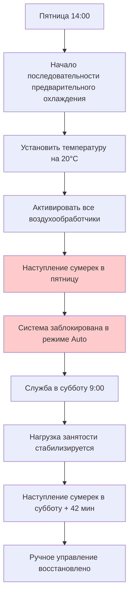
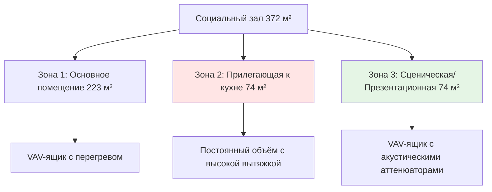

## Обзор

Проектирование HVAC синагог представляет уникальные вызовы, которые сочетают переменные режимы занятости, строгие ограничения операционного времени и требования сохранения религиозных артефактов. Основной проектный анализ сосредоточен на приспособлении к экстремальным колебаниям нагрузок между типовыми службами Шаббата (150–300 человек) и Высокими святыми днями (800–1200 человек) при сохранении бесшумности оборудования во время молитв и соблюдении ограничений операции в Шаббат.

## Основы кондиционирования святилища

Пространства святилища требуют двухрежимной работы: нормальная занятость и переполняющая вместимость. Чувствительная теплоотдача от присутствующих преобладает в расчёте нагрузки во время пиковых событий.

### Расчёты пиковых нагрузок

Чувствительная теплоотдача на человека варьируется с уровнем активности во время служб:

$$Q_s = N \times q_s$$

Где:
- $Q_s$ = Общая чувствительная теплоотдача (кДж/ч)
- $N$ = Количество присутствующих
- $q_s$ = Чувствительная теплоотдача на человека = 264 кДж/ч (сидящие, лёгкая активность)

Для службы Высоких святых дней на 1000 человек:

$$Q_s = 1000 \times 264 = 264\,000 \text{ кДж/ч}$$

Скрытая теплоотдача становится значительной при высокой плотности занятости:

$$Q_l = N \times q_l = 1000 \times 211 = 211\,000 \text{ кДж/ч}$$

Это даёт коэффициент чувствительного тепла (SHR):

$$\text{SHR} = \frac{Q_s}{Q_s + Q_l} = \frac{264\,000}{475\,000} = 0.56$$

Этот низкий коэффициент SHR требует значительной ёмкости осушения, превышающей типовое проектирование сборочного пространства.

## Стратегия предварительного кондиционирования в Шаббат

Еврейский закон запрещает включение электрических выключателей с наступления сумерек в пятницу до наступления сумерек в субботу. Это ограничение требует автоматизированных последовательностей предварительного кондиционирования.

### Расчёт тепловой массы при предварительном кондиционировании

Тепловая масса здания обеспечивает стабильность температуры во время неизменяемого периода Шаббата. Дрейф температуры можно оценить по формуле:

$$\Delta T = \frac{Q \times t}{m \times c_p}$$

Где:
- $\Delta T$ = Изменение температуры (°C)
- $Q$ = Скорость чистой теплоотдачи (кДж/ч)
- $t$ = Период времени (ч)
- $m$ = Эффективная тепловая масса (кг)
- $c_p$ = Удельная теплоёмкость строительных материалов (0.84 кДж/кг·°C для типового строительства)

Для святилища с эффективной массой 181 437 кг, испытывающего чистую теплоотдачу 52 821 кДж/ч в течение 4 часов:

$$\Delta T = \frac{52\,821 \times 4}{181\,437 \times 0.84} = 1.4°C$$

Этот приемлемый дрейф подтверждает справедливость подхода предварительного кондиционирования для умеренного климата.

## Контроль влажности Святилища Торы

Свитки Торы требуют строгого контроля окружающей среды для предотвращения деградации пергамента. Рекомендации ASHRAE предусматривают поддержание 45–55% ОВ с минимальными колебаниями.

| Параметр | Спецификация | Допуск |
|-----------|--------------|-----------|
| Температура | 20–22°C | ±1°C |
| Относительная влажность | 50% | ±5% ОВ |
| Воздухообмены | 2–4 ACH | Минимум 2 |
| Фильтрация | MERV 11 минимум | MERV 13 предпочтительно |

### Выделенная система кондиционирования Святилища

Выделенный воздухообработчик, обслуживающий только пространство Святилища, обеспечивает превосходный контроль:

$$m_a = \frac{Q_l}{\Delta \omega \times h_{fg}}$$

Где:
- $m_a$ = Требуемый объёмный расход воздуха (кг/ч)
- $Q_l$ = Скрытая теплоотдача (кДж/ч)
- $\Delta \omega$ = Разница коэффициента влажности (кг_воды/кг_воздуха)
- $h_{fg}$ = Скрытая теплота испарения = 2257 кДж/кг

Для типовых пространств Святилища с минимальными внутренними источниками влаги, влага инфильтрации преобладает. Выделенная система 340 м³/ч с перегревом обеспечивает стабильные условия круглый год.

## Планирование ёмкости для Высоких святых дней

Службы Рош Ашана и Йом Кипура представляют пиковые проектные условия, возникающие 2–3 дня в году. Экономический анализ уравновешивает затраты на оборудование большего размера против временного дискомфорта.

### Сравнение стратегий проектирования

| Стратегия | Капитальные затраты | Операционные затраты | Уровень комфорта |
|----------|--------------|----------------|---------------|
| 100% проектная ёмкость | Наибольшие | Умеренные | Отличный |
| 70% проектная + предварительное охлаждение | Умеренные | Повышенные | Хороший |
| 60% проектная + мобильные установки | Наименьшие | Наибольшие | Приемлемый |
| Двухступенчатое оборудование | Высокие | Наименьшие | Отличный |

Рекомендуемый подход использует базовое оборудование, рассчитанное на 70% пиковой нагрузки с агрессивным предварительным охлаждением:

Подход с использованием тепловой массы снижает размер оборудования на 30–40% при сохранении приемлемых условий.

## Проектирование многофункционального социального зала

Социальные залы принимают свадьбы, приёмы, образовательные программы и переполняющие помещения с широко варьирующимися нагрузками.

### Внедрение систем переменного объёма воздуха

Системы VAV оптимизируют потребление энергии в различных сценариях использования:

$$CFM_{фактический} = CFM_{максимум} \times \frac{Q_{фактическая}}{Q_{проектная}}$$

Для зала с проектной нагрузкой охлаждения 5,930 кДж/ч, работающего при 40% частичной нагрузки:

$$CFM_{фактический} = 1600 \times 0.40 = 640 \text{ CFM}$$

Эта способность регулирования снижает энергию вентилятора примерно на 75% согласно требованиям ASHRAE 90.1–2019:

$$P_{вентилятор} \propto CFM^{2.5}$$

### Стратегия зонирования

Оптимальное зонирование разделяет социальный зал по режимам занятости:

Зона 2 требует постоянной вентиляции из-за тепла кухни и запахов, в то время как Зоны 1 и 3 выигрывают от регулирования VAV.

## Акустические соображения

Тишина во время молитвенных служб требует звукоизоляции, превышающей типовые коммерческие стандарты. Целевые уровни критериев шума (NC):

| Тип помещения | Уровень NC | Максимум дБА |
|------------|----------|-------------|
| Главное святилище | NC-25 | 35 дБА |
| Область Святилища Торы | NC-20 | 30 дБА |
| Социальный зал | NC-35 | 45 дБА |
| Учебные классы | NC-30 | 40 дБА |

Достижение NC-25 требует:
- Скорости в воздуховодах ниже 4 м/с в окончательных ответвлениях
- Виброизоляции для всего оборудования
- Акустически облицованных плен при основных ответвлениях
- Преобразователей частоты (VFD) для управления постоянной скоростью
- Звуковых ловушек на выпуске воздухообработчика

Перепад давления через устройства звукоизоляции повышает статическое давление системы на 75–125 Па, требующее надлежащего выбора вентилятора.

## Интеграция образовательного крыла

Религиозные школы работают в будни после полудня и по воскресеньям утром, создавая отчётливый график от функций святилища.

### Рекомендация выделенных систем

Отдельные воздухообработчики для образовательных пространств обеспечивают:
- Независимое управление расписанием
- Сниженное потребление энергии в выходные дни
- Упрощённую координацию обслуживания
- Соответствие нормам вентиляции классных комнат согласно ASHRAE 62.1

Минимальный наружный воздух для классных комнат:

$$OA_{мин} = R_p \times P_z + R_a \times A_z$$

Где:
- $R_p$ = 2.36 л/(с·человек) (Таблица 6.2.2.1)
- $P_z$ = Население зоны
- $R_a$ = 1.29 л/(с·м²) (Таблица 6.2.2.1)
- $A_z$ = Площадь зоны (м²)

Для классной комнаты 84 м² с 25 учащимися:

$$OA_{мин} = (2.36 \times 25) + (1.29 \times 84) = 59 + 108 = 167 \text{ л/с}$$

Это значительное требование наружного воздуха обосновывает системы рекуперации энергии для образовательных крыльев, превышающих 283 л/с общего наружного воздуха.

## Рекомендации по выбору системы

| Размер здания | Первичная система | Распределение | Стратегия управления |
|---------------|----------------|--------------|------------------|
| До 930 м² | Несколько RTU | CAV с зонами | Программируемые термостаты |
| 930–2787 м² | Центральный AHU | VAV с перегревом | DDC с BAS |
| Более 2787 м² | Несколько AHU | VAV с перегревом | Полная интеграция BAS |

Все системы требуют:
- Семидневного программируемого управления с переопределением праздников
- Способности блокировки Шаббата
- Дистанционного мониторирования с сигналами температурных тревог в нерабочее время
- Мониторирования влажности для пространств Святилища Торы

## Заключение

Успешное проектирование HVAC синагог уравновешивает высокопеременные нагрузки, ограничения операционного времени и требования сохранения артефактов. Ключевые элементы проектирования включают надёжные стратегии предварительного кондиционирования для операции в Шаббат, выделенный контроль влажности для пространств Святилища Торы и экономичные подходы к редким пиковым нагрузкам Высоких святых дней. Соблюдение стандартов вентиляции ASHRAE 62.1, требований энергии 90.1 и целей по звукоизоляции обеспечивает как нормативное соответствие, так и комфорт прихожан во всём спектре использования сооружения.
