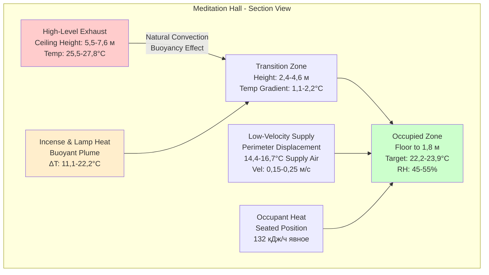
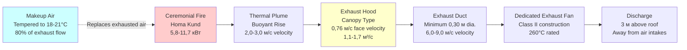
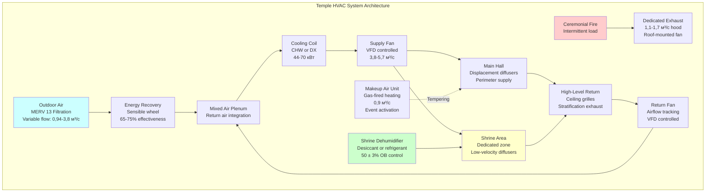

## Обзор

Системы HVAC в храмах должны обеспечивать баланс между тепловым комфортом для сидящих молящихся и требованиями сохранения религиозных артефактов, одновременно управляя продуктами сгорания от благовоний, масляных ламп и церемониального огня. Комбинация помещений с высокой плотностью занятости, напольным сиденьем, непрерывным горением благовоний и периодическими высокотемпературными церемониальными мероприятиями создает уникальные задачи проектирования, требующие специализированных стратегий вентиляции и слоистого подхода к кондиционированию.

## Характеристики тепловых нагрузок

### Компоненты теплопередачи

Храмовые помещения создают отчетливые модели тепловой нагрузки в сравнении с обычными помещениями общественного назначения. Коэффициент явного тепла (SHR) обычно находится в диапазоне 0,75–0,85, при этом скрытые нагрузки определяются в основном плотностью занятости, а не источниками процесса.

**Расчет нагрузки по занятости:**

Для конфигураций напольного сиденья плотность занятости значительно увеличивается в сравнении с сиденьем в скамье или кресле:

$$Q_{occupants} = N \cdot q_{person} \cdot CLF$$

Где:
- $N$ = число занимающих (обычно 1 человек на 0,56–0,74 м² при напольном сидении)
- $q_{person}$ = 132 кДж/ч явного тепла + 58 кДж/ч скрытого тепла (уровень активности сидячей медитации)
- $CLF$ = коэффициент охлаждающей нагрузки (0,85–0,95 в периоды пиковой занятости)

**Источники тепла сгорания:**

Масляные лампы и свечи обеспечивают локализованные нагрузки явного тепла:

$$Q_{flame} = n_{lamps} \cdot \dot{m}_{fuel} \cdot LHV \cdot \eta_{radiative}$$

Где:
- $n_{lamps}$ = количество активных пламен
- $\dot{m}_{fuel}$ = расход топлива (масляные лампы на топленом масле: 15–25 г/ч на пламя)
- $LHV$ = низшая теплотворная способность (37 МДж/кг для топленого масла, 44 МДж/кг для парафина)
- $\eta_{radiative}$ = радиационная доля в помещение (0,30–0,40)

Типичный алтарь с 20 масляными лампами генерирует примерно 880–1320 кДж/ч явной нагрузки.

| Источник тепла | Нагрузка на единицу | Типовое количество | Общая нагрузка |
|-------------|---------------|------------------|------------|
| Занимающий (сидящий) | 132 кДж/ч явное | 150–300 человек | 19,800–39,600 кДж/ч |
| Масляная лампа (топленое масло) | 53–73 кДж/ч | 10–50 ламп | 530–3,650 кДж/ч |
| Палочка благовония | 3,5–5,3 кДж/ч | 20–100 палочек | 70–530 кДж/ч |
| Церемониальный огонь (хома) | 4,400–11,700 кДж/ч | Периодический | Зависит от события |

## Требования вентиляции

### Удаление благовоний и продуктов сгорания

Горение благовоний производит взвешенные частицы (PM2.5 и PM10) и летучие органические соединения, требующие непрерывной вентиляции разбавлением. Требования ASHRAE Standard 62.1 для помещений общественного назначения (0,06 CFM/м²) недостаточны для управления продуктами сгорания.

**Скорость вентиляции разбавлением:**

$$\dot{V}_{OA} = \frac{G_{emission}}{C_{target} - C_{OA}}$$

Где:
- $G_{emission}$ = общая скорость выброса загрязняющих веществ (мг/ч)
- $C_{target}$ = целевая концентрация в помещении (µг/м³)
- $C_{OA}$ = концентрация наружного воздуха (обычно пренебрежимо мала)

Для храмов с непрерывным горением благовоний рекомендуются скорости наружного воздуха 25–42 CFM (м³/ч) на человека, что составляет 2,5–4× базовое требование для помещений общественного назначения. Эта повышенная скорость вентиляции поддерживает концентрацию PM2.5 ниже 35 µг/м³ (24-часовой стандарт EPA).

### Стратифицированная стратегия вентиляции

Конфигурации напольного сиденья создают возможности для стратифицированной вентиляции с подачей кондиционированного воздуха на низких скоростях (<0,25 м/с) в занятой зоне, в то время как загрязненный воздух отводится на уровне потолка.

**Эффективность стратификации:**

Число стратификации (St) количественно определяет тепловую стратификацию:

$$St = \frac{H \cdot \Delta T}{T_{supply} \cdot Fr^2}$$

Где:
- $H$ = высота потолка (м)
- $\Delta T$ = разница температур между занятой зоной и потолком (°C)
- $T_{supply}$ = температура поступаемого воздуха (K)
- $Fr$ = число Фруда (функция скорости подачи и геометрии помещения)

Целевое значение St > 0,15 для эффективной стратификации в храмовых залах с высотой потолка более 5,5 м.

## Вентиляция церемониального огня

### Выброс огня хома

Индуистские огненные церемонии (хома/хаван) генерируют интенсивное локализованное тепло и продукты сгорания, требующие специальных систем выброса. Очаг обычно производит 4,400–11,700 кДж/ч в зависимости от количества топлива и продолжительности церемонии.

**Проектирование вытяжного колпака:**

Локальная вытяжная вентиляция для церемониального огня следует принципам промышленной вентиляции:

$$Q_{hood} = V_{face} \cdot A_{face} = 0,50–0,76 \text{ м/с} \cdot A_{opening}$$

Для типичного переносного хома кунда (0,61 м × 0,61 м очаг), потолочный навесной колпак с минимальным покрытием 1,2 м × 1,2 м требует:

$$Q_{hood} = 0,76 \text{ м/с} \cdot 1,44 \text{ м}^2 = 1,1 \text{ м}^3\text{/с} \text{ (67 CFM)}$$

Колпак должен быть расположен на расстоянии 1,2–1,8 м над огнем со скоростью захвата, достаточной для преодоления скоростей восходящего теплового потока (обычно 1,5–2,5 м/с непосредственно над активным пламенем).

**Требования к поступающему воздуху:**

Система выброса удаляет значительное количество кондиционированного воздуха. Поступающий воздух должен быть введен во избежание разрежения в здании:

$$Q_{makeup} = 0,80 \cdot Q_{exhaust}$$

Система выброса 1,1 м³/с требует примерно 0,9 м³/с поступающего воздуха. Этот поступающий воздух должен быть нагрет до 18–21°C в отопительный сезон во избежание дискомфорта занимающих. Система поступающего воздуха работает только во время церемониального огня (обычно 1–3 часа длительность).

## Сохранение артефактов и статуй

### Требования контроля климата

Религиозные статуи, фрески и артефакты требуют стабильной температуры и влажности во избежание деградации материала. Различные материалы показывают различную чувствительность к колебаниям окружающей среды.

| Материал | Диапазон температур | Диапазон ОВ | Максимальные суточные колебания |
|----------|-------------------|----------|---------------------------|
| Камень (гранит, мрамор) | 15,6–23,9°C | 40–60% | ±2,8°C, ±10% ОВ |
| Бронза, латунь | 15,6–23,9°C | 35–50% | ±2,8°C, ±5% ОВ |
| Дерево (резное) | 18,3–22,2°C | 45–55% | ±1,7°C, ±5% ОВ |
| Окрашенные поверхности | 20,0–22,2°C | 50–55% | ±1,1°C, ±3% ОВ |
| Текстиль (шелк, хлопок) | 18,3–21,1°C | 45–50% | ±1,7°C, ±5% ОВ |

**Равновесное содержание влаги:**

Деревянные артефакты реагируют на изменения влажности посредством корректировки содержания влаги:

$$EMC = \frac{18}{K} \cdot \frac{k \cdot h}{1 - k \cdot h} + \frac{k_1 \cdot k \cdot h + 2 \cdot k_1 \cdot k_2 \cdot k^2 \cdot h^2}{1 + k_1 \cdot k \cdot h + k_1 \cdot k_2 \cdot k^2 \cdot h^2}$$

Где:
- $EMC$ = равновесное содержание влаги (%)
- $h$ = относительная влажность (десятичная)
- $K$, $k$, $k_1$, $k_2$ = зависящие от температуры константы

Изменения размеров в резных деревянных элементах подчиняются примерно 1% линейному изменению размера на 4% изменения EMC. Поддержание ОВ в пределах ±5% предотвращает видимые трещины или деформацию в резных деревянных элементах.

### Микроклимат области алтаря

Области алтаря, содержащие артефакты высокой стоимости, выигрывают от специальных локализованных систем кондиционирования, независимых от основной системы HVAC зала:

- **Отдельная установка температуры:** 20,0–21,1°C (более строгая, чем для помещения общественного назначения)
- **Специальная осушка:** Поддерживает 50 ± 3% ОВ независимо от условий на улице
- **Непрерывная работа:** Кондиционирование 24/7 предотвращает суточные колебания, которые напрягают материалы
- **Фильтрация:** MERV 13–16 для удаления частиц благовоний перед входом в область алтаря

## Соображения комфорта при напольном сидении

### Распределение воздуха на низком уровне

Позиции напольного сидения размещают занимающих ближе к диффузорам подачи воздуха в сравнении с приподнятым сиденьем. Это требует тщательного внимания к температуре поступающего воздуха и скорости во избежание сквозняков.

**Критерии комфорта:**

ASHRAE Standard 55 определяет границы теплового комфорта. Для сидячей медитации (метаболическая активность 1,0 мет, одежда 0,5–0,7 кло для легких одеяний):

- **Операционная температура:** 22,2–24,4°C для одежды 0,6 кло
- **Скорость воздуха:** <0,15 м/с для малоподвижной деятельности во избежание ощущения сквозняка
- **Радиационная асимметрия:** <5,6°C между полом и потолком на высоте 1,8 м
- **Вертикальная разница температур воздуха:** <2,8°C между уровнем щиколотки и головы на высоте 1,2 м для сидящего

**Понижение температуры поступающего воздуха:**

Для достижения низких скоростей подачи при вытесняющей вентиляции:

$$\Delta T_{supply} = T_{zone} - T_{supply} = 5,6–8,3°C$$

Более низкие температуры подачи (14,4–16,7°C) позволяют адекватную мощность охлаждения при сохранении низких скоростей выброса (0,15–0,25 м/с), которые предотвращают дискомфорт сквозняка для занимающих на полу.

## Архитектура системы

### Двухрежимная работа

Системы HVAC в храмах должны поддерживать два отчетливых режима работы:

**Режим ежедневной работы:**
- Непрерывная вентиляция для сохранения артефактов
- Умеренная занятость (20–50 человек)
- Непрерывное горение благовоний и ламп
- Наружный воздух: 25–34 CFM (42–58 м³/ч) на человека
- Приоритетное кондиционирование области алтаря

**Режим церемонии/праздника:**
- Высокая занятость (200–500 человек)
- Интенсивное горение благовоний
- Работа церемониального огня (периодическая)
- Наружный воздух: 34–42 CFM (58–71 м³/ч) на человека + поступающий воздух
- Полная активация системы выброса

**Последовательность управления:**

1. **Датчики занятости** регулируют жалюзи наружного воздуха и расход подачи воздуха на основе уровней CO₂ или плановой занятости
2. **Контроль влажности области алтаря** работает независимо на непрерывной основе
3. **Обнаружение церемониального огня** (переключатель вручную или обнаружение тепла) активирует вытяжной колпак и блок поступающего воздуха
4. **Переустановка температуры поступающего воздуха** на основе температуры занятой зоны поддерживает 14,4–16,7°C подачу во время охлаждения

## Контрольный список проектирования

### Критические элементы проектирования

- [ ] Скорость наружного воздуха минимум 42 CFM (м³/ч) на человека для разбавления благовоний (2,5× базовый уровень ASHRAE 62.1)
- [ ] Стратифицированная вентиляция с подачей ниже 1,8 м, выбросом выше 4,6 м
- [ ] Специальный выброс церемониального огня: 1,1–1,7 м³/с за очаг с 0,9–1,4 м³/с нагретого поступающего воздуха
- [ ] Изолированное кондиционирование области алтаря: 20,0–21,1°C, 50 ± 3% ОВ, работа 24/7
- [ ] Скорость поступающего воздуха <0,15 м/с в занятой зоне во избежание дискомфорта от сквозняка для сидящих занимающих
- [ ] Высокоэффективная фильтрация (MERV 13–16) для удаления частиц благовоний
- [ ] Рекуперация энергии на наружный воздух (избегать в мягком климате, где доминирует работа экономайзера)
- [ ] Двухточечная стратегия установки: приоритет сохранения во время периодов незанятости, приоритет комфорта во время церемоний
- [ ] Независимая осушка для областей артефактов поддерживает ОВ независимо от явной нагрузки
- [ ] Позиционирование вытяжного колпака 1,2–1,8 м над очагом с минимальной скоростью захвата 0,76 м/с

### Соображения по техническому обслуживанию

Продукты сгорания благовоний откладываются на катушках, фильтрах и воздуховодах быстрее, чем типовые загрязняющие вещества помещений общественного назначения:

- **Частота замены фильтра:** Ежемесячное инспектирование, замена при 50% от номинального срока
- **Очистка катушки:** Полугодовое инспектирование, ежегодная профессиональная очистка
- **Инспекция воздуховодов:** Двухгодичная инспекция на накопление частиц
- **Калибровка управления:** Ежегодная проверка датчиков влажности в областях сохранения

---

## Компоненты

- HVAC медитационного зала
- Кондиционирование области алтаря
- Многоцелевой зал общественного назначения
- HVAC образовательного крыла
- Требования церемониального пространства
- Интеграция общественного центра
