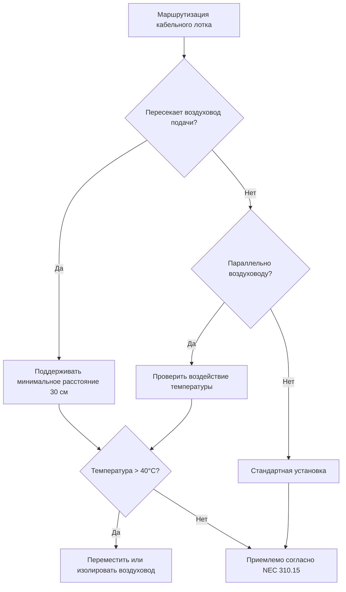

Интеграция аудиовизуального оборудования создает уникальные тепловые и акустические проблемы при проектировании HVAC лекционных залов. Современные AV системы генерируют значительные тепловые нагрузки при одновременном требовании точного контроля окружающей среды и минимального акустического воздействия.

## Тепловая нагрузка проектора и охлаждение

Высокопроизводительные проекторы генерируют значительное тепло из-за неэффективности лампы и рассеивания мощности электроникой. Типичный проектор с яркостью 6000 люмен потребляет мощность 300–400 Вт, где 70–85 % преобразуется в тепло.

Чувствительная теплопроизводительность проектора в установившемся режиме:

$$Q_{\text{proj}} = P_{\text{elec}} \times \eta_{\text{heat}} \times F_u$$

Где:
- $Q_{\text{proj}}$ = теплопроизводительность проектора (кДж/ч)
- $P_{\text{elec}}$ = потребляемая электрическая мощность (Вт)
- $\eta_{\text{heat}}$ = доля преобразованная в тепло (0,70–0,85)
- $F_u$ = коэффициент использования (обычно 0,8–1,0 для лекционных залов)

Для проектора мощностью 350 Вт с 75 % преобразованием тепла:

$$Q_{\text{proj}} = 350 \times 3,41 \times 0,75 \times 1,0 = 895 \text{ кДж/ч}$$

### Стратегии охлаждения проекторов, установленных на потолке

```mermaid
graph TD
    A[Стратегия подачи воздуха] --> B[Канальная подача в корпус проектора]
    A --> C[Охлаждение плеума потолка в окружающей среде]
    B --> D[Выделенная подача 150–250 CFM (254–424 м³/ч) на проектор]
    B --> E[Температура: максимум 20–22°C]
    C --> F[Вентиляция плеума: 15–20 ACH]
    C --> G[Максимальная температура плеума: 29°C]
    D --> H[Критерий шума: NC-25 или ниже]
    E --> H
    F --> I[Контролировать температуру входа проектора]
    G --> I
```

Проекторы, установленные на потолке, требуют специального охлаждения в следующих случаях:
- Мощность проектора превышает 300 Вт
- Температура в плеуме потолка превышает 27°C
- Деградация срока службы лампы неприемлема
- Гарантия проектора требует определенных пределов температуры

**Таблица проектирования охлаждения проектора:**

| Мощность проектора | Метод охлаждения | Требуемый расход воздуха | Температура подачи | Примечания |
|----------------|----------------|------------------|-------------------|-------|
| <200 Вт | Пассивный плеум | Без выделенного | Плеум окружающей среды | Контролировать температуру плеума |
| 200–400 Вт | Канальная подача или активный плеум | 150–200 CFM (254–339 м³/ч) | 20–22°C | Обычно для большинства установок |
| 400–600 Вт | Выделенная канальная подача | 250–350 CFM (424–594 м³/ч) | 18–21°C | Высокопроизводительные проекторы |
| >600 Вт | Выделенная мини-сплит-система или канальная подача | 400+ CFM (678+ м³/ч) | 18–20°C | Лазерные проекторы, специальные случаи |

## Вентиляция оборудования в стойке

AV стойки оборудования концентрируют теплогенерирующие компоненты в замкнутых пространствах. Тепловые нагрузки стойки обычно колеблются от 586–2343 кДж/ч в зависимости от плотности оборудования.

Рост температуры по вентилируемой стойке оборудования:

$$\Delta T = \frac{Q_{\text{rack}}}{1,25 \times \text{CFM}}$$

Где:
- $\Delta T$ = рост температуры через стойку (°C)
- $Q_{\text{rack}}$ = общая тепловая нагрузка стойки (кДж/ч)
- CFM = расход воздуха через стойку (м³/ч)

Для стойки с нагрузкой 1465 кДж/ч с приемлемым ростом температуры 8°C:

$$\text{CFM} = \frac{1465}{1,25 \times 8} = 147 \text{ CFM (249 м³/ч)}$$

### Реализация охлаждения стойки

```mermaid
flowchart LR
    A[Тепловая нагрузка стойки] --> B{Нагрузка < 880 кДж/ч?}
    B -->|Да| C[Пассивная вентиляция с перфорированными дверцами]
    B -->|Нет| D{Нагрузка < 1760 кДж/ч?}
    D -->|Да| E[Вспомогательная вентиляция вентилятором<br/>150–350 CFM (254–594 м³/ч)]
    D -->|Нет| F[Выделенное охлаждение<br/>Встроенный кондиционер или канальная подача]
    C --> G[Контролировать температуру стойки]
    E --> G
    F --> G
    G --> H{Температура > 27°C?}
    H -->|Да| I[Увеличить вентиляцию]
    H -->|Нет| J[Приемлемо]
```

**Требования вентиляции оборудования в стойке:**

- **Направление подачи воздуха:** Снизу вверх, следуя естественной конвекции
- **Температура подаваемого воздуха:** 18–21°C для долговечности оборудования
- **Максимальная внутренняя температура:** 27°C непрерывно, 29°C максимально
- **Минимальная скорость вентиляции:** 9–14 CFM (15–24 м³/ч) на 293 кДж/ч нагрузки
- **Перфорация дверцы:** Минимум 60 % открытой площади для пассивного охлаждения

## Тепловой вклад экранов дисплеев

Крупноформатные дисплеи вносят вклад в тепловые нагрузки охлаждения лекционного зала. LED дисплеи более эффективны, чем старые технологии LCD, но все еще генерируют измеримое тепло.

Оценка тепловой нагрузки дисплея:

$$Q_{\text{display}} = P_{\text{rated}} \times 3,41 \times F_u \times (1 - \eta_{\text{light}})$$

Для коммерческого дисплея диагональю 86 дюймов (2,18 м) номинальной мощностью 450 Вт с 20 % эффективностью светового выхода:

$$Q_{\text{display}} = 450 \times 3,41 \times 0,9 \times 0,80 = 1105 \text{ кДж/ч}$$

**Сравнение тепловой нагрузки по типам дисплеев:**

| Технология дисплея | Мощность на м² | Теплоотдача | Эффективность | Применение |
|-------------------|---------------|-------------|------------|-------------|
| LCD (старый) | 86–129 Вт/м² | 100 % мощности | Низкая | Устаревшие системы |
| LED-подсветка LCD | 54–86 Вт/м² | 80–85 % мощности | Средняя | Обычный текущий стандарт |
| OLED | 43–75 Вт/м² | 75–80 % мощности | Лучше | Премиум-приложения |
| Прямая стена LED | 161–323 Вт/м² | 70–75 % мощности | Переменная | Крупный формат |

## Акустическая координация: HVAC и звуковые системы

Шум HVAC напрямую влияет на акустические характеристики лекционного зала. Стандарт ASHRAE 62.1 рекомендует NC-25 до NC-30 для лекционных пространств, но высококачественные AV системы могут требовать NC-20 или ниже.

Соотношение между шумом HVAC и требуемой мощностью звуковой системы:

$$\text{SNR}_{\text{required}} = L_{\text{speech}} - L_{\text{background}}$$

Где отношение сигнал-шум должно превышать 25 дБ для отличной разборчивости, 15–25 дБ для хорошей разборчивости.

### Стратегии снижения шума

1. **Выбор диффузора:** Низкоскоростные диффузоры (1,5–2,0 м/с) в сравнении с высокоскоростными (3,0+ м/с)
2. **Расположение воздухозаборника:** Удаленное от зоны презентации, минимум 4,6 м от микрофонов
3. **Шумоглушители воздуховода:** Требуются, когда рассчитанный NC превышает целевой показатель более чем на 5
4. **Системы переменного объема:** Снижение расхода воздуха в критические периоды прослушивания
5. **Виброизоляция:** Все оборудование на пружинных или эластомерных изоляторах

**Влияние шума HVAC на производительность AV:**

| Фоновый уровень NC | Разборчивость речи | Требования звуковой системы | Приемлемое применение |
|--------------------|------------------------|---------------------------|------------------------|
| NC-20 | Отлично | Минимальное усиление | Студии звукозаписи, высокопроизводительные лекционные залы |
| NC-25 | Очень хорошо | Стандартное усиление | Типичные лекционные залы, конференц-залы |
| NC-30 | Хорошо | Умеренное усиление | Общие классные комнаты, учебные комнаты |
| NC-35 | Справедливо | Значительное усиление | Многофункциональные пространства, спортивные залы |
| NC-40+ | Плохо | Невозможно преодолеть | Неприемлемо для AV приложений |

## Требования к окружающей среде в помещении управления

Помещения управления AV размещают чувствительную электронику и операторов, требующих определенных условий в соответствии с руководящими принципами ASHRAE TC 9.9:

**Параметры проектирования помещения управления:**

- **Температура:** 22°C ± 1°C круглогодично
- **Относительная влажность:** 45–55 % ± 5 %
- **Воздухообмены:** Минимум 15 ACH, до 20–25 ACH при высокой плотности оборудования
- **Избыточное давление:** Небольшое положительное давление (+5–12 Па) относительно лекционного зала
- **Фильтрация:** MERV 11–13 минимум для защиты оборудования

Плотность тепловой нагрузки в помещениях управления обычно достигает 127–191 кДж/ч на м², требуя выделенного охлаждения, даже когда соседние пространства удовлетворены.

## Координация кабельных лотков и воздуховодов

Маршрутизация кабельного лотка должна координироваться с распределением HVAC, чтобы предотвратить тепловую деградацию и поддерживать производительность системы.

**Требования координации:**



**Факторы де-рейтинга температуры кабеля:**

- **Стандартный рейтинг:** 30°C (86°F) окружающей среды для большинства AV кабелей
- **Коррекция температуры:** Снизить допустимый ток на 10 % на каждые 6°C выше расчетной окружающей среды
- **Близость к воздуховодам:** Поддерживать минимальное расстояние 30 см от неизолированных воздуховодов с температурой поверхности выше 49°C
- **Кабели в плеуме:** Должны использовать рейтинг CL2P или CL3P для воздействия 66°C согласно статье NEC 725

Тепловое воздействие на ток кабеля:

$$I_{\text{adjusted}} = I_{\text{rated}} \times \sqrt{\frac{T_{\text{rated}} - T_{\text{ambient,rated}}}{T_{\text{rated}} - T_{\text{ambient,actual}}}}$$

Справочник ASHRAE—Приложения HVAC Глава 4 содержит подробное руководство по тепловым нагрузкам оборудования AV и стратегиям охлаждения, специфичным для помещений собраний.

## Лучшие практики интеграции

1. **Ранняя координация:** Консультанты HVAC и AV привлекаются на этапе предварительного проектирования
2. **Документирование нагрузок:** Требовать спецификации оборудования с фактическими данными потребления электроэнергии и теплоотдачи
3. **Стратегия зонирования:** Отдельные зоны оборудования AV от зон занятости для независимого контроля
4. **Точки контроля:** Датчики температуры в критических местах расположения оборудования
5. **Наладка:** Проверить акустические характеристики с работающей AV системой в условиях проектирования

Успешная интеграция AV требует одновременного рассмотрения тепловых нагрузок, акустических характеристик, пространственной координации и электрической инфраструктуры на этапах проектирования и установки.
