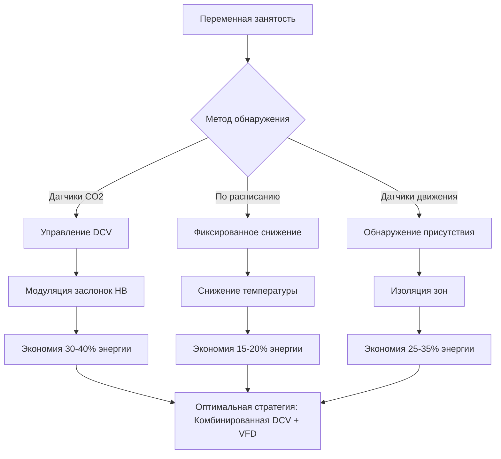
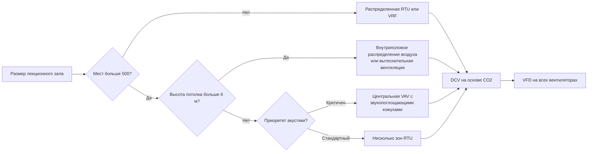

## Масштабирование мощности системы для больших лекционных залов

Большие лекционные залы создают уникальные проблемы HVAC из-за высокой плотности людей, изменяющихся закономерностей посещаемости и акустических ограничений. Основное уравнение расчета тепловой нагрузки масштабируется нелинейно с занятостью:

$$Q_{total} = Q_{sensible} + Q_{latent} = \dot{m}c_p\Delta T + \dot{m}h_{fg}\Delta\omega$$

где $\dot{m}$ — расход воздуха (кг/с), $c_p$ — удельная теплоемкость (1,006 кДж/кг·К), $\Delta T$ — разность температур, $h_{fg}$ — скрытая теплота парообразования (2501 кДж/кг), и $\Delta\omega$ — изменение влагосодержания.

Для полностью занятого лекционного зала на 500 мест выделение тепла людьми доминирует:

- **Явная теплота на человека**: 75 Вт (сидя, легкая активность)
- **Скрытая теплота на человека**: 55 Вт
- **Общая метаболическая нагрузка**: 500 × 130 Вт = 65 000 Вт (18,5 кВт)

Это составляет 60-70% пиковой охлаждающей нагрузки в больших помещениях, что делает вариабельность нагрузки в зависимости от занятости критичной для проектирования системы.

## Подбор оборудования для пиковых нагрузок

### Компоненты нагрузки

| Компонент нагрузки | Малый (100 мест) | Средний (500 мест) | Большой (1000 мест) |
|----------------|-------------------|--------------------|--------------------|
| Явная теплота от людей | 7,5 кВт | 37,5 кВт | 75 кВт |
| Скрытая теплота от людей | 5,5 кВт | 27,5 кВт | 55 кВт |
| Освещение (LED, 10 Вт/м²) | 4 кВт | 15 кВт | 30 кВт |
| Ограждающие конструкции (в зависимости от климата) | 8-12 кВт | 20-30 кВт | 40-60 кВт |
| Нагрузка от вентиляции | 6-10 кВт | 30-50 кВт | 60-100 кВт |
| **Общая пиковая нагрузка** | **31-44 кВт** | **130-160 кВт** | **260-320 кВт** |

### Требования вентиляции

ASHRAE 62.1 определяет требования к наружному воздуху для лекционных залов:

$$V_{oz} = R_p \times P_z + R_a \times A_z$$

где:
- $R_p$ = 7,5 CFM/человека (норма наружного воздуха на человека)
- $R_a$ = 0,06 CFM/м² (норма наружного воздуха на площадь)
- $P_z$ = проектная занятость
- $A_z$ = площадь зоны (м²)

Для зала на 500 мест (740 м²):

$$V_{oz} = 7,5 \times 500 + 0,06 \times 7970 = 3,753 + 478 = 4,231 \text{ CFM (120 м³/ч)}$$

При 50% занятости вентиляция с управлением спросом (DCV) снижает это значение примерно до 2 600 CFM (73 м³/ч), значительно влияя на энергопотребление.

## Стратегии повышения эффективности при частичной нагрузке

Большие лекционные залы обычно работают при частичной занятости 60-80% рабочих часов. Деградация коэффициента производительности (COP) при частичной нагрузке следует закономерности:

$$COP_{part} = COP_{rated} \times PLR \times LF$$

где $PLR$ — отношение частичной нагрузки, а $LF$ — коэффициент нагрузки (обычно 0,85-0,95 для оборудования с переменной производительностью).

### Сравнение работы при частичной нагрузке

### Реализация привода с переменной частотой

Соотношение мощности вентилятора демонстрирует кубическое снижение энергопотребления:

$$P_{fan} = \frac{\dot{V} \times \Delta P}{\eta_{fan}} \propto \dot{V}^3$$

Снижение расхода воздуха до 60% от проектного (типичная частичная нагрузка) дает:

$$P_{60\%} = 0.6^3 \times P_{design} = 0.216 \times P_{design}$$

Это снижение мощности на 78% при 60% расхода делает переменный объем воздуха (VAV) с приводами переменной частоты (VFD) необходимыми для больших лекционных залов.

## Центральные и распределенные системы

### Центральные всевоздушные системы

**Преимущества:**
- Централизованный доступ для обслуживания
- Превосходный контроль влажности через большие охлаждающие батареи
- Акустическая изоляция (машинное отделение удалено от занятых помещений)
- Более низкая стоимость оборудования за кВт
- Более легкая интеграция рекуперации энергии

**Недостатки:**
- Большие требования к воздуховодам (воздуховоды подачи обычно 0,15-0,20 м² на 100 мест)
- Более высокие потери энергии вентилятора из-за потерь при распределении
- Ограниченный контроль по зонам
- Риск отказа в одной точке

### Распределенные системы

**Типы конфигурации:**
- Несколько кровельных установок (RTU) с выделенными зонами
- Системы охлажденного потолка с децентрализованным охлаждением явной теплоты
- Системы переменного хладагента (VRF) с несколькими внутренними блоками

**Сравнение производительности:**

| Параметр | Центральная VAV | Распределенная RTU | Система VRF |
|-----------|-------------|-----------------|------------|
| Энергетическая эффективность (IPLV) | 14-16 EER | 12-14 EER | 16-20 EER |
| Точность управления по зонам | ±1,1°C | ±0,6°C | ±0,3°C |
| Акустическое исполнение | Отлично (NC 25-30) | Хорошо (NC 30-35) | Очень хорошо (NC 25-30) |
| Сложность обслуживания | Средняя | Низкая | Высокая |
| Первоначальная стоимость ($/кВт) | $1 200-1 500 | $1 000-1 200 | $1 600-2 000 |

### Блок-схема выбора системы

## Рекомендации проектирования для высокоэффективной работы

**Для залов на 100-250 мест:**
- Несколько малых RTU (8,8-17,6 кВт каждая) с индивидуальным управлением по зонам
- DCV с датчиками CO2 (уставка 1 000-1 200 ppm)
- Управление по расписанию с периодом предварительного нагрева 1 час

**Для залов на 250-500 мест:**
- Центральная система VAV с 4-6 зонами или распределенная VRF
- Блоки с принудительным питанием серии или двойной воздуховод для периметральных зон
- Вентилятор рекуперации энергии (ERV) с эффективностью 70-80%
- Ночное снижение температуры до 29°C охлаждения/15°C отопления

**Для залов на 500-1000 мест:**
- Центральная установка охлажденной воды с переменным первичным расходом
- Внутриполовое распределение воздуха при 0,8-1,0 CFM/м² для улучшенной стратификации
- Система выделенного наружного воздуха (DOAS) с рекуперацией энергии
- Тепловой аккумулятор для снижения пикового спроса
- Интеграция автоматизации здания с системами расписания лекций

Выбор между центральной и распределенной архитектурой зависит в основном от акустических требований, возможностей обслуживания и более широкой инфраструктуры HVAC здания. Центральные системы превосходны в больших помещениях, где имеется место для воздуховодов и требуется превосходный контроль влажности, в то время как распределенные системы обеспечивают лучшую эффективность при частичной нагрузке и резервирование для залов среднего размера.

## Компоненты

- Малый лекционный зал 100-250 мест
- Средний лекционный зал 250-500 мест
- Большой лекционный зал 500-1000 мест
- Аудиториальное размещение мест
- Гибридная конструкция класса
- Планирование плотности занятости
- Координация HVAC при обеспечении доступности
