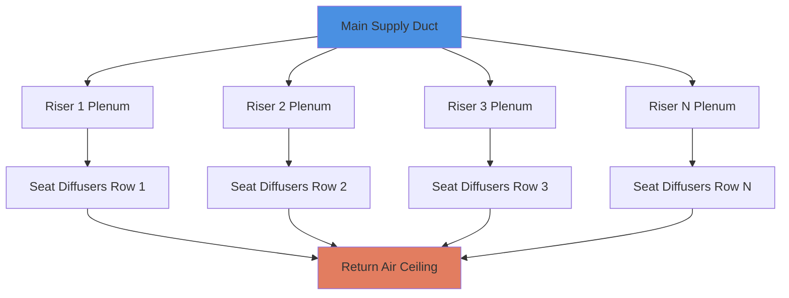
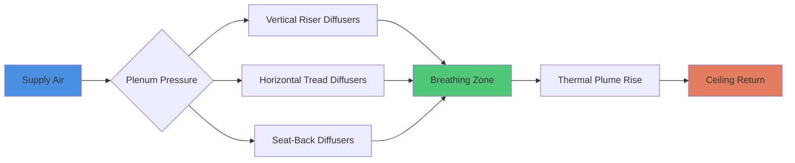

Конфигурации ярусной посадки в лекционных залах представляют уникальные проблемы с потоком воздуха из-за геометрии ступенчатого пола, вертикальных градиентов температуры и необходимости подачи кондиционированного воздуха на несколько высотных уровней. Наклонное пространство создает сложные картины тепловой стратификации, принципиально отличающиеся от приложений с плоским полом.

## Физические принципы кондиционирования ярусного пространства

Доминирующим физическим явлением в ярусной посадке является **вертикальная тепловая стратификация**, вызванная силами плавучести. Теплый воздух от людей поднимается через вертикальный столб, создавая градиент температуры, описываемый следующим образом:

$$\frac{dT}{dz} = \frac{Q_{sensible}}{A \cdot \rho \cdot c_p \cdot v_z}$$

Где:
- $\frac{dT}{dz}$ = вертикальный градиент температуры (K/м)
- $Q_{sensible}$ = полезная тепловая нагрузка от людей (кДж/ч)
- $A$ = горизонтальная площадь поперечного сечения (м²)
- $\rho$ = плотность воздуха (кг/м³)
- $c_p$ = удельная теплоёмкость воздуха (кДж/кг·K)
- $v_z$ = вертикальная скорость воздуха (м/с)

В ярусной посадке люди на верхних рядах испытывают более теплые условия, если система не управляет активно этой стратификацией. Разница температур между самым низким и самым высоким рядами может достигать 2,8–4,4°C без надлежащей конструкции системы вентиляции.

## Системы подпольной подачи воздуха

Подпольная подача воздуха (UFAD) использует структуру ступенчатого пола как серию горизонтальных пленумов. Воздух, поданный с низкой скоростью (0,25–0,51 м/с) под каждый подступенок, создает зоны положительного давления, которые питают вертикальные диффузоры.

### Температура и расход подаваемого воздуха

Системы UFAD в ярусной посадке обычно работают с температурой подаваемого воздуха 17–18°C, что теплее, чем в традиционных потолочных системах (13°C). Требуемый массовый расход подаваемого воздуха на человека составляет:

$$\dot{m}_{person} = \frac{Q_{sensible,person}}{c_p \cdot \Delta T_{supply}}$$

Для типичного человека, производящего 264 кДж/ч полезного тепла с повышением температуры на 6,7°C:

$$\dot{m}_{person} = \frac{264}{1.005 \cdot 6.7} = 39 \text{ кг/ч (при плотности 1.2 кг/м³ ≈ 32 м³/ч)}$$

ASHRAE Standard 62.1 требует минимальной скорости вентиляции 2,4 м³/ч на человека для наружного воздуха в дыхательной зоне, но тепловая нагрузка требует значительно более высокого фактического расхода подачи.

### Распределение давления в пленуме

Каждая полость подступенка действует как герметичная камера. Перепад давления вдоль длины пленума следует:

$$\Delta P = f \cdot \frac{L}{D_h} \cdot \frac{\rho v^2}{2}$$

Где $D_h$ – гидравлический диаметр полости подступенка. Надлежащая балансировка требует потерь давления менее 12,4 Па для поддержания равномерного выпуска диффузоров по ряду.

## Вытеснительная вентиляция через пленумы сидений

Вытеснительная вентиляция использует поток, управляемый плавучестью, вводя холодный воздух на уровне пола и позволяя тепловым шлейфам переносить загрязняющие вещества вверх. Эффективность зависит от числа Архимеда:

$$Ar = \frac{g \cdot \beta \cdot \Delta T \cdot H}{v_0^2}$$

Где:
- $g$ = ускорение свободного падения (9,81 м/с²)
- $\beta$ = коэффициент теплового расширения (1/T для идеального газа)
- $\Delta T$ = разница температур между подачей и помещением (K)
- $H$ = характеристическая высота (м)
- $v_0$ = скорость подачи (м/с)

Для эффективной работы вытеснительной вентиляции требуется $Ar > 1$, обеспечивая, чтобы силы плавучести преобладали над инерционными силами. Типичные диффузоры на уровне сидений выпускают воздух со скоростью 0,25–0,41 м/с с разницей температур 5,6–6,7°C.

### Проектирование диффузоров, встроенных в сиденья

Диффузоры, установленные на полу или встроенные в сиденья, должны удовлетворять следующим требованиям:

1. **Низкая скорость выпуска** для предотвращения сквозняков (< 0,51 м/с в занятой зоне)
2. **Достаточный выброс** для достижения уровня лодыжки без застоя
3. **Низкий шум** (NC 30–35 для лекционных залов согласно Справочнику приложений ASHRAE)

Эффективная температура сквозняка (EDT) должна оставаться ниже 1,7°C:

$$EDT = (T_{air} - T_{set}) - 8(v_{air} - 0.15)$$

Где $v_{air}$ в м/с. Диффузоры сидений со скоростью выпуска 0,25 м/с и температурой подачи 18°C поддерживают приемлемые значения EDT.

## Управление тепловой стратификацией

Проблема в ярусной посадке – поддержание равномерности температуры при вертикальных перепадах высоты. Высота стратификации $h_s$, где начинает расти температура, составляет:

$$h_s = \frac{Q_{total}}{A \cdot \rho \cdot c_p \cdot \Delta T_{return}}$$

Системы должны соблюдать два конкурирующих требования:

| Подход проектирования | Место подачи | Градиент температуры | Эффективность вентиляции | Энергоэффективность |
|----------------------|--------------|----------------------|--------------------------|---------------------|
| Верхнее смешивание | Уровень потолка | Равномерная | Умеренная (0,8–1,0) | Умеренная |
| UFAD с вытеснением | Уровень пола | Стратифицированная | Высокая (1,2–1,8) | Высокая |
| Подача на уровне сиденья | Полости подступенка | Контролируемый градиент | Высокая (1,3–1,6) | Высокая |
| Гибридная верхняя/подпольная | Комбинированная | Переменная | Высокая (1,1–1,4) | Умеренно-высокая |

Системы вытеснительной вентиляции достигают более высокой эффективности вентиляции $\varepsilon_v$:

$$\varepsilon_v = \frac{C_{exhaust} - C_{supply}}{C_{breathing} - C_{supply}}$$

Значения 1,2–1,8 являются типичными для хорошо спроектированных систем вытеснения в сравнении с 0,8–1,0 для систем смешивания.

## Размещение диффузоров подачи на ступенчатых полах

Размещение диффузоров следует геометрии подступенка. Существуют три основные конфигурации:

1. **Крепление на вертикальную грань подступенка**: Диффузоры, встроенные в вертикальную грань каждой ступени
2. **Крепление на горизонтальную проступь**: Установленные на полу агрегаты в поверхности проступи
3. **Интеграция в спинку сиденья**: Подача через перфорированные спинки сидений

### Расстояние и распределение потока воздуха

Расстояние между диффузорами должно учитывать картины выброса и перекрытие. Для систем вытеснения:

$$L_{max} = 2 \cdot x_{0.5}$$

Где $x_{0.5}$ – горизонтальное расстояние до снижения скорости на 50%. Типичные диффузоры сидений достигают $x_{0.5}$ от 0,9 до 1,2 м, требуя максимального расстояния 1,8–2,4 м.

Поток воздуха на диффузор масштабируется в соответствии с плотностью заполнения:

$$м³/ч_{diffuser} = \frac{OA_{person} \cdot n_{occupants}}{n_{diffusers}}$$

Для требования 9,4 м³/ч наружного воздуха на человека и 2 человек на диффузор: минимум 18,8 м³/ч на диффузор.

## Рассмотрение воздуха, удаляемого из помещения

Местоположение удаляемого воздуха критически влияет на стратификацию. Потолочные возвраты в ярусных помещениях захватывают самый теплый воздух, позволяя полезной стратификации снижать охлаждающие нагрузки. Температура удаляемого воздуха в режиме вытеснения составляет:

$$T_{return} = T_{supply} + \frac{Q_{sensible}}{\dot{m}_{supply} \cdot c_p}$$

При надлежащем потоке вытеснения температуры удаления могут достигать 25,6–26,7°C при поддержании 22–23,3°C в дыхательной зоне, повышая эффективность холодильника.

## Рекомендации по проектированию

Согласно ASHRAE Standard 55, тепловой комфорт в ярусной посадке требует:

- Операционная температура: 20–24,4°C (зима–лето)
- Вертикальная разница температур воздуха (лодыжка–голова): < 2,8°C
- Скорость сквозняка: < 0,20 м/с на уровне лодыжки
- Относительная влажность: 30–60%

Достижение этих целевых показателей в ярусной посадке требует:

1. Подачи воздуха на уровне людей (UFAD или вытеснение)
2. Низкоскоростных диффузоров (выпуск 0,25–0,51 м/с)
3. Адекватного потока воздуха на человека (28–47 м³/ч в целом, 7–9,4 м³/ч наружного воздуха)
4. Сбалансированного по давлению распределения пленума (< 12,4 Па вариации)
5. Потолочного возврата воздуха для использования стратификации

Физика управляемого плавучестью потока в ступенчатой геометрии делает подпольную вытеснительную вентиляцию оптимальным решением для больших ярусных лекционных залов, объединяя превосходное качество воздуха в помещении, тепловой комфорт и энергоэффективность.
