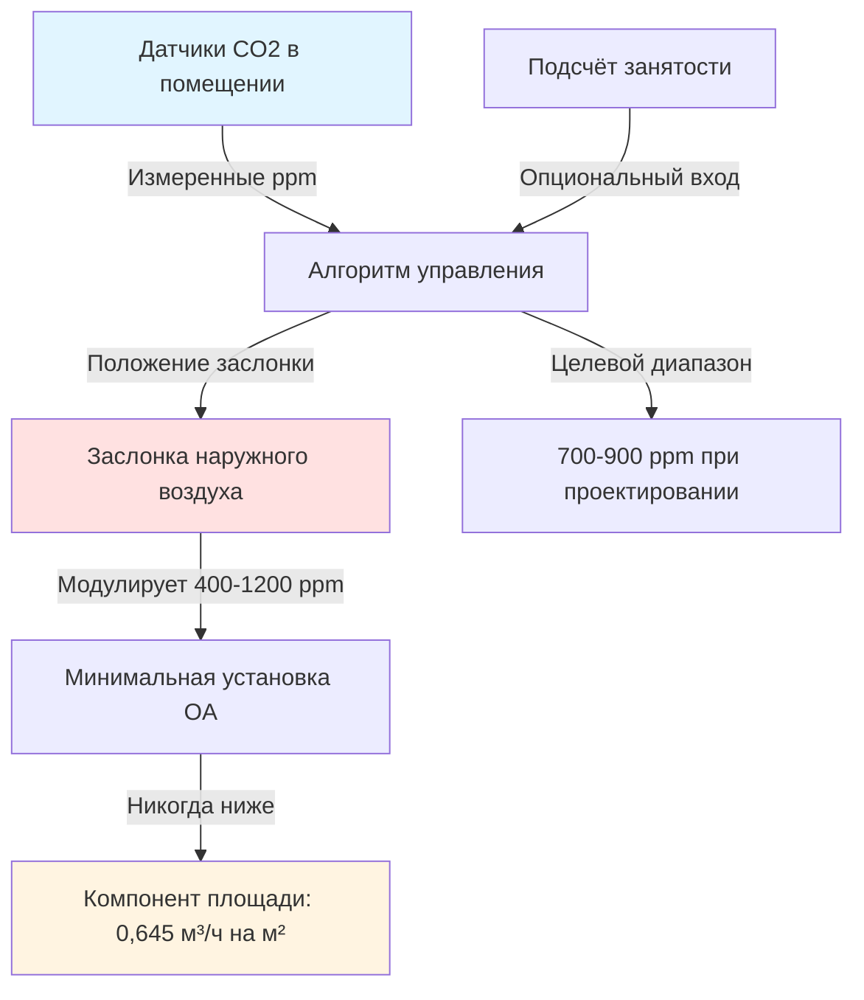
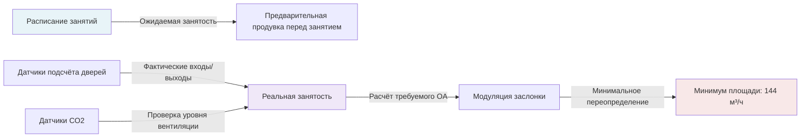

## Требования ASHRAE 62.1 по вентиляции лекционных залов

Лекционные залы представляют уникальные проблемы вентиляции из-за высокой плотности занятости, переменного расписания и продолжительных периодов использования. Стандарт ASHRAE 62.1 устанавливает минимальные требования к наружному воздуху на основе как количества людей, так и площади помещения для учёта загрязнителей от человеческого метаболизма и строительных материалов.

### Расчёт требуемого уровня вентиляции при проектировании

Требуемый расход наружного воздуха для вентиляции лекционных залов объединяет два компонента:

$$V_{bz} = R_p \times P_z + R_a \times A_z$$

Где:
- $V_{bz}$ = расход наружного воздуха в зоне дыхания (м³/ч)
- $R_p$ = расход наружного воздуха на человека = 12,7 м³/ч на человека
- $P_z$ = численность населения зоны (расчётная занятость)
- $R_a$ = расход наружного воздуха на единицу площади = 0,645 м³/ч на м²
- $A_z$ = площадь пола зоны (м²)

**Пример расчёта:**
Для лекционного зала площадью 223 м² с расчётной занятостью 120 человек:

$$V_{bz} = (12,7 \times 120) + (0,645 \times 223) = 1,524 + 143,8 = 1,668 \text{ м³/ч}$$

Этот двухкомпонентный подход признаёт, что биоэффлюенты человека (в основном CO₂, соединения запаха тела и дыхательные аэрозоли) доминируют в пространствах высокой плотности, тогда как выбросы, зависящие от площади, от материалов, мебели и чистящих средств создают постоянную фоновую нагрузку.

### Эффективность в зоне дыхания и вентиляция систем

Расход вентиляции в зоне дыхания должен быть скорректирован с учётом неэффективности распределения на уровне системы. ASHRAE 62.1 вводит коэффициент эффективности распределения воздуха в зоне ($E_z$) и эффективность вентиляции системы ($E_v$):

$$V_{ot} = \frac{V_{bz}}{E_z \times E_v}$$

**Типичные значения эффективности для лекционных залов:**

| Система распределения | Коэффициент $E_z$ | Примечания к применению |
|---------------------|--------------|-------------------|
| Потолочная подача, источники тепла на полу | 1,0 | Стандартная конфигурация |
| Вытесняющая вентиляция | 1,2 | Низкоскоростная подача с пола |
| Подпольная система распределения воздуха | 1,2 | Стратифицированная подача ниже зоны дыхания |
| Смешивающая верхняя подача со стеновыми возвратами | 0,9 | Плохое перемешивание в глубоких помещениях |
| Подача с высокой боковой стены | 0,8 | Возможное короткое замыкание |

Эффективность вентиляции системы ($E_v$) учитывает многозонные системы, в которых некоторые зоны могут быть недовентилированы по сравнению с другими. Для однозонных систем свежего воздуха, обслуживающих лекционные залы, $E_v = 1,0$. Для многозонных систем с рециркуляцией на уровне зоны $E_v$ обычно составляет от 0,6 до 0,9 в зависимости от разнообразия системы.

### Кратность воздухообмена в образовательных помещениях

Хотя ASHRAE 62.1 не предписывает кратность воздухообмена, типичные лекционные залы работают при:

$$ACH = \frac{V_{подача} \times 60}{Объём}$$

**Типичные диапазоны кратности воздухообмена:**

| Условие | Диапазон кратности | Характер вентиляции |
|-----------|-----------|----------------------|
| Только минимум наружного воздуха | 2-4 кратн. | Контроль биоэффлюентов |
| Расчётная общая подача | 6-10 кратн. | Управление тепловой нагрузкой |
| Высокая плотность (>3,7 м² на человека) | 8-12 кратн. | Повышенное перемешивание |

Лекционный зал площадью 223 м² с высотой потолка 3,7 м (объём 825 м³), требующий 1,668 м³/ч наружного воздуха, представляет:

$$ACH_{OA} = \frac{1,668}{825} = 2,0 \text{ кратн. (только наружный воздух)}$$

Общий подаваемый воздух, включая рециркуляцию для охлаждающих нагрузок, обычно обеспечивает 6-8 кратности воздухообмена.

### Управляемая вентиляция по спросу на основе CO₂

Управляемая вентиляция по спросу (DCV) модулирует поступление наружного воздуха на основе измеренных концентраций CO₂ как суррогата занятости. Установившаяся концентрация CO₂ в помещении следует:

$$C_{space} = C_{outdoor} + \frac{N \times G}{V_{OA} \times 60}$$

Где:
- $C_{space}$ = концентрация CO₂ в помещении (ppm)
- $C_{outdoor}$ = концентрация CO₂ на улице ≈ 420 ppm (атмосферная в 2025 году)
- $N$ = количество людей
- $G$ = скорость выделения CO₂ на человека ≈ 8,5 л/ч при малоподвижной деятельности
- $V_{OA}$ = расход вентиляции наружного воздуха (м³/ч)

Для расчётного условия (120 человек, 1,668 м³/ч):

$$C_{space} = 420 + \frac{120 \times 8,5}{1,668} = 420 + \frac{1,020}{1,668} = 421 \text{ ppm}$$

**Стратегия реализации DCV:**

**Параметры управления DCV:**

| Параметр | Значение | Основание |
|-----------|-------|-------|
| Базовое значение CO₂ на улице | 420 ppm | Текущая атмосферная концентрация |
| Точка установки внутри помещения при проектировании | 700-900 ppm | Соответствие ASHRAE 62.1 при расчётной занятости |
| Минимальное положение заслонки | Компонент площади / Расчётный OA | 144 м³/ч / 1,668 м³/ч = 8,6% |
| Мёртвая зона управления | ±50 ppm | Предотвращение колебаний |
| Требуемая точность датчика | ±75 ppm | Руководство ASHRAE |

### Интеграция датчиков занятости

Современные системы вентиляции лекционных залов интегрируют обнаружение занятости через:

1. **Датчики пассивного инфракрасного излучения (PIR)**: Обнаруживают наличие людей, но не считают их
2. **Датчики CO₂**: Определяют занятость по метаболической нагрузке
3. **Прямой подсчёт людей**: На основе камер или счётчиков входящих
4. **Плановая занятость**: Интеграция с системой управления зданием

**Многодатчиковая логика DCV:**

Последовательность управления должна непрерывно поддерживать компонент на основе площади (0,645 м³/ч на м²), даже в неиспользуемые периоды в многозонных системах, где соседние помещения остаются занятыми.

### Эффективность вентиляции на практике

Эффективность в зоне дыхания зависит от достижения надлежащего перемешивания воздуха в занятой зоне. Лекционные залы с многоярусными сидениями представляют проблемы:

**Факторы, влияющие на $E_z$:**

- **Тепловая стратификация**: Тепло от людей и оборудования поднимается вверх, снижая перемешивание
- **Дифференциал температуры подаваемого воздуха**: Холодная подача воздуха (ΔT > 11°C) может стратифицироваться
- **Расположение возврата воздуха**: Высокие возвраты в многоярусных залах могут привести к короткому замыканию подачи
- **Выбор диффузора**: Диффузоры с высокой индукцией улучшают перемешивание

Для оптимальной производительности подаваемый воздух должен поступать с умеренными скоростями (2-3 м/с на диффузоре) с рисунками разброса, достигающими 75% длины помещения. Высота потолков более 3,7 м требует особого внимания к расчётам дальности разброса:

$$Throw = \frac{V_0}{K} \times \left(\frac{A_k}{A_0}\right)$$

Где конечная скорость на расстоянии разброса должна поддерживать минимум 0,25 м/с для достаточного перемешивания в зоне дыхания.

### Практические соображения проектирования

**Стратегия предварительной продувки:**
Лекционные залы выигрывают от предварительной продувки вентиляции перед началом занятий, работающей на 100% наружном воздухе в течение 30-60 минут перед запланированным использованием для снижения накопления загрязнителей от предыдущих сеансов.

**Переходная реакция CO₂:**
Во время повышения занятости концентрация CO₂ следует логарифмической кривой первого порядка:

$$C(t) = C_{final} \times (1 - e^{-t/\tau})$$

Где постоянная времени $\tau = V/V_{OA}$ (объём помещения / расход вентиляции). Для примера зала, $\tau = 825/1,668 = 0,49$ часа, что означает, что 95% установившегося значения CO₂ достигаются приблизительно через $3\tau = 1,47$ часа.

**Проверка и наладка:**
- Произведение измерений наружного воздуха при множественных положениях заслонки
- Проверка калибровки датчика CO₂ по эталонным стандартам
- Документирование расхода воздуха в зоне при расчётных условиях
- Подтверждение допущений $E_z$ через визуализацию дыма или тестирование с использованием газов-трассеров

Надлежащая вентиляция в лекционных залах требует интеграции скоростей метаболических и материальных выбросов, коррекции с учётом эффективности распределения и реализации адаптивных стратегий управления, которые поддерживают качество воздуха в помещении при переменной занятости, одновременно оптимизируя энергопотребление.
