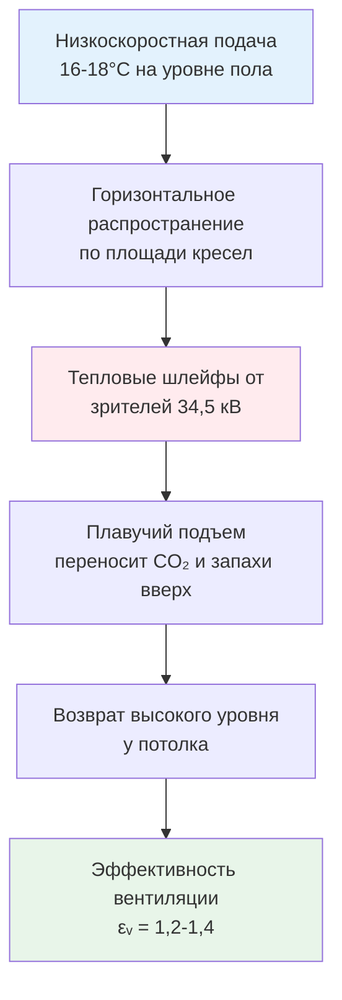
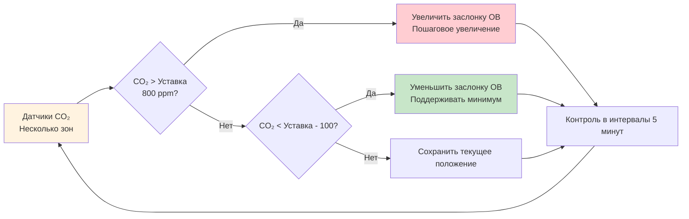

Кинотеатры представляют исключительные сложности при проектировании HVAC из-за экстремальных колебаний занятости, строгих акустических требований и физики кондиционирования сидящей аудитории в затемненных помещениях. Прерывистый характер кинопроизводства создает нестационарные тепловые нагрузки, которые традиционные модели комфорта не в состоянии адекватно описать.

## Характеристики тепловых нагрузок

Кинозалы испытывают колебания нагрузок, превышающие 60 Вт/м² в течение 30-минутных интервалов при входе аудитории. Выделение метаболического тепла зрителями доминирует в профиле тепловой нагрузки:

$$Q_{total} = Q_{occupants} + Q_{lights} + Q_{equipment} + Q_{envelope}$$

Для типичного кинозала на 300 мест:

$$Q_{occupants} = N \times q_{met} = 300 \times 115\text{ Вт} = 34,5\text{ кВ}$$

Это представляет 70-80% пиковой явной нагрузки во время киносеанса. Скрытая составляющая от дыхания и испарения пота добавляет приблизительно 25 Вт на человека, создавая значительные требования к управлению влажностью.

Проблема нестационарного отклика вытекает из взаимодействия с тепловой массой. Поверхности стен и кресел поглощают лучистое тепло во время занятости, а затем отдают его после ухода зрителей. Эта задержка создает отставание 45-90 минут между изменением занятости и достижением теплового равновесия:

$$\frac{dT}{dt} = \frac{Q_{net} - hA(T_{surface} - T_{air})}{mc_p}$$

Системы должны предварительно охлаждать помещения перед сеансом для компенсации эффекта теплоемкости.

## Акустические ограничения и проектирование системы

Кинотеатры требуют рейтингов Noise Criteria от NC 25 до NC 35, находящихся среди самых строгих для коммерческих зданий. Эти ограничения налагают серьезные ограничения на скорости воздуха и выбор оборудования.

Соотношение между скоростью воздуха в воздуховоде и регенерируемым шумом следует:

$$L_w = 10\log_{10}(V^6) + K$$

Где $V$ — скорость в м/с и $K$ учитывает геометрию воздуховода. Поддержание NC 30 обычно ограничивает скорость воздуха до 4-5 м/с в занятых зонах, по сравнению с 7-10 м/с в обычных коммерческих помещениях.

Это ограничение скорости напрямую влияет на размеры воздуховодов и требования к давлению системы:

| Параметр | Обычный офис | Кинотеатр | Коэффициент влияния |
|----------|--------------|----------|---------------------|
| Скорость в главном воздуховоде | 9 м/с | 4,5 м/с | 2× большая площадь |
| Скорость в сопле диффузора | 5 м/с | 2,5 м/с | 4× снижение перепада давления |
| Статическое давление вентилятора | 750 Па | 400 Па | Меньшая энергия, больше воздуховодов |
| Скорость возвратной решетки | 3 м/с | 1,5 м/с | 4× большая площадь решетки |

Акустическое требование вынуждает применение стратегий вытеснительной вентиляции с низкоскоростной подачей и размещением возврата воздуха высоко.

## Эффективность вентиляции для сидящей аудитории

ASHRAE 62.1 предписывает 7,5 л/с на человека для театров, но эффективность доставки значительно варьируется в зависимости от стратегии распределения воздуха. Сидячее положение создает отчетливые тепловые зоны:

**Концентрация в зоне дыхания:**

$$\frac{C_e}{C_r} = \frac{1}{\varepsilon_v}$$

Где $\varepsilon_v$ — эффективность вентиляции. Обычная верхняя смесительная вентиляция дает $\varepsilon_v = 0,8$, в то время как вытеснительная вентиляция достигает $\varepsilon_v = 1,2-1,4$.

Физика, благоприятствующая системам вытеснения, сосредоточена на потоке, управляемом плавучестью. Холодный подаваемый воздух (16-18°C), поступающий на уровне пола, распространяется горизонтально, а затем поднимается через занятую зону по мере поглощения тепла от зрителей:

$$\frac{dh}{dt} = \frac{g\beta\Delta T}{1 + (C_d A / A_c)^2}$$

Это создает вертикальный градиент температуры 2-4°C между уровнем лодыжек и головы, обеспечивая комфорт при повышении эффективности удаления загрязняющих веществ.

## Контроль запахов и качество воздуха

Кинотеатры накапливают разнообразные загрязняющие вещества: CO₂ от дыхания, летучие органические соединения от продовольственных киосков и частицы от ковровых покрытий и тканей. Увеличение концентрации диоксида углерода служит индикатором адекватности вентиляции:

$$\frac{dC}{dt} = \frac{N \times G - Q(C - C_o)}{V}$$

Где:
- $N$ = занятость (человек)
- $G$ = скорость выделения CO₂ (0,005 л/с на человека)
- $Q$ = скорость вентиляции (л/с)
- $V$ = объем помещения (м³)
- $C_o$ = концентрация CO₂ на улице

Поддержание CO₂ ниже 1000 ppm требует:

$$Q_{min} = \frac{N \times G}{(C_{max} - C_o)} = \frac{300 \times 0,005}{(0,001 - 0,0004)} = 2500\text{ л/с}$$

Это превышает минимумы ASHRAE 62.1 (2250 л/с для 300 занимающих), показывая, что контроль запахов часто определяет скорость вентиляции.

Вентиляция, управляемая спросом с использованием датчиков CO₂, позволяет снизить энергопотребление в периоды низкой занятости:

## Проблемы однородности температуры

Затемненные помещения исключают лучистый обмен тепла с поверхностями, делая зрителей более чувствительными к колебаниям температуры воздуха. Эффект средней лучистой температуры снижается:

$$T_{operative} = \frac{h_c T_{air} + h_r T_{mrt}}{h_c + h_r}$$

В темноте $h_r$ приближается к нулю при уменьшении длинноволнового лучистого обмена, вынуждая $T_{operative} \approx T_{air}$. Это требует более жесткого контроля температуры воздуха (±0,5°C), чем в типичных коммерческих помещениях (±1,0°C).

Стратификация усугубляет проблемы однородности. Вертикальные температурные градиенты следуют:

$$\frac{dT}{dz} = \frac{Q_{convective}}{kA} - \frac{g}{c_p}$$

Амфитеатровая схема посадки усиливает этот эффект, с приподнятыми рядами, испытывающими на 1-2°C более теплые условия, чем нижние кресла. Компенсирующие стратегии потока воздуха включают:

- Отдельное зональное управление для верхних рядов
- Размещение возвратного воздуха на нескольких высотах
- Подполные диффузоры для индивидуального кондиционирования
- Потолочные вентиляторы для мягкой циркуляции воздуха (требует акустической изоляции)

## Выбор системы и стратегия управления

Оптимальные системы HVAC кинотеатров балансируют акустическую производительность, отклик нагрузки и энергоэффективность:

| Тип системы | Акустическая производительность | Отклик нагрузки | Энергоэффективность | Применение |
|-------------|--------------------------------|-----------------|---------------------|-----------|
| Переменный расход воздуха (VAV) | Хорошая (с низкоскоростным проектированием) | Отличная | Отличная | Большие кинокомплексы |
| Выделенная система наружного воздуха (DOAS) + лучистое | Отличная (минимальное движение воздуха) | Плохая (задержка лучистого) | Хорошая | Премиум-театры |
| Подпольное распределение воздуха (UFAD) | Отличная (режим вытеснения) | Хорошая | Очень хорошая | Однозальные кинотеатры |
| Охлажденные балки + DOAS | Отличная (разделенная вентиляция) | Удовлетворительная | Отличная | Современные проекты |

Последовательности управления должны предугадывать переходы занятости. Предварительное охлаждение начинается за 60-90 минут до начала сеанса для преодоления задержек тепловой массы. Вентиляция после сеанса осуществляется с повышенной скоростью в течение 15-20 минут для удаления накопившихся загрязняющих веществ перед переходом в режим ненанятости.

Профиль прерывистой нагрузки создает уникальные возможности для аккумулирования тепловой энергии и переноса нагрузки, которые значительно снижают эксплуатационные расходы в должным образом спроектированных системах.

## Стандарты и справочные материалы по проектированию

- ASHRAE 62.1: Вентиляция для приемлемого качества внутреннего воздуха (7,5 л/с на человека)
- ASHRAE 55: Тепловой комфорт в затемненных помещениях (сниженный лучистый обмен)
- AHRI 885: Процедура определения уровней звука в занятых помещениях
- ISO 3382-1: Акустика измерений в помещениях с производительностью (информативная для шума HVAC)

Успешное проектирование HVAC кинотеатра требует интегрированного акустического и теплового анализа, предвосхищающих стратегий управления и признания того, что тепловой комфорт занимающихся в затемненных помещениях принципиально отличается от обычных коммерческих приложений.
