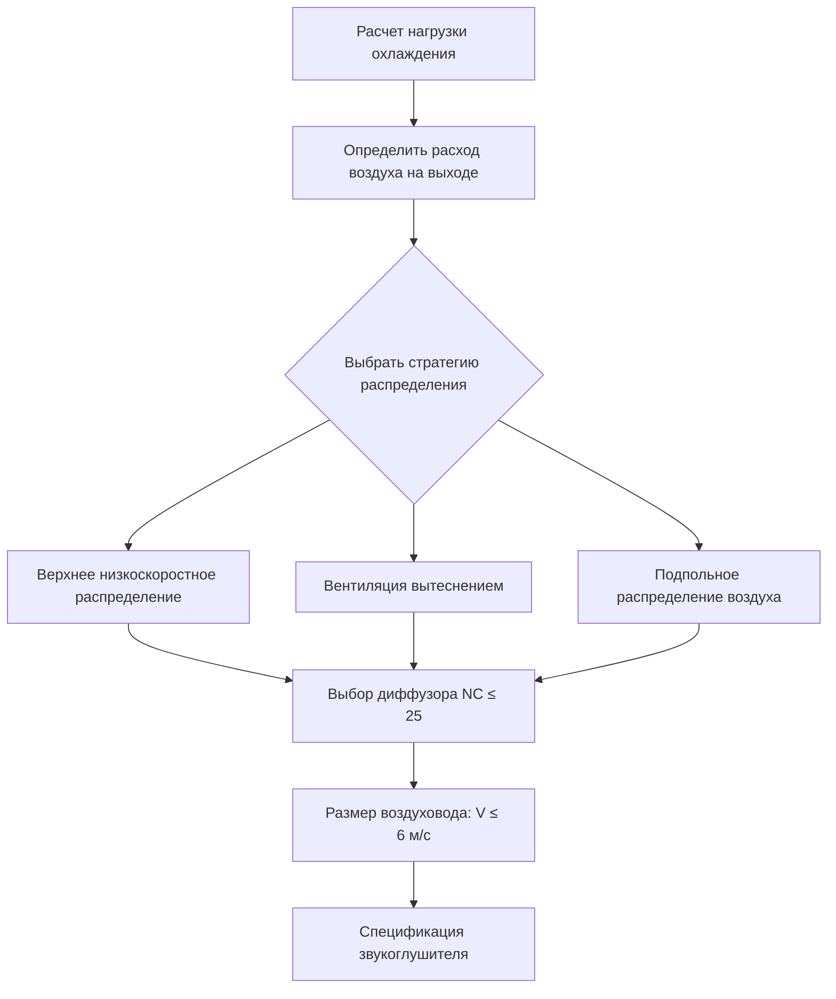
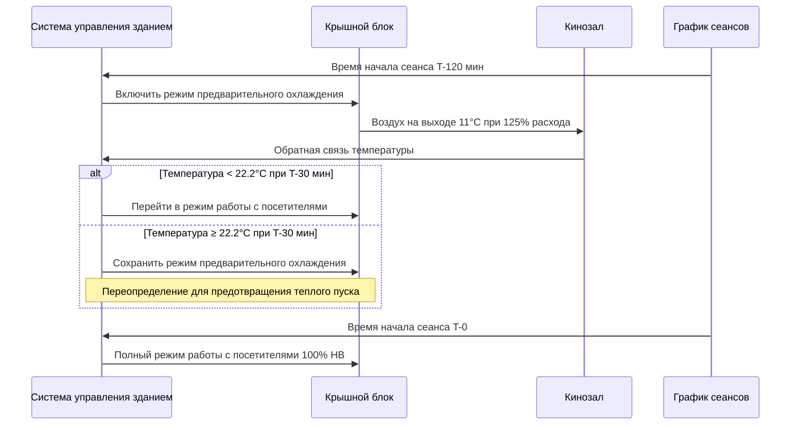

## Выбор архитектуры системы

Системы кондиционирования воздуха в кинотеатрах сталкиваются с противоречивыми требованиями: высокие явные охлаждающие нагрузки от посетителей и оборудования, строгие акустические критерии (NC 25-30) и высокую изменчивость графика посещаемости, требующую быстрого охлаждения до проектной мощности.

### Крышные блоки в сравнении с центральными станциями

**Моноблочные крышные кондиционеры** доминируют в приложениях кинотеатров по ряду физических и экономических причин:

- **Исключение тепловой инерции**: Прямой доступ наружного воздуха исключает тепловую инерцию трубопроводов охлажденной воды, обеспечивая более быстрый отклик температуры при предварительном охлаждении
- **Эффективность холодильного контура**: Прямое расширение холодильного агента обеспечивает коэффициент эффективности (COP) 3.0-3.5 в номинальных условиях, в сравнении с 2.5-3.0 для систем на базе чиллеров при учете потерь на насосы и градирни
- **Акустическая изоляция**: Вибрация оборудования остается вне внутреннего пространства здания, снижая передачу структурного шума

**Центральные станции с охлажденной водой** обеспечивают преимущества для крупных кинокомплексов (8+ экранов):

| Параметр | Крышные блоки | Центральная станция |
|-----------|---------------|---------------|
| Начальная стоимость | $15-25/CFM | $25-35/CFM |
| Коэффициент разнообразия | 1.0 на зону | 0.7-0.8 по системе |
| Доступ для обслуживания | На уровне крыши | В механическом помещении |
| Избыточность | Отказ отдельного блока | Уязвимость всей системы |
| Эффективность при частичной нагрузке | Фиксированные ступени | Непрерывная модуляция |

Преимущество коэффициента разнообразия становится значительным для объектов, превышающих 67,800 CFM (м³/ч) полного расхода воздуха, где центральные системы получают выгоду от статистического усреднения пиковых нагрузок по нескольким кинозалам.

### Моноблочные системы в сравнении со сплит-системами

**Моноблочные крышные кондиционеры** размещают все холодильные компоненты в одном корпусе, в то время как **сплит-системы** разделяют конденсаторный блок и воздухообрабатывающий агрегат.

Тепловое отведение у конденсатора следует:

$$Q_{\text{rej}} = Q_{\text{evap}} + W_{\text{comp}} = Q_{\text{evap}} \left(1 + \frac{1}{\text{COP}}\right)$$

Для кинозала с нагрузкой охлаждения 105 кВ (360 000 кДж/ч) при COP = 3.0:

$$Q_{\text{rej}} = 360{,}000 \times \left(1 + \frac{1}{3.0}\right) = 480{,}000 \text{ кДж/ч}$$

**Преимущества моноблочной конфигурации**:
- Заводская сборка холодильных трубопроводов исключает полевую пайку и риск утечек
- Единая ответственность за проверку производительности
- Сниженные затраты на монтаж (на 40-60% ниже, чем сплит-системы)
- Встроенные экономайзерные заслонки и управление

**Приложения сплит-систем**:
- Размещение внутреннего воздухообрабатывающего агрегата снижает длину воздуховодов при ограниченном пространстве на крыше
- Разделение теплоотведения позволяет размещение конденсатора на уровне земли для облегчения обслуживания
- Несколько воздухообрабатывающих агрегатов на один конденсаторный блок в небольших объектах (2-4 экрана)

## Низкоскоростное распределение воздуха

Акустические критерии определяют конструкцию распределения воздуха. Связь между скоростью в воздуховоде и генерируемым шумом следует:

$$\text{PWL} = 10 \log_{10}(V^6)$$

где PWL — уровень звуковой мощности, а V — скорость. Снижение скорости с 10 м/с до 6 м/с снижает звуковую мощность на 14 дБ — критично для достижения целей NC 25-30.

### Параметры проектирования воздуха на выходе

Повышение температуры воздуха на выходе из-за теплопроникновения в воздуховод становится значительным в низкоскоростных системах:

$$\Delta T = \frac{Q_{\text{gain}}}{\.{m} c_p} = \frac{UA(T_{\text{ambient}} - T_{\text{supply}})}{\.{m} c_p}$$

Для 30 м неизолированного воздуховода из листовой стали с расходом 16,990 CFM (м³/ч) при 13°C в полости потолка 35°C:

- U-значение ≈ 5.1 Вт/м²·К (голый металл)
- Площадь поверхности ≈ 32 м² (диаметр 1.2 м)
- Теплопроникновение = 5.1 × 32 × (35 - 13) = 3,590 Вт
- Массовый расход воздуха = 16,990 CFM × 1.2 × 60 = 1,222,920 кг/ч
- Повышение температуры = 3,590 / (1,222,920 × 1,010) = 0.003°C

Требуется изоляция RSI 1.1 или прокладка через кондиционируемое пространство для поддержания точности заданного значения.

### Конфигурация пути обратного воздуха

| Конфигурация | Приложение | Акустическая производительность | Начальная стоимость |
|---------------|-------------|---------------------|------------|
| Воздуховоды возврата | Отдельные кинозалы | Отличная (изолированные пути) | Высокая |
| Полостный возврат | Небольшие кинотеатры (<200 мест) | Хорошая (требует перегородок) | Средняя |
| Возврат через коридор | Кинокомплексы | Удовлетворительная (требует переходных решеток) | Низкая |
| Возврат под сиденьями | Премиум-установки | Отличная (минимальная площадь воздуховода) | Очень высокая |

**Воздуховоды возврата** предотвращают перекрестную помеху между смежными кинозалами. Требуемая звукоизоляция следует:

$$\text{TL} = \text{SWL}_{\text{source}} - \text{NC}_{\text{target}} - 10\log_{10}(A/A_0)$$

где A — поглощение звука в помещении, а $A_0$ = 0.093 м². Для двух кинозалов на 400 мест с SWL = 85 дБ на низких частотах и целью NC 30, требуемая звукоизоляция перегородки превышает 50 дБ при 125 Гц — достижимо только с полностью воздуховодными возвратами или массивными полостными барьерами.

## Стратегии предварительного охлаждения

Посещаемость кинотеатра переходит от близкой к нулю к проектной мощности за 15-30 минут при времени начала показа. Тепловая инерция помещения обеспечивает благоприятный эффект накопления:

$$Q_{\text{stored}} = (mc_p)_{\text{air}}(T_1 - T_2) + (mc_p)_{\text{surfaces}}(T_1 - T_2)$$

### Пример расчета предварительного охлаждения

Кинозал на 400 мест объемом 425 м³ и площадью внутренней поверхности 1,115 м² (бетон, гипс):

**Тепловая инерция воздуха**:
$$Q_{\text{air}} = 425 \times 1.2 \times 1,010 \times (25.6 - 22.2) = 1,713 \text{ кДж}$$

**Тепловая инерция поверхностей** (эффективная глубина 25 мм):
$$Q_{\text{surface}} = 1,115 \times 0.025 \times 2,400 \times 0.20 \times (25.6 - 22.2) = 182,340 \text{ кДж}$$

Общее накопленное охлаждение = 184,053 кДж. Эта тепловая емкость позволяет отклонению заданного значения до 25.6°C в период отсутствия посетителей, затем 2-часовое предварительное охлаждение с увеличением емкости на 50% восстанавливает значение 22.2°C перед прибытием аудитории, одновременно накапливая 14 кВт·ч охлаждения в массе здания.

### Последовательность управления предварительным охлаждением

**Энергетические последствия**: Предварительное охлаждение снижает требования к размеру оборудования на 20-30% благодаря использованию тепловой инерции помещения. Интегрированная энергия охлаждения остается постоянной (первый закон термодинамики), но спрос мощности смещается на периоды вне пиков, когда наружные температуры на 4-7°C ниже, улучшая эффективность охлаждения на 15-25%.

## Интеграция компонентов системы

**Операция экономайзера**: Использование наружного воздуха для бесплатного охлаждения функционирует при $T_{\text{oa}} < T_{\text{return}} - 1.1°C$. При типичных температурах возврата воздуха в кинотеатре 23.9-25.6°C и требовании 100% наружного воздуха в периоды с посетителями, последовательность экономайзера функционирует только при предварительном охлаждении и циклах продувки после окончания сеанса.

**Рекуперация энергии**: Гликолевые контуры с промежуточным теплообменником или энтальпийные колеса восстанавливают 50-70% энергии отработанного воздуха. Соотношение эффективности-NTU:

$$\epsilon = \frac{1 - e^{-NTU(1-C^*)}}{1 - C^* e^{-NTU(1-C^*)}}$$

Для сбалансированных расходов воздуха ($C^* = 1$), эффективность приближается к 0.50 при NTU = 1.0, требуя площади поверхности теплообменника приблизительно 0.23 м² на CFM (м³/ч) для практических установок.

**Переменный расход воздуха в сравнении с постоянным**: Системы VAV снижают энергию при частичной посещаемости, но компрометируют эффективность вентиляции. ASHRAE 62.1 требует скоростей вентиляции на основе пиковой посещаемости (2.4 л/с на человека + 0.036 л/(с·м²)), ограничивая снижение VAV только периодами после окончания сеанса.

## Заключение

Выбор системы кондиционирования воздуха в кинотеатре уравновешивает акустическую производительность, быстрый отклик нагрузки и энергетическую эффективность. Моноблочные крышные кондиционеры доминируют благодаря простоте и преимуществам начальной стоимости, в то время как низкоскоростное распределение воздуха остается обязательным для соответствия акустическим требованиям. Стратегии предварительного охлаждения используют тепловую инерцию здания для снижения требований к размеру оборудования и смещения потребления энергии на благоприятные условия окружающей среды, демонстрируя практическое применение принципов термодинамического накопления энергии.
