## Обзор

Кинотеатры-мультиплексы представляют уникальные вызовы для HVAC из-за динамичных, несовпадающих нагрузок на несколько кинозалов с чередующимся расписанием сеансов. В отличие от однозальных кинотеатров, мультиплексы (8-30 экранов) требуют архитектуры системы, которая использует разнообразие нагрузок при сохранении индивидуального управления зоной. Фундаментальное инженерное решение сосредоточено на системах центральной установки в сравнении с распределённым оборудованием, с существенными последствиями для энергоэффективности, капитальных затрат и операционной гибкости.

## Анализ разнообразия нагрузок и несовпадающих пиков

Основное преимущество проектирования HVAC мультиплекса вытекает из разнообразия нагрузок. Когда кинозалы работают по чередующемуся расписанию, пиковые нагрузки редко совпадают по всем помещениям одновременно.

### Расчёт коэффициента разнообразия

Суммарная холодильная нагрузка мультиплекса составляет:

$$Q_{total} = \sum_{i=1}^{n} Q_{i} \times DF$$

Где:
- $Q_i$ = пиковая холодильная нагрузка для кинозала $i$ (кВт)
- $n$ = количество кинозалов
- $DF$ = коэффициент разнообразия (обычно 0,70-0,85 для мультиплексов)

Коэффициент разнообразия учитывает несинхронные пики. Для 16-залового мультиплекса с чередованием начал на 30 минут типичный $DF = 0,75$, что означает, что мощность центральной установки может быть на 25% меньше суммы отдельных пиковых нагрузок.

### Переходное поведение нагрузки

Нагрузки в кинозале следуют характерной кривой при каждом сеансе:

Скорость прироста явного тепла при входе зрителей приблизительно:

$$\frac{dQ_s}{dt} = n_{people} \times \left(\frac{dn}{dt}\right) \times q_{sensible}$$

Где $\frac{dn}{dt}$ — скорость входа (люд./мин) и $q_{sensible}$ = 73 кВт/100 человек при типичных условиях кинотеатра.

## Архитектура центральной установки vs распределённого оборудования

| Параметр | Центральная установка | Распределённое оборудование |
|-----------|---------------|----------------------|
| **Капитальные затраты** | Выше (премия 15-20%) | Ниже начальные инвестиции |
| **Энергоэффективность** | Превосходная (EER 14-18) | Умеренная (EER 11-13) |
| **Преимущество разнообразия** | Полностью реализовано | Минимальное преимущество |
| **Техническое обслуживание** | Централизованное, эффективное | Распределённое, трудозатратное |
| **Требования к пространству** | Машинное отделение на крыше | Крыша/межэтажное пространство |
| **Акустический контроль** | Отличный (удалённое оборудование) | Сложный (локальные агрегаты) |
| **Варианты резервирования** | Конфигурация N+1 чиллера | Резервный индивидуальный агрегат |

### Проектирование центральной установки

Системы центральной установки используют холодоснабжение с распределёнными воздухообрабатывающими агрегатами (ВОА), обслуживающими отдельные кинозалы или группы меньших залов.

**Типичная конфигурация:**
- Водяные чиллеры (2-4 единицы, резервирование N+1)
- Первичная-вторичная система циркуляции холодной воды
- Насосы конденсатора переменной производительности
- Индивидуальные ВОА переменного расхода на кинозал или общие ВОА для меньших экранов

**Размеры системы холодной воды:**

Общая мощность установки с учётом разнообразия:

$$Q_{plant} = \frac{\sum Q_{auditoriums} \times DF + Q_{lobby} + Q_{misc}}{efficiency_{system}}$$

Для 16-залового мультиплекса:
- Кинозалы: 920 кВт × 0,75 = 690 кВт
- Фойе/общие зоны: 280 кВт (без разнообразия)
- Прочее (туалеты, буфет): 70 кВт
- **Общая мощность установки: 1040 кВт** (обычно 2 × 520 кВт чиллеров)

### Подход с распределённым оборудованием

Кровельные агрегаты (КА), обслуживающие отдельные кинозалы или небольшие группы, представляют распределённый подход. Эта конфигурация жертвует преимуществами разнообразия, но предлагает простоту и более низкие начальные затраты.

**Характеристики:**
- Индивидуальный КА на кинозал (меньшие экраны) или общий КА для 2-3 залов
- Отсутствие центральной инфраструктуры холодной воды
- Ограниченное использование разнообразия нагрузок
- Общая установленная мощность: 1400+ кВт для того же 16-залового объекта

## Стратегии управления переменной нагрузкой

Эффективные системы HVAC мультиплекса должны реагировать на резко меняющиеся нагрузки при входе, занятости и выходе зрителей из кинозалов.

### Управление системой переменного расхода воздуха

Системы переменного расхода воздуха обеспечивают оптимальный отклик на переходные нагрузки:

$$\dot{m}_{air} = \frac{Q_{sensible}}{c_p \times (T_{supply} - T_{zone})}$$

При изменении занятости и внутренних теплоприбылей расход воздуха модулируется при сохранении температуры подаваемого воздуха. Минимальный расход воздуха должен удовлетворять требованиям вентиляции по ASHRAE Standard 62.1:

$$\dot{V}_{min} = R_p \times P_z + R_a \times A_z$$

Где:
- $R_p$ = 2,4 м³/ч на человека (занятость театра)
- $P_z$ = численность зоны
- $R_a$ = 0,65 м³/(ч·м²) (компонент площади)
- $A_z$ = площадь зоны

### Последовательности управления по требованию

Сложные стратегии управления повышают эффективность:

1. **Сброс на основе занятости:** датчики CO₂ определяют занятость кинозала, модулируя поступление наружного воздуха между минимумом (незанято) и проектным (полная занятость) уровнями.

2. **Сброс температуры подаваемого воздуха:** в периоды низкой нагрузки (перед сеансом, после выхода) температура подаваемого воздуха повышается с 13°C до 15-17°C, снижая энергию доповторного нагрева и улучшая эффективность осушения.

3. **Интеграция экономайзера:** когда это позволяют наружные условия (обычно $T_{outdoor} < 18°C$ и $h_{outdoor} < h_{return}$), работа со 100% наружным воздухом исключает механическое охлаждение.

## Кондиционирование фойе и коридоров

Помещения фойе испытывают непрерывные, относительно стабильные нагрузки по сравнению с кинозалами. Высокие потолки (4,6-7,6 м) и большие остекленённые площади создают отличительные тепловые вызовы.

### Компоненты нагрузки фойе

$$Q_{lobby} = Q_{solar} + Q_{transmission} + Q_{occupancy} + Q_{lighting} + Q_{infiltration}$$

Солнечное излучение через обширное остекление доминирует в дневные часы:

$$Q_{solar} = A_{glazing} \times SHGC \times SGHF \times CLF$$

Где:
- $SHGC$ = коэффициент пропускания солнечного излучения (0,25-0,40 для низкоэмиссионного стекла)
- $SGHF$ = коэффициент солнечного теплового выигрыша (630-610 кВт/м²)
- $CLF$ = коэффициент холодильной нагрузки (учитывает тепловую массу)

### Управление температурной стратификацией

Высокие потолки фойе способствуют температурной стратификации. Без вмешательства развиваются градиенты температуры 5-8°C между полом и потолком, тратя впустую энергию за счёт перегрева занятой зоны при кондиционировании плена потолка.

**Стратегии смягчения:**
- Вытеснительная вентиляция с подачей низкого уровня (0,15-0,45 м АПП)
- Вентиляторы перемешивания для смешивания
- Лучистое отопление в полу или низких стенах

## Влияние чередующегося расписания сеансов

Стратегическое расписание существенно влияет на размер механической системы и эксплуатационные затраты.

```mermaid
gantt
    title Влияние 16-залового чередующегося расписания на суммарную нагрузку
    dateFormat HH:mm
    axisFormat %H:%M

    section Управление пиком
    Традиционные совпадающие начала    :a1, 19:00, 15m
    Пиковый скачок нагрузки                  :crit, 19:00, 30m

    section Оптимизированное чередование
    Чередующиеся начала (15-мин интервалы) :a2, 19:00, 4h
    Управляемый профиль нагрузки                :19:00, 4h
```

### Оптимизация профиля нагрузки

Для 16-залового мультиплекса с чередованием начал на 15 минут:

| Схема сеансов | Пиковая суммарная нагрузка | Требуемая мощность установки |
|----------------|---------------------|------------------------|
| **Совпадающие начала** | 1120 кВт (100%) | 1260 кВт (1,0 коэффициент безопасности) |
| **15-мин чередование** | 840 кВт (75%) | 945 кВт (0,75 разнообразия) |
| **30-мин чередование** | 700 кВт (62,5%) | 805 кВт (0,65 разнообразия) |

Оптимальные интервалы чередования уравновешивают удобство зрителей с эффективностью механической системы. Большинство мультиплексов достигают коэффициентов разнообразия 0,70-0,80 через естественное изменение расписания.

### Требования к переходному отклику

Несмотря на чередующееся расписание, отдельные кинозалы испытывают быстрые изменения нагрузки. Системы должны реагировать на переходы занятости в пределах допустимого температурного дрейфа:

$$\Delta T_{drift} = \frac{Q_{gain} \times \Delta t}{m_{air} \times c_p}$$

Для 300-местного кинозала с прибылью 260 кВт (888,000 кДж/ч) в 10-минутный период входа с недостаточным расходом воздуха температурный дрейф может превысить 3°C. Надлежащий отклик переменного расхода воздуха предотвращает дискомфорт во время этих переходных событий.

## Рекомендации по проектированию

**Системы центральной установки оптимальны, когда:**
- 12+ залов позволяют значительные преимущества разнообразия
- Акустическое исполнение критично
- Минимизация долгосрочной стоимости эксплуатации приоритизирована
- Доступно машинное отделение или отдельное пространство установки

**Системы с распределённым КА целесообразны, когда:**
- 8 или менее залов ограничивают преимущества разнообразия
- Бюджет капитальных затрат ограничен
- Площадь крыши вмещает несколько агрегатов
- Персонал обслуживания имеет компетентность по обслуживанию КА

**Ключевые параметры проектирования (ASHRAE Handbook - HVAC Applications):**
- Температура подаваемого воздуха: 13°C (с управлением влажностью)
- Воздухообмен кинозала: 8-12 воздухообменов в час (занято)
- Воздухообмен фойе: 4-6 воздухообменов в час
- Явная нагрузка на одного зрителя: 73 кВт/100 человек
- Латентная нагрузка на одного зрителя: 59 кВт/100 человек
- Критерии звука: NC-30 to NC-35 максимум

## Заключение

Проектирование HVAC мультиплекса кинотеатра использует разнообразие нагрузок от чередующегося расписания сеансов для значительного снижения мощности центральной установки в сравнении с размерами по сумме пиков. Системы центральной холодной воды с распределёнными системами переменного расхода воздуха обеспечивают превосходную энергетическую производительность и акустический контроль для объектов с 12+ залами, в то время как распределённые подходы с КА предоставляют более простые решения с низкими затратами для меньших мультиплексов. Сложные стратегии управления, реагирующие на переходы занятости, в сочетании с надлежащим кондиционированием фойе, обеспечивают комфорт в различных тепловых зонах в пределах этих сложных развлекательных объектов.
