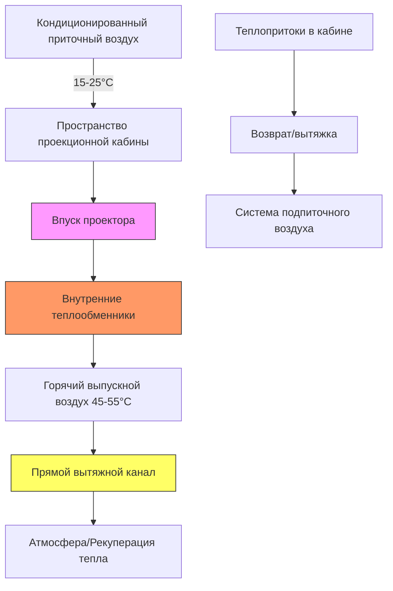

## Обзор

Проекционные кабины представляют сосредоточенные тепловые нагрузки, требующие выделенных стратегий охлаждения независимо от систем HVAC аудитории. Современные цифровые и лазерные проекторы генерируют 3-15 кВт тепла в замкнутых пространствах, создавая повышенные температуры помещения, которые могут снизить надежность оборудования и срок его службы. Переход от систем с ксеноновыми лампами к системам с лазерным люминофором изменил ландшафт управления тепловым режимом, требуя обновленных подходов к вентиляции и охлаждению.

## Рассеивание тепла цифровым проектором

Цифровые кинопроекторы преобразуют электрическую мощность в свет с типичной эффективностью 15-25%, что означает, что 75-85% входной мощности становится отходящим теплом. Это тепло проявляется тремя основными способами:

**Конвективная передача тепла** происходит через корпус проектора к монтажным поверхностям, хотя это представляет небольшую часть (обычно <10%) от общего отвода тепла. **Конвективная передача тепла** доминирует, так как внутренние вентиляторы выхлопляют нагретый воздух непосредственно в пространство кабины. **Радиационная передача тепла** от корпуса проектора вносит минимальный вклад при типичных рабочих температурах 40-60°C.

Расчет общей тепловой нагрузки следует уравнению:

$$Q_{total} = P_{input} \times (1 - \eta_{optical})$$

где $Q_{total}$ — тепловая нагрузка в ватах, $P_{input}$ — входная электрическая мощность, и $\eta_{optical}$ — оптическая эффективность (световой выход, деленный на входную электрическую мощность).

Для 6 кВт лазерного проектора с 20% оптической эффективностью:

$$Q_{total} = 6000 \text{ Вт} \times (1 - 0.20) = 4800 \text{ Вт} = 16.38 \text{ кДж/с}$$

### Типичные диапазоны тепловой нагрузки

| Тип проектора | Входная мощность | Тепловой выход | Требуемый охлаждающий воздух |
|---|---|---|---|
| Малый цифровой (ксенон) | 2-4 кВт | 6.8-13.6 кДж/с | 425-848 CFM (м³/ч) |
| Большой цифровой (ксенон) | 5-7 кВт | 17-23.9 кДж/с | 1017-1441 CFM (м³/ч) |
| Лазерный люминофор | 3-6 кВт | 10.2-20.5 кДж/с | 509-1101 CFM (м³/ч) |
| RGB лазер (премиум) | 8-15 кВт | 27.3-51.2 кДж/с | 1611-3054 CFM (м³/ч) |

## Требования охлаждения лазерного проектора

Лазерные проекторы используют твердотельные источники света, требующие точного управления тепловым режимом. Лазерные диоды работают оптимально при температуре переходов 20-30°C. Отклонение за пределы спецификаций производителя ускоряет деградацию светового потока и сокращает номинальный срок службы 20000-30000 часов.

Лазерные системы используют встроенное замкнутое жидкостное охлаждение или передовую технологию тепловых трубок для передачи тепла от лазерных модулей к охлаждаемым воздухом теплообменникам. Кабина должна удалять это отводимое тепло посредством:

1. **Выделенной вытяжной вентиляции** согласованной со спецификациями охлаждающего воздуха проектора
2. **Подачи кондиционированного воздуха** для поддержания температуры окружающей среды кабины на уровне 15-25°C
3. **Контроля перепада давления** для предотвращения инфильтрации воздуха из аудитории

Повышение температуры охлаждающего воздуха через проектор следует:

$$\Delta T = \frac{Q_{sensible}}{\.m \times c_p} = \frac{Q_{sensible}}{CFM \times 1.08}$$

При 4,8 кВт (16,38 кДж/с) отводимого через 425 CFM (м³/ч):

$$\Delta T = \frac{16380}{425 \times 1.08} = 35.5°C$$

Это значительное повышение температуры требует прямого выхлопа воздуха из проектора, а не рециркуляции в пространстве кабины.

## Стратегия вентиляции проекционной кабины

Эффективная вентиляция кабины изолирует тепло оборудования от занятых пространств, поддерживая условия эксплуатации оборудования. Стратегия использует трехуровневый подход:

### Параметры проектирования вентиляции

**Приточный воздухообмен** должен преодолеть теплопритоки оболочки кабины плюс остаточное тепло оборудования, не захватываемое прямым выпуском. ASHRAE рекомендует минимум 0.5 CFM/ft² (2.5 м³/(ч·м²)) для машинных помещений, но проекционные кабины обычно требуют 2-5 CFM/ft² (10-25 м³/(ч·м²)) из-за сосредоточенных нагрузок.

**Вытяжной воздухообмен** должен соответствовать или немного превышать подачу (103-110% от подачи) для поддержания отрицательного давления 5-12 Па относительно аудитории. Это предотвращает передачу звука проектора и утечку света через отверстия кабины.

**Распределение воздуха** размещает приточные диффузоры на низком уровне (пол или нижняя стена) и общую вытяжку на высоком уровне (потолок), используя тепловую плавучесть. Выпуск проектора подключается прямо через жесткий воздуховод, чтобы предотвратить смешивание горячего воздуха с пространством кабины.

## Проектирование изолированной системы охлаждения

Охлаждение проекционного оборудования работает независимо от систем аудитории по нескольким критическим причинам:

1. **Независимость расписания** — проекторы требуют охлаждения во время прогрева перед показом и охлаждения после показа, периоды которых выходят за рамки занятости аудитории
2. **Требования к температуре** — оборудование требует 15-25°C, в то время как аудитории поддерживают 21-24°C с меньшей точностью
3. **Избыточность** — отказ охлаждения оборудования не должен влиять на комфорт посетителей
4. **Изменчивость нагрузки** — нагрузки на проекцию остаются постоянными, тогда как нагрузки аудитории колеблются с заполняемостью

### Выделенные подходы охлаждения

| Тип системы | Диапазон мощности | Преимущества | Ограничения |
|---|---|---|---|
| Сплит-система DX | 1-3 кВт | Простота, экономичность | Требует доступа к наружному блоку |
| Компактная AC | 1-5 кВт | Автономная конструкция | Ограничения по пространству |
| Вентиль с чиллированной водой | 1-4 кВт | Тихая, эффективная | Требует центральной установки |
| Гликолевой контур с сухим охладителем | 2-10 кВт | Потенциал свободного охлаждения | Более высокие первоначальные затраты |

Коэффициент чувствительного тепла (SHR) для охлаждения проекционной кабины приближается к 0.95-1.0, так как минимальное количество влаги попадает в герметичное пространство. Это высокое SHR позволяет выбрать меньшее оборудование по сравнению с эквивалентными нагрузками включая скрытое тепло.

Расчет мощности охлаждения:

$$Q_{cooling} = Q_{projector} + Q_{envelope} + Q_{lights} + Q_{misc}$$

Для кабины 18.6 м² с 5 кВт проектором:

$$Q_{cooling} = 17000 + 2000 + 1500 + 1000 = 21500 \text{ кДж/ч} = 5.97 \text{ кВт}$$

Коэффициент безопасности 1.15-1.25 дает выбор агрегата 6.9-7.5 кВт.

## Сравнение: цифровые и устаревшие пленочные проекторы

Переход от пленочной к цифровой проекции фундаментально изменил тепловые характеристики кабины:

| Параметр | Пленочный проектор (ксенон) | Цифровой/лазерный проектор |
|---|---|---|
| Максимальный тепловой выход | 8-12 кВт | 3-8 кВт |
| Профиль тепла | Высоко переменный при замене лампы | Стабильный в течение срока службы |
| Температура выхлопа | 60-80°C | 45-60°C |
| Требуемый охлаждающий воздух | 1359-2034 CFM (м³/ч) | 509-1359 CFM (м³/ч) |
| Температурный скачок при замене лампы | Да (дополнительно 2-3 кВт) | Нет |
| Генерирование озона | Да (требует дополнительной вентиляции) | Нет |

Устаревшие пленочные проекторы использовали высокоинтенсивные короткодуговые ксеноновые лампы, работающие при давлении 55-75 бар и цветовой температуре 6000-7000 K. Эти лампы генерировали интенсивное инфракрасное излучение, требующее существенного принудительного воздушного охлаждения. Замена ламп (каждые 1000-2000 часов) создавала дополнительные тепловые нагрузки во время критического периода начального прогрева.

Современные лазерные системы исключают замену ламп, снижают общий тепловой выход на 25-40% и обеспечивают более согласованные тепловые профили. Однако лазерные системы требуют более точного контроля температуры — пленочные проекторы выдерживали температуры кабины до 35°C, в то время как лазерные системы указывают максимальные температуры окружающей среды 25-30°C.

## Требования вентиляции кабины согласно нормативам

Международный механический кодекс (IMC) раздел 403 требует механической вентиляции для проекционных помещений при расходах, достаточных для ограничения повышения температуры и поддержания спецификаций производителя оборудования. Хотя конкретные требования CFM не установлены, кодекс требует:

- Вывода выхлопного воздуха в атмосферу (без рециркуляции в занятые пространства)
- Подачи воздуха для замены выхлопляемых количеств
- Независимого управления от систем аудитории
- Соответствия требованиям установки производителя оборудования

ASHRAE Standard 90.1 Energy Standard позволяет системам проекционной кабины работать во время незанятых часов при необходимости для управления тепловым режимом оборудования, освобождается от типичных требований снижения температуры.

## Рекомендации по проектированию

1. **Размер вытяжной мощности на уровне 110-120%** от указанного производителем проектора охлаждающего воздухообмена
2. **Обеспечьте выделенное охлаждение, рассчитанное на одновременную работу проектора** плюс теплопритоки оболочки
3. **Установите мониторинг температуры с сигнализацией** на впуске проектора (не должен превышать 25°C)
4. **Отделите выпуск проектора от общей вытяжки кабины** для возможности рекуперации тепла
5. **Рассмотрите избыточное охлаждение** для площадок с высоким влиянием на доход от простоев
6. **Проектируйте с учетом будущих обновлений** на системы RGB-лазеров с более высокой выходной мощностью (потенциал 15-20 кВт)

Экономическая ценность надлежащего управления тепловым режимом значительна — преждевременная деградация светового потока снижает качество изображения и сокращает срок службы дорогостоящих компонентов проектора. Инвестиция в надлежащее охлаждение кабины дает отдачу благодаря расширенным интервалам технического обслуживания и сохраненной яркости изображения в течение всего рабочего периода проектора.
