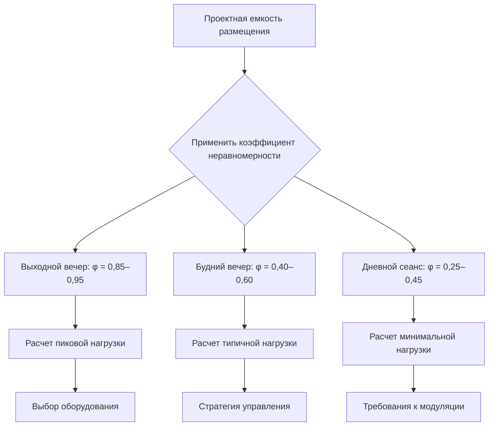

## Основы плотности размещения и расчета нагрузки от людей

Плотность размещения представляет критический параметр проектирования систем HVAC кинотеатра, поскольку теплопроизводство людей определяет расчет охлаждающей нагрузки. Современные кинотеатры имеют плотность размещения от 0,03 до 0,05 человека на м², что соответствует 20–33 м² на одного человека в зависимости от конфигурации мест и расстояния между проходами.

Каждый зритель кинотеатра производит примерно **117 Вт явного тепла** и **88 Вт скрытого тепла** при малоподвижной деятельности, что дает общее теплопроизводство 205 Вт на человека. Это метаболическое теплопроизводство создает доминирующую тепловую нагрузку в занятом кинотеатре, значительно превышающую потери через ограждающие конструкции и прибыль от внутреннего оборудования.

Коэффициент явного тепла (SHR) для занятости кинотеатра рассчитывается как:

$$\text{SHR} = \frac{Q_{\text{явное}}}{Q_{\text{явное}} + Q_{\text{скрытое}}} = \frac{117}{117 + 88} = 0,57$$

Этот относительно низкий SHR 0,57 указывает на значительные требования к удалению влаги, требующие осушающей способности сверх типичных коммерческих приложений. Высокая скрытая нагрузка обусловлена выделением влаги при дыхании в замкнутой среде кинотеатра.

## Методология расчета нагрузки от людей

Общие явные и скрытые нагрузки линейно масштабируются с фактической занятостью. Для кинотеатра с проектной емкостью $N_{\text{мест}}$ и коэффициентом занятости $\phi$, общие нагрузки от людей составляют:

$$Q_{\text{явное,общее}} = N_{\text{мест}} \times \phi \times 117 \text{ Вт}$$

$$Q_{\text{скрытое,общее}} = N_{\text{мест}} \times \phi \times 88 \text{ Вт}$$

Расположение мест на нескольких уровнях с увеличенным расстоянием между рядами (101–107 см) снижает эффективную плотность размещения по сравнению с традиционными конфигурациями (91–97 см), но обеспечивает улучшенные пути распределения воздуха. Пониженная плотность на единицу площади пола не снижает общую емкость кинотеатра и пиковую нагрузку от людей.

## Требования вентиляции и м³/ч на место

Стандарт ASHRAE 62.1 устанавливает требования к наружному воздуху для кинотеатров на основе плотности людей. Процедура расчета вентиляции определяет:

$$\dot{V}_{\text{НВ}} = R_p \times P_z + R_a \times A_z$$

Где:
- $R_p$ = 2,4 м³/ч на человека (интенсивность наружного воздуха в дыхательной зоне)
- $P_z$ = проектная занятость (человек)
- $R_a$ = 0,6 м³/(ч·м²) (компонент площади)
- $A_z$ = площадь зоны (м²)

Для типичных кинотеатров компонент от людей доминирует. При полной занятости минимальный наружный воздух составляет **2,4 м³/ч на место зрителя** плюс незначительный компонент площади.

Общие требования к воздухоснабжению превышают наружный воздух из-за необходимости удаления тепловой нагрузки. Для явного охлаждения требуемый расход воздуха определяется из:

$$\dot{V}_{\text{подача}} = \frac{Q_{\text{явное}}}{1,2 \times \Delta T}$$

Предполагая разность температур между подаваемым и помещением 11 °C и явную нагрузку 117 Вт на человека:

$$\dot{V}_{\text{на человека}} = \frac{117}{1,2 \times 11} = 8,9 \text{ м³/ч на место}$$

Таким образом, проектирование HVAC кинотеатра обычно предусматривает **8,9–9,5 м³/ч на место** для теплового контроля, значительно выше минимума 2,4 м³/ч наружного воздуха. Фактические подачи зависят от температуры подаваемого воздуха и допустимого температурного перепада.

| Конфигурация мест | Плотность (м²/человека) | Человек/100 м² | м³/ч/место (мин. НВ) | м³/ч/место (общая подача) |
|----------------------|---------------------|-----------------|-------------------|-------------------------|
| Традиционные ряды    | 2,0–2,3             | 43–50         | 2,4                 | 8,9–9,5                   |
| Многоуровневое размещение      | 2,3–3,1             | 32–43         | 2,4                 | 9,5–10,6                   |
| Премиум/люкс       | 3,2–4,6             | 21–31         | 2,4                 | 10,6–13,2                   |

## Коэффициенты неравномерности и управление пиковой нагрузкой

Посещаемость кинотеатра значительно варьируется по времени суток, дню недели и сезону. Проектирование систем HVAC на 100% занятость во все часы работы приводит к значительному завышению мощности и потерям энергии. Коэффициенты неравномерности учитывают реальные паттерны занятости.

Рекомендуемые коэффициенты неравномерности для проектирования HVAC кинотеатра:

| Период | Типичный коэффициент занятости (φ) | Проектное рассмотрение |
|--------|------------------------------|----------------------|
| Выходной вечер (пик) | 0,85–0,95 | Основание для выбора оборудования |
| Будний вечер | 0,40–0,60 | Промежуточная мощность |
| Дневной сеанс | 0,25–0,45 | Минимальная модуляция |
| Летний блокбастер (пиковая неделя) | 0,95–1,00 | Кратковременная перегрузочная мощность |

Выбор оборудования должен учитывать баланс между пиковой мощностью и условиями типичной работы. Кинотеатр с 300 местами при 100% проектной занятости генерирует:

- Общая явная нагрузка: $300 \times 1,0 \times 117 = 35,1$ кВт
- Общая скрытая нагрузка: $300 \times 1,0 \times 88 = 26,4$ кВт
- Общая нагрузка от людей: 61,5 кВт (17,5 т охлаждения)

Однако применение реалистичного коэффициента неравномерности 0,70 для выбора размера снижает проектную нагрузку до:

- Проектная явная нагрузка: $300 \times 0,70 \times 117 = 24,6$ кВт
- Проектная скрытая нагрузка: $300 \times 0,70 \times 88 = 18,5$ кВт
- Эффективная проектная нагрузка: 43,1 кВт (12,3 т охлаждения)

Это представляет 30% снижение мощности оборудования при сохранении адекватного охлаждения для 99% условий работы.

## Профиль нагрузки и следствия для системы

Быстрое изменение занятости от пустого до полного за 15–20 минут проходного периода создает переходные условия нагрузки. Системы должны реагировать на:

1. **Быстрое увеличение явной нагрузки** при входе зрителей (117 Вт × количество входящих в минуту)
2. **Запаздывающее развитие скрытой нагрузки** по мере повышения влажности в помещении за 20–30 минут
3. **Асимметричное восстановление нагрузки** после окончания сеанса (зрители быстро выходят, но повышенные температура и влажность сохраняются)

Системы переменной производительности (VRF, модулирующие RTU, охлажденная вода с VFD) эффективно отслеживают эту динамическую нагрузку. Оборудование фиксированной производительности чрезмерно включается/выключается при частичных нагрузках, что ухудшает контроль влажности и комфорт зрителей.

Комбинация высоких скрытых нагрузок, переменной занятости и быстрых изменений нагрузки делает проектирование HVAC кинотеатра отличительно сложным. Надлежащее применение коэффициентов неравномерности, адекватная осушающая мощность и отзывчивые системы управления обеспечивают приемлемую производительность во всем диапазоне работы, избегая чрезмерных затрат на оборудование и потребления энергии.
