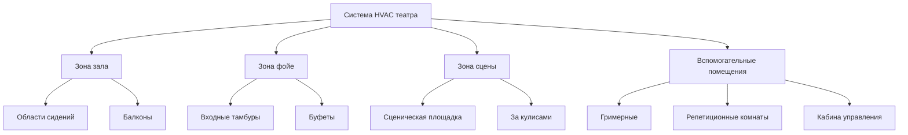

Системы HVAC театров и концертных залов сталкиваются с уникальными инженерными задачами, вызванными экстремальными колебаниями занятости, жесткими требованиями к акустике и необходимостью поддерживать тепловой комфорт без нарушения спектаклей. Эти объекты варьируются от небольших общественных театров до концертных центров на 3000+ мест, каждый из которых требует точных стратегий экологического контроля.

## Проектные задачи

### Колебания нагрузки при занятости

Театральные помещения испытывают колебания нагрузки, несравнимые с большинством типов зданий. Концертный зал на 1200 мест переходит от минимальной занятости при подготовке к полной вместимости за 20 минут. Явное тепловыделение от посетителей определяется по формуле:

$$Q_s = N \times SHG \times CLF$$

Где $N$ обозначает количество посетителей, $SHG$ равен явному тепловыделению на одного человека (обычно 64,8 кДж/ч для сидящих взрослых в театрах), а $CLF$ — коэффициент охлаждающей нагрузки, учитывающий эффекты теплоемкости.

Для полностью заполненного зала на 1200 мест:

$$Q_s = 1200 \times 64,8 \times 0,85 = 66,0 \text{ кВт}$$

Это явное охлаждающее воздействие в 66,0 кВт появляется быстро, требуя агрессивных стратегий охлаждения в течение первых 30 минут занятости.

### Требования акустической интеграции

Стандарт ASHRAE 62.1 предусматривает 6,4 л/с на одного человека наружного воздуха для театров, но подача должна осуществляться в пределах строгих акустических ограничений. Справочник приложений ASHRAE, глава 5, указывает кривые критериев шума (NC) для помещений с живым исполнением:

| Тип помещения | Рейтинг NC | Макс. скорость воздуха (м/с) |
|------------|-----------|------------------------|
| Концертный зал | NC 20-25 | 1,5-2,0 |
| Драматический театр | NC 25-30 | 2,0-2,5 |
| Многофункциональный концертный зал | NC 30-35 | 2,5-3,0 |
| Фойе | NC 35-40 | 3,0-3,5 |

Ограничения скорости воздуха вытекают из соотношения между скоростью в воздуховоде и генерированием акустической мощности:

$$PWL = 10 \log_{10}(V^6) + C$$

Где $PWL$ обозначает уровень звуковой мощности, $V$ — скорость воздуха, а $C$ включает коэффициенты геометрии воздуховода. Это соотношение с шестой степенью требует увеличения размеров воздуховодов и снижения скоростей.

## Стратегии проектирования системы

### Требования к зонированию

Эффективная система HVAC театра разделяет помещения на отдельные тепловые зоны:

Каждая зона работает по различным расписаниям и профилям нагрузок. Зал требует максимальной мощности только во время спектаклей, в то время как фойе достигают пиковых нагрузок за 30 минут до начала и во время антрактов.

### Методология быстрого охлаждения

Стратегии предварительного охлаждения снижают температуру воздуха на 4,4–6,7 °C ниже уставки до занятости. Требуемая мощность охлаждения следует из:

$$Q_{total} = Q_{sensible} + Q_{latent} + Q_{pulldown}$$

Компонент быстрого охлаждения учитывает тепловую емкость конструкции:

$$Q_{pulldown} = \frac{m \times c_p \times \Delta T}{t}$$

Где $m$ обозначает эффективную массу (воздух плюс легкие предметы мебели), $c_p$ — удельная теплоемкость, $\Delta T$ — снижение температуры, а $t$ — время охлаждения.

Для концертного зала объемом 2831 м³ с предварительным охлаждением в течение 2 часов:

$$Q_{pulldown} = \frac{(2831 \times 1,2 \times 1,0 \times 5,6)}{7200} = 2,6 \text{ кВт}$$

Это охлаждающее воздействие в 2,6 кВт дополняет расчетную мощность охлаждения в периоды отсутствия занятости.

### Подходы к распределению воздуха

Распределение воздуха в театре отдает приоритет подаче с низкой скоростью и высокий объем:

**Вентиляция с вытеснением снизу**
- Подача воздуха при 17-18 °C через напольные решетки при 0,25–0,5 м/с
- Естественная конвекция поднимает теплый воздух к потолочному возврату
- Снижает энергию смешивания и генерирование шума
- Требует приподнятого пола высотой 46–61 см

**Воздушный поток ламинарный с потолка**
- Большие потолочные диффузоры с дальнейшим выбросом
- Температура подачи на 5,6–8,3 °C ниже температуры помещения
- Требует высоты потолка 4,9–6,1 м
- Распространено в проектах реконструкции

**Распределение с низкой скоростью по боковым стенкам**
- Линейные щелевые диффузоры вдоль боковых стен
- Горизонтальный выброс поперек зон сидения
- Затухание скорости следует: $V_x = V_0 \times \sqrt{A_0/A_x}$
- Эффективно для помещений шириной менее 18,3 м

## Разделение фойе и зала

Физическое и тепловое разделение между фойе и концертными залами предотвращает нарушения во время спектаклей:

**Соотношения давления**
Поддерживайте зал при небольшом положительном давлении (5–7,5 Па) относительно фойе. Этот перепад давления блокирует передачу шума через дверные проемы и предотвращает проникновение некондиционированного воздуха.

Воздушный поток через щели дверей следует:

$$Q = C \times A \times \sqrt{\Delta P}$$

Где $C$ — коэффициент потока (обычно 0,65), $A$ обозначает площадь щели, а $\Delta P$ — перепад давления.

**Тепловая изоляция**
Работайте с системами фойе и зала независимо с отдельными регулирующими органами температуры. Фойе допускают более широкие диапазоны температур (20–25,6 °C), в то время как зал поддерживает жесткий контроль (22–23,3 °C).

## Соображения по многофункциональным объектам

Многофункциональные концертные залы, принимающие концерты, театры, лекции и спортивные события, требуют гибких конфигураций HVAC:

| Тип события | Вентиляция (л/с на человека) | Охлаждающее воздействие | Контроль влажности |
|------------|--------------------------|--------------|------------------|
| Концерт | 6,4–8,5 | Высокое (освещение + посетители) | Стандартный |
| Театр/Драма | 6,4 | Среднее | Стандартный |
| Лекция | 6,4–8,5 | Низкое | Стандартный |
| Спорт | 8,5–10,6 | Очень высокое | Усиленный (удаление влаги) |

Системы с переменным объемом воздуха (VAV) с широким диапазоном регулирования (10:1) обеспечивают эти вариации. Прямое цифровое управление (DDC) координирует подачу воздуха на основе датчиков занятости и расписания событий.

## Уточнения расчета нагрузок

Стандартные расчеты охлаждающей нагрузки недооценивают требования театра. Применяйте следующие коэффициенты корректировки:

- **Разнообразие посетителей**: Используйте 1,0 (предположите полную занятость)
- **Нагрузка от освещения**: Включите сценическое освещение на уровне 32–54 Вт/м² для площади зала
- **Инфильтрация**: Удвойте стандартные значения при открытии дверей
- **Коэффициент безопасности**: Добавьте 15–20 % к окончательной расчетной мощности

Уравнение полной охлаждающей нагрузки становится:

$$Q_{total} = (Q_{occupants} + Q_{lights} + Q_{envelope} + Q_{infiltration}) \times 1,15$$

Этот консервативный подход обеспечивает адекватную мощность при наихудших условиях спектакля с полной занятостью и максимальным сценическим освещением.

## Последовательности управления

Эффективное управление HVAC театра требует расписания по событиям:

**Последовательность подготовки к событию (T-120 до T-30 минут)**
- Увеличьте системы до 100% наружного воздуха для продувки
- Снизьте температуру помещения на 4,4–5,6 °C ниже уставки
- Проверьте работоспособность всех зон

**Режим спектакля (T-30 до T+0)**
- Переходите на минимальный наружный воздух (соответствие ASHRAE 62.1)
- Восстановите уставку температуры
- Снизьте шум системы до пределов NC

**Антракт (по расписанию)**
- Увеличьте наружный воздух до 50% от максимума
- Повысьте мощность охлаждения на 20%
- Поддерживайте акустику режима спектакля

Эта последовательность оптимизирует комфорт, уважая акустические ограничения во время живых спектаклей.
