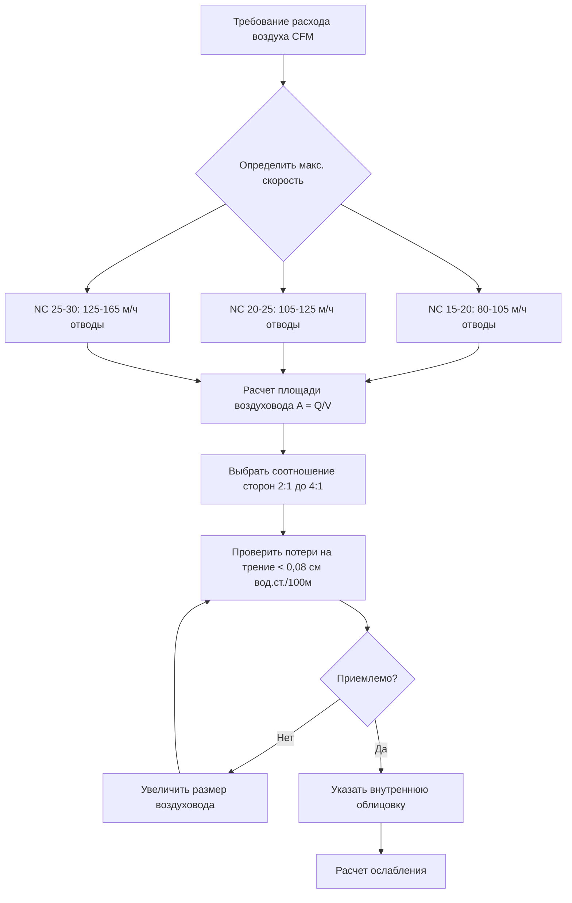
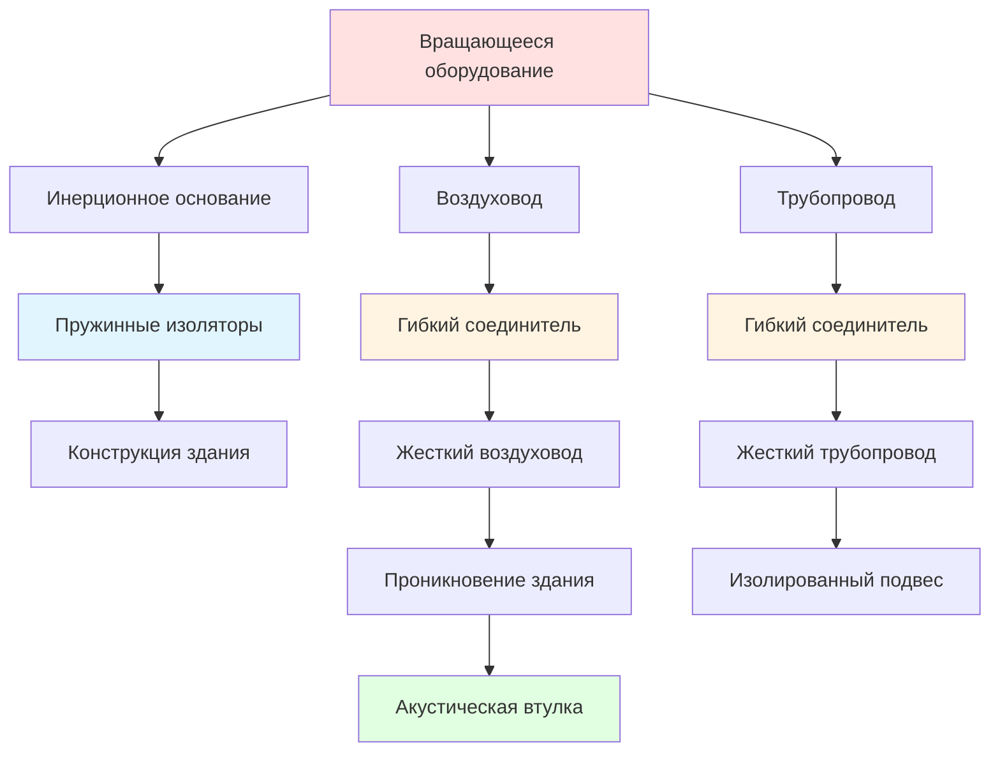

## Акустическая координация

Успешное проектирование HVAC для театров и аудиторий требует достижения уровней фонового шума NC 15-25 при одновременном обеспечении адекватной вентиляции и теплового комфорта. Это требует тесной координации между механическими и акустическими специалистами, решая вопросы генерирования звука, передачи и вибрации по всей системе распределения воздуха.

## Критерии шума для помещений исполнительского искусства

HVAC системы театров должны соответствовать строгим критериям шума, которые варьируются в зависимости от типа и назначения помещения.

### Целевые уровни NC по типу помещения

| Тип помещения | Целевой NC | Максимальный SPL при 1000 Гц (дБ) | Примечания применения |
|------------|-----------|------------------------------|-------------------|
| Концертные залы | NC 15-20 | 30-35 | Критично для неусиленной музыки |
| Драматические театры | NC 20-25 | 35-40 | Приоритет разборчивости речи |
| Многофункциональные аудитории | NC 25-30 | 40-45 | Гибкое использование для исполнений |
| Кинотеатры | NC 30-35 | 45-50 | Маскирование звуковой дорожки фильма |

Кривые NC (Noise Criteria) определяют максимально допустимый уровень звукового давления в октавных полосах от 63 Гц до 8000 Гц. Номер кривой примерно соответствует SPL на средних частотах (1000-2000 Гц).

### Физическое обоснование критериев NC

Звуковая мощность, генерируемая оборудованием HVAC, преобразуется в звуковое давление в занятых помещениях согласно:

$$L_p = L_w + 10\log_{10}\left(\frac{Q}{4\pi r^2} + \frac{4}{R}\right)$$

где:
- $L_p$ = уровень звукового давления в точке приема (дБ)
- $L_w$ = уровень звуковой мощности источника (дБ)
- $Q$ = коэффициент направленности (безразмерный)
- $r$ = расстояние от источника (м)
- $R$ = постоянная помещения = $\frac{S\alpha}{1-\alpha}$ (м²)
- $S$ = общая площадь поверхности (м²)
- $\alpha$ = средний коэффициент поглощения

Это соотношение показывает, что достижение низких уровней NC требует как снижения звуковой мощности источника, так и контроля акустики помещения.

## Распределение воздуха с низкой скоростью

Высокие скорости воздуха генерируют турбулентный шум в воздуховодах и терминальных устройствах. Поддержание низких скоростей по всей системе распределения является основой конструкции тихой HVAC.

### Пределы скорости для акустического проектирования

| Компонент системы | Максимальная скорость (м/ч) | Основание для ограничения |
|------------------|------------------------|-----------------|
| Главные приточные воздуховоды | 250-310 | Генирирование турбулентного шума |
| Ответвляющиеся воздуховоды | 165-205 | Контроль регенерированного шума |
| Финальные отводы к диффузорам | 80-105 | Шум терминального устройства |
| Возвратные воздуховоды (над потолком) | 205-250 | Сниженное значение по сравнению с приточным |
| Возвратные воздуховоды (в занятом пространстве) | 120-165 | Прямое воздействие на пространство |

Звуковая мощность, генерируемая турбулентным потоком воздуха в прямых участках воздуховода, увеличивается со скоростью согласно:

$$L_w = K + 60\log_{10}(V) + 10\log_{10}(A)$$

где:
- $K$ = эмпирическая константа (≈ -35 для облицованных воздуховодов, -25 для необлицованных)
- $V$ = скорость воздуха (м/ч)
- $A$ = площадь поперечного сечения воздуховода (м²)

Это отношение 60 дБ на декаду демонстрирует, что снижение скорости вдвое снижает звуковую мощность на 18 дБ, иллюстрируя критическую важность проектирования с низкой скоростью.

### Определение размера воздуховода для акустического выполнения

Размеры воздуховодов определяются с использованием потерь на трение 0,05-0,08 см водяного столба на 100 м, а не типичные 0,1-0,15 см водяного столба для коммерческих систем. Это приводит к созданию более крупных, более тихих воздуховодов с более низкими операционными затратами.

## Выбор глушителя воздуховода и его размещение

Глушители воздуховода обеспечивают зависящее от частоты ослабление звука через поглощение и реактивные механизмы.

### Типы глушителей и производительность

**Поглощающие глушители** используют стекловолокно или минеральную вату внутри перфорированных металлических дефлекторов. Звуковая энергия рассеивается в виде вязких и тепловых потерь при взаимодействии акустической скорости частиц с пористым материалом.

**Реактивные глушители** используют четвертьволновые резонаторы или расширительные камеры для отражения звуковой энергии обратно в сторону источника через разрывы импеданса.

### Требования к вносимому ослаблению

Рассчитайте требуемое вносимое ослабление путем сравнения прогнозируемой звуковой мощности системы с целевой кривой NC:

$$IL_{требуется} = L_{w,система} - L_p{цель} - TL_{путь}$$

где:
- $IL_{требуется}$ = требуемое вносимое ослабление (дБ в октавной полосе)
- $L_{w,система}$ = звуковая мощность системы (дБ)
- $L_{p,цель}$ = целевое звуковое давление от кривой NC (дБ)
- $TL_{путь}$ = потери передачи воздуховода и влияние помещения (дБ)

### Стратегия размещения глушителя

Размещайте первичные глушители сразу после оборудования обработки воздуха для ослабления шума вентилятора. Расположите вторичные глушители рядом с терминальными устройствами для контроля регенерированного шума от фитингов и демпферов.

### Критические параметры проектирования

**Потери давления:** Ограничьте потери давления глушителя до 0,25-0,50 см водяного столба для поддержания низкого энергопотребления вентилятора.

**Скорость на входе:** Поддерживайте скорость входа глушителя ниже 205 м/ч для предотвращения самогенерируемого шума.

**Длина:** Более длинные глушители обеспечивают большее ослабление, но сталкиваются с убывающей отдачей из-за внутренних потерь.

## Системы виброизоляции

Вибрация от вращающегося оборудования передается через конструктивные соединения, излучаясь как слышимый шум от поверхностей здания.

### Эффективность изоляции

Передачу вибрации через изоляторы определяет формула:

$$T = \frac{1}{\sqrt{(1-r^2)^2 + (2\zeta r)^2}}$$

где:
- $T$ = передачимость (отношение переданной силы к приложенной)
- $r$ = отношение частот = $\frac{f}{f_n}$
- $f$ = рабочая частота (Гц)
- $f_n$ = собственная частота изолированной системы (Гц)
- $\zeta$ = коэффициент демпирования

Эффективная изоляция требует $r > \sqrt{2}$, как правило, достигается путем выбора изоляторов с собственной частотой $f_n < 0,35f_{рабочая}$.

### Компоненты системы виброизоляции

| Компонент | Функция | Основание спецификации |
|-----------|----------|---------------------|
| Пружинные изоляторы | Основная виброизоляция | Статический прогиб 5-7,5 см |
| Прокладки из неопрена | Высокочастотное ослабление | Твердость по Шору 40-50 дюрометр |
| Инерционные основания | Развязка массы | 1,5-2,5× вес оборудования |
| Гибкие соединители | Изоляция воздуховод/труба | Минимальная длина 30-45 см |
| Сейсмические ограничители | Соответствие кодексу | Сейсмическое проектирование ASCE 7 |

### Предотвращение передачи структурного шума

Обеспечивайте непрерывную изоляцию от оборудования к конструкции, включая гибкие соединители воздуховода/трубы, изолированные подвесы и акустические уплотнения в местах проникновения.

## Выбор тихого диффузора

Шум, генерируемый диффузором, доминирует в акустической среде, когда надлежащее проектирование воздуховода снижает шум системы до низких уровней.

### Механизмы генирирования шума диффузором

Турбулентное смешивание между струями приточного воздуха и воздухом помещения генерирует широкополосный шум. Звуковая мощность быстро возрастает при увеличении скорости выпуска:

$$L_w = K_d + 50\log_{10}(Q) + 10\log_{10}(P)$$

где:
- $K_d$ = константа, специфичная для диффузора
- $Q$ = расход воздуха (CFM)
- $P$ = полное давление на диффузоре (см водяного столба)

### Спецификации производительности

Выбирайте диффузоры с сертифицированными производителем рейтингами NC при фактических условиях эксплуатации. Запросите данные испытаний согласно AHRI Standard 880 или ASHRAE Standard 70.

**Критические параметры выбора:**
- Максимальный рейтинг NC на 5-10 пунктов ниже цели (NC 10-15 для помещения NC 20)
- Скорость выпуска < 60 м/ч для перфорированных диффузоров
- Скорость выпуска < 10 м/ч в зоне занятости
- Полное давление < 0,01 см водяного столба на входе диффузора

### Типы диффузоров для критической акустики

| Тип диффузора | Типичный диапазон NC | Преимущества | Ограничения |
|---------------|------------------|------------|------------|
| Перфорированная панель | NC 10-20 | Минимальное генирирование шума | Высокая стоимость, большой размер |
| Линейная щель | NC 15-25 | Архитектурная интеграция | Ограниченное управление направлением |
| Вытеснение | NC 20-30 | Очень низкая скорость | Требует расслоения |
| Радиальный | NC 25-35 | Горизонтальный выброс | Требуются более высокие скорости |

## Предотвращение акустического кроссмодуляции

Передача звука между помещениями через общие воздуховоды подрывает акустическое разделение.

### Потери передачи кроссмодуляции в воздуховоде

Ослабление между соседними помещениями, соединенными воздуховодом, зависит от длины, облицовки и геометрии воздуховода:

$$TL_{воздуховод} = \alpha L + TL_{колено} + TL_{терминал}$$

где:
- $TL_{воздуховод}$ = общие потери передачи (дБ)
- $\alpha$ = ослабление на единицу длины (дБ/м)
- $L$ = длина воздуховода между помещениями (м)
- $TL_{колено}$ = потери на коленах (3-8 дБ на каждое)
- $TL_{терминал}$ = потери конечного отражения (0-10 дБ)

### Стратегии проектирования

**Минимальное разделение:** Поддерживайте 12-15 м облицованного воздуховода между критическими помещениями.

**Акустические перегородки:** Установите звуковые перегородки в воздуховодах, обслуживающих соседние тихие помещения, для увеличения TL на 10-20 дБ.

**Отдельные системы:** Выделите отдельные воздухообработчики для отдельных помещений исполнительского искусства, чтобы полностью исключить пути кроссмодуляции.

**Избегайте общих плиниумов:** Никогда не используйте общие потолочные плиниумы для возвратного воздуха из акустически чувствительных и шумных помещений.

## Координация с акустическими специалистами

Установите требования к акустическому проектированию на ранней стадии проектирования посредством сотрудничества с квалифицированными акустическими специалистами.

### Результаты проектирования по фазам

**Концептуальное проектирование:**
- Целевые NC для каждого типа помещения
- Предварительный выбор оборудования с данными звуковой мощности
- Концептуальные стратегии изоляции и глушителей

**Разработка проекта:**
- Полный бюджет звуковой мощности
- Анализ макета воздуховода на соответствие акустике
- Спецификации и местоположение глушителей
- Детали виброизоляции

**Рабочие чертежи:**
- Окончательные расчеты NC
- Представления оборудования с сертифицированными данными о звуке
- Процедуры пуска и испытаний

### Проверка при вводе в эксплуатацию

Проверьте акустическую производительность с помощью полевых измерений:
- Уровни звукового давления в октавных полосах согласно ASTM E1574
- Расчет NC на основе измеренных данных
- Документирование соответствия критериям проектирования
- Выявление и исправление недостатков

Успешная акустика HVAC театров требует интеграции распределения с низкой скоростью, стратегического ослабления, комплексной виброизоляции и тщательного выбора терминального устройства. Достижение целевых NC 15-25 требует физического анализа и координации на всех этапах проектирования и строительства.
