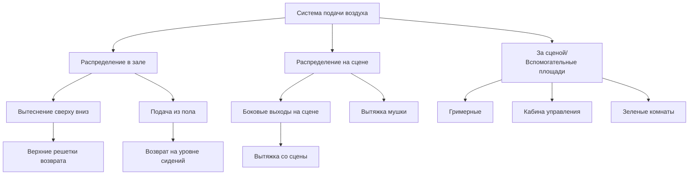

## Характеристики тепловых нагрузок

Системы HVAC театров сталкиваются с уникальными тепловыми проблемами, вызванными экстремальной плотностью людей, переменными нагрузками от освещения и необходимостью акустической совместимости. Пиковые чувствительные нагрузки обычно достигают 1,3–1,7 кВт на человека во время представлений, объединяя выделение метаболического тепла (1,17 кВт на сидящего взрослого), лучистое тепло от сценического освещения (500–2000 Вт на светильник) и нагрузки через оболочку здания.

Общая холодильная нагрузка следует этому соотношению:

$$Q_{total} = Q_{occupants} + Q_{lighting} + Q_{equipment} + Q_{envelope} + Q_{infiltration}$$

Для театра на 500 мест нагрузка от людей является доминирующей:

$$Q_{occupants} = N \times (SHG + LHG) = 500 \times (731 + 584) = 657{,}500 \text{ кДж/ч}$$

где $SHG$ представляет чувствительное выделение тепла и $LHG$ представляет скрытое выделение тепла на человека при сидячей, умеренной активности.

## Регулирование температуры и влажности

Стандарт ASHRAE 55 рекомендует операционные температуры 20–22 °C для театральных помещений, с относительной влажностью, поддерживаемой на уровне 40–50% для обеспечения комфорта зрителей во время продолжительных представлений длительностью 2–3 часа. Узкий диапазон температур предотвращает жалобы на тепловой дрейф, при этом допуская стратификацию температуры на 8–11 °C, общую для высокопотолочных концертных залов.

Контроль влажности становится критическим по двум причинам: во-первых, скрытые нагрузки от дыхания (0,09 кг/ч на человека) быстро увеличивают содержание влаги в помещении в современных герметичных театрах; во-вторых, относительная влажность ниже 35% увеличивает статическое электричество и респираторный дискомфорт, в то время как уровни выше 55% способствуют росту плесени в тканевых сиденьях и акустических панелях.

Отношение чувствительного тепла (SHR) для театров обычно находится в диапазоне 0,65–0,75:

$$SHR = \frac{Q_{sensible}}{Q_{sensible} + Q_{latent}}$$

Это относительно низкое значение SHR требует охлаждающих спиралей с достаточной скрытой мощностью, часто требующих более низких температур подаваемого воздуха (11–13 °C) чем стандартные приложения комфортного охлаждения.

## Стратегии распределения воздуха

Фундаментальная проблема при распределении воздуха в театре заключается в подаче высоких скоростей вентиляции (3,5–7 м³/ч на человека согласно ASHRAE 62.1) при сохранении критериев акустики NC-25 до NC-30. Это требует скоростей подаваемого воздуха менее 2,5 м/с на морде диффузора и скоростей в воздуховодах менее 6 м/с на последних 6 метрах перед концевыми устройствами.

### Кондиционирование зала и сцены

Зрительный зал и сценическое пространство требуют независимых систем HVAC из-за несовместимых требований:

| Параметр | Зал (Зрители) | Сцена | За сценой |
|----------|---------------|-------|-----------|
| Температура подачи | 13–14 °C | 15–18 °C | 13–14 °C |
| Воздухообмены в час | 6–8 | 15–20 | 8–12 |
| Критерии акустики | NC-25 | NC-35 | NC-30 |
| Отношение давлений | Отрицательное | Нейтральное | Положительное |
| Допуск влажности | 40–50% ОВ | 35–55% ОВ | 40–50% ОВ |

Сценические площади испытывают экстремальные тепловые нагрузки от театрального освещения (1600–3200 Вт/м² во время представлений) в сочетании с лучистым теплом от исполнителей под высокоинтенсивными светильниками. Повышенный воздухообмен служит трем целям: разбавление тепла у источника, предотвращение миграции теплового шлейфа в зрительный зал и удаление продуктов сгорания из пиротехнических эффектов.

Соотношение давлений предотвращает попадание запахов со сцены, пыли и дыма в помещение зрителей. Поддержание зала при давлении –5–8 Па относительно сцены создает эффект воздушной завесы через проем пропилея.

## Управление пиковыми нагрузками в антракте

Антракты создают наиболее серьезные мгновенные нагрузки при работе театра. Когда 500–800 посетителей встают, переходят в фойе и занимают ранее свободные пространства, эффективная метаболическая скорость увеличивается с 1,17 кВт (сидящий) до 1,61 кВт (стоящий, медленная ходьба).

Расчет коэффициента разнообразия становится критическим:

$$DF = \frac{\text{Фактическая пиковая нагрузка}}{\text{Сумма отдельных пиковых нагрузок}}$$

Для театров коэффициент разнообразия в фойе во время антракта обычно находится в диапазоне 0,6–0,75, поскольку только 60–75% аудитории одновременно используют помещения фойе. Однако холодильная нагрузка на зал во время антракта снижается всего на 20–30%, так как остаточное тепло, накопленное в сиденьях, коврах и внутренней массе, продолжает передаваться в помещение.

Система должна предварительно охладить помещение за 60–90 минут до начала представления, чтобы установить тепловой накопитель в строительную массу. Этот период предварительного кондиционирования обычно работает при 100–110% проектной подачи воздуха с температурами подачи на 1–2 °C ниже уставки для представления, удаляя чувствительное тепло из бетонных полов, поверхностей стен и материалов сидений.

## Помещения за сценой и вспомогательные площади

Гримерные, зеленые комнаты и кабины управления требуют выделенных систем с независимым управлением. Исполнители в тяжелых костюмах или с макияжем под горячим светом нуждаются в температурах подачи на 3–4 °C ниже стандартных условий комфорта, часто требуя температур помещения 15–17 °C.

Охлаждение кабины управления представляет собой уникальные проблемы: электронное оборудование постоянно генерирует 320–530 Вт/м², требуя охлаждения круглый год даже во время зимних представлений. Круглосуточная работа оборудования требует резервного охлаждения с автоматическим переключением при отказе, чтобы предотвратить отключение системы звука и света.

Гримерные комнаты требуют дополнительного наружного воздуха (минимум 12 м³/ч на человека) для разбавления летучих органических соединений от косметики, лаков для волос и адгезивов. Локальная вытяжка на гримерных станциях, работающих при 35–47 м³/ч, улавливает эти загрязнители перед их распространением в коридоры.

## Требования к вентиляции и интеграция акустики

Стандарт ASHRAE 62.1 указывает минимум 3,5 м³/ч на человека для театров, но акустические соображения часто требуют более высокой общей подачи воздуха для достижения адекватного охлаждения при повышенных температурах подачи, необходимых для распределения с низкой скоростью.

Предел акустической скорости проявляется в требуемой площади воздуховода:

$$A_{duct} = \frac{Q}{V_{max}} = \frac{\text{м³/ч}}{V_{max} \text{ (м/мин)}}$$

Для системы с подачей 4,7 м³/с, ограниченной скоростью 5 м/с: $A_{duct} = 0,94$ м², требующей нескольких параллельных путей или увеличенных одиночных воздуховодов, которые существенно увеличивают пространственные и стоимостные требования.

Звукоподавление в системах HVAC театров обычно требует 1,2–1,8 м выложенного воздуховода перед каждым концевым устройством, акустических сапог при подключении диффузоров и виброизоляции для всего вращающегося оборудования. Уровни звуковой мощности вентилятора на выходе не должны превышать 75 дБ в октавных полосах, критических для разборчивости речи (500–2000 Гц).

## Рекомендации по внедрению

Критические элементы дизайна для успешных систем HVAC театров включают:

- **Стратегия зонирования**: Отдельные системы для зала, сцены, за сценой и фойе с независимым регулированием температуры
- **Циклы очистки перед показом**: 90-минутное предварительное охлаждение и цикл вентиляции перед запланированным началом представления
- **Сброс нагрузок**: Автоматическое сокращение освещения и нагрузок некритичного оборудования во время пиковых периодов охлаждения
- **Вентиляция с управлением по требованию**: Модуляция наружного воздуха на основе CO₂ (уставка 750–1000 ppm) для снижения энергии при неполной загрузке
- **Рекуперация тепла**: Чувствительные или энтальпийные колеса, восстанавливающие 50–70% энергии выхлопного воздуха в отопительный сезон
- **Резервирование**: Конфигурация оборудования N+1 или 2N для критичных по назначению систем охлаждения и вентиляции

Взаимодействие между архитектурной акустикой и распределением HVAC требует ранней координации. Акустические консультанты должны проверить маршрутизацию воздуховодов, выбор диффузоров и расположение оборудования во время разработки дизайна, чтобы предотвратить конфликты, которые компрометируют либо тепловой комфорт, либо акустическую производительность.
