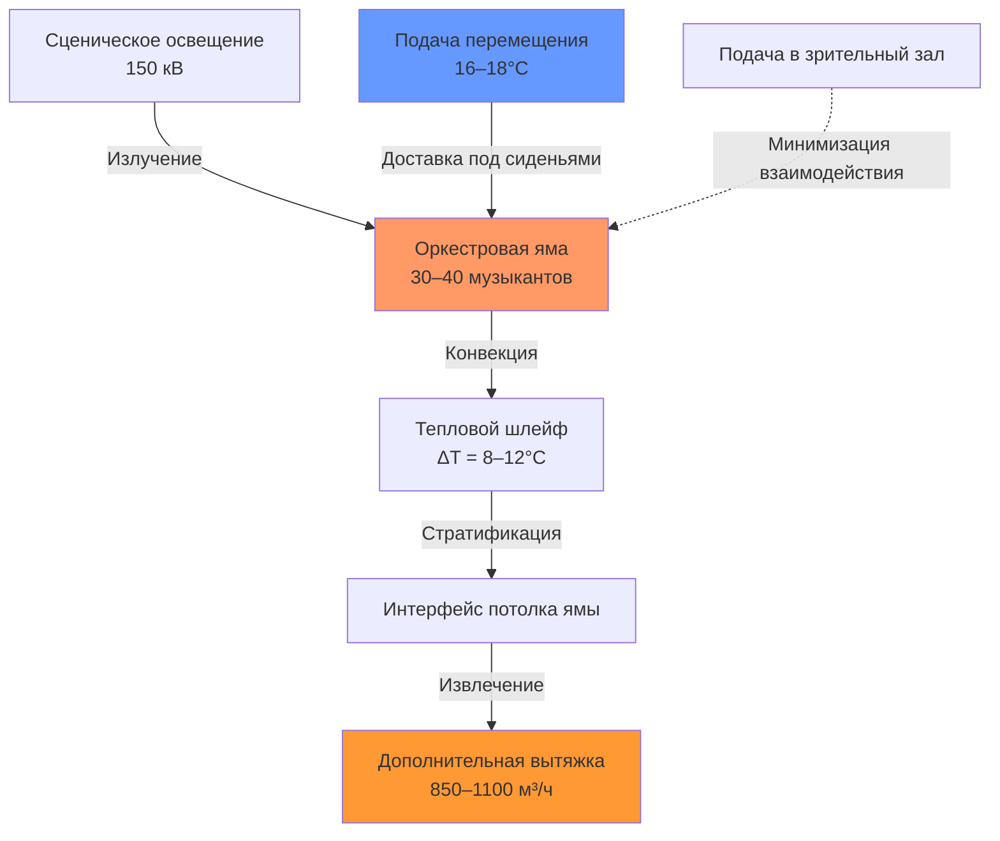

Легитимные театры, в которых проводятся живые представления, представляют уникальные задачи HVAC, требующие одновременно акустической прозрачности, быстрого теплового отклика и точного контроля окружающей среды в нескольких взаимосвязанных зонах. В отличие от кинотеатров с постоянными разумными нагрузками, площадки в стиле Бродвея испытывают резкие колебания нагрузок от сценического освещения (50–200 кВ), метаболического выделения артистами и изменений плотности зрителей во время антрактов. Инженерное решение требует понимания динамики тепловой стратификации, принципов акустического ослабления и психрометрических требований материалов, от исторических костюмов до музыкальных инструментов.

## Характеристики нагрузки театра с авансценой

Традиционная конфигурация авансцены создает отдельные тепловые зоны с существенно различающимися требованиями:

| Зона | Разумная нагрузка (Вт/м²) | Коэффициент скрытой нагрузки | Кратность воздухообмена | Критический параметр |
|------|---------------------|-------------------|-----|-------------------|
| Зрительный зал | 80–120 | 0,30–0,40 | 6–8 | NC-25 максимум |
| Сцена | 400–800 | 0,15–0,25 | 15–20 | Очистка от дыма |
| Оркестровая яма | 200–300 | 0,35–0,45 | 12–18 | CO₂ < 1000 ppm |
| Летник | 150–250 | 0,10–0,15 | 8–12 | Температурный градиент |
| Гримерные комнаты | 60–80 | 0,40–0,50 | 8–10 | Контроль влажности |

Сценическое освещение генерирует тепловой поток излучения в соответствии с соотношением Стефана-Больцмана, при этом галогенные вольфрамовые приборы при 3200K излучают:

$$q_{rad} = \varepsilon \sigma A (T_s^4 - T_{\infty}^4)$$

Где типичные прожекторы мощностью 1000 Вт производят приблизительно 850 Вт в виде теплового излучения. Для скромного бродвейского спектакля с подключенной нагрузкой освещения 150 кВ при уровне диммера 70%, мгновенный прирост разумного тепла достигает:

$$Q_s = 150 \times 0,70 \times 0,85 = 89 \text{ кВ}$$

Это добавление тепла происходит преимущественно над плоскостью сцены, создавая мощную стратификацию, вызванную плавучестью.

## Стратегия вентиляции оркестровой ямы

Оркестровая яма представляет наиболее термически неблагоприятную микросреду в театре. Музыканты генерируют 115–150 Вт разумного и 50–75 Вт скрытого тепла при упаковке плотностью до 0,5 м²/человека, окруженные излучающим тепло сценическим освещением сверху. Узкая геометрия (обычно глубина 1,2–1,8 м) препятствует естественной конвекции, создавая тепловую ловушку.

Эффективное кондиционирование ямы требует:

**1. Перемещающая вентиляция под сиденьями** подачей 15–20 л/с на музыканта при температуре 16–18°C, используя тепловые шлейфы, поднимающиеся от исполнителей:

$$\Delta T_{supply} = \frac{q_{sensible}}{\dot{m} c_p} = \frac{150}{(0,018)(1,20)(1005)} = 6,9°C$$

**2. Дополнительная вытяжка** у потолка ямы для захвата стратифицированного теплового слоя перед его миграцией в зрительный зал.

**3. Разбавление диоксида углерода** для поддержания концентрации ниже 1000 ppm согласно ASHRAE 62.1:

$$\dot{V}_{OA} = \frac{G_{CO_2}}{C_{exhaust} - C_{supply}} = \frac{0,005 \times 30}{1000 - 400} = 0,00025 \text{ м}^3/\text{с на одного человека}$$

Это соответствует минимальной подаче 9 л/с на музыканта для метаболического выделения CO₂, хотя тепловые нагрузки требуют более высоких расходов воздуха.

## Управление теплом в летнике

Летник, простирающийся на 20–30 м выше сценического пола, создает массивную вертикальную полость, подверженную экстремальной тепловой стратификации. Во время представлений нагретый воздух от сценического освещения поднимается со скоростями, определяемыми следующим образом:

$$v = \sqrt{2g \beta \Delta T H}$$

При температурном перепаде 15°C на высоте 25 м, поток, обусловленный плавучестью, достигает 6,8 м/с, создавая горячий воздушный резервуар на уровне ферм, потенциально превышающий 45°C. Эта тепловая масса излучает вниз на сцену, усугубляя дискомфорт артистов.

**Подход дестратификации:**

- **Высокоиндукционное перемешивание** с использованием потолочных установок с коэффициентом выброса >4:1 для захвата и циркуляции стратифицированного слоя
- **Сбросная вытяжка** на уровне ферм (30–35 м высота) удаляющая самый горячий воздух непосредственно
- **Подача приточного воздуха** на средней высоте (12–15 м) предотвращающая нисходящие потоки на сцену

Ключевое соотношение уравновешивает объемный расход вытяжки с тепловой плавучестью:

$$\dot{Q}_{removed} = \rho \dot{V} c_p (T_{exhaust} - T_{ambient})$$

## Вентиляция цеха сцены и технических помещений

Изготовление и покраска декораций генерируют твердые частицы, ЛОС из клеев и красок, и сварочные дымы, требующие дополнительной вытяжки. ASHRAE 62.1 требует 0,75 л/с·м² для помещений деревообработки, хотя тепловые нагрузки от оборудования и персонала обычно требуют более высоких расходов.

**Рекомендуемый подход:**

| Вид работ | Расход вытяжки | Фильтрация | Специальное требование |
|----------|--------------|------------|---------------------|
| Общая деревообработка | 1,0 л/с·м² | 45% MERV 8 | Сбор пыли у источника |
| Напыляемая покраска | 15 кратностей воздухообмена минимум | 95% MERV 14 | Взрывозащитные вентиляторы |
| Сварка | Локальный захват + 1,5 л/с·м² | N/A | Системы извлечения сварочных газов |
| Сборка/репетиция | 0,75 л/с·м² | 35% MERV 7 | Подпрессование для предотвращения миграции |

Поддерживайте цех сцены под избыточным разрежением относительно задней сцены для предотвращения миграции загрязнителей в помещения выступлений.

## Контроль влажности при хранении костюмов

Исторические костюмы, сшитые из натуральных волокон (шерсть, шелк, хлопок) и исторических материалов требуют строгого контроля влажности для предотвращения деградации. Равновесное содержание влаги (EMC) текстилей подчиняется следующему соотношению:

$$EMC = \left(\frac{1800}{W} \times \frac{KH}{1-KH}\right) + \left(\frac{K_1 KH + 2K_1 K_2 K^2 H^2}{1+K_1 KH + K_1 K_2 K^2 H^2}\right)$$

На практике поддерживайте хранилище костюмов при:

- **Температура:** 18–20°C (снижает метаболическую активность насекомых и плесени)
- **Относительная влажность:** 45–55% (предотвращает как высыхание, так и образование плесени)
- **Фильтрация:** MERV 11 минимум (удаляет частицы и споры)

Используйте дополнительное осушение с адсорбционными ротами или горячего газа для поддержания точки росы независимо от требований разумного охлаждения. Для помещения хранения костюмов площадью 200 м² с типичной передачей влаги через конструкцию:

$$\dot{m}_{moisture} = A \times \mu \times \Delta w = 200 \times 0,15 \times (0,012-0,008) = 0,12 \text{ кг/ч}$$

## Акустическая интеграция

Передача шума системы HVAC в зрительный зал представляет основное ограничение проектирования. ASHRAE Applications Chapter 48 рекомендует NC-25 к NC-30 для легитимных театров. Достижение этого требует:

**Ограничения скорости воздуха в воздуховодах:**
- Основные воздуховоды: 4–6 м/с максимум
- Ветвевые воздуховоды: 3–4 м/с максимум
- Концевые устройства: 2–3 м/с максимум

**Стратегия ослабления:**

Полное ослабление звуковой мощности от выпуска вентилятора до занимаемого пространства должно превышать 40–50 дБ для достижения проектных уровней NC от типичных установок центробежного вентилятора.

## Философия управления системой

HVAC легитимного театра требует быстрого отклика на изменения нагрузки и расписание представлений:

**До спектакля:** Полная мощность подготовки, начинающаяся за 2–3 часа до начала занавеса, приведение зрительного зала в состояние 22–23°C

**Во время спектакля:** Пониженная подача во время тихих сцен для минимизации шумовых помех, со стратегическими порывами вентиляции во время аплодисментов

**Антракт:** Максимальная мощность для быстрого удаления тепла и разбавления CO₂ от плотной занятости

**После спектакля:** Продленная работа в течение 1–2 часов для обработки тепловой массы и подготовки к следующему представлению

Внедрите зональное DDC с расписанием занятости, управлением по требованию CO₂ и интеграцией с системами управления театральным освещением для упреждающего прогнозирования нагрузок.

## Компоненты

- HVAC театра с авансценой
- Вентиляция выдвижной сцены
- Распределение воздуха в театре арены
- Системы черного ящика театра
- Вместимость мест от 100 до 2000
- Кондиционирование сценической площади
- HVAC задней сцены
- Вентиляция гримерных комнат
- HVAC оркестровой ямы
- Распределение воздуха на балконе
