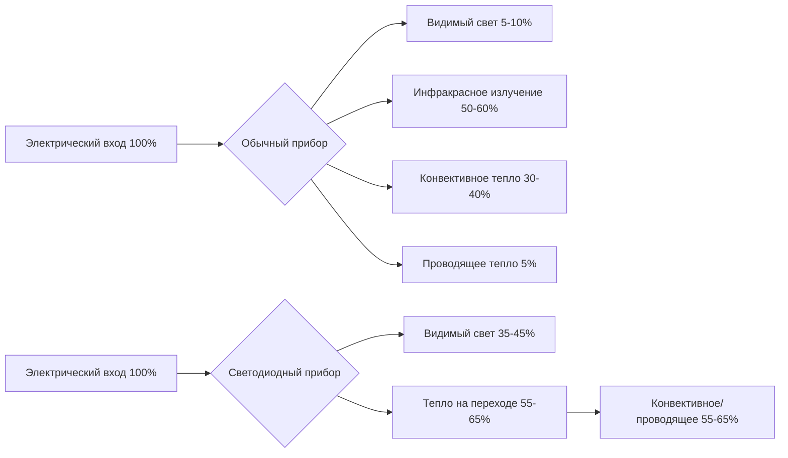
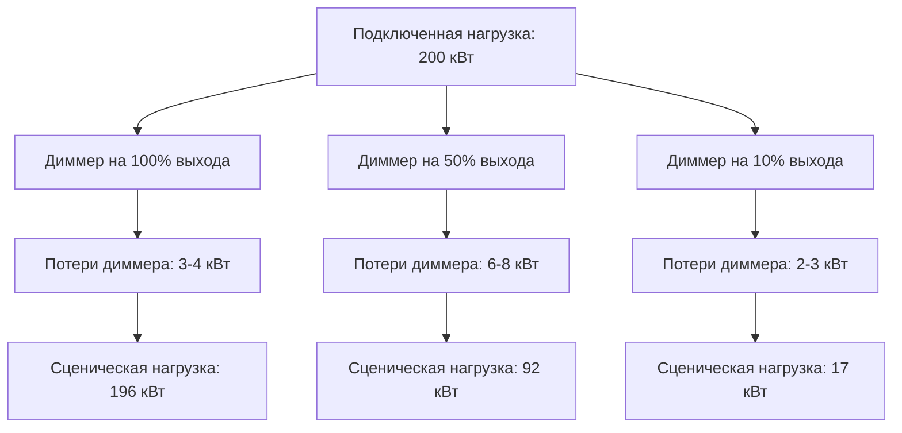
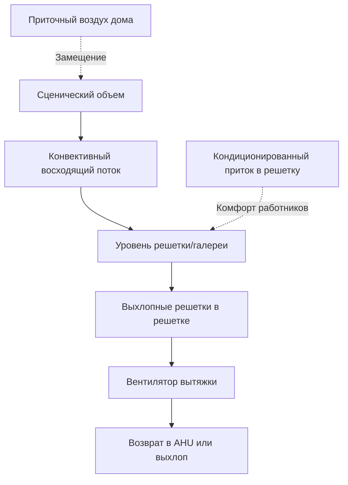

## Фундаментальные характеристики тепловых нагрузок

Сценическое освещение представляет собой один из наиболее значительных и переменных источников тепла в театральных помещениях. Традиционные лампы накаливания и вольфрамово-галогенные приборы преобразуют 90-95% электрической энергии в тепловую энергию, при этом только 5-10% производит видимый свет. Эта неэффективность создает существенные проблемы с охлаждением, требующие тщательного инженерного анализа.

Мгновенное тепловыделение от освещения подчиняется фундаментальному соотношению:

$$Q_{lighting} = \sum_{i=1}^{n} P_i \times F_{use} \times F_{allow}$$

Где $Q_{lighting}$ — общее тепловыделение (Вт), $P_i$ — подключенная мощность прибора (Вт), $F_{use}$ — коэффициент использования (0-1), и $F_{allow}$ — коэффициент допуска для балласта/вспомогательного оборудования.

### Типичные плотности мощности приборов

Театральные осветительные установки имеют широкий диапазон плотности мощности в зависимости от требований производства:

| Тип помещения | Плотность мощности | Подключенная нагрузка | Расчетная нагрузка |
|--------------|-------------------|----------------------|-------------------|
| Малый театр | 10,8-16,1 Вт/м² | 40-60 кВт | 60-80% |
| Региональный театр | 21,5-32,3 Вт/м² | 100-150 кВт | 70-90% |
| Крупное производство | 32,3-53,8 Вт/м² | 200-400 кВт | 80-100% |

Процент расчетной нагрузки отражает коэффициент одновременного использования при максимальной интенсивности производства.

## Тепловые характеристики обычного и светодиодного освещения

Переход от обычных вольфрамово-галогенных к светодиодным приборам принципиально изменяет профиль тепловой нагрузки и характеристики отвода тепла.

### Сравнение преобразования энергии

### Тепловой анализ уровня прибора

Для типичного обычного эллипсоидального рефлекторного прожектора (ERS):

$$Q_{total} = P_{lamp} + P_{ballast} = 750\,\text{Вт} + 50\,\text{Вт} = 800\,\text{Вт}$$

Излучающий компонент непосредственно влияет на комфорт исполнителя:

$$Q_{radiant} = 0,55 \times 800 = 440\,\text{Вт}$$

Эквивалентный светодиодный прибор, производящий аналогичный световой выход:

$$Q_{total,LED} = P_{LED} + P_{driver} = 200\,\text{Вт} + 20\,\text{Вт} = 220\,\text{Вт}$$

Это представляет собой снижение на 72,5% тепловыделения на один прибор.

| Параметр | Обычный 750 Вт | Светодиодный 200 Вт | Снижение |
|----------|----------------|-------------------|----------|
| Общее тепло | 800 Вт | 220 Вт | 72,5% |
| Излучающее тепло | 440 Вт | 22 Вт | 95% |
| Конвективное тепло | 280 Вт | 178 Вт | 36% |
| Влияние на нагрузку помещения | 800 Вт | 220 Вт | 72,5% |

## Тепловые эффекты диммерных систем

Эксплуатация диммера вызывает сложное тепловое поведение, которое противоречит общепринятым предположениям. Диммеры на основе управляемых кремниевых выпрямителей (SCR) рассеивают максимальное количество тепла при работе на промежуточных уровнях (40-60% выходной мощности) из-за увеличенных потерь при фазовом управлении.

Рассеивание тепла диммером подчиняется следующему соотношению:

$$P_{dimmer} = I_{RMS}^2 \times R_{on} + V_{forward} \times I_{avg}$$

Где $R_{on}$ — сопротивление SCR в открытом состоянии и $V_{forward}$ — падение прямого напряжения.

### Профиль нагрузки помещения диммеров

Справочник ASHRAE — Приложения HVAC рекомендует проектировать охлаждение помещения диммеров на 5-7% подключенной нагрузки как тепловыделение, происходящее в сосредоточенном помещении оборудования, требующем выделенной вентиляции.

## Требования к вентиляции осветительной решетки

Осветительная решетка или галерея испытывают экстремальную тепловую стратификацию, с температурами на 8-14 °C выше уровня занятого пространства из-за восходящих конвективных потоков и поглощения излучения конструктивными элементами.

### Анализ стратификации

Повышение температуры выше окружающей подчиняется движению, вызванному плавучестью:

$$\Delta T_{stratification} = \frac{Q_{convective}}{(\rho \times c_p \times V_{exhaust})}$$

Для осветительной нагрузки 150 кВт с конвективной долей 60%:

$$\Delta T = \frac{90 000\,\text{Вт}}{(1,2\,\text{кг/м}^3 \times 1005\,\text{Дж/кг·К} \times 3,5\,\text{м}^3\text{/с})} = 21,3\,\text{°C}$$

### Стратегия вентиляции решетки

Расчетные скорости вентиляции для осветительных решеток:

| Плотность освещения | Скорость вентиляции | Воздухообмены в час |
|-------------------|-------------------|----------------------|
| < 10,8 Вт/м² | 1,5-2,0 CFM/Вт (2,5-3,4 м³/ч/Вт) | 15-25 ACH |
| 10,8-21,5 Вт/м² | 2,0-2,5 CFM/Вт (3,4-4,2 м³/ч/Вт) | 25-35 ACH |
| > 21,5 Вт/м² | 2,5-3,0 CFM/Вт (4,2-5,1 м³/ч/Вт) | 35-50 ACH |

## Эффекты излучающего тепла на исполнителей

Интенсивность излучения на уровне исполнителя зависит от расстояния до прибора, угла луча и интенсивности. Излучающий тепловой поток подчиняется закону обратных квадратов:

$$E = \frac{I_{radiant}}{d^2} \times \cos(\theta)$$

Где $E$ — облученность (Вт/м²), $I_{radiant}$ — интенсивность излучения, $d$ — расстояние, и $\theta$ — угол от центральной оси луча.

Исполнитель, находящийся в 6,1 м от 1000 Вт обычного прожектора, получает:

$$E = \frac{550\,\text{Вт}}{(6,1\,\text{м})^2} \times 1,0 = 14,8\,\text{Вт/м}^2$$

Это превышает допустимые пределы лучистой асимметрии (5 Вт/м²), указанные в стандарте ASHRAE 55, требуя повышенной скорости воздуха или пониженной температуры сухого термометра в зоне выступлений.

## Интеграция с системами HVAC

Динамичный характер театрального освещения требует сложной интеграции управления. Стандарты ASHRAE 189.1 и IECC 90.1 признают театральное освещение как технологическую нагрузку, исключенную из стандартных ограничений плотности мощности освещения, но проектирование системы охлаждения должно учитывать:

1. **Проектирование на пиковую нагрузку** — рассчитать оборудование на максимальный вероятный сценарий освещения (обычно 80-90% подключенной нагрузки)
2. **Возможность модуляции** — обеспечить модулирующую мощность до 20-30% для репетиций и подготовки
3. **Быстрый отклик** — спроектировать распределение воздуха для отклика за 15-20 минут на изменения нагрузки
4. **Зонирование** — изолировать охлаждение сцены от зала, чтобы предотвратить переохлаждение зрителей во время темной сцены

Общая корректировка нагрузки охлаждения здания для театрального освещения:

$$Q_{cooling} = 3,412 \times P_{connected} \times F_{use} \times F_{CLF}$$

Где $F_{CLF}$ — коэффициент охлаждающей нагрузки (0,75-0,95 для мгновенных осветительных нагрузок без эффектов тепловой аккумуляции в современном строительстве).

## Условия окружающей среды на галереях

Галереи и решетки требуют особого внимания к сотрудникам технического обслуживания, которые получают доступ к приборам во время технических работ. Хотя OSHA не устанавливает ограничения температуры для этих помещений, практические пределы 32-37 °C по сухому термометру обеспечивают безопасность работников и производительность.

Индекс теплового напряжения в этих приподнятых пространствах учитывает скорость метаболической работы (умеренная при 300-400 Вт), излучающее воздействие от приборов (50-100 Вт/м²) и сниженную скорость воздуха (< 0,25 м/с). Точечное охлаждение или персональные системы охлаждения становятся необходимыми, когда окружающие температуры превышают 32 °C в сочетании с излучающими нагрузками.

---

**Связанные темы:** [Системы вентиляции театра](../../../../../specialty-applications-testing/specialty-hvac-applications/places-of-assembly/theaters-auditoriums/_index.md), [Охлаждение помещения диммеров](../../../../../specialty-applications-testing/specialty-hvac-applications/places-of-assembly/theaters-auditoriums/_index.md), Тепловой комфорт занятых
