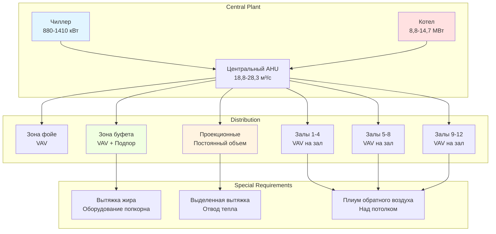

## Обзор

Системы HVAC кинотеатров должны соответствовать экстремальным колебаниям плотности занятости, управлять значительными тепловыделениями от систем цифровой проекции, поддерживать акустические характеристики и обеспечивать управление на уровне зон в нескольких зрительных залах. Современные мультиплексные комплексы создают уникальные вызовы с одновременной работой 8-16 зрительных залов, каждый из которых требует независимого управления температурой и вентиляцией при использовании общего центрального оборудования.

Основная проектная задача заключается в быстрых колебаниях занятости между сеансами. Зрительный зал на 300 мест переходит от пустого к полной вместимости в течение 15 минут, создавая мгновенные скрытые и явные тепловые нагрузки, требующие активного управления HVAC.

## Нагрузки от занятости и вентиляции

Плотность занятости кинотеатров значительно превышает типичные общественные помещения. Строительные нормы требуют проектирования для максимальной вместимости:

$$
\text{Вместимость} = \frac{\text{Площадь зала (м}^2\text{)}}{0.65 \, \text{м}^2\text{/чел}}
$$

Для зрительного зала площадью 465 м²:

$$
\text{Вместимость} = \frac{465}{0.65} \approx 714 \text{ человек}
$$

ASHRAE Standard 62.1 требует расходов наружного воздуха 2,36 м³/ч на человека плюс 0.61 м³/(ч·м²) для кинотеатров. Общее требование к вентиляции:

$$
Q_{oa} = (2,36 \times 714) + (0,61 \times 465) = 1686 + 284 = 1970 \, \text{м³/ч}
$$

Это значительное требование к наружному воздуху определяет энергопотребление и требует применения систем рекуперации тепла в большинстве климатических зон.

## Тепловыделения от оборудования

### Системы цифровой проекции

Современные цифровые кинопроекторы выделяют 1500-3500 Вт тепла в зависимости от яркости и технологии. Высокояркие системы для больших экранов (12-18 м) с поддержкой 3D находятся в верхнем диапазоне:

$$
Q_{projector} = 3000 \, \text{Вт} = 3156 \, \text{кДж/ч}
$$

Охлаждение проекционной кабины требует выделенных систем с резервными устройствами, так как перегрев проектора приводит к немедленному прерыванию сеанса. Температура в кабине не должна превышать 35°C при любых условиях работы.

### Усилители звуковой системы

Стойки усилителей генерируют 200-400 Вт на зрительный зал, что добавляет дополнительное явное тепло в оборудовочные помещения.

## Акустические требования

Уровень шума системы HVAC не должен превышать NC-30 в зрительных залах, чтобы не создавать помех звукозаписи фильмов. Это требует:

- Низкоскоростных воздуховодов (максимум 6 м/с в занятых помещениях)
- Звукопоглощающих элементов на всех зональных подключениях
- Виброизоляции всего механического оборудования
- Гибких воздуховодных соединений для предотвращения структурного переноса звука
- Воздухораспределительных устройств, отвечающих критерию NC-25 или лучше

Воздухораспределительные решетки никогда не должны размещаться рядом со стеной экрана или зонами потолочных громкоговорителей, так как шум воздуха комбинируется деструктивно с направленными аудиосистемами.

## Зонирование HVAC мультиплекса

Каждый зрительный зал требует независимого зонального управления из-за разных времен сеансов. Типичный 12-экранный мультиплекс работает со следующей схемой:

## Требования HVAC по размеру зрительного зала

| Вместимость зала | Площадь (м²) | Холодильная нагрузка (кВт) | Тепловая нагрузка (кВт) | Расход воздуха (м³/ч) | Наружный воздух (м³/ч) | Акустический критерий |
|---------------------|------------------|---------------------|-------------------|---------------------|-------------------|-----------------|
| 100-150 мест | 140-186 | 28-42 | 23-35 | 1700-2550 | 280-425 | NC-30 |
| 200-300 мест | 280-418 | 53-77 | 44-65 | 3400-4825 | 565-850 | NC-30 |
| 400-500 мест | 557-697 | 106-141 | 88-117 | 6800-8500 | 1130-1415 | NC-30 |
| 600+ мест (премиум) | 836+ | 176-247 | 147-205 | 10200-14200 | 1700-2270 | NC-25 |

*Примечание: Нагрузки основаны на 330 кДж/ч явного и 660 кДж/ч скрытого тепла на человека при максимальной занятости, плюс теплопередача через ограждение и тепловыделения от оборудования.*

## Последствия амфитеатра

Современное расположение мест с приподнятыми задними рядами создает вызовы из-за тепловой стратификации. Стратегии распределения подаваемого воздуха включают:

1. **Вентиляция вытеснением из подпола** с уровня ступеней (предпочтительно для энергоэффективности)
2. **Высокие боковые диффузоры** с вертикальной траекторией струи
3. **Потолочные переменные воздухораспределители** с направленным выбросом

Вертикальный градиент температуры не должен превышать 1,7°C между уровнем головы в передних и задних рядах. Это часто требует выделенных зон подачи для верхних ярусов мест.

## Области буфета и фойе

Буфетные зоны генерируют значительные явные и скрытые нагрузки от аппаратов для попкорна (5-8 кВт каждый), подогревателей для начинок и раздатчиков напитков. Выделенные устройства подпора воздуха обеспечивают 150-200% от расхода вытяжного воздуха, поддерживая избыточное давление относительно зрительных залов и предотвращая миграцию запахов в кинозалы.

Зоны фойе служат в качестве тепловых буферных зон и вмещают очереди посетителей. Проектирование на 50% от общей вместимости театров, одновременно присутствующих в часы пик выходных дней.

## Управление и работа по требованию

Современное управление HVAC кинотеатров использует последовательности управления на основе занятости:

- **Предварительная продувка**: 30-минутная вентиляция с большим объемом перед сеансом
- **Режим сеанса**: Сниженный расход воздуха (60-70% от проектного) с DCV на основе CO₂
- **Буст во время антракта**: Временное увеличение расхода для быстрого обновления воздуха
- **Режим отсутствия**: Сниженное кондиционирование между сеансами с ограничением дрейфа температуры (±2,8°C)

Эти последовательности снижают энергопотребление на 30-40% по сравнению с работой с постоянным объемом, сохраняя при этом качество воздуха и комфорт.

## Рекуперация энергии

Вентиляторы рекуперации тепла или колеса рекуперации энергии необходимы в климатических зонах с более чем 1110 градусо-днями отопления или 555 градусо-днями охлаждения. Полная эффективность 60-70% пропорционально снижает нагрузки на кондиционирование наружного воздуха, с сроком окупаемости менее 3 лет для объектов, работающих 360+ дней в году.

## Ссылки на проектирование

ASHRAE Handbook—HVAC Applications, Глава 5 (Places of Assembly) содержит рекомендации по проектированию, специфичные для кинотеатров. Ключевые рекомендации включают минимум 8 воздухообменов в час во время занятости, 0,5-1,0 воздухообмена в час во время отсутствия и положения по управлению дымом согласно IMC Section 909.

## Специальные соображения

**IMAX и премиум большие форматы**: Кинотеатры с экранами, превышающими 18 м, требуют проекторов, генерирующих 4000-6000 Вт. Емкости охлаждения проекционных кабин увеличиваются пропорционально, часто требуя сплит-систем с резервными компрессорами.

**3D системы**: Поляризационные серебристые экраны имеют более низкую излучательную способность, чем стандартные белые экраны, что слегка снижает радиационный прирост тепла, но увеличивает отраженные световые нагрузки в помещении.

**Откидные кресла**: Роскошные откидные кресла снижают плотность мест на 0,11-0,14 м²/чел, пропорционально снижая нагрузки от занятости, но увеличивая площадь на одно место для распределения воздуховодов.

---

**Файл**: `/Users/evgenygantman/Documents/github/gantmane/hvac/content/specialty-applications-testing/specialty-hvac-applications/places-of-assembly/theaters-auditoriums/movie-theaters/_index.md`
