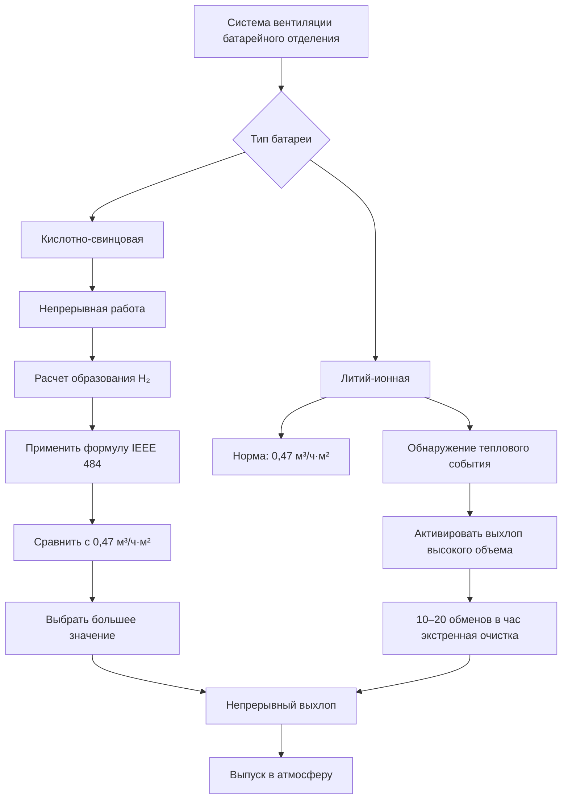
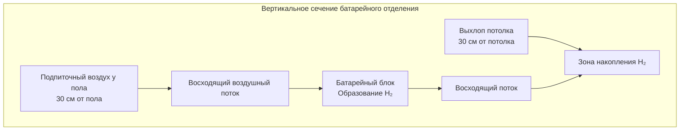
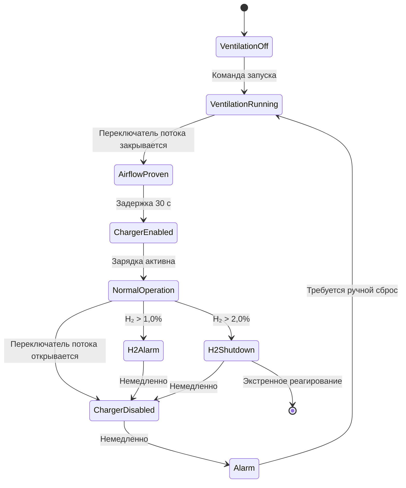

Системы вентиляции батарейных отделений выполняют критическую функцию безопасности, отличающуюся от комфортной вентиляции: предотвращение взрывоопасного накопления водорода путем непрерывной вентиляции разбавления. При заряде кислотно-свинцовые батареи электролизируют воду с образованием газов водорода и кислорода. Водород с его исключительно низкой плотностью (0,0696 кг/м³) и нижним пределом взрывчатости 4,0% по объему создает катастрофический риск взрыва при накоплении. Надлежащее проектирование вентиляции требует количественной оценки скоростей образования водорода, расчета расходов воздуха разбавления, позиционирования точек выхлопа согласно физике плавучести и интеграции предохранительных блокировок, которые предотвращают зарядку без доказанного воздушного потока.

## Электрохимическое образование водорода

Кислотно-свинцовые батареи генерируют водород путем электролиза воды при напряжении заряда, превышающем пороговое напряжение газообразования. Фундаментальная электрохимическая реакция:

$$2\text{H}_2\text{O} \rightarrow 2\text{H}_2 \uparrow + \text{O}_2 \uparrow$$

Эта реакция разложения выделяет два моля водорода на каждый моль кислорода. Объемное отношение составляет 2:1, создавая стехиометрическую смесь при отсутствии вентиляции.

**Пороговое напряжение газообразования:**

Для кислотно-свинцовых элементов при 25°C:
- Открытые элементы: газообразование начинается приблизительно при 2,30–2,35 В/элемент
- VRLA (регулируемые клапаном кислотно-свинцовые): газообразование начинается при 2,35–2,40 В/элемент
- Температурный коэффициент: -3 до -5 мВ/°C (напряжение снижается с повышением температуры)

Плавающий заряд, как правило, работает при 2,25–2,30 В/элемент, производя минимальное выделение газа. Уравнительный заряд при 2,50–2,65 В/элемент генерирует значительное выделение водорода, представляющее условие проектирования для расчетов вентиляции.

**Применение закона Фарадея:**

Теоретическая скорость образования водорода следует закону Фарадея электролиза:

$$Q_{\text{H}_2} = \frac{n \cdot I \cdot t}{z \cdot F} \cdot V_m$$

Где:
- $Q_{\text{H}_2}$ = Объем образовавшегося водорода (л)
- $n$ = Количество элементов
- $I$ = Ток на элемент (A)
- $t$ = Время (с)
- $z$ = Количество переданных электронов (2 для H₂)
- $F$ = Постоянная Фарадея (96 485 Кл/моль)
- $V_m$ = Молярный объем при СТУ (22,4 л/моль)

**Практическая скорость образования водорода:**

IEEE 484 предоставляет эмпирическое уравнение с учетом эффективности заряда и типа батареи:

$$Q = \frac{N \cdot I \cdot C \cdot F_{\text{eq}}}{1 \times 10^6}$$

Где:
- $Q$ = Скорость образования водорода (м³/ч)
- $N$ = Количество элементов в цепи батареи
- $I$ = Ток заряда на элемент (ампер)
- $C$ = Коэффициент емкости (безразмерный коэффициент)
- $F_{\text{eq}}$ = Коэффициент уравнивания

**Коэффициенты емкости по типам батарей:**

| Тип батареи | Плавающий заряд | Уравнивающий заряд | Примечания |
|--------------|-----------------|-------------------|-----------|
| Открытая кислотно-свинцовая | 0,00042 | 0,00042 | Повышенная скорость газообразования |
| VRLA (AGM) | 0,0005 | 0,0005 | Внутренняя рекомбинация снижает внешнее газообразование |
| VRLA (гелевая) | 0,0003 | 0,0003 | Меньшее газообразование, чем открытая |
| Чистый свинец | 0,0002 | 0,0002 | Минимальное газообразование |

Коэффициент уравнивания $F_{\text{eq}}$ варьируется от 1,0 (плавающий) до 1,5 (уравнивающий заряд). Консервативное проектирование использует 1,5.

## Пример расчета образования водорода

**Параметры системы:**
- Конфигурация батареи: цепь из 60 элементов (номинально 120 В пост. тока)
- Тип батареи: открытая кислотно-свинцовая
- Ток уравнивающего заряда: 400 А
- Коэффициент емкости: 0,00042
- Коэффициент уравнивания: 1,5

**Расчет:**

$$Q = \frac{60 \times 400 \times 0,00042 \times 1,5}{1 \times 10^6} = \frac{15,12}{10^6} = 0,00001512 \text{ м}^3/\text{ч}$$

Это представляет базовое образование водорода, требующее непрерывной вентиляции разбавления.

**Несколько параллельных цепей батарей:**

Электростанции обычно используют несколько резервных параллельных цепей батарей. Для трех параллельных цепей:

$$Q_{\text{total}} = 3 \times 0,00001512 = 0,00004536 \text{ м}^3/\text{ч}$$

## Физика взрывной опасности

Водород создает уникальные взрывные опасности из-за его молекулярных свойств и характеристик горения.

**Нижний предел взрывчатости (LEL):**

Смеси водорода с воздухом воспламеняются между 4,0% (LEL) и 75% (UEL) по объему. Широкий диапазон воспламеняемости создает постоянную опасность — большинство горючих газов имеют узкие диапазоны (метан: 5–15%, пропан: 2,1–9,5%).

**Минимальная энергия воспламенения:**

Водород требует всего 0,017 мДж для воспламенения, в сравнении с:
- Метаном: 0,28 мДж
- Пропаном: 0,26 мДж
- Паром бензина: 0,24 мДж

Это исключительно низкий энергетический порог означает, что статический разряд, механические искры или горячие поверхности легко воспламеняют смеси водорода с воздухом.

**Ламинарная скорость горения:**

Водород горит быстро с ламинарной скоростью горения $S_L = 2,65$ м/с при стехиометрических условиях, в сравнении с метаном при 0,38 м/с. Эта семикратная более высокая скорость производит быстрый рост давления при ограниченных взрывах.

**Плавучесть и стратификация:**

Плотность водорода при 20°C и 1 атм:

$$\rho_{\text{H}_2} = \frac{M \cdot P}{R \cdot T} = \frac{2,016 \times 101 325}{8314 \times 293} = 0,0838 \text{ кг/м}^3$$

Плотность воздуха при тех же условиях: $\rho_{\text{air}} = 1,204$ кг/м³

Отношение плотностей:

$$\frac{\rho_{\text{H}_2}}{\rho_{\text{air}}} = \frac{0,0838}{1,204} = 0,0696 \approx 1/14$$

Водород в 14 раз легче воздуха, создавая сильную силу плавучести:

$$F_b = (\rho_{\text{air}} - \rho_{\text{H}_2}) \cdot g \cdot V$$

Эта плавучесть приводит в движение быстрое восходящее движение, при котором водород достигает потолочных точек в течение секунд после выхода. Расположение выхлопа на уровне потолка является обязательным.

## Расчеты требуемого расхода вентиляции разбавления

Требуемый расход воздуха должен разбавлять водород до безопасных концентраций, обычно 25% LEL (1,0% по объему) с адекватным запасом безопасности.

**Фундаментальное уравнение разбавления:**

$$V_{\text{req}} = \frac{Q_{\text{H}_2} \times 100 \times F_s}{C_{\text{max}}}$$

Где:
- $V_{\text{req}}$ = Требуемый расход вентиляции (CFM)
- $Q_{\text{H}_2}$ = Скорость образования водорода (м³/ч)
- $F_s$ = Коэффициент безопасности (минимум 4,0 согласно IEEE 484)
- $C_{\text{max}}$ = Максимальная допустимая концентрация (1,0% = 25% LEL)

**Применение к предыдущему примеру:**

При конвертации из м³/ч в CFM (1 CFM = 1,699 м³/ч), где $Q_{\text{H}_2} = 0,00001512$ м³/ч = 0,0000089 CFM:

$$V_{\text{req}} = \frac{0,0000089 \times 100 \times 4,0}{1,0} = 0,00356 \text{ CFM}$$

**Минимум по предписаниям NFPA 1:**

Независимо от расчетного образования водорода, NFPA 1 устанавливает:

$$V_{\text{min}} = 0,47 \text{ м}^3/\text{ч·м}^2 \times A_{\text{floor}}$$

Для батарейного отделения площадью 18,6 м²:

$$V_{\text{min}} = 0,47 \times 18,6 = 8,74 \text{ м}^3/\text{ч} \approx 5,1 \text{ CFM}$$

**Выбор расхода вентиляции при проектировании:**

$$V_{\text{design}} = \max(V_{\text{req}}, V_{\text{min}}) \times F_{\text{design}}$$

Где $F_{\text{design}} = 1,25$–1,5 (коэффициент конструкционного запаса)

Используя минимум NFPA (большее значение):

$$V_{\text{design}} = 8,74 \times 1,25 = 10,9 \text{ м}^3/\text{ч} \approx 6,4 \text{ CFM}$$

## Литий-ионные батареи: специальные рассмотрения

Литий-ионные батареи демонстрируют принципиально различные характеристики газообразования по сравнению с кислотно-свинцовыми системами.

**Нормальная работа:**

Литий-ионные элементы не генерируют водород при нормальном заряде. Процесс интеркаляции/деинтеркаляции лития не производит газа:

$$\text{LiCoO}_2 + \text{C}_6 \leftrightarrow \text{Li}_{1-x}\text{CoO}_2 + \text{Li}_x\text{C}_6$$

**Условия теплового разбегания:**

При тепловом разбегании (внутреннее короткое замыкание, перезаряд, перегревание) литий-ионные элементы выделяют пары электролита и горючие газы, включая:
- Карбонаты (диметилкарбонат, этиленкарбонат)
- Моноксид углерода (CO)
- Диоксид углерода (CO₂)
- Фторид водорода (HF) от разложения электролита
- Углеводороды

**Подход к проектированию вентиляции:**

| Параметр | Кислотно-свинцовая | Литий-ионная |
|----------|-------------------|-------------|
| Газообразование в нормальных условиях | Непрерывное низкоуровневое | Отсутствует |
| Триггер вентиляции | Всегда при заряде | Обнаружение теплового разбегания |
| Основа проектирования | Разбавление непрерывного образования | Быстрая очистка от выбросов события |
| Типичный расход | 0,47 м³/ч·м² непрерывно | 10–20 обменов воздуха в час при активации |
| Обнаружение газа | Водород (H₂) | Множественный газ (дым, CO, VOC) |

NFPA 855 (стандарт для установки стационарных систем накопления энергии) требует:
- Механическую вентиляцию для крупномасштабных установок литий-ионных батарей
- Активацию выхлопа при обнаружении газообразования
- Минимум 0,47 м³/ч·м² для отделений, содержащих литий-ионные батареи
- Улучшенную вентиляцию (10+ обменов воздуха в час) при тепловых событиях

## Требования к проектированию системы выхлопа

Крайняя плавучесть водорода диктует расположение точки отбора выхлопа. Анализ стратификации демонстрирует требование для отбора выхлопа на уровне потолка.

**Градиент концентрации:**

В спокойном помещении с выпуском водорода на уровне пола вертикальная концентрация следует турбулентной диффузии с плавучестью:

$$\frac{\partial C}{\partial t} = D \frac{\partial^2 C}{\partial z^2} + u_b \frac{\partial C}{\partial z}$$

Где:
- $C$ = Концентрация водорода
- $D$ = Коэффициент турбулентной диффузии
- $z$ = Вертикальная координата
- $u_b$ = Скорость плавучести

Решение демонстрирует экспоненциальное увеличение концентрации, приближаясь к потолку.

**Требования к расположению выхлопа:**

- Входное отверстие выхлопа в пределах 30 см от потолка
- Несколько точек выхлопа для отделений, превышающих 46 м² площади пола
- Расстояние: максимум 7,5–9 метров между точками выхлопа
- Избегать мертвых зон в углах и за препятствиями

**Расположение выпуска выхлопа:**

- Минимум 3 метра от воздухозаборных жалюзи
- Минимум 3 метра выше уровня крыши
- Минимум 4,5 метра от границ имущества, открываемых отверстий
- Избегать рециркуляции в системы вентиляции здания

**Положения подпиточного воздуха:**

Подпиточный воздух на низком уровне создает поток от пола к потолку:

- Входное отверстие подпиточного воздуха в пределах 30 см от пола
- Расположено на противоположной стене от точек выхлопа
- Пассивное (жалюзи/решетка) или активное (канальное питание)
- Скорость воздушного потока в верхней части батареи: 0–0,25 м/с (избегать чрезмерного охлаждения)

**Анализ картины потока:**

## Требования к оборудованию, защищенному от взрывов

Статья 500 NEC классифицирует батарейные отделения как места Класс I, Отделение 2, Группа B, когда концентрация водорода может достичь 25% LEL при ненормальных условиях отказа вентиляции.

**Классификация опасной зоны:**

Класс I: Горючие газы или пары
Отделение 2: Только ненормальные условия (отказ вентиляции)
Группа B: Водород и газы эквивалентной опасности

**Выбор оборудования по расположению:**

| Оборудование | Требуемая классификация | Альтернативы |
|--------------|------------------------|------------|
| Двигатель вентилятора выхлопа | Класс I, Отд. 2, Группа B | Внешний монтаж вне отделения |
| Лопасти вентилятора выхлопа | Конструкция без искрообразования | Неферритметаллическое (алюминий, латунь) или покрытая сталь |
| Осветительные приборы | Герметичные, Класс I Отд. 2 | Закрытые и уплотненные |
| Выключатели, розетки | Рассчитаны на Класс I, Отд. 2 | Монтаж вне отделения |
| Датчики температуры | Цепи внутренней безопасности | Подходящие для Отд. 2 |
| Методы прокладки проводов | Опечатанный кондуит, взрывозащитные фитинги | IMC/RMC с опечатанными фитингами |

**Вариант проектирования - неклассифицированное пространство:**

Некоторые юрисдикции разрешают неклассифицированное проектирование, если инженерный анализ демонстрирует, что концентрация водорода остается ниже 25% LEL при всех вероятных сценариях, включая:
- Одиночный отказ вентиляции с активацией резервного вентилятора
- Непрерывный мониторинг водорода с блокировкой зарядного устройства
- Сигнал тревоги и автоматическое отключение зарядного устройства при концентрации 1%

Этот подход требует одобрения органом надзора и комплексной документации.

**Критерии выбора вентилятора:**

Центробежные вентиляторы с обратным наклоном с:
- Конструкцией без искрообразования (AMCA Spark Resistant Construction)
- Неферритметаллическим рабочим колесом или покрытой сталью
- Внешним монтажом двигателя или взрывозащитным двигателем
- Предпочтительна прямая передача вместо ременной передачи (исключить статическое накопление)

## Системы предохранительных блокировок и мониторинга

Комплексные системы безопасности предотвращают накопление водорода путем многоуровневого контроля и мониторинга.

**Последовательность логики блокировки:**

**Доказательство воздушного потока:**

Дифференциальный переключатель давления контролирует воздуховод выхлопа:
- Минимальный $\Delta P$ = 0,025 кПа в станции измерения потока
- Регулируемая временная задержка: 30–60 секунд (предотвращение ложных срабатываний)
- Контакты нормально разомкнуты закрываются при доказанном воздушном потоке
- Потеря потока открывает контакты, отключает зарядное устройство

**Обнаружение водорода:**

Электрохимические или каталитические датчики непрерывно контролируют концентрацию водорода:
- Расположение датчика: уровень потолка, в пределах 30 см от наивысшей точки
- Установка сигнала тревоги: 1,0% по объему (25% LEL)
- Установка отключения: 2,0% по объему (50% LEL)
- Интервал калибровки: ежеквартально согласно требованиям производителя

**Сравнение технологий обнаружения:**

| Технология | Диапазон | Точность | Время отклика | Срок службы |
|------------|----------|----------|--------|----------|
| Электрохимическая | 0–4% | ±0,1% | 15–30 сек | 2–3 года |
| Каталитическая бусина | 0–100% LEL | ±5% LEL | 10–20 сек | 3–5 лет |
| Тепловая проводимость | 0–100% | ±2% | 5–10 сек | 5–10 лет |

Электрохимические датчики предлагают наилучшую точность при низких концентрациях, актуальных для пределов безопасности.

**Требования к последовательности управления:**

1. Запуск вентиляции → 30-секундная задержка установления воздушного потока
2. Воздушный поток доказан → Включить цепь зарядного устройства
3. Воздушный поток потерян → Немедленная блокировка зарядного устройства + звуковая/визуальная тревога
4. H₂ > 1,0% → Только тревога (зарядное устройство продолжает, если приемлемо)
5. H₂ > 2,0% → Отключение зарядного устройства + эвакуационная тревога
6. Требуется ручной сброс после любого состояния срабатывания

**Избыточность для критических приложений:**

- Двойные вентиляторы выхлопа: конфигурация N+1 с автоматическим переключением
- Источник бесперебойного питания: поддерживает вентиляцию при отключении питания
- Двойные датчики водорода: логика голосования (2 из 2 для тревоги)
- Независимый мониторинг: система автоматизации здания + отдельная панель

## Влияние температуры на образование водорода

Температура батареи значительно влияет на скорость газообразования путем электрохимических кинетических и термодинамических эффектов.

**Температурный коэффициент:**

Образование водорода увеличивается приблизительно на 10–15% на каждое повышение температуры на 10°C выше эталонной температуры 25°C. Отношение Аррениуса управляет скоростью реакции:

$$k = A \cdot e^{-E_a/(R \cdot T)}$$

Где:
- $k$ = Константа скорости реакции
- $A$ = Предэкспоненциальный множитель
- $E_a$ = Энергия активации
- $R$ = Универсальная газовая постоянная (8,314 Дж/моль·K)
- $T$ = Абсолютная температура (K)

**Практическая температурная коррекция:**

$$Q_T = Q_{25} \times \left[1 + \alpha(T - 25)\right]$$

Где:
- $Q_T$ = Скорость образования при температуре $T$ (°C)
- $Q_{25}$ = Скорость образования при эталонной 25°C
- $\alpha$ = Температурный коэффициент (0,010–0,015 на °C)

Для батарейного отделения при 35°C с $\alpha = 0,012$:

$$Q_{35} = Q_{25} \times [1 + 0,012(35-25)] = Q_{25} \times 1,12$$

Образование водорода увеличивается на 12% по сравнению с эталонным условием 25°C.

**Следствие при проектировании:**

Батарейные отделения в теплых климатах или с недостаточным охлаждением требуют применения температурной коррекции к расчетам образования водорода. Консервативное проектирование использует максимальную ожидаемую температуру батареи (обычно 35–40°C для внутренних установок).

## Применимые стандарты и нормы

**IEEE 484** (рекомендуемая практика IEEE для проектирования установки и установки кислотно-свинцовых батарей с вентилируемыми отверстиями для стационарных приложений):
- Раздел 5.8: Требования вентиляции
- Методология расчета образования водорода
- Коэффициенты безопасности и конструкционные запасы
- Руководство по выбору оборудования

**NFPA 1** (Пожарный кодекс):
- Раздел 52.1.9: Отделения систем батарей
- Предписывающая скорость вентиляции (0,47 м³/ч·м²)
- Требования выпуска выхлопа
- Руководство по классификации электрооборудования

**NFPA 70** (Национальный электрический кодекс):
- Статья 480: Требования установки батареи
- Статья 500: Классификация опасных мест
- Статья 501: Требования оборудования Класс I, Отделение 2

**NFPA 855** (стандарт для установки стационарных систем накопления энергии):
- Глава 4: Требования системы литий-ионных батарей
- Вентиляция при событиях теплового разбегания
- Интеграция обнаружения и подавления

**Международный механический кодекс (IMC)**:
- Раздел 502: Системы опасного выхлопа
- Раздел 510: Хранение и использование опасных материалов
- Требования конструкции воздуховода и зазоров

**Справочник приложений ASHRAE**:
- Глава 23: Промышленные приложения
- Рассмотрения при проектировании батарейного отделения

## Пакет проектной документации

Полные представления проектирования вентиляции батарейного отделения включают:

**Расчеты:**
- Технические характеристики батареи (тип, элементы, напряжение, емкость)
- Профиль заряда (напряжение плавающего заряда, напряжение уравнивающего заряда, ток)
- Скорость образования водорода, используя методологию IEEE 484
- Применены коэффициенты температурной коррекции
- Определение скорости вентиляции с коэффициентами безопасности
- Сравнение с предписывающим минимумом NFPA 1

**Спецификации оборудования:**
- Данные производительности вентилятора выхлопа (м³/ч, Па, кВт)
- Технические характеристики двигателя и взрывозащитные номиналы
- Технические характеристики датчика водорода и сертификаты калибровки
- Компоненты панели управления и номиналы
- Демпферы, жалюзи и принадлежности

**Чертежи:**
- План этажа, показывающий расположение батареи, расположение выхлопов, подпиточный воздух
- Вертикальное сечение, показывающее зоны стратификации и высоту отбора выхлопа
- Прокладка воздуховода и расположение выпуска
- Электрическая однолинейная диаграмма, показывающая цепи блокировки
- Диаграмма последовательности управления

**Процедуры ввода в эксплуатацию:**
- Измерение и проверка воздушного потока
- Калибровка дифференциального переключателя давления и проверка установки точки
- Функциональное тестирование датчика водорода (контрольный газ)
- Тестирование последовательности блокировки (имитация потери воздушного потока)
- Проверка функции сигнала тревоги и отключения
- Документирование результатов приемочного теста

Вентиляция батарейного отделения представляет специализированное приложение HVAC, критичное по безопасности, где надлежащее проектирование предотвращает катастрофические взрывы. Консервативные методы расчета, совместимый с кодексом выбор оборудования, надежные системы блокировки и комплексный ввод в эксплуатацию гарантируют, что концентрации водорода остаются безопасно ниже взрывных пределов на протяжении всего срока службы батареи.
