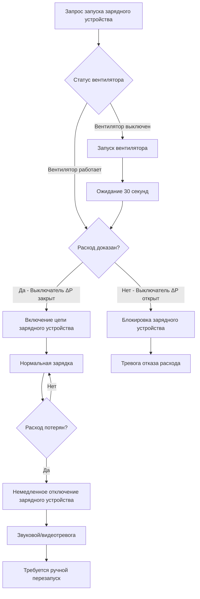
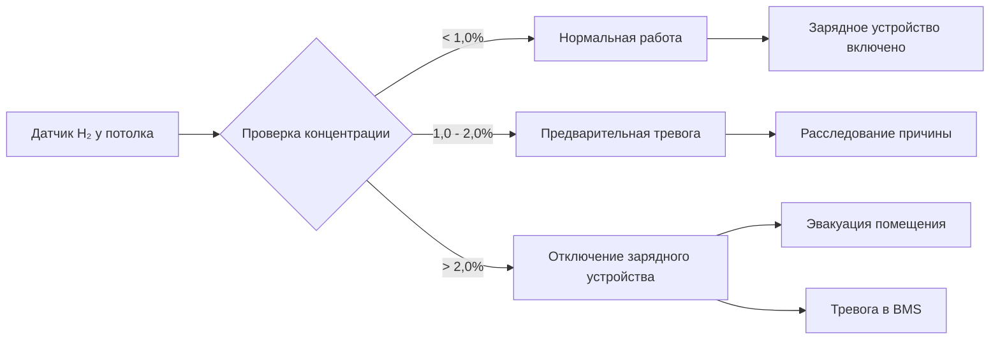
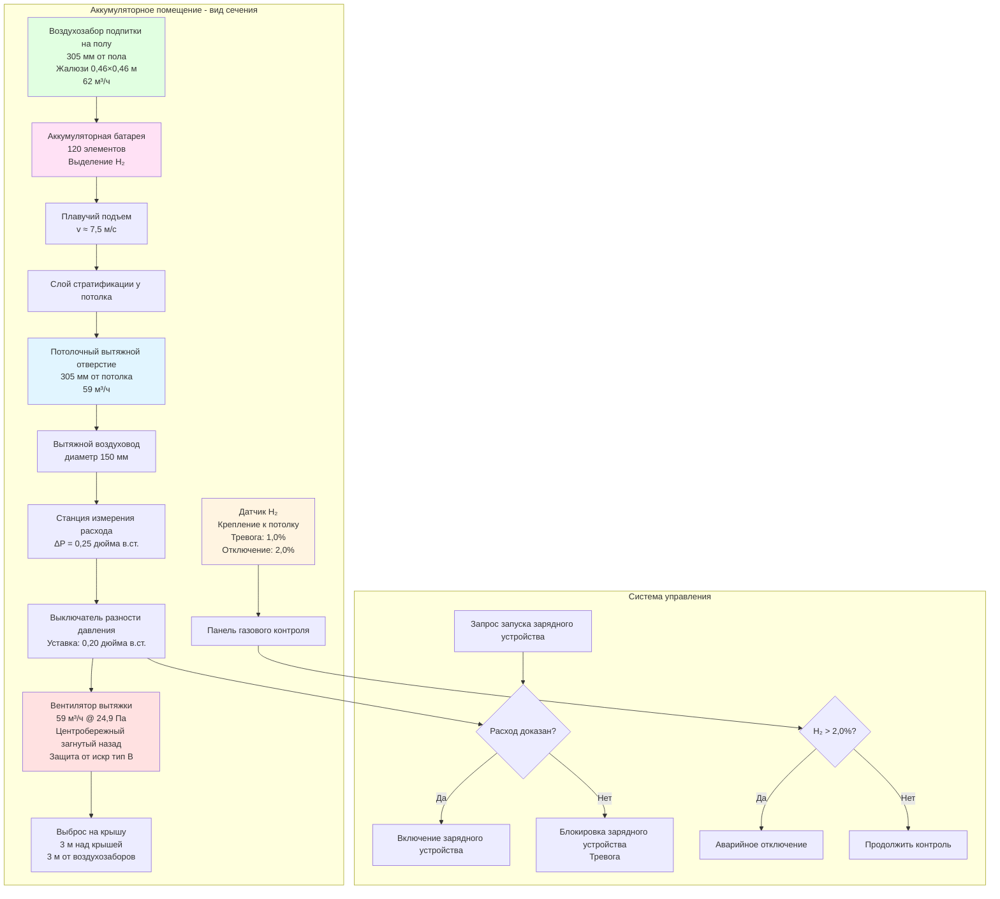

Системы вытяжки из аккумуляторных помещений должны непрерывно удалять газообразный водород для поддержания концентраций ниже взрывоопасных пределов. В отличие от систем общей вентиляции, которые могут допускать перерывистую работу, вытяжка из аккумуляторных помещений требует непрерывной работы во время всех операций зарядки. Проектирование основано на трех физических принципах: расчет достаточного объемного расхода воздуха для разбавления водорода ниже 25% нижнего предела взрываемости (1,0% по объему), размещение вытяжных отверстий на уровне потолка, где накапливается легкий водород, и интеграция систем безопасности, предотвращающих зарядку без подтвержденного расхода вытяжного воздуха. Отказ системы вытяжки создает немедленную угрозу взрыва, так как концентрация водорода может достичь порога НПВ 4,0% в течение минут при неблагоприятных условиях зарядки.

## Расчеты расхода вытяжного воздуха

Объемный расход вытяжного воздуха должен превышать требование разбавления, рассчитанное на основе скорости выделения водорода, коэффициентов безопасности и максимально допустимых пределов концентрации.

**Уравнение вентиляции с разбавлением:**

Фундаментальная зависимость между выделением водорода и требуемым расходом воздуха определяется из баланса массы:

$$\dot{V}_{\text{exhaust}} = \frac{\dot{Q}_{\text{H}_2} \times 100 \times F_s}{C_{\text{max}}}$$

Где:
- $\dot{V}_{\text{exhaust}}$ = Требуемый расход вытяжного воздуха (CFM)
- $\dot{Q}_{\text{H}_2}$ = Скорость выделения водорода (м³/ч)
- $F_s$ = Коэффициент безопасности (безразмерный)
- $C_{\text{max}}$ = Максимально допустимая концентрация водорода (% по объему)

Коэффициент 100 переводит дробную концентрацию в процентное выражение для обеспечения размерной согласованности.

**Определение коэффициента безопасности:**

IEEE 484 рекомендует минимальный коэффициент безопасности $F_s = 4,0$ для учета:

- Неидеального смешивания внутри аккумуляторного помещения (эффективность смешивания обычно 0,7-0,9)
- Локальных максимумов концентрации вблизи газовыделяющих аккумуляторов
- Неопределенностей измерения скоростей выделения водорода
- Эффектов старения батарей на характеристики газовыделения
- Деградации вентиляционной системы за время эксплуатации

Консервативные проекты используют $F_s = 5,0$ до 6,0 для критических объектов, где риск взрыва неприемлем.

**Максимально допустимая концентрация:**

Отраслевой стандарт устанавливает $C_{\text{max}} = 1,0\%$ по объему, представляющий 25% НПВ (4,0%). Это обеспечивает достаточный запас безопасности ниже взрывоопасного порога.

Более консервативные проекты целевой показатель $C_{\text{max}} = 0,5\%$ (12,5% НПВ) для:
- Ядерных объектов
- Центров обработки данных без допустимого времени простоя
- Установок в замкнутых подземных пространствах
- Мест с источниками зажигания, которые нельзя исключить

**Пример расчета - аккумуляторная батарея с жидким электролитом:**

Параметры аккумуляторной системы:
- Конфигурация: цепь из 120 элементов (номинальная система 240 VDC)
- Тип аккумулятора: свинцово-кислотный с жидким электролитом
- Ток уравнительного заряда: 500 ампер
- Коэффициент емкости $C = 0,00042$ (свинцово-кислотный с жидким электролитом)
- Коэффициент уравнительного заряда $F_{\text{eq}} = 1,5$

Скорость выделения водорода согласно IEEE 484:

$$\dot{Q}_{\text{H}_2} = \frac{N \times I \times C \times F_{\text{eq}}}{1 \times 10^6}$$

$$\dot{Q}_{\text{H}_2} = \frac{120 \times 500 \times 0,00042 \times 1,5}{1 \times 10^6} = \frac{37,8}{10^6} = 3,78 \times 10^{-5} \text{ м}^3/\text{ч}$$

Требуемый расход вытяжки с $F_s = 4,0$ и $C_{\text{max}} = 1,0\%$:

$$\dot{V}_{\text{exhaust}} = \frac{3,78 \times 10^{-5} \times 100 \times 4,0}{1,0} = 0,0151 \text{ CFM}$$

**Предписывающий минимум NFPA 1:**

Раздел 52.1.9 Кодекса пожарной безопасности NFPA 1 устанавливает предписывающие требования вентиляции независимо от расчета водорода:

$$\dot{V}_{\text{min}} = 1,0 \text{ CFM/м}^2 \times A_{\text{floor}}$$

Для аккумуляторного помещения с площадью пола $A_{\text{floor}} = 27,9$ м²:

$$\dot{V}_{\text{min}} = 1,0 \times 27,9 = 27,9 \text{ CFM}$$

**Выбор расхода проектирования:**

Определяющий расход проектирования берется как большее значение из требуемого расхода разбавления и предписываемого кодовым минимумом с дополнительным запасом проектирования:

$$\dot{V}_{\text{design}} = \max(\dot{V}_{\text{exhaust}}, \dot{V}_{\text{min}}) \times F_{\text{design}}$$

Где $F_{\text{design}} = 1,25$ учитывает утечки в воздуховодах, падение давления на фильтре и деградацию производительности вентилятора.

$$\dot{V}_{\text{design}} = 27,9 \times 1,25 = 35 \text{ CFM (или 59 м}^3\text{/ч)}$$

Предписываемый минимум NFPA определяет требуемый расход для большинства установок, так как скорости выделения водорода обычно небольшие по сравнению с объемом помещения. Большие аккумуляторные батареи с высокими токами зарядки иногда превышают предписанный минимум, требуя расчетного расхода разбавления.

**Рассмотрение нескольких аккумуляторных цепей:**

Электростанции обычно устанавливают несколько независимых аккумуляторных цепей для обеспечения резервирования. Когда N цепей находятся в общем помещении, скорости выделения суммируются:

$$\dot{Q}_{\text{total}} = \sum_{i=1}^{N} \dot{Q}_{i}$$

Для трех одинаковых цепей из 120 элементов:

$$\dot{Q}_{\text{total}} = 3 \times 3,78 \times 10^{-5} = 1,13 \times 10^{-4} \text{ м}^3/\text{ч}$$

$$\dot{V}_{\text{exhaust}} = \frac{1,13 \times 10^{-4} \times 100 \times 4,0}{1,0} = 0,0452 \text{ CFM}$$

Предписанный минимум по-прежнему определяет требуемый расход для этой умеренной установки.

## Поправочные коэффициенты на температуру

Скорости выделения водорода увеличиваются с температурой аккумулятора в соответствии с кинетикой электрохимических реакций. Соотношение Аррениуса определяет температурную зависимость:

$$\dot{Q}_{T} = \dot{Q}_{25} \times \exp\left[\frac{E_a}{R}\left(\frac{1}{298} - \frac{1}{T}\right)\right]$$

Где:
- $\dot{Q}_T$ = Скорость выделения при температуре T (К)
- $\dot{Q}_{25}$ = Скорость выделения при справочной температуре 25°C (298 К)
- $E_a$ = Энергия активации выделения водорода (приблизительно 25 000 Дж/моль)
- $R$ = Универсальная газовая постоянная (8,314 Дж/моль·К)

**Упрощенное линейное приближение:**

Для практического проектирования в пределах типичного диапазона работы аккумулятора (20-40°C) линейная температурная поправка обеспечивает адекватную точность:

$$\dot{Q}_T = \dot{Q}_{25} \times [1 + \alpha(T - 25)]$$

Где $\alpha = 0,012$ на °C (эмпирический коэффициент для свинцово-кислотных аккумуляторов).

Для аккумуляторного помещения, поддерживаемого при 35°C:

$$\dot{Q}_{35} = \dot{Q}_{25} \times [1 + 0,012(35-25)] = \dot{Q}_{25} \times 1,12$$

Выделение водорода увеличивается на 12% по сравнению с условиями эталонной температуры 25°C.

**Последствия для проектирования:**

Аккумуляторные помещения в жарком климате, с недостаточным охлаждением или подверженные высоким температурам окружающей среды требуют расчетов скорости выделения водорода с поправкой на температуру. Консервативное проектирование использует максимально ожидаемую температуру аккумулятора:

- Внутренние помещения с контролем температуры: 30-35°C
- Наружные кожухи в жарком климате: 40-45°C
- Закрытые шкафы с солнечным нагревом: 50-55°C

Система вытяжки должна обеспечивать повышенную скорость выделения при максимальных температурных условиях.

## Расположение вытяжного отверстия на уровне потолка

Исключительно низкая плотность водорода (0,0838 кг/м³ против 1,204 кг/м³ для воздуха при 20°C) создает сильную плавучесть, обеспечивающую быстрое перемещение вверх. Расположение вытяжного отверстия должно захватывать водород в точке его накопления.

**Анализ сил плавучести:**

Сила плавучести на элемент объема водорода:

$$F_b = (\rho_{\text{air}} - \rho_{\text{H}_2}) \times g \times V$$

Для 1 м³ водорода при 20°C:

$$F_b = (1,204 - 0,0838) \times 9,81 \times 1 = 10,99 \text{ Н}$$

Эта существенная восходящая сила вызывает быстрый подъем водорода сквозь неподвижный воздух с терминальной скоростью, приблизительно:

$$v_{\text{rise}} \approx \sqrt{\frac{2g h \Delta\rho}{\rho_{\text{air}}}}$$

Где h - характерный размер. Для помещения высотой 3 метра:

$$v_{\text{rise}} \approx \sqrt{\frac{2 \times 9,81 \times 3 \times 1,12}{1,204}} = 7,5 \text{ м/с}$$

Водород, выпущенный на уровне пола, достигает потолка в течение 0,4 секунды.

**Физика стратификации:**

В отсутствие механического смешивания водород образует стратифицированный слой под потолком с концентрацией, экспоненциально убывающей с расстоянием от потолка:

$$C(z) = C_{\text{ceiling}} \times \exp\left(-\frac{z}{\lambda}\right)$$

Где:
- $C(z)$ = Концентрация водорода на расстоянии z ниже потолка
- $C_{\text{ceiling}}$ = Максимальная концентрация у потолка
- $\lambda$ = Характеристическая длина спада (обычно 0,3-0,6 м)

Этот крутой градиент концентрации демонстрирует критическое значение расположения вытяжного отверстия.

**Требования к высоте вытяжного отверстия:**

IEEE 484 и NFPA 1 определяют:

- **Максимальное расстояние от потолка:** 305 мм (12 дюймов)
- **Оптимальное расположение:** В пределах 150 мм (6 дюймов) от потолка
- **Монтаж заподлицо с потолком:** Предпочтительная конфигурация для максимальной эффективности улавливания

Вытяжные отверстия, расположенные на средней высоте или на уровне пола, не способны захватывать стратифицированный слой водорода, позволяя концентрациям накапливаться у потолка независимо от расхода вытяжного воздуха.

**Расстояние между несколькими вытяжными отверстиями:**

Большие аккумуляторные помещения требуют несколько вытяжных точек для предотвращения мертвых зон:

| Площадь пола помещения | Минимальное число вытяжных отверстий | Максимальное расстояние между отверстиями |
|------------------------|---------------------------------------|------------------------------------------|
| < 18,6 м² | 1 | Одна точка достаточна |
| 18,6-46,5 м² | 2 | 7,6 м между отверстиями |
| 46,5-93 м² | 3-4 | 7,6 м между отверстиями |
| > 93 м² | Рассчитать по охватываемой площади | 6-7,6 м максимум |

Расстояние обеспечивает, что водород, выпущенный в любом месте помещения, мигрирует к вытяжному отверстию в пределах доступного времени плавучего подъема.

**Учет препятствий:**

Физические препятствия создают мертвые зоны, где накапливается водород:

- Светильники, подвешенные ниже потолка
- Кабельные лотки и кабелепроводы
- Конструктивные балки и стропила
- Воздуховоды HVAC, пересекающие помещение

Вытяжные отверстия должны быть расположены для захвата водорода из всех потенциальных точек накопления, включая пространства выше препятствий. В помещениях с высокой плотностью оборудования дополнительные вытяжные точки компенсируют скомпрометированное смешивание.

## Маршрутизация вытяжного воздуховода и место выброса

Вытяжной воздуховод должен направлять водород в безопасную наружную точку выброса без создания вторичных опасностей.

**Выбор материала воздуховода:**

Вытяжные воздуховоды из аккумуляторных помещений работают в коррозионных условиях (туман серной кислоты от батарей с жидким электролитом) и потенциально взрывоопасных атмосфер. Требования к материалам:

| Материал | Применение | Преимущества | Недостатки |
|----------|-----------|-------------|-----------|
| Стальной оцинкованный | Внутренние участки, умеренная коррозия | Низкая стоимость, доступность | Умеренная коррозионная стойкость |
| Нержавеющая сталь (304) | Умеренная коррозия | Хорошая коррозионная стойкость | Выше стоимость, чем оцинкованная |
| Нержавеющая сталь (316) | Сильное воздействие кислоты | Отличная коррозионная стойкость | Наиболее дорогостоящая |
| ПВХ Schedule 40 | Некоррозионные применения | Антикоррозионная, легкая | Горючесть, низкий температурный рейтинг |
| Покрытая сталь | Баланс свойств | Хорошая защита, умеренная стоимость | Повреждение покрытия создает уязвимости |

Нержавеющая сталь 304 обеспечивает оптимальный баланс для большинства приложений в аккумуляторных помещениях. Сварные или фланцевые соединения предотвращают утечки водорода лучше, чем скользящие соединения.

**Принципы определения размера воздуховода:**

Скорость в воздуховоде должна балансировать конкурирующие требования:

- **Минимальная скорость:** 305-457 м/ч для поддержания увлечения и предотвращения осаждения тумана кислоты
- **Максимальная скорость:** 609-762 м/ч для ограничения шума и потерь давления
- **Типичный диапазон проектирования:** 366-549 м/ч

Для примера расчета 59 м³/ч с целевой скоростью 457 м/ч:

$$A_{\text{duct}} = \frac{\dot{V}}{v} = \frac{59}{457} = 0,129 \text{ м}^2 = 1290 \text{ см}^2$$

$$d = \sqrt{\frac{4A}{\pi}} = \sqrt{\frac{4 \times 1290}{\pi}} = 40,4 \text{ мм}$$

Выбрать воздуховод диаметром 150 мм (следующий стандартный размер).

Фактическая скорость:

$$v_{\text{actual}} = \frac{59}{\pi(0,15/2)^2} = \frac{59}{0,0177} = 3333 \text{ м/ч (или 427 м/ч)}$$

**Расчет потерь статического давления:**

Полное статическое давление системы включает трение в воздуховоде, потери в фитингах и скоростное давление на выходе:

$$\Delta P_{\text{total}} = \Delta P_{\text{friction}} + \sum \Delta P_{\text{fittings}} + P_{\text{velocity}}$$

Потеря на трение в прямом воздуховоде (Дарси-Вейсбах):

$$\Delta P_{\text{friction}} = f \times \frac{L}{D} \times \frac{\rho v^2}{2} \times \frac{1}{12 \times 5,2} \text{ дюйм в.ст.}$$

Для 15,2 м воздуховода диаметром 150 мм при скорости 427 м/ч с коэффициентом трения $f = 0,018$:

$$\Delta P_{\text{friction}} = 0,018 \times \frac{15,2}{0,15} \times \frac{0,075 \times (427/60)^2}{2} \times \frac{1}{5,2} = 0,18 \text{ дюйм в.ст.}$$

Потери на фитингах для двух поворотов на 90° с коэффициентом потерь $K = 0,25$ каждый:

$$\Delta P_{\text{fittings}} = 2 \times 0,25 \times \frac{(427)^2}{4005} = 0,25 \text{ дюйм в.ст.}$$

Скоростное давление на выходе:

$$P_{\text{velocity}} = \frac{(427)^2}{4005} = 0,49 \text{ дюйм в.ст.}$$

Полное системное давление:

$$\Delta P_{\text{total}} = 0,18 + 0,25 + 0,49 = 0,92 \text{ дюйм в.ст.}$$

Спроектировать вентилятор на 59 м³/ч при статическом давлении 24,9-31,1 Па (0,1-0,125 дюйма в.ст.) с запасом.

**Требования к месту выброса:**

Выброс вытяжного воздуха должен предотвращать повторное поступление водорода в воздухозаборы здания и избегать создания опасностей вблизи открываемых окон:

**Установленные кодом расстояния:**

- **Минимум 3 м** от любого воздухозабора или открываемого окна
- **Минимум 3 м** над поверхностью крыши (предотвращает повторное поступление в воздухозаборы на уровне крыши)
- **Минимум 4,6 м** от границ собственности
- **Минимум 3 м** от любого источника зажигания
- **Вертикальное направление выброса** (вверх) для максимального распыления

**Скорость выброса для распыления:**

Адекватная скорость выброса обеспечивает быстрое разбавление водорода в наружном воздухе. Минимальная скорость выброса:

$$v_{\text{discharge}} = 609 \text{ м/ч минимум}$$

Более высокие скорости (762-914 м/ч) улучшают распыление, но увеличивают потерю давления системы.

**Разбавление водорода в наружном воздухе:**

Концентрация водорода быстро уменьшается с расстоянием от выброса благодаря турбулентной диффузии и увлечению ветром. Для вертикального выброса со скоростью выхода $v_0$ в поперечный ветер $u$, концентрация на подветренном расстоянии x:

$$C(x) = C_0 \times \frac{v_0}{u} \times \frac{d_0}{x} \times \exp\left(-\frac{u^2 x}{2K_z v_0 d_0}\right)$$

Где:
- $C_0$ = Концентрация на выбросе (1,0% для расчетного случая)
- $d_0$ = Диаметр выброса
- $K_z$ = Коэффициент вертикальной турбулентной диффузии

Для типичных условий (ветер 2 м/с, скорость выброса 762 м/ч) водород разбавляется до < 0,1% НПВ в пределах 3 м от выброса, подтверждая достаточность кодовых расстояний.

## Выбор и конфигурация вытяжного вентилятора

Вытяжные вентиляторы должны работать непрерывно в коррозионных, потенциально взрывоопасных атмосфер с высокими требованиями надежности.

**Выбор типа вентилятора:**

| Тип вентилятора | Пригодность применения | Преимущества | Недостатки |
|-----------------|----------------------|------------|-----------|
| Центробежный с загнутыми назад лопатками | Предпочтительно для большинства установок | Высокая эффективность, стабильная работа | Выше стоимость, чем другие типы |
| Центробежный с радиальными лопатками | Высокое статическое давление | Простая конструкция, долговечность | Низкая эффективность, больше шума |
| Центробежный с загнутыми вперед лопатками | Низкое давление, большой расход | Компактный размер | Нестабильная кривая давления-расхода |
| Осевой пропеллер | Низкое давление без воздуховода | Низкая стоимость, простой монтаж | Слабые способности в отношении статического давления |
| Трубчатый осевой | Умеренное давление, встроенный | Компактный, эффективный | Умеренная эффективность |

**Рекомендуемый выбор:** Центробережный вентилятор с загнутыми назад лопатками обеспечивает оптимальную комбинацию эффективности (70-80%), стабильных характеристик давления-расхода и тихой работы.

**Конструкция с защитой от искр:**

Требования AMCA (Air Movement and Control Association) по конструкции с защитой от искр:

- **Тип A:** Неферромагнитный ротор и корпус (алюминий, латунь, бронза)
- **Тип B:** Неферромагнитный ротор, ферромагнитный корпус с зазором минимум 1,6 мм
- **Тип C:** Ферромагнитный ротор и корпус с неискрящим покрытием

Конструкция типа B (алюминиевый или покрытый ротор в стальном корпусе) обеспечивает лучший баланс стоимости и безопасности для приложений в аккумуляторных помещениях.

**Конфигурации монтажа двигателя:**

Классификация NEC Class I, Division 2, Group B применяется к аккумуляторным помещениям при ненормальных условиях отказа вентиляции. Монтаж двигателя влияет на требования электрической классификации:

**Сравнение конфигураций:**

| Конфигурация | Расположение двигателя | Требуемый рейтинг двигателя | Преимущества | Недостатки |
|--------------|----------------------|---------------------------|------------|-----------|
| Прямой привод внутренний | Внутри потока воздуха | Class I, Div 2, Group B | Компактный, эффективный | Дорогостоящий взрывозащищенный двигатель |
| Ременный привод внутренний | Внутри потока воздуха | Class I, Div 2, Group B | Регулировка скорости через шкивы | Двигатель и ремень в коррозионном потоке |
| Прямой привод внешний | Вне корпуса | Общего назначения | Двигатель в чистой среде | Требуется уплотнение вала, потенциальная точка утечки |
| Ременный привод внешний | Вне корпуса | Общего назначения | Наиболее экономичный | Износ ремня, требуется обслуживание |

**Рекомендуемая конфигурация:** Прямой привод с внешним монтажом исключает требование взрывозащищенного двигателя, сохраняя высокую эффективность. Уплотнение вала должно предотвращать утечку водорода из корпуса в отделение двигателя.

**Спецификация производительности вентилятора:**

Используя предыдущий пример расчета (59 м³/ч при 0,1 дюйма в.ст.):

**Рабочая точка вентилятора:**
- Объемный расход: 59 м³/ч (или 34,6 CFM)
- Статическое давление: 24,9 Па (или 0,1 дюйма в.ст.)
- Мощность на валу: $\text{bhp} = \frac{59 \times 0,1}{6356 \times \eta}$

Предполагая эффективность вентилятора $\eta = 0,75$:

$$\text{bhp} = \frac{59 \times 0,1}{6356 \times 0,75} = 0,0123 \text{ hp}$$

Выбрать двигатель мощностью 0,25 hp (следующий стандартный размер) с достаточным запасом.

**Коэффициент обслуживания двигателя:** Минимум 1,15 для обеспечения адекватности при кратковременных перегрузках и вариациях сопротивления системы.

**Конфигурации резервирования:**

Критические приложения требуют резервной мощности вытяжки:

**Конфигурация N+1:** Два вентилятора со 100% емкостью каждый с автоматическим переключением при отказе основного. Резервный вентилятор запускается при:
- Потере тока основного двигателя
- Срабатывании выключателя потока воздуха
- Ручной активации

**Непрерывная двойная работа:** Два вентилятора с 60% емкостью работают непрерывно, обеспечивая 120% полной емкости. Отказ одного вентилятора обеспечивает минимум 60% расхода, позволяя контролируемое отключение и ремонт.

Анализ затрат-выгод определяет оптимальный уровень резервирования на основе критичности аккумуляторной системы.

## Наличие воздуха подпитки

Непрерывная вытяжка требует компенсирующего воздуха подпитки для предотвращения отрицательного давления, которое снижает эффективность вытяжки и создает проблемы с открыванием двери.

**Требование расхода воздуха подпитки:**

$$\dot{V}_{\text{makeup}} = \dot{V}_{\text{exhaust}} + \dot{V}_{\text{exfiltration}}$$

Где экспортация через щели в дверях и утечки конструкции обычно составляют 5-10% расхода вытяжки.

Для выхлопа 59 м³/ч с 5% экспортацией:

$$\dot{V}_{\text{makeup}} = 59 + 0,05 \times 59 = 62 \text{ м}^3/\text{ч}$$

Практическое проектирование использует воздух подпитки, равный расходу вытяжки; небольшое отрицательное давление (24,9-49,8 Па или 0,01-0,02 дюйма в.ст.) обеспечивает утечку водорода в смежные помещения.

**Расположение воздухозабора подпитки:**

Воздухозабор низкого уровня создает циркуляцию воздуха от пола к потолку, которая выносит водород вверх к вытяжным отверстиям:

- **Расположение:** В пределах 305 мм от пола, диагонально противоположно вытяжному отверстию
- **Конфигурация:** Пассивная жалюзи или активный вентилятор подачи
- **Скорость на верхней части батареи:** Максимум 0,25 м/с для избежания чрезмерного охлаждения аккумулятора

**Пассивная против активной подачи воздуха:**

| Конфигурация | Применение | Преимущества | Недостатки |
|--------------|-----------|------------|-----------|
| Пассивная жалюзи | Вытяжка с отрицательным давлением | Простая, без потребления электроэнергии | Ограниченное управление потоком, температура не контролируется |
| Активный вентилятор подачи | Сбалансированное или положительное давление | Точный контроль расхода, фильтрованный и темперированный воздух | Выше стоимость, требуются элементы управления |
| Переходящий воздух из смежного пространства | Внутренняя подпитка | Нет внешних проходок | Требуется адекватная вентиляция смежного пространства |

**Определение размера пассивной жалюзи:**

Свободная площадь жалюзи должна ограничивать потерю давления до 12,4-24,9 Па при расчетном расходе:

$$A_{\text{free}} = \frac{\dot{V}_{\text{makeup}}}{v_{\text{louver}}}$$

С скоростью на жалюзи 2,03 м/с (400 fpm):

$$A_{\text{free}} = \frac{62}{2,03} = 30,5 \text{ м}^2 = 0,0305 \text{ м}^2$$

Коммерческие жалюзи имеют эффективную свободную площадь 40-60% номинального размера. Для 50% эффективной площади:

$$A_{\text{nominal}} = \frac{0,0305}{0,50} = 0,061 \text{ м}^2$$

Выбрать жалюзи 0,46×0,46 м (номинальная площадь 0,212 м²).

**Воздух подпитки с контролем температуры:**

Аккумуляторные помещения требуют контроля температуры для поддержания оптимальной производительности аккумулятора (20-25°C). В экстремальных климатах пассивный воздух подпитки подает чрезмерно горячий или холодный наружный воздух.

Решения:
1. **Косвенный нагрев** пассивной жалюзи для темперирования зимнего воздуха
2. **Активный вентилятор подачи** из температурного контролируемого смежного пространства
3. **Специальный агрегат подачи воздуха** с нагревательными/охладительными змеевиками (большие установки)

Энергетический анализ определяет рентабельность активного контроля температуры в зависимости от принятия более широкого диапазона температур аккумулятора.

## Системы безопасности с блокировкой

Отказ системы вытяжки во время зарядки создает немедленную угрозу взрыва. Системы безопасности с блокировкой предотвращают работу зарядного устройства без подтвержденного расхода вытяжного воздуха.

**Методы подтверждения расхода воздуха:**

**Выключатель разности давления:**

Контролирует падение давления на станции измерения расхода в вытяжном воздуховоде:

$$\Delta P_{\text{station}} = K \times \frac{\rho v^2}{2}$$

Где K = коэффициент потерь станции измерения (пластина с отверстием, матрица трубок Пито или сетка потока).

Для расчетной скорости 427 м/ч на сетке потока с $K = 0,5$:

$$\Delta P = 0,5 \times \frac{(427)^2}{4005} = 0,25 \text{ дюйма в.ст.}$$

Выключатель разности давления настроен на закрытие контактов при $\Delta P > 0,20$ дюйма в.ст., указывающее подтвержденный расход воздуха.

**Преимущества:**
- Прямое измерение расхода воздуха
- Отсутствие движущихся частей в потоке
- Надежность при непрерывной работе

**Недостатки:**
- Требуются проходки воздуховода
- Линии зондирования требуют периодического обслуживания
- Конденсация в линиях может вызывать ложные срабатывания

**Реле контроля тока:**

Контролирует ток двигателя вентилятора; закрытые контакты указывают на работу двигателя.

**Преимущества:**
- Простой монтаж
- Отсутствие проходок воздуховода
- Низкая стоимость

**Недостатки:**
- Предполагает расход воздуха по работе двигателя (не подтверждает движение воздуха)
- Неспособно обнаружить закрытую заслонку, засоренный воздуховод или отказ ремня
- Неприемлемо как единственный метод подтверждения расхода согласно IEEE 484

**Выключатель расхода воздуха:**

Выключатель типа лопатки вставляется в воздуховод и отклоняется потоком воздуха для замыкания контактов.

**Преимущества:**
- Прямое зондирование расхода
- Визуальное отображение через стенку воздуховода
- Регулируемый уставка

**Недостатки:**
- Препятствие в потоке
- Механический износ шарнира лопатки
- Подвержена коррозии от тумана кислоты

**Рекомендуемая конфигурация:** Выключатель разности давления обеспечивает наиболее надежное подтверждение расхода. Дополните реле контроля тока двигателя для резервирования.

**Последовательность логики управления:**

**Установка временных задержек:**

- **Запуск вентилятора до подтверждения расхода:** 30-60 секунд позволяет вентилятору достичь рабочей скорости и стабилизации давления
- **Потеря расхода до отключения зарядного устройства:** 0 секунд (немедленное отключение при потере расхода)
- **Ручной перезапуск:** Требуется после любого отказа расхода для обеспечения осведомленности оператора

**Интеграция обнаружения водорода:**

Системы обнаружения газа обеспечивают вторичную защиту путем контроля фактической концентрации водорода:

**Архитектура безопасности с двойным каналом:**

Критические установки используют резервные каналы безопасности:

**Канал A - Блокировка расхода:**
- Основной выключатель разности давления
- Резервное реле контроля тока двигателя
- Логика голосования: оба должны подтвердить расход

**Канал B - Обнаружение водорода:**
- Двойные датчики H₂
- Независимые сигналы тревоги концентрации
- Возможность переопределения для отключения зарядного устройства

Любой канал может предотвратить работу зарядного устройства; оба канала должны очиститься для возобновления нормальной работы.

## Сравнение конфигураций систем вытяжки

Различные проектные подходы балансируют стоимость, сложность и надежность:

| Конфигурация | Оборудование | Метод блокировки | Воздух подпитки | Типовое применение | Относительная стоимость |
|--------------|-----------|------------------|-----------------|-------------------|----------------------|
| **Один вентилятор, пассивная подпитка** | 1 вентилятор вытяжки, жалюзи | Выключатель разности давления | Пассивная жалюзи | Небольшие аккумуляторные помещения (< 27,9 м²) | Базовая ($) |
| **Один вентилятор, активная подпитка** | 1 вентилятор вытяжки, 1 вентилятор подачи | Выключатель ΔP на вытяжке, реле тока на подаче | Активная подача с опциональным темперированием | Средние аккумуляторные помещения (27,9-74,3 м²) | 1,5× ($$) |
| **Двойной вентилятор N+1, пассивная подпитка** | 2 вентилятора вытяжки (100% каждый), жалюзи | Выключатель ΔP на общем воздуховоде, автоматическое переключение | Пассивная жалюзи с увеличенной свободной площадью | Критические системы, требующие резервирования | 2,0× ($$$) |
| **Двойной вентилятор N+1, активная подпитка** | 2 вентилятора вытяжки, 1 вентилятор подачи | Выключатель ΔP, двойные реле тока, логика PLC | Активная подача с нагревом/охлаждением | Крупные центры обработки данных или телекоммуникационные аккумуляторные заводы | 2,5× ($$$\$) |
| **Непрерывно двойной, активная подпитка** | 2 вентилятора вытяжки (60% непрерывно каждый), 1 вентилятор подачи | Индивидуальные выключатели ΔP, контроль PLC | Активная подача с полной HVAC | Критически важное (ядерное, больничное экстренное питание) | 3,0× ($$$$) |

**Критерии выбора конфигурации:**

- **Ограниченный бюджет:** Один вентилятор, пассивная подпитка
- **Стандартные коммерческие:** Один вентилятор, активная подпитка с базовыми элементами управления
- **Высокая надежность:** Двойной вентилятор N+1 с автоматическим переключением
- **Критично важное:** Непрерывная двойная работа с полным мониторингом

## Принципиальная схема системы вытяжки из аккумуляторного помещения

## Применимые стандарты и нормы

**IEEE 484** - Рекомендуемая практика проектирования и установки герметичных свинцово-кислотных аккумуляторов для стационарных приложений:
- Раздел 5.8: Требования вентиляции
- Методология расчета выделения водорода
- Коэффициенты безопасности и определение расхода вытяжного воздуха
- Требования системы блокировки

**NFPA 1** - Кодекс пожарной безопасности:
- Раздел 52.1.9: Помещения аккумуляторных систем
- Предписывающая норма вентиляции: минимум 1,0 CFM/м² (или эквивалент в м³/ч)
- Расстояния выброса вытяжки
- Требования воздуха подпитки

**NFPA 70** - Национальный электротехнический кодекс:
- Статья 480: Установка аккумуляторов
- Статья 500: Опасные (классифицированные) помещения
- Статья 501: Методы проводки Class I, Division 2
- Классификация Group B для водорода

**Международный механический кодекс (IMC)**:
- Раздел 502.9.1: Аккумуляторные помещения
- Раздел 510: Опасные системы выхлопа
- Требования к строительству воздуховодов

**Справочник приложений ASHRAE**:
- Глава 23: Промышленные приложения
- Рекомендации по проектированию аккумуляторных помещений

**Стандарт AMCA 99-0401** - Классификация защиты от искр:
- Определения конструкции типов A, B, C
- Требования к испытаниям и сертификации

Системы вытяжки из аккумуляторных помещений представляют критичные для безопасности приложения, где надлежащее проектирование предотвращает катастрофические взрывы. Расчеты должны учитывать скорости выделения водорода при неблагоприятных условиях зарядки, коэффициенты безопасности, учитывающие несовершенства смешивания, и установленные кодом минимальные нормы вентиляции. Размещение вытяжных отверстий на уровне потолка захватывает накопление водорода, обусловленное плавучестью, а надежные системы блокировки обеспечивают невозможность проведения зарядки без подтвержденного расхода воздуха. Глубокое понимание основополагающей физики в сочетании с консервативным применением стандартов обеспечивает надежную защиту в течение всего периода эксплуатации аккумуляторной системы.
